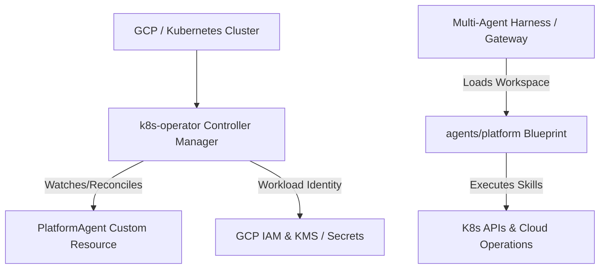
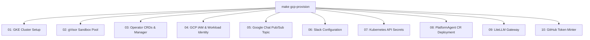

# Kubernetes Agentic Harness Installation & Setup Guide

This comprehensive, step-by-step guide explains how to install, configure, deploy, and verify the **Kubernetes Agentic Harness (`kube-agents`)** across different environments—from automated Google Cloud Platform (GCP) / GKE deployments to local development clusters and third-party multi-agent orchestrators.

---

## Table of Contents

1. [Architecture & Overview](#architecture--overview)
2. [Prerequisites & Tooling Matrix](#prerequisites--tooling-matrix)
3. [Method 1: Automated GCP & GKE Provisioning (Recommended)](#method-1-automated-gcp--gke-provisioning-recommended)
   - [Modular Pipeline Stages](#modular-pipeline-stages)
   - [Step-by-Step Execution](#step-by-step-execution)
4. [Method 2: Manual Kubernetes Cluster Deployment](#method-2-manual-kubernetes-cluster-deployment)
   - [Step 1: Install cert-manager](#step-1-install-cert-manager)
   - [Step 2: Create API Key & Access Secrets](#step-2-create-api-key--access-secrets)
   - [Step 3: Build & Push the Operator Image](#step-3-build--push-the-operator-image)
   - [Step 4: Deploy the Operator & CRDs](#step-4-deploy-the-operator--crds)
   - [Step 5: Deploy Integrations (LiteLLM & GitHub)](#step-5-deploy-integrations-litellm--github)
   - [Step 6: Apply Custom Resources](#step-6-apply-custom-resources)
5. [Method 3: Local Development & Fast Iteration](#method-3-local-development--fast-iteration)
6. [Method 4: Harness & Orchestrator Integration](#method-4-harness--orchestrator-integration)
   - [Declarative Registration](#1-declarative-registration-yamljson)
   - [Imperative CLI Registration](#2-imperative-cli-registration)
   - [Heartbeat Schedule Configuration](#3-heartbeat-schedule-configuration)
7. [Teardown & Cleanup](#teardown--cleanup)
8. [Troubleshooting & Common FAQ](#troubleshooting--common-faq)

---

## Architecture & Overview

The Kubernetes Agentic Harness manages Kubernetes operations via an autonomous **Platform Agent (`platform`)** acting as the master custodian and architect.



- **Agent Configuration (`agents/platform`)**: Contains the system prompt and persona identity (`SOUL.md`), workspace instructions (`AGENTS.md`), runtime configuration (`config.yaml`), scheduled governance jobs (`cron/jobs.json`), operational playbooks (`governance/`), and reusable skills (`skills/`).
- **Kubernetes Operator (`k8s-operator`)**: A Kubebuilder-powered Go operator that manages Custom Resource Definitions (`PlatformAgent`) and reconciles cluster lifecycle state.
- **Integrations**: Supports LiteLLM Gateway for LLM provider routing (Gemini, OpenAI, Anthropic) and enterprise messaging bridges (Google Chat, Slack).

---

## Prerequisites & Tooling Matrix

Before beginning installation, ensure your environment meets the following requirements:

| CLI Tool / Utility              | Required Version | Verification Command       | Description                                                    |
| :------------------------------ | :--------------- | :------------------------- | :------------------------------------------------------------- |
| **Go**                          | `1.24+`          | `go version`               | Required for building operator binaries and running tests.     |
| **Docker / Podman**             | `20.10+`         | `docker --version`         | Required to build container images for the operator.           |
| **kubectl**                     | `1.28+`          | `kubectl version --client` | Communicates with your target Kubernetes or GKE cluster.       |
| **Google Cloud SDK (`gcloud`)** | Latest           | `gcloud version`           | Needed for GKE cluster access, IAM, and Artifact Registry.     |
| **Helm**                        | `3.10+`          | `helm version`             | Used for installing cluster dependencies like `cert-manager`.  |
| **gettext (`envsubst`)**        | Standard         | `envsubst --version`       | Used by Makefile deployment targets for template substitution. |

---

## Method 1: Automated GCP & GKE Provisioning (Recommended)

For full end-to-end setups on Google Cloud Platform (GCP) with GKE Standard, Workload Identity, Pub/Sub, LiteLLM, and GitHub Token Minter, use the automated provisioning pipeline in `k8s-operator/`.

### Modular Pipeline Stages

The automated installer executes 10 idempotent stages sequentially:



### Step-by-Step Execution

#### Step 1: Authenticate with Google Cloud

Authenticate your `gcloud` CLI and set Application Default Credentials:

```bash
gcloud auth login
gcloud auth application-default login
```

#### Step 2: Execute Provisioning

Navigate to the `k8s-operator` directory and launch the provisioning pipeline:

```bash
cd k8s-operator
make gcp-provision
```

- On the first run, the script prompts for configuration inputs (GCP Project ID, region, cluster name, model provider, API key, etc.) and saves them locally in `scripts/vars.sh`.
- Subsequent invocations reuse `scripts/vars.sh` for non-interactive idempotency.
- **Dry-run check**: To preview actions without modifying cloud infrastructure:
  ```bash
  make gcp-provision ARGS="--dry-run"
  ```

> [!TIP]
> Each stage of the provisioning pipeline can also be run individually using step-specific Makefile targets (e.g., `make gcp-provision-01-cluster`, `make gcp-provision-02-gvisor`, ..., `make gcp-provision-10-github`). See [k8s-operator/README.md](k8s-operator/README.md#running-individual-steps-with-make) for the complete list of individual provisioning and teardown targets.

#### Step 3: Verify Running Components

Verify that the operator, LiteLLM gateway, and custom resources are healthy:

```bash
kubectl get deployments -n kubeagents-system
kubectl get pods -n kubeagents-system
kubectl get platformagents --all-namespaces
```

#### Step 4: ChatGPT OAuth Authentication (If Applicable)

If you chose `chatgpt` as your `MODEL_PROVIDER`, follow the printed OAuth Device Flow instructions or check the LiteLLM gateway logs:

```bash
kubectl logs -n kubeagents-system deployment/litellm -f
```

---

## Method 2: Manual Kubernetes Cluster Deployment

If you are installing into an existing Kubernetes or GKE cluster without using the automated GCP provisioning pipeline, follow these steps.

### Step 1: Install cert-manager

The Kubernetes Operator requires `cert-manager` (version `1.13.0+`) to generate and rotate admission webhook TLS certificates.

- **Standard Kubernetes / GKE Standard Cluster (via Helm)**:

  ```bash
  helm repo add jetstack https://charts.jetstack.io
  helm repo update
  helm install cert-manager jetstack/cert-manager \
    --namespace cert-manager \
    --create-namespace \
    --set installCRDs=true
  ```

- **GKE Autopilot Cluster (Leader Election Workaround)**:
  GKE Autopilot restricts coordination Leases in `kube-system`. Disable leader election during install:
  ```bash
  helm install cert-manager jetstack/cert-manager \
    --namespace cert-manager \
    --create-namespace \
    --set installCRDs=true \
    --set controller.leaderElection.enabled=false \
    --set cainjector.leaderElection.enabled=false
  ```

### Step 2: Create API Key & Access Secrets

Create the `kubeagents-system` namespace and add your model provider credentials:

```bash
kubectl create namespace kubeagents-system --dry-run=client -o yaml | kubectl apply -f -

kubectl create secret generic platform-agent-secrets \
  --namespace kubeagents-system \
  --from-literal=GEMINI_API_KEY="your-gemini-api-key" \
  --from-literal=API_SERVER_KEY="your-api-server-key" \
  --from-literal=ANTHROPIC_API_KEY="your-anthropic-api-key" \
  --from-literal=OPENAI_API_KEY="your-openai-api-key"
```

### Step 3: Build & Push the Operator Image

Set your registry destination and build the container image:

```bash
cd k8s-operator

export IMG=us-central1-docker.pkg.dev/<YOUR_PROJECT>/<YOUR_REPO>/kube-agents-operator:latest

make docker-build IMG=$IMG
make docker-push IMG=$IMG
```

### Step 4: Deploy the Operator & CRDs

Install the Custom Resource Definitions (CRDs) and deploy the controller manager deployment:

```bash
make install
make deploy IMG=$IMG
```

Verify controller readiness:

```bash
kubectl rollout status deployment -n kubeagents-system
```

### Step 5: Deploy Integrations (LiteLLM & GitHub)

To optionally deploy the LiteLLM Gateway or GitHub Token Minter:

```bash
# Deploy LiteLLM Gateway
export MODEL_PROVIDER=gemini
export MODEL_DEFAULT_NAME=gemini-3.1-flash
make deploy-litellm

# Deploy GitHub Integration (requires pre-configured github-app-credentials secret)
make deploy-github
```

### Step 6: Apply Custom Resources

Submit a sample `PlatformAgent` Custom Resource to activate cluster governance (run inside `k8s-operator/`):

```bash
kubectl apply -f examples/platformagent.yaml
kubectl get platformagents -A
```

---

## Method 3: Local Development & Fast Iteration

For developer testing on a workstation against a local cluster (e.g., Kind) or remote GKE cluster without building container images:

1. **Set your active Kubernetes context**:
   ```bash
   kubectl config current-context
   ```
2. **Install CRDs**:
   ```bash
   cd k8s-operator
   make install
   ```
3. **Run the controller locally with webhooks disabled**:
   ```bash
   ENABLE_WEBHOOKS=false make run
   ```
4. **Fast Remote Rebuild & Update**:
   To rebuild and push an updated container image and trigger immediate deployment rollout in GKE:
   ```bash
   make dev-rebuild-agent ARGS="platform"
   ```

---

## Method 4: Harness & Orchestrator Integration

This repository is also a declarative blueprint for multi-agent frameworks (CrewAI, Microsoft AutoGen, LangGraph, or custom platforms).

### 1. Declarative Registration (YAML/JSON)

Add the Platform Agent workspace directory to your agent gateway configuration:

```yaml
agents:
  - id: platform
    workspace: ./agents/platform
    instructions: ./agents/platform/SOUL.md
```

### 2. Imperative CLI Registration

For frameworks with CLI-based registration, import the workspace directly:

```bash
# Register Platform Agent workspace
gateway-cli agents add platform \
  --workspace ./agents/platform \
  --non-interactive
```

### 3. Scheduled Governance & Cron Jobs

The Platform Agent executes recurring governance checks and cluster audits configured in `agents/platform/cron/jobs.json`:

- **Scheduled Playbooks (`agents/platform/governance/`)**: Standard Operating Procedures (SOPs) including `blueprint_sync_sop.md`, `compliance_audit_sop.md`, `policy_propagation_sop.md`, and `security_patch_orchestrator_sop.md`.
- **Execution Engine**: Jobs run on standard cron schedules (e.g., hourly policy propagation or daily compliance scans) to proactively detect and remediate cluster drift.

---

## Teardown & Cleanup

To safely remove provisioned resources:

### Automated Cloud Teardown

To clean up all GCP/GKE cluster resources, IAM bindings, secrets, and subscriptions provisioned by `make gcp-provision`:

```bash
cd k8s-operator
make gcp-teardown
```

You can also run step-specific teardowns:

- `make gcp-teardown-10-github`: Remove GitHub Token Minter
- `make gcp-teardown-09-litellm`: Undeploy LiteLLM Gateway
- `make gcp-teardown-08-deploy`: Delete PlatformAgent CR
- `make gcp-teardown-07-secrets`: Delete Kubernetes secrets
- `make gcp-teardown-06-slack`: Reset Slack configuration
- `make gcp-teardown-05-gchat`: Remove Google Chat Pub/Sub resources
- `make gcp-teardown-04-iam`: Clean up Workload Identity and GSAs
- `make gcp-teardown-03-operator`: Undeploy operator controller and CRDs
- `make gcp-teardown-02-gvisor`: Delete gVisor node pool
- `make gcp-teardown-01-cluster`: Decommission GKE Standard cluster

### Manual Local Uninstall

To uninstall the operator controller and CRDs manually:

```bash
cd k8s-operator
make undeploy
make uninstall
```

---

## Troubleshooting & Common FAQ

### 1. Workload Identity Authorization Errors (`403 Permission Denied`)

- Ensure the GKE Kubernetes Service Account (`kubeagents-system/kubeagents-platform-agent-ksa`) is correctly annotated with the GCP Service Account email (`iam.gke.io/gcp-service-account`).
- Verify IAM bindings using:
  ```bash
  gcloud iam service-accounts get-iam-policy <GSA_EMAIL>
  ```

### 2. Admission Webhook Errors (`x509: certificate signed by unknown authority`)

- Confirm `cert-manager` pods are running in the `cert-manager` namespace:
  ```bash
  kubectl get pods -n cert-manager
  ```
- If running the controller locally via `make run`, ensure `ENABLE_WEBHOOKS=false` is explicitly set to bypass webhooks.

### 3. GKE Autopilot Pod Pending on Lease Resources

- Check if your deployment is stuck waiting for leader election Leases in `kube-system`. Disable leader election arguments `--leader-elect=false` when deploying controllers to GKE Autopilot clusters.
