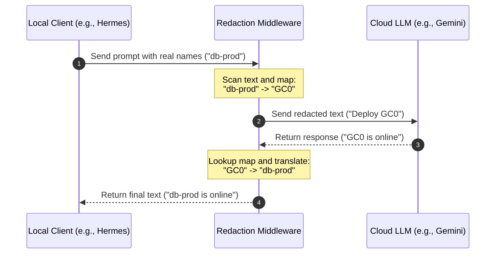

# LLM Placeholder Collision & Context Contamination

This document provides a technical breakdown of **Placeholder Collision** and **Context Contamination** in Large Language Model (LLM) pipelines. These anomalies typically occur in enterprise environments where data redaction/confidentiality filters are applied to LLM inputs and outputs.

---

## 1. How Redaction Pipelines Work

To prevent PII, hostnames, IP addresses, or internal keys from leaking to external model providers, a middleware wrapper (redactor) sits between the client and the LLM.



The gateway keeps an **ephemeral mapping table** in memory during the request/response lifecycle. Once the API call finishes, this mapping is deleted.

---

## 2. The Mechanics of a Placeholder Collision

A collision occurs when a placeholder token (e.g., `GC0`) leaks into persistent storage (such as a database or compressed history summary) and is subsequently reused for a different entity in a later request.

### Step-by-Step Scenario

#### Request 1 (Yesterday)

1. The user asks: `"Why is database-alpha failing?"`
2. The gateway redacts `"database-alpha"` $\rightarrow$ `GC0`.
3. The LLM responds: `"GC0 is out of disk space."`
4. The model confuses the placeholder (e.g., swapping `GC0` with `GC1` due to high similarity), causing the gateway's reverse-mapping lookup to fail.
5. The gateway falls back to returning the raw placeholder, and the client saves the literal response to the database: `"GC0 is out of disk space."`

#### Request 2 (Today - Compaction using a Low-Tier Model)

1. Automatic **Session Compaction** runs to condense the conversation history. Because a lower-tier model is used, it acts literally and carries over the placeholder token verbatim: `"GC0 is out of disk space."` into the persistent summary.
2. The user types a new prompt: `"Is database-beta healthy?"`
3. The gateway processes the payload. It sees `"database-beta"` and assigns it the first available placeholder counter: `GC0`.
4. The gateway sends this context to the LLM:
   - **History:** `"GC0 is out of disk space."`
   - **Prompt:** `"Is GC0 healthy?"`
5. The LLM receives `GC0` as representing `"database-beta"`. It matches this to the history and answers: `"No, GC0 (database-beta) is not healthy because it is out of disk space."`

> [!WARNING]
> **Context Contamination:** The historical error belonging to **database-alpha** has been falsely attributed to **database-beta** because the literal `GC0` token persisted in the history.

---

## 3. Impact on Agentic AI

Placeholder collisions are particularly destructive for autonomous coding and troubleshooting agents (like Hermes) because:

- **Tool-Call Decisions:** Agents make execution decisions based on historical logs. If logs indicate `GC0` failed, and the agent currently maps `GC0` to a target service, it may perform destructive actions (like restarting or rolling back) on the wrong machine.
- **State Drift:** The agent's internal state tracker drifts away from reality, leading to cascading reasoning errors.
- **Corrupted Memory:** When the agent stores the session output into its long-term retrieval memory (vector store or memory databases), the corrupted association is saved permanently.

---

## 4. Mitigation Strategies

### 1. Proposed resolution: Compaction using a High-Tier Model

1. Automatic **Session Compaction** runs using a high-tier model (e.g., `model-summary`).
2. The model recognizes the placeholders as temporary identifiers and abstracts them away in the summary: `"The user investigated a database failing due to lack of disk space."` (The literal token `GC0` is replaced with the generic term `"a database"`).
3. The user types a new prompt: `"Is database-beta healthy?"`
4. The gateway redacts `"database-beta"` to `GC0` (first available counter).
5. The gateway sends this context:
   - **History:** `"The user investigated a database failing due to lack of disk space."`
   - **Prompt:** `"Is GC0 healthy?"`
6. The LLM sees no mention of `GC0` in the history, preventing context contamination. It treats `GC0` (database-beta) as a clean new entity.

The solution needs to be tested to verify if `GC0` placeholders are not appearing in the session summaries at all.

**Action:** Always route the auxiliary compression task (`auxiliary.compression`) to a **high-tier reasoning model** (such as `gemini-3.1-pro-preview`, aliased as `model-summary` in the LiteLLM gateway):

```yaml
auxiliary:
  compression:
    provider: "main"
    model: "model-summary"
```

High-tier models have the instruction-following precision needed to treat placeholders as strict, immutable identifiers and summarize conversations without mangling the boundary mappings.

### 2. Client-Side Un-Redaction (Active Implementation)

Perform the redaction/un-redaction steps locally on the agent client harness (e.g. `platform-agent` running in the GKE management cluster) rather than at the model gateway level. The client maintains a persistent translation map inside a local SQLite database (`redaction_cache.db`) to translate identifiers on the fly. This keeps GKE infrastructure metadata private during transit to the Cloud LLM API, while allowing the client to maintain clean, human-readable execution history and logs.

We have explored and implemented the following options for client-side redaction:

#### Option A: Dynamic Registry-Based Vocabulary Matching (First Iteration)

- **Design**: Scan local agent swarm registration registries (`devteam_agents.jsonl`, `operator_agents.jsonl`) on startup. Build a dynamic vocabulary list of known cluster names, namespaces, regions, endpoints, and agent names. Redact these specific terms using regex word-boundary mapping.
- **Results**: Worked well for known, static infrastructure.
- **Limitations**: Failed to catch arbitrary runtime resources (e.g. newly created pods, logs containing ephemeral hashes, or random error tokens like `sj4d4n` that were not in the registry registries).

#### Option B: System Spellcheck Dictionary Filter + Technical Allowlist (Current Implementation)

- **Design**:
  1. Install the `wamerican` dictionary package and load `/usr/share/dict/words` (102,485 standard English words) into memory on startup.
  2. Implement a token-level scanner: any word/token that is not in the English dictionary is treated as a sensitive identifier and redacted to a deterministic hash placeholder (`GCxxxxxx`).
  3. To prevent corrupting operational commands, define a static `TECHNICAL_ALLOWLIST` of Unix/Kubernetes keywords (e.g. `kubectl`, `describe`, `pod`, `service`, `emptydir`, `volumeclaimtemplate`) that are exempted from redaction.
  4. Ensure existing placeholders matching the pattern `^GC[a-fA-F0-9]{6}$` are skipped to prevent double-redaction.
  5. Store mappings in `/opt/data/redaction_cache.db` with WAL mode enabled to support thread-safe asynchronous requests (`check_same_thread=False`).
- **Results**: Fully integrated into the `client_redactor` plugin, built into the base `platform-agent` container image, and verified active. Catching ephemeral GKE pod resource names (like `operator-agent-...`) and random error strings dynamically.
- **Open items to watch**: Tuning the `TECHNICAL_ALLOWLIST` to prevent over-redaction of standard tech words/jargon not present in a standard English dictionary.

###### Resolved Integration Issues

###### Issue 1: Escaped Newline Concatenation Bug (Leading `n` Prefix)

- **Symptom**: Unredacted names returned to the user or stored in history were observed to have a leading `n` character (e.g. `ncurl-test` instead of `curl-test`, `noperator-agent-...` instead of `operator-agent-...`).
- **Root Cause**:
  1. In the agentic framework, tool results are often passed as JSON-serialized strings. In JSON-serialized format, real newline characters are escaped as the literal character sequence `\n` (a backslash `\` followed by the character `n`).
  2. If a sensitive word begins immediately at the start of a newline (e.g. `...\ncurl-test ...`), the character sequence is `\` $\rightarrow$ `n` $\rightarrow$ `c` $\rightarrow$ `u` $\rightarrow$ `r` $\rightarrow$ `l`.
  3. Because backslash `\` is non-alphanumeric, the word boundary scanner (`\b[a-zA-Z0-9_-]+\b`) matches a boundary right before `n`!
  4. The scanner therefore extracts the token **`ncurl-test`** as a single token. Since it is not in the dictionary, it gets redacted to `GCxxxxxx`, saving `ncurl-test` into the cache mapping.
- **Resolution (JSON-Aware Object Redaction)**:
  We introduced `redact_object` and `unredact_object` to perform JSON-aware recursion:
  - If a string is a valid JSON dictionary or list, the redactor parses the JSON payload back into python objects.
  - It recursively traverses the structure, redacting only the string _values_ in their decoded state where newlines are real LF characters (`\x0a`) rather than the literal characters `\n`. This prevents the `n` of `\n` from being merged with the subsequent word.
  - Once redacted, the python object is re-serialized back to JSON, preserving valid structures.

###### Issue 2: Partial Vocabulary Matching & Double-Redaction Blind Spot

- **Symptom**: Long, hyphenated pod identifiers (e.g. `devteam-mercury-09-us-central1-podcertificate-controller-sj4d4n`) were observed to leak parts of their names (`devteam-` and `-podcertificate-controller-sj4d4n`) completely unredacted in the chat output.
- **Root Cause**:
  1. **Word Boundary Mismatch**: Standard regex `\b` boundaries define word characters (`\w`) as `[a-zA-Z0-9_]` (excluding hyphens `-`), whereas our custom token scanner uses a broader character set `[a-zA-Z0-9_-]` (including hyphens).
  2. **Partial Redaction**: Because `\b` treats hyphens as word boundaries, the vocabulary matcher matched and redacted the registered sub-components `mercury-09` $\rightarrow$ `GC27189e` and `us-central1` $\rightarrow$ `GCa9d14a` inside the larger hyphenated identifier, transforming the string into `devteam-GC27189e-GCa9d14a-podcertificate-controller-sj4d4n`.
  3. **Double-Redaction Prevention Lockout**: The fallback spellcheck scanner matches the entire sequence `devteam-GC27189e-GCa9d14a-podcertificate-controller-sj4d4n` as a single token. However, to avoid double-redaction, it is configured to skip any token containing an embedded placeholder (`GCxxxxxx`). Because `GC27189e` was present, the entire remaining token was skipped, leaving the rest of the identifier completely unredacted.
- **Resolution (Custom Boundary Lookarounds)**:
  We replaced standard `\b` boundaries with custom lookbehinds/lookaheads matching our token set `[a-zA-Z0-9_-]`:
  ```python
  vocab_regex = re.compile(
      r"(?<![a-zA-Z0-9_-])(" + "|".join(re.escape(word) for word in sorted_vocab) + r")(?![a-zA-Z0-9_-])"
  )
  ```
  This prevents the vocabulary matcher from looking inside larger hyphenated/underscored words, allowing the fallback spellcheck scanner to match and redact the entire long pod identifier as a single cohesive token.

###### Issue 3: Google Chat Outbound Formatting Placeholder Restoration Order Bug

- **Symptom**: The user observed formatting placeholders like `GC1`, `GC3`, `GC5`... in the Google Chat window instead of unredacted resource/pod names, even when the local client database logged that the names were correctly resolved.
- **Root Cause**:
  1. The platform agent's Google Chat outbound `format_message` function converts standard Markdown to Google Chat's specific dialect. To protect formatting regions (such as inline code blocks, links, and bold blocks) from being modified by subsequent regex passes, it replaces them with temporary sequential tokens (`\x00GC{counter}\x00`) and stores the original content in a dictionary.
  2. For nested formatting constructs (e.g. bold containing an inline code block: `**`broker-dbbb484c5-d8p9w`**`), the inner block is protected first (`\x00GC0\x00`). Then the outer bold block matches the inner placeholder and wraps it, creating a nested placeholder mapping: `\x00GC1\x00` $\rightarrow$ `*\x00GC0\x00*`.
  3. When restoring the placeholders, the original code iterated through the dictionary keys in **forward insertion order**.
  4. In the forward pass, it tries to restore the inner `\x00GC0\x00` first. However, the string `text` still contains the outer `\x00GC1\x00` and does not contain `\x00GC0\x00` yet, so this replacement does nothing. Then it restores the outer `\x00GC1\x00` to `*\x00GC0\x00*`.
  5. The loop terminates, leaving `\x00GC0\x00` completely unrestored. When null bytes are stripped during output rendering, this leaks to the user as the literal string `GC0` (or `GC1`, etc.).
- **Resolution (Reverse Order Restoration)**:
  We updated the restoration loop in the Google Chat platform adapter (`format_message`) to iterate in **reverse order of creation** (using `reversed(list(placeholders.items()))`). This ensures the outermost nested blocks (e.g. `\x00GC1\x00`) are expanded first, revealing the inner placeholders (e.g. `\x00GC0\x00`) so they can be successfully matched and restored by subsequent iterations.

#### Option C: Entropy-Based Character Randomness Filter (Discarded / Not Adopted)

- **Design**: Compute Shannon Entropy ($H(X) = -\sum P(x_i) \log_2 P(x_i)$) for each token to identify random character sequences (like API keys or hashes).
- **Limitations / Why it failed**: Short strings (e.g. 4-6 character resource hashes like `sj4d4n` or GKE node suffixes) do not provide a large enough statistical character set to differentiate their entropy from standard short English words (like `then` or `from`), leading to critical false negatives (unredacted identifiers) or false positives.

##### Experimental Entropy vs. Spellcheck Test Results:

| Token                        | Len | Entropy | In Dict? | Spellcheck Redact? | Entropy Redact (th=2.5)? | Entropy Redact (th=3.0)? |
| :--------------------------- | :-- | :------ | :------- | :----------------- | :----------------------- | :----------------------- |
| `hello`                      | 5   | 1.922   | True     | NO                 | NO                       | NO                       |
| `database`                   | 8   | 2.406   | True     | NO                 | NO                       | NO                       |
| `failing`                    | 7   | 2.522   | True     | NO                 | **YES (False Pos)**      | NO                       |
| `yesterday`                  | 9   | 2.725   | True     | NO                 | **YES (False Pos)**      | NO                       |
| `restarted`                  | 9   | 2.503   | True     | NO                 | **YES (False Pos)**      | NO                       |
| `kubectl`                    | 7   | 2.807   | True     | NO                 | **YES (False Pos)**      | NO                       |
| `describe`                   | 8   | 2.750   | True     | NO                 | **YES (False Pos)**      | NO                       |
| `deployment`                 | 10  | 3.122   | True     | NO                 | **YES (False Pos)**      | **YES (False Pos)**      |
| `volumeclaimtemplate`        | 19  | 3.287   | False    | YES                | YES                      | YES                      |
| `emptydir`                   | 8   | 3.000   | False    | YES                | YES                      | NO                       |
| `sj4d4n` (pod suffix)        | 6   | 2.252   | False    | YES                | **NO (False Neg)**       | **NO (False Neg)**       |
| `sqtb7t` (pod suffix)        | 6   | 2.252   | False    | YES                | **NO (False Neg)**       | **NO (False Neg)**       |
| `nb9tg` (pod suffix)         | 5   | 2.322   | False    | YES                | **NO (False Neg)**       | **NO (False Neg)**       |
| `788b8b5ccb` (hash)          | 10  | 2.171   | False    | YES                | **NO (False Neg)**       | **NO (False Neg)**       |
| `broker-5dd98d4c85-6b4rh`    | 23  | 3.675   | False    | YES                | YES                      | YES                      |
| `AIzaSyA1234567890abcdef...` | 33  | 4.923   | False    | YES                | YES                      | YES                      |

##### Detailed Analysis of Findings:

1. **Critical False Positives (Technical Context Ruined)**:
   - Common verbs and keywords like `failing` (H=2.522), `restarted` (H=2.503), `kubectl` (H=2.807), and `describe` (H=2.75) exceed the `2.5` threshold and get redacted.
   - Standard resource nouns like `deployment` have an entropy of **`3.122`**. Even at a conservative threshold of `3.0`, it gets redacted. Redacting these names strips semantic meaning and prevents the LLM from understanding what resources it should interact with.
2. **Critical False Negatives (Data Leakage)**:
   - Short random suffixes like `sj4d4n` or `nb9tg` have an entropy of only **`2.2 - 2.3`** due to their short length and letter repetitions.
   - Under both `2.5` and `3.0` thresholds, these GKE identifiers are **completely missed** and leak directly to the cloud LLM.
   - Even a 10-char hash containing repeating character subsets (like `788b8b5ccb` at H=2.171) is completely missed.

#### Option D: Alphanumeric Mixed Regex Patterns (Discarded / Not Adopted)

- **Design**: Scan text using custom regular expressions designed to catch alphanumeric mixes (e.g., `\b[a-zA-Z]*[0-9]+[a-zA-Z0-9]*\b`) and strings containing hyphens/underscores.
- **Limitations / Why it failed**: Too brittle. Fails to redact purely alphabetic namespace/cluster names or keys that do not happen to contain digits or separators, leaving gaps in metadata privacy.
