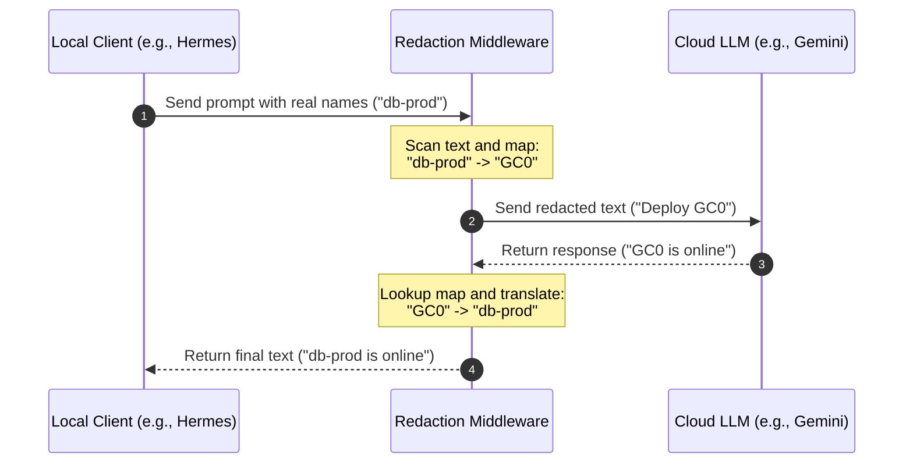

# LLM Placeholder Collision & Context Contamination

This document provides a technical breakdown of **Placeholder Collision** and **Context Contamination** in Large Language Model (LLM) pipelines. These anomalies typically occur in enterprise environments where data redaction/confidentiality filters are applied to LLM inputs and outputs.

---

## 1. How Redaction Pipelines Work

To prevent PII, hostnames, IP addresses, or internal keys from leaking to external model providers, a middleware wrapper (redactor) sits between the client and the LLM.



The gateway keeps an **ephemeral mapping table** in memory during the request/response lifecycle. Once the API call finishes, this mapping is deleted.

---

## 2. The Mechanics of a Placeholder Collision

A collision occurs when a placeholder token (e.g., `GC0`) leaks into persistent storage (such as a database or compressed history summary) and is subsequently reused for a different entity in a later request.

### Step-by-Step Scenario

#### Request 1 (Yesterday)
1. The user asks: `"Why is database-alpha failing?"`
2. The gateway redacts `"database-alpha"` $\rightarrow$ `GC0`.
3. The LLM responds: `"GC0 is out of disk space."`
4. The model confuses the placeholder (e.g., swapping `GC0` with `GC1` due to high similarity), causing the gateway's reverse-mapping lookup to fail.
5. The gateway falls back to returning the raw placeholder, and the client saves the literal response to the database: `"GC0 is out of disk space."`

#### Request 2 (Today - Compaction using a Low-Tier Model)
1. Automatic **Session Compaction** runs to condense the conversation history. Because a lower-tier model is used, it acts literally and carries over the placeholder token verbatim: `"GC0 is out of disk space."` into the persistent summary.
2. The user types a new prompt: `"Is database-beta healthy?"`
3. The gateway processes the payload. It sees `"database-beta"` and assigns it the first available placeholder counter: `GC0`.
4. The gateway sends this context to the LLM:
   * **History:** `"GC0 is out of disk space."`
   * **Prompt:** `"Is GC0 healthy?"`
5. The LLM receives `GC0` as representing `"database-beta"`. It matches this to the history and answers: `"No, GC0 (database-beta) is not healthy because it is out of disk space."`

> [!WARNING]
> **Context Contamination:** The historical error belonging to **database-alpha** has been falsely attributed to **database-beta** because the literal `GC0` token persisted in the history.

#### Proposed resolution: Compaction using a High-Tier Model
1. Automatic **Session Compaction** runs using a high-tier model (e.g., `model-summary`).
2. The model recognizes the placeholders as temporary identifiers and abstracts them away in the summary: `"The user investigated a database failing due to lack of disk space."` (The literal token `GC0` is replaced with the generic term `"a database"`).
3. The user types a new prompt: `"Is database-beta healthy?"`
4. The gateway redacts `"database-beta"` to `GC0` (first available counter).
5. The gateway sends this context:
   * **History:** `"The user investigated a database failing due to lack of disk space."`
   * **Prompt:** `"Is GC0 healthy?"`
6. The LLM sees no mention of `GC0` in the history, preventing context contamination. It treats `GC0` (database-beta) as a clean new entity.

The solution needs to be tested to verify if `GC0` placeholders are not appearing in the session summaries at all.

---

## 3. Impact on Agentic AI

Placeholder collisions are particularly destructive for autonomous coding and troubleshooting agents (like Hermes) because:
* **Tool-Call Decisions:** Agents make execution decisions based on historical logs. If logs indicate `GC0` failed, and the agent currently maps `GC0` to a target service, it may perform destructive actions (like restarting or rolling back) on the wrong machine.
* **State Drift:** The agent's internal state tracker drifts away from reality, leading to cascading reasoning errors.
* **Corrupted Memory:** When the agent stores the session output into its long-term retrieval memory (vector store or memory databases), the corrupted association is saved permanently.

---

## 4. Mitigation Strategies

Preventing placeholder collisions requires applying the following configurations within the agentic harness codebase:

### 1. High-Tier Compaction Models
Session compaction (context compression) is performed by querying an LLM to summarize the conversation history. Standard lightweight models (like `gemini-3.1-flash-lite`) are prone to placeholder confusion:
* **Placeholder Confusion:** Due to high lexical similarity, lightweight models frequently confuse `GC0` with `GC1` during processing.
* **Reverse Mapping Failures:** When the model confuses the placeholders, the gateway fails to map the placeholder back to its original real name on response return. The raw placeholder (e.g., `GC0`) is returned to the client and stored literally in the session database.
* **Context Contamination:** During compaction, the low-tier model merges or swaps details between the confused placeholders, permanently corrupting the history log.

**How High-Tier Models Help:**
A high-tier reasoning model (such as `gemini-3.1-pro-preview`) possesses the instruction-following and attention precision required to:
* Keep highly similar entities (like `GC0` and `GC1`) strictly distinct throughout reasoning and summarization.
* Preserve placeholders as exact, immutable identifiers in the summary, ensuring the gateway can always cleanly perform the reverse-translation when the history is reloaded.

**Action:** Always route the auxiliary compression task (`auxiliary.compression`) to a **high-tier reasoning model** (such as `gemini-3.1-pro-preview`, aliased as `model-summary` in the LiteLLM gateway):

```yaml
auxiliary:
  compression:
    provider: "main"
    model: "model-summary"
```

High-tier models have the instruction-following precision needed to treat placeholders as strict, immutable identifiers and summarize conversations without mangling the boundary mappings.

### 2. Client-Side Un-Redaction (Future Architecture)
Perform the un-redaction step locally on the user's terminal/client rather than on the cloud gateway. The client maintains a persistent sqlite translation table. This keeps the data private during transport to the LLM, but ensures the client database and logs are stored with real, clean names.


