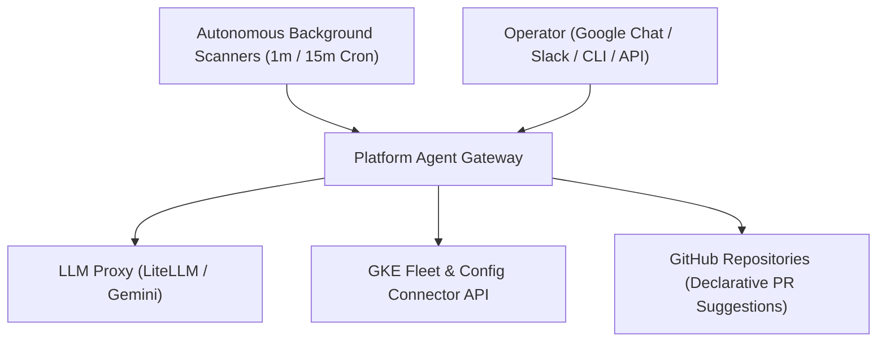

# kube-agents: The Kubernetes Agentic Harness

`kube-agents` is an agentic harness and control plane for Kubernetes and GKE fleet management. It replaces static, imperative manual management (`kubectl`, `gcloud`, GCP Console) with an autonomous, intent-driven agent architecture.

Rather than acting as a passive chatbot that waits for user prompts, the Platform Agent operates as a **proactive, hands-free custodian**. It runs continuous background watchdog and governance cycles (1m/15m cron execution) that independently discover fleet anomalies—such as OOM memory pressure, under-utilized node pools, security vulnerability advisories, and Kubernetes API deprecations—and automatically generates declarative **GitOps Pull Requests** for SRE review.

---

## Architecture Overview



---

## Proactive Autonomy vs. Passive Chatbot

The key distinction of the `kube-agents` harness is its **end-to-end autonomous workflow**:

1. **Autonomous Audit**: Scheduled background jobs continuously scan GKE workloads, cluster utilization, node health, and policy constraints.
2. **Declarative Remediation**: When an anomaly is discovered, the agent drafts the exact declarative YAML/Terraform configuration patch.
3. **Automated GitOps PR Creation**: The agent commits the patch to a GitOps branch and submits a GitHub Pull Request for operator review.
4. **Proactive Notification**: The agent dispatches a summary report and PR link directly to your team's Chat workspace (Google Chat or Slack).

---

## Out-of-the-Box Skill Catalog

| Skill Name                        | Domain / Focus            | Autonomous Action & Impact                                                                |
| --------------------------------- | ------------------------- | ----------------------------------------------------------------------------------------- |
| **Fleet Health Watchdog**         | Workload Diagnostics      | Audits CrashLoopBackOff pods, event logs, and node conditions; posts diagnostic reports.  |
| **Global Capacity Orchestrator**  | Node Pool Sizing          | Identifies memory pressure and under-utilized pools; submits node autoscaling PRs.        |
| **Compliance Audit**              | Security & Network Policy | Validates NetworkPolicies, cert-manager, and RBAC boundaries; submits security patch PRs. |
| **Lifecycle Deprecation Manager** | API Upgrades              | Detects deprecated Kubernetes API versions prior to GKE minor version upgrades.           |
| **Fleet Cost Analysis**           | Cost Optimization         | Scans for idle node capacity and Spot VM candidates; submits resource right-sizing PRs.   |

---

## Quick Start

### Prerequisites

- A running GKE cluster or local [Kind](https://kind.sigs.k8s.io/) cluster
- `kubectl` configured with cluster access
- `cert-manager` (v1.13.0+) installed on the target cluster

### Option 1: Deploy to Kubernetes via Helm (Recommended)

```bash
# 1. Clone the repository
git clone https://github.com/gke-labs/kube-agents.git
cd kube-agents

# 2. Create target namespace and credentials secret
kubectl create namespace kubeagents-system
kubectl create secret generic platform-agent-secrets \
  --namespace kubeagents-system \
  --from-literal=GEMINI_API_KEY="your-gemini-api-key" \
  --from-literal=GH_TOKEN="your-github-pat"

# 3. Deploy the Platform Agent Gateway via Helm
helm install platform-agent deploy/helm/platform-agent/ \
  --namespace kubeagents-system
```

### Option 2: Local Offline Testing via Kind

```bash
# Spin up a local 3-node Kind cluster pre-configured with cert-manager
./local-dev/setup-kind.sh
```

---

## Harness Integration & Setup

This repository contains agent configurations, personas, and skills that can be imported into custom multi-agent frameworks (such as CrewAI, Microsoft AutoGen, or LangGraph).

Refer to [INSTALL.md](INSTALL.md) for step-by-step registration instructions. To delegate installation to your multi-agent framework, clone this repository and issue the prompt:

> "Using `kube-agents/INSTALL.md` provision k8s agentic harness and create platform agent"

### Declarative Registration (YAML/JSON)

For platforms or gateways that load agents declaratively, add the Platform Agent workspace path to your profile:

```yaml
agents:
  - id: platform
    workspace: ./agents/platform
```

### Imperative CLI Registration

```bash
gateway-cli agents add platform --workspace ./agents/platform --non-interactive
```

For detailed operational playbooks, proof gates, and demonstration scenarios, see the [Platform Agent Demonstration & Scenario Guide](docs/m1-demos.md).

---

## Disclaimer

This is not an officially supported Google product.

This project is not eligible for the Google Open Source Software Vulnerability Rewards Program.
