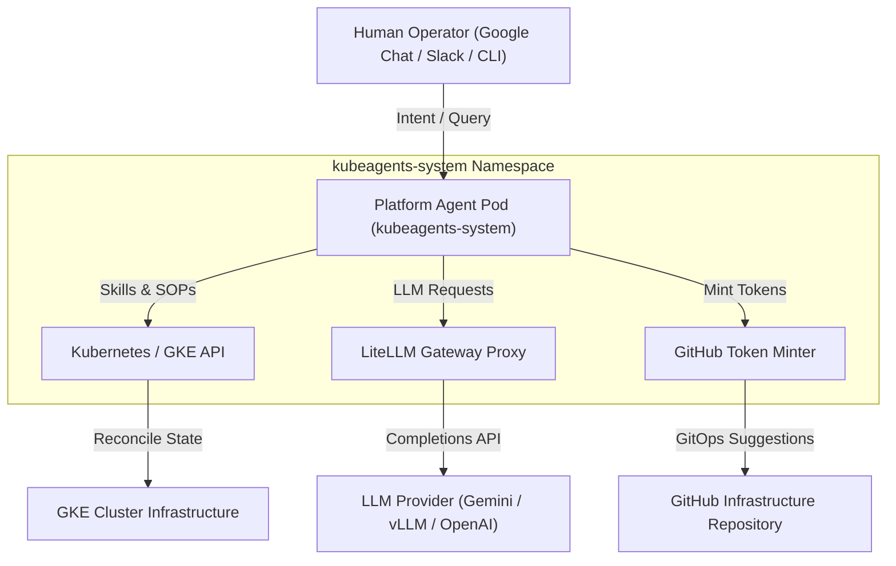

# kube-agents: The Kubernetes Agentic Harness

`kube-agents` provides an autonomous Platform Agent that streamlines Kubernetes and GKE operations. Traditional cluster management requires engineers to manually translate operational goals into complex, imperative CLI commands (`kubectl`, `gcloud`) and continuously perform manual health checks. `kube-agents` bridges this gap by enabling natural language interactions (via Google Chat, Slack, or CLI) that interpret high-level intent. The Platform Agent translates that intent into declarative cluster operations, enforces multi-tenancy boundaries, and continuously audits fleet health—transitioning management from reactive manual troubleshooting to proactive, intent-driven operations.

## Key Components

### 1. Platform Agent (`platform`)

The primary platform interface configured with an architectural persona (`SOUL.md`). It manages multi-tenancy governance, RBAC boundaries, and GKE infrastructure lifecycles.

## Architecture & System Topology

`kube-agents` operates as a single **Platform Agent** rather than a multi-agent tier model. This consolidation simplifies operator lifecycle management, eliminates multi-controller state synchronization overhead, reduces memory/CPU resource consumption on clusters, and provides a clear, unified identity for human interactions and fleet governance.



---

## Harness Integration & Setup

This workspace contains agent configurations, personas, and skills that can be imported into AI agent gateways and execution runtimes.

Agent platforms and orchestrators can use the [INSTALL.md](INSTALL.md) guide to set up the Platform Agent. To delegate this setup task to an existing agent runtime, clone this repository to your workspace and run:

> "Using `kube-agents/INSTALL.md` provision k8s agentic harness and create platform agent"

### 1. Declarative Registration (YAML/JSON)

For platforms or gateways that load agents declaratively, add the Platform Agent workspace path to your profile or orchestrator configuration:

```yaml
agents:
  - id: platform
    workspace: ./agents/platform
```

### 2. Imperative CLI Registration

For hosts supporting CLI-driven imports, register the Platform Agent directory from the repository root. For example:

```bash
# Register platform agent
gateway-cli agents add platform --workspace ./agents/platform --non-interactive
```

For more details on platform capabilities, architecture, and guides, see the [documentation index](docs/).

## Disclaimer

This is not an officially supported Google product.

This project is not eligible for the Google Open Source Software Vulnerability Rewards Program.
