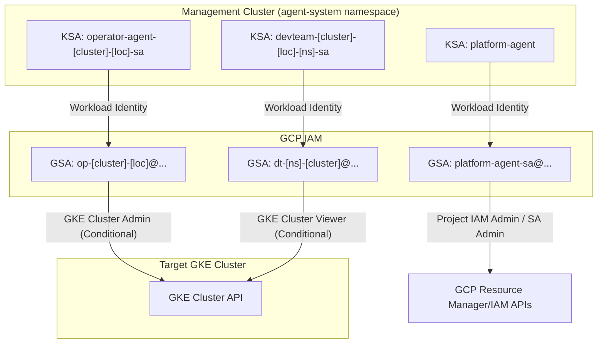

# Kubernetes Agentic Harness Security & Permission Model

This document outlines the security architecture, service accounts, and RBAC models utilized by the `kube-agents` harness in YOLO mode.

---

## Cluster Architecture Roles

The `kube-agents` harness divides workloads and agent execution environments across two distinct types of Kubernetes clusters:

*   **Management Cluster:** The central control plane cluster. All AI agent runners (Platform, Operator, and DevTeam pods) are deployed and execute here in the `agent-system` namespace. This is where their LLM reasoning loops, memory storage, and tool call processes reside.
*   **Target Cluster (Workload Cluster):** The destination GKE cluster(s) being managed or targeted. This is where user applications run. Agents do not execute containers here; instead, they interact with the target cluster's API server remotely to perform operational or deployment tasks.

---

## 1. Security Model Overview

The harness uses a **dual-layer isolation model** designed on the principles of **least privilege** and **strict multi-tenancy**:

1.  **Kubernetes Isolation (RBAC):** All agents run on a centralized **Management Cluster** in the `agent-system` namespace. Their internal K8s permissions are strictly scoped via Kubernetes Service Accounts (KSAs) and Roles.
2.  **GCP Identity Isolation (Workload Identity):** To interact with GCP services (like GKE clusters, log engines, etc.), KSAs are bound to GCP Google Service Accounts (GSAs) using **GCP Workload Identity**. This completely eliminates static API keys or credentials in agent environments.
3.  **Boundary Constraints (IAM Conditions):** GCP permissions granted to Operator and DevTeam GSAs are restricted using **IAM Conditions**. Even though they have GCP roles (like GKE Viewer or GKE Admin), they can only execute these actions against their specific assigned **Target GKE Cluster**.

---

## 2. Platform Agent Permissions

The Platform Agent is the orchestration control plane. It acts as the provisioning authority for the Operator and DevTeam agents.

*   **Cluster Scope:** Management Cluster (Namespace-restricted Admin), Target Clusters (None directly).

### Kubernetes Service Account (KSA)
*   **Name:** `platform-agent`
*   **Namespace:** `agent-system` (Management Cluster)
*   **RBAC Permissions:**
    *   **Management Cluster:** Scoped strictly to the `agent-system` namespace via a **RoleBinding** (`platform-agent-rolebinding`) mapping the KSA to the `cluster-admin` ClusterRole. This grants full namespace administration (`*` access to pods, PVCs, services, configmaps, secrets, etc.) but no cluster-wide permissions outside `agent-system`.

### Google Service Account (GSA)
*   **Name:** `platform-agent-sa@agentic-harness-demo.iam.gserviceaccount.com`
*   **IAM Roles & Permissions (Project-wide on `agentic-harness-demo`):**
    *   `roles/container.admin`: Required to dynamically provision/manage GKE Target Clusters.
    *   `roles/resourcemanager.projectIamAdmin`: Permits binding Workload Identity permissions to newly provisioned GSAs.
    *   `roles/iam.serviceAccountAdmin`: Permits creation and management of individual agent GSAs dynamically.
    *   `roles/iam.serviceAccountUser`: Permits acting as service accounts to attach them to GKE nodes or workloads.
    *   `roles/chat.admin` & `roles/chat.executor`: Integration roles for the Google Chat webhook/bot interface.
    *   `roles/compute.admin`: Configures target networks and compute assets for clusters.
    *   `roles/logging.logWriter` & `roles/logging.viewer`: Writes system logs and reads execution logs/traces.
    *   `roles/serviceusage.serviceUsageConsumer`: Required to consume GCP API quota under the billing project.
    *   `roles/viewer`: Broad project-level read-only access.
    *   `roles/iam.workloadIdentityUser`: Allows `agent-system/platform-agent` KSA to assume this GSA. (Note: Currently also bound to several active devteam and operator KSAs in the cluster).

---

## 3. Operator Agent Permissions

The Operator Agent handles infrastructure health, scaling, capacity optimization, and SRE operations.

*   **Cluster Scope:** Management Cluster (Isolated runtime), Target Cluster (Administrative control).

### Kubernetes Service Account (KSA)
*   **Name:** `operator-agent-<cluster_name>-<location>-sa`
*   **Namespace:** `agent-system` (Management Cluster)
*   **RBAC Permissions:**
    *   **Management Cluster:** Scoped to its local pod boundaries. No cluster-wide permissions.
    *   **Target Cluster:** Wildcard administrative access via **ClusterRoleBinding** mapping the GSA to a custom `operator-agent-<cluster_name>-<location>-role` ClusterRole (equivalent to K8s `cluster-admin`).

### Google Service Account (GSA)
*   **Name:** `op-<cluster_name>-<location>@agentic-harness-demo.iam.gserviceaccount.com`
*   **IAM Roles & Permissions (GCP project level, restricted via IAM condition):**
    *   `roles/container.admin` (GKE Cluster Admin)
        *   **Condition:** Restricted to its specific GKE cluster.
        *   *Expression:* `resource.type == 'container.googleapis.com/Cluster' && resource.name == 'projects/agentic-harness-demo/locations/<location>/clusters/<cluster_name>'`
    *   `roles/monitoring.viewer`: Permits reading GKE metrics and resource utilization.
    *   `roles/monitoring.notificationChannelEditor`: Permits creating and managing Cloud Monitoring notification channels (Email, SMS, Webhooks).
    *   `roles/serviceusage.serviceUsageConsumer`: Required to call Google APIs and consume billing project quotas.
    *   `roles/iam.serviceAccountTokenCreator`: Permits the GSA to generate tokens for authenticating GKE client calls.
    *   `roles/iam.workloadIdentityUser`: Allows KSA binding on the Management Cluster.

---

## 4. DevTeam Agent Permissions

The DevTeam Agent handles workload code deployments, CI/CD validations, and application-level troubleshooting.

*   **Cluster Scope:** Management Cluster (Isolated runtime), Target Cluster (Namespace-restricted administrative control, Cluster-wide GKE metadata viewer).

### Kubernetes Service Account (KSA)
*   **Name:** `devteam-<cluster_name>-<location>-<namespace>-sa`
*   **Namespace:** `agent-system` (Management Cluster)
*   **RBAC Permissions:**
    *   **Management Cluster:** Scoped to its local pod boundaries. No cluster-wide permissions.
    *   **Target Cluster:** Wildcard administrative access **strictly restricted to its assigned namespace (`<namespace>`)** via a namespaced **RoleBinding** mapping the GSA to a custom `devteam-agent-yolo-role` Role. It cannot view or modify resources in other namespaces on the target cluster.

### Google Service Account (GSA)
*   **Name:** `dt-<namespace>-<cluster_name>@agentic-harness-demo.iam.gserviceaccount.com`
*   **IAM Roles & Permissions (GCP project level, restricted via IAM condition):**
    *   `roles/container.viewer` (GKE Cluster Viewer)
        *   **Condition:** Restricted to its specific GKE cluster.
        *   *Expression:* `resource.type == 'container.googleapis.com/Cluster' && resource.name == 'projects/agentic-harness-demo/locations/<location>/clusters/<cluster_name>'`
    *   `roles/serviceusage.serviceUsageConsumer`: Required to consume billing project quotas (e.g. for Developer Knowledge API usage).
    *   `roles/monitoring.notificationChannelEditor`: Permits creating and managing Cloud Monitoring notification channels (Email, SMS, Webhooks).
    *   `roles/iam.serviceAccountTokenCreator`: Permits the GSA to generate credentials for authenticating GKE read calls.
    *   `roles/iam.workloadIdentityUser`: Allows KSA binding on the Management Cluster.

---

## 5. Config Connector (KCC) & GCP Resource Provisioning

To enable declarative management of GCP infrastructure directly via Kubernetes manifests, GKE target clusters utilize **GCP Config Connector (KCC)** configured in **Namespaced Mode**.

### KCC Namespace Onboarding (Platform Orchestrated)
When the Platform Agent provisions a DevTeam workspace on a target GKE cluster (via `provision_devteam`), it executes the KCC onboarding lifecycle:
1.  **GSA Creation:** Creates a dedicated GSA for the namespace: `kcc-<namespace>-<cluster_name>@<project_id>.iam.gserviceaccount.com`.
2.  **Owner IAM Binding:** Grants the `roles/owner` role project-wide to this namespace-specific KCC GSA. This allows KCC to provision any type of GCP resource (databases, networking, compute, storage) on behalf of that namespace.
3.  **Workload Identity Linking:** Binds the KCC GSA to the namespaced KCC controller manager KSA: `serviceAccount:<project_id>.svc.id.goog[cnrm-system/cnrm-controller-manager-<namespace>]`.
4.  **ConfigConnectorContext Application:** Configures a `ConfigConnectorContext` resource inside the tenant namespace, forcing the controller manager to assume the namespace GSA when applying KCC resources.

### What Operators Can Configure
The **Operator Agent** has cluster-wide wildcard (`*`) access to the target cluster.
*   **Infrastructure Management:** Can create, edit, or delete any cluster-wide or namespace-scoped GCP resources via KCC (e.g. provisioning global GKE clusters, SQL databases, Compute Networks, firewall rules, or DNS zones).
*   **Scope:** Cluster-wide, utilizing high-privilege credentials.

### What DevTeams Can Configure
The **DevTeam Agent** is restricted to its tenant namespace (`<namespace>`) via K8s RoleBindings, but has wildcard (`*`) access *within* that namespace.
*   **GCP Resource Provisioning:** Can declare GCP resources (such as `SQLInstance`, `StorageBucket`, `PubSubTopic`, `KMSKeyring`) as Kubernetes manifests inside its tenant namespace. KCC will automatically detect these and provision the corresponding resources in the GCP project.
*   **Security Boundary Warning:** Because the namespaced KCC controller manager GSA is bound to `roles/owner` project-wide, the DevTeam agent effectively holds project-level administrator capabilities for resources declared through KCC. However, it is structurally isolated from other tenant namespaces on GKE.
