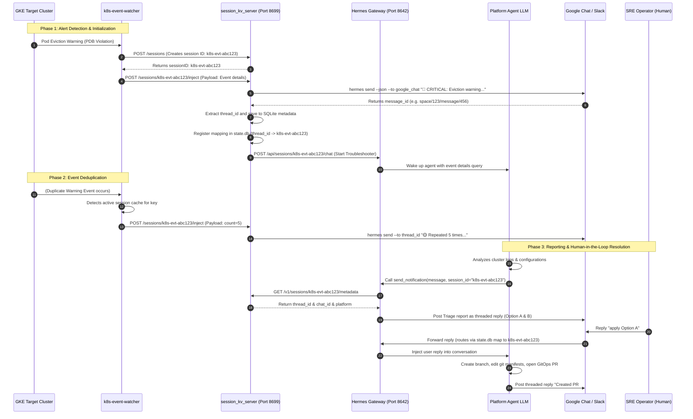

# Platform Session Management & Thread Routing

This document details the architecture and workflow for routing GKE Kubernetes warning alerts into persistent diagnostic agent sessions, enabling interactive threaded troubleshooting in chat platforms (Google Chat and Slack).

---

## Architecture Overview

AI agent execution is typically stateless and triggered on-demand. To support proactive GKE warning troubleshooting, we run a local stateful proxy server called `session_kv_server.py` on the Platform Agent host. This server acts as a bridge between the **GKE Event Watcher** (monitoring target clusters) and the **Platform Agent Gateway** (running the LLM reasoning turns).

### Key Responsibilities:
1. **Deduplication:** Maps repeat events to the same troubleshooting session, preventing alert flooding and saving LLM token costs.
2. **Dynamic Thread Resolution:** Captures the Chat API message ID returned from the first alert, saving it as the persistent thread key.
3. **Gateway Routing Hook:** Registers thread-to-session mappings in the Gateway's routing table (`state.db`) so replies from humans in Chat route back to the correct active agent session.

---

## End-to-End Workflow

The diagram below details the lifecycles of alert ingestion, session routing, and interactive GitOps fixes:



---

## Database Schemas & Storage

### 1. Local Session Metadata Database
* **Path:** `/var/lib/kube-agents/session/session_kv.db`
* **Table:** `session_metadata`
* **Purpose:** Stores the stateful config for each active troubleshooting session.

```sql
CREATE TABLE IF NOT EXISTS session_metadata (
    session_id TEXT PRIMARY KEY,
    metadata TEXT NOT NULL,         -- JSON object storing platform, chat_id, thread_id, and timestamps
    updated_at TIMESTAMP DEFAULT CURRENT_TIMESTAMP
);
```

### 2. Hermes Gateway Routing Database
* **Path:** `/opt/data/state.db`
* **Table:** `gateway_routing`
* **Purpose:** Read by the Hermes core platform runner. It matches incoming Chat webhook events (replies) to active agent sessions.

* **Routing Key Pattern:** `agent:main:{platform}:group:{chat_id}:{thread_id}`
* **Row Format:**
  * `scope`: `/opt/data/sessions`
  * `session_key`: The routing key pattern.
  * `entry_json`: Metadata payload containing session ID and platforms.

---

## Local API Endpoints

The proxy server starts automatically on port `8699` when the Platform Agent containers initialize.

### 1. Create Session
* **Endpoint:** `POST /sessions`
* **Returns:** `{"sessionID": "k8s-evt-xyz"}`
* **Purpose:** Generates a new unique session identifier and registers it.

### 2. Inject Event / Message
* **Endpoint:** `POST /sessions/{session_id}/inject`
* **Payload:**
  ```json
  {
    "message": "{\"reason\": \"FailedMount\", \"namespace\": \"default\", \"name\": \"billing-pod\", \"message\": \"MountVolume.SetUp failed\", \"type\": \"Warning\"}"
  }
  ```
* **Purpose:** Receives event alerts from the watcher. If the thread is not yet established, it posts the message to Chat, registers the thread routing rules, and starts the agent. If it is already running, it posts a threaded status update.

### 3. Retrieve Session Metadata
* **Endpoint:** `GET /v1/sessions/{session_id}/metadata`
* **Returns:**
  ```json
  {
    "platform": "google_chat",
    "chat_id": "spaces/AAAA12345",
    "thread_id": "spaces/AAAA12345/threads/xyz",
    "created_at": "2026-07-20T18:22:00Z"
  }
  ```
* **Purpose:** Queried by the agent's `send_notification` MCP tool to determine the correct thread target.
