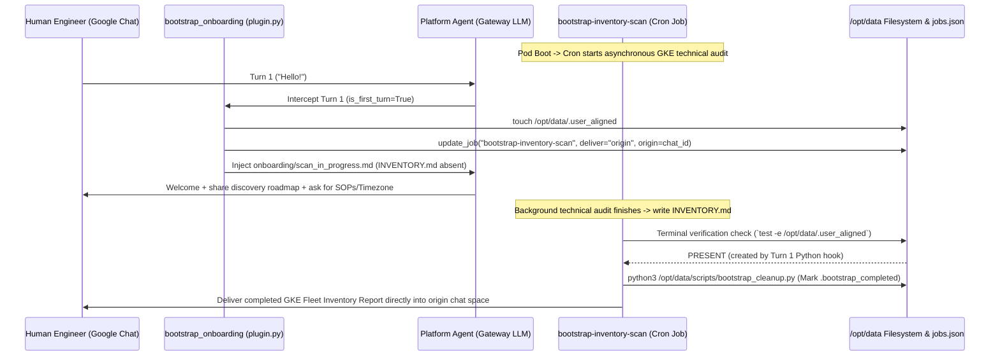
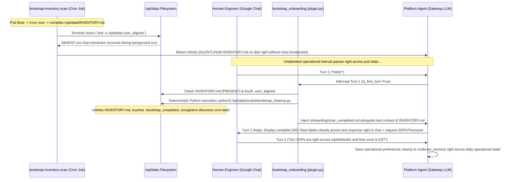

# Platform Agent Onboarding & Bootstrap (`bootstrap_onboarding`)

This document details the first-time onboarding and GKE environment discovery architecture right inside the Platform Agent. It provides clear operational guidance for human platform engineers and defines exact maintenance conventions and guardrails for future AI agents working on the repository.

---

## 1. System Overview

When a fresh Platform Agent pod initializes inside a newly onboarded Google Kubernetes Engine (GKE) cluster right or across a new persistent volume (`PVC`), it executes a two-stage initialization workflow right out of the box:

1. **Background Technical Discovery (`bootstrap-inventory-scan`):** A scheduled read-only cron task kicks off right shortly after container boot to systematically map out every running cluster, node pool machine classification, networking model (`Dataplane V2 / eBPF`), and workload SRE compliance configuration across the target Google Cloud project.
2. **Deterministic Conversational Onboarding (`bootstrap_onboarding` plugin):** A lightweight Python pre-hook intercepts initial user interaction turns right before they reach the model. By directly assessing absolute filesystem markers, Python deterministically routes the user right into either active ongoing discovery or complete post-scan findings presentation, isolating the model entirely from conditional logic or speculative file checking during initial greetings.

```mermaid
graph TD
    A[Platform Agent Container Boot] -->|Launch +1m Cron| B(bootstrap-inventory-scan Background Routine)
    A -->|User Initiates Chat| C{bootstrap_onboarding pre_llm_call Hook}
    B -->|Discovery Continues| D[Audit Fleet Topologies & Workloads]
    D -->|Compile Complete Findings| E[/opt/data/INVENTORY.md Written to Disk]
    C -->|INVENTORY.md Absent on Disk| F[Case A: Inject scan_in_progress.md & Bind Origin Chat ID]
    C -->|INVENTORY.md Present on Disk| G[Case B: Inject scan_completed.md & Master Findings Text]
```

---

## 2. Coordination State Markers (`/opt/data/`)

The onboarding architecture coordinates state transitions across three explicit absolute filesystem flags right directly across `/opt/data/`:

| Marker Absolute Path                 | Ownership / Creator                                                        | Lifecycle & Coordination Mechanics                                                                                                                                                                                                                                                                                                                                                                                                                                      |
| :----------------------------------- | :------------------------------------------------------------------------- | :---------------------------------------------------------------------------------------------------------------------------------------------------------------------------------------------------------------------------------------------------------------------------------------------------------------------------------------------------------------------------------------------------------------------------------------------------------------------- |
| **`/opt/data/INVENTORY.md`**         | Created directly by `bootstrap-inventory-scan` (`cron task`)               | Contains the master GKE fleet tables right alongside workload health checks and SRE remediation priorities compiled across the background scan. Its presence indicates that technical discovery is complete. Removed upon onboarding self-cleanup right when the findings are displayed.                                                                                                                                                                                |
| **`/opt/data/.user_aligned`**        | Created deterministically by `bootstrap_onboarding` (`plugin.py:37`)       | Touched immediately inside Python on the opening interactive user turn (`is_first_turn=True`). Signals to background cron jobs that a human user has connected to the platform chat space. **Inviolable safety rule:** Models inside background routines are strictly forbidden from creating right or writing to this marker across terminal commands. Preserved permanently right on disk across subsequent onboarding self-cleanups (`do not delete .user_aligned`). |
| **`/opt/data/.bootstrap_completed`** | Created exclusively right across `bootstrap_cleanup.py` (`cleanup script`) | Created immediately across the single conversational turn where completed inventory findings tables are presented. Its presence indicates that onboarding has permanently concluded, instructing our Python hook right to return `None` across all subsequent interactions right alongside preventing background scan re-executions across standard daily operations.                                                                                                   |

---

## 3. Operational Cases

Because complex multi-cluster fleet surveys run asynchronously right across container initialization right alongside diverse human engineering interaction patterns, `bootstrap_onboarding` cleanly orchestrates two distinct convergence pathways:

### Case A: User Engages Before Background Scan Completes (`Mid-Scan Interaction`)

In **Case A**, a human engineer initiates conversation while `bootstrap-inventory-scan` (`cron task`) is still actively surveying GKE cluster configurations in the background:

1. **Turn 1 Intercept (`plugin.py`):** The user sends their first message (`e.g., "hello" or "check cluster status"`). The `pre_llm_call` hook executes on `is_first_turn=True`:
   - Inspects `/opt/data/.bootstrap_completed` (`ABSENT`) and `/opt/data/INVENTORY.md` (`ABSENT`).
   - **Deterministic Touch:** Directly touches `/opt/data/.user_aligned` on disk across Python syntax (`Path("/opt/data/.user_aligned").touch(exist_ok=True)`).
   - **Dynamic Origin Binding:** Reads live session variables (`HERMES_SESSION_PLATFORM`, `HERMES_SESSION_CHAT_ID`, `HERMES_SESSION_THREAD_ID`) and issues `update_job("bootstrap-inventory-scan", {"deliver": "origin", "origin": origin_data})` directly against `jobs.json`. This dynamically anchors the active running cron task to deliver its eventual report directly into the specific chat room or topic that started conversation.
   - **Instruction Injection:** Loads `defaults/onboarding/scan_in_progress.md` directly into the prompt context right ahead of API call #1.
2. **Interactive Mid-Scan Reply:** The agent warmly greets the user, transparently summarizes what the active background scan (`bootstrap-inventory-scan`) is discovering right now across the cluster fleet, and invites team operational alignment preferences (`such as repository Standard Operating Procedures (`SOPs`) right alongside local time zone details`) without attempting synchronous scan commands across the opening turn.
3. **Background Scan Completion:** Minutes later right across the cluster, `bootstrap-inventory-scan` fully finishes compiling `/opt/data/INVENTORY.md`.
   - Executes its mandatory terminal verification (`test -e /opt/data/.user_aligned && echo "PRESENT" || echo "ABSENT"`).
   - Receives **`PRESENT`** (`created across Turn 1 directly in Python`).
   - Following its strict instructions (`Step 5 in governance/inventory.md`), `bootstrap-inventory-scan` formats its full findings overview right inside its final turn text and immediately runs `python3 /opt/data/scripts/bootstrap_cleanup.py` right across its exit (`touching .bootstrap_completed and unlinking INVENTORY.md + cron registration cleanly while permanently preserving .user_aligned`).
   - `_deliver_job_output` (`cron/scheduler.py`) evaluates `deliver: origin`, discovers our dynamically bound origin room (`origin.chat_id`), and cleanly pushes the fully formatted discovery tables right into the user's active Google Chat space right away right upon completion!



---

### Case B: User Engages After Background Scan Has Finished (`Post-Scan Interaction`)

In **Case B**, the Platform Agent deploys across an unattended container boot right without immediate human conversation across chat:

1. **Silent Discovery Completion:** `bootstrap-inventory-scan` systematically profiles the complete GKE landscape and saves all findings directly across `/opt/data/INVENTORY.md`.
2. **Strict Silent Termination (`governance/inventory.md:Step 5`):** Upon compiling findings, `bootstrap-inventory-scan` evaluates `test -e /opt/data/.user_aligned && echo "PRESENT" || echo "ABSENT"`.
   - Receives **`ABSENT`** (`since no human user initiated interactive conversation across chat yet`).
   - Honoring explicit instructions (`"If .user_aligned is ABSENT: Return strictly [SILENT] immediately and do nothing else"`), the background job safely exits across `[SILENT]`. This cleanly avoids unprompted room broadcasts across `deliver=all`, leaving `/opt/data/INVENTORY.md` completely preserved right across disk awaiting future human contact right off the bat.
3. **Turn 1 Intercept (`plugin.py`):** Hours or days later right across routine engineering activity, a user initiates chat (`"hello"`). `handle_pre_llm_call` intercepts Turn 1:
   - Inspects `/opt/data/.bootstrap_completed` (`ABSENT`).
   - Inspects `/opt/data/INVENTORY.md` (`PRESENT` — generated directly by the earlier unattended background scan).
   - **Deterministic Touch & Self-Cleanup (`plugin.py:99`):** Python touches `/opt/data/.user_aligned`, reads `INVENTORY.md` into prompt context memory, and immediately executes `subprocess.run(["python3", "/opt/data/scripts/bootstrap_cleanup.py"])` directly inside Python. This deterministically unlinks single-use files and registers `.bootstrap_completed` with zero dependence across model tool invocations.
   - **Instructions + Inventory Injection:** Python reads `defaults/onboarding/scan_completed.md` and appends its presentation instructions right alongside the literal master tables from `/opt/data/INVENTORY.md` (`[SYSTEM ONBOARDING INSTRUCTIONS — SCAN COMPLETED] ... --- EXCLUSIVE COMPLETED ENVIRONMENT INVENTORY FINDINGS ---...`) directly inside the active prompt context.
4. **Immediate Single-Turn Table Presentation:** Receiving the master inventory directly across its context window on Turn 1 alongside self-cleanup already completed directly in Python, the agent cleanly formats and presents the master discovery tables (`GKE Fleet Discovery, Workload Health Highlights, Prioritized SRE Recommendations`) right inside its text response (`tool_turns=0`) while requesting team operational alignment preferences (`SOPs & Timezone`).
5. **Standard Operations:** When the user provides follow-up alignment replies across subsequent turns (`Turn 2+`), the agent saves their preferences right into `multiuser_memory` (`user and memory targets`) across standard daily infrastructure management operations right away!



---

## 4. Architectural Rules & Implementation Principles (`For Future AI Maintainers`)

When expanding or modifying onboarding instructions, skills, or scripts inside `agents/platform/`, future AI engineers and developers **MUST STRICTLY ENFORCE** the following non-negotiable structural conventions:

### 1. Absolute Path Verifications vs Relative File Queries

- **Rule:** Whenever instructed across background discovery playbooks or self-cleanup procedures to verify whether state markers exist, all terminal verifications must evaluate explicit absolute paths directly across standard shell checks (`test -e /opt/data/INVENTORY.md`) or absolute file reading commands (`read_file path="/opt/data/INVENTORY.md"`).
- **Why:** Running relative pattern searches across directory trees (`such as calling search_files for .*inventory.*`) introduces severe fragility right across container operations because autonomous background tasks or interactive working directories frequently run across isolated subdirectories (`such as /opt/data/infra`), causing relative file queries right to miss root environment state markers right completely.

### 2. Inviolable Checklist Safety Boundaries (`Preventing Agent Goal Leaps`)

- **Rule:** Background scheduled routines (`governance/inventory.md`) must **NEVER** create, write, or touch `/opt/data/.user_aligned` directly under any circumstances.
- **Why:** When an autonomous tool-capable LLM encounters conditional instructions inside a background cron checklist (_"If `.user_aligned` exists, deliver report and execute cleanup command"_), models perceive executing the concluding self-cleanup command (`bootstrap_cleanup.py`) as their target mission objective right away right across their evaluation loop. Without rigorous safety prohibitions forbidding them directly from modifying `.user_aligned`, models actively forge `.user_aligned` via `write_file` directly during quiet unattended container boots across `Case B`, generating unprompted room noise across unassigned gateway channels and pre-emptively locking out user conversational onboarding right across `.bootstrap_completed`.

### 3. Immediate Single-Turn Cleanup vs Multi-Turn Dependency Rot

- **Rule:** When displaying completed findings tables across interactive onboarding turns (`onboarding/scan_completed.md`), self-cleanup execution (`python3 /opt/data/scripts/bootstrap_cleanup.py`) **MUST run directly across Turn 1 right when the summary tables are presented.**
- **Why:** Splitting self-cleanup across subsequent conversational turns right (_"Execute self-cleanup script upon receiving the user's follow-up reply in Turn 2"_) exposes the system to multi-turn cleanup debts. If transient tool faults occur across Turn 2 right (`e.g., temporary memory system downtime right across user preference saving`), the model shifts attention right to debugging tool failures across conversation history, stranding `INVENTORY.md` on disk across indefinite future operations right off the bat.

### 4. Cron Execution Filtering inside Hooks (`pre_llm_call`)

- **Rule:** Because every scheduled cron execution right inside Hermes boots a fresh evaluation turn where `is_first_turn == True`, `handle_pre_llm_call` (`plugin.py`) **MUST ALWAYS evaluate session identity and platform targets** directly right before injecting conversational user instructions right alongside touching coordination markers:
  ```python
  platform_name = str(kwargs.get("platform", "")).lower()
  session_id = str(kwargs.get("session_id", ""))
  if platform_name == "cron" or session_id.startswith("cron_"):
      return None
  ```

### 5. Multi-Chunk Delivery & Dynamic Origin Destination Binding

- **Dynamic Origin Anchoring (`plugin.py`):** Scheduled background routines right (`platform="cron"`) lack hardcoded destination room bindings (`_get_home_target_chat_id("google_chat") == None`) whenever platform integrations are provisioned dynamically across cloud subscriptions (`like GCP PubSub right across k8s-operator/internal/controller/platformagent_manifests.go`). `handle_pre_llm_call` resolves this dynamically right across **Case A** by inspecting live interactive conversational variables (`HERMES_SESSION_PLATFORM`, `HERMES_SESSION_CHAT_ID`, `HERMES_SESSION_THREAD_ID`) and executing `update_job("bootstrap-inventory-scan", {"deliver": "origin", "origin": origin_data})` directly against `jobs.json` right upon Turn 1 engagement.
- **Gateway Chunking Capabilities Patch (`register(ctx) right inside plugin.py`):** Upstream runtime gateways (`gateway/delivery.py`) enforce hard 4,000-character limits right across background cron task outputs, inserting `... [truncated, full output saved to...]` footers whenever platform adapters omit self-reporting multi-chunk capabilities (`splits_long_messages = True`). Because `GoogleChatAdapter` natively chunks arbitrary length markdown outputs across its core `send()` loop right across `_chunk_text(format_message(content))` but omitted declaring `splits_long_messages = True` directly inside class boundaries, our registration hook (`register(ctx) inside plugin.py`) **MUST ALWAYS maintain its safe runtime registration capability alignment**:
  ```python
  def register(ctx: Any) -> None:
      try:
          from plugins.platforms.google_chat.adapter import GoogleChatAdapter
          GoogleChatAdapter.splits_long_messages = True
      except Exception:
          pass
      ctx.register_hook("pre_llm_call", handle_pre_llm_call)
  ```
  This ensures comprehensive GKE fleet discovery reports across **Case A** deliver sequentially directly across active chat rooms across clean message blocks right without encountering gateway truncation right off the bat!

---

## 5. Quick Diagnostic Check Commands

To verify active state files directly inside a live deployment across the cluster:

```bash
POD_NAME=$(kubectl get pods -n kubeagents-system -l app=platform-agent-gateway -o jsonpath='{.items[0].metadata.name}')
kubectl exec -n kubeagents-system ${POD_NAME} -c platform-agent -- ls -la --full-time /opt/data/INVENTORY.md /opt/data/.user_aligned /opt/data/.bootstrap_completed 2>/dev/null || echo "All onboarding file markers cleared across active operations"
```

To review onboarding plugin turn interceptions right inside active agent logs:

```bash
kubectl exec -n kubeagents-system ${POD_NAME} -c platform-agent -- grep -E "bootstrap_onboarding|Dynamically linked bootstrap-inventory-scan|Created /opt/data/.user_aligned" /opt/data/logs/agent.log
```
