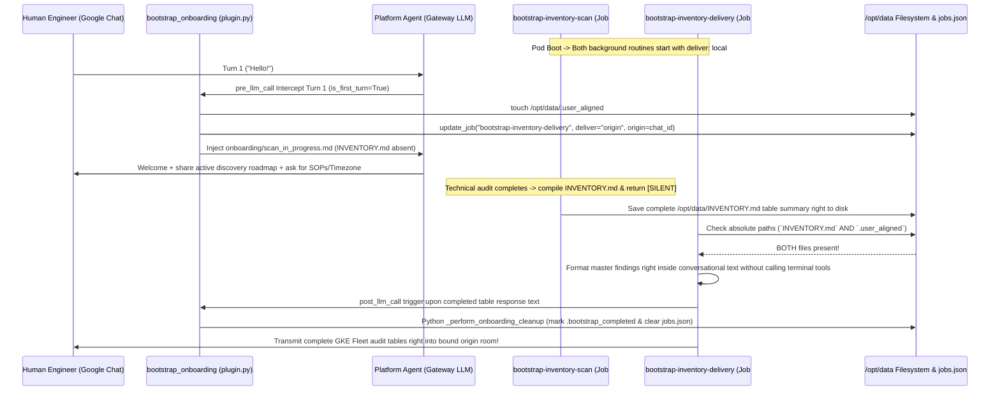
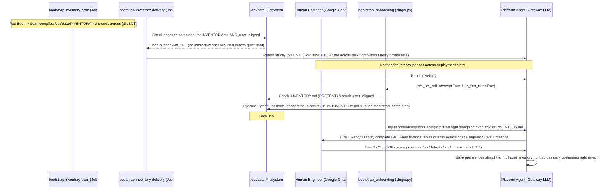

# Platform Agent Onboarding & Bootstrap (`bootstrap_onboarding`)

This document details the first-time onboarding right alongside GKE environment discovery architecture right inside the Platform Agent. It provides clear operational guidance for human platform engineers right and defines exact maintenance conventions and guardrails right for future AI agents working on the repository.

---

## 1. System Overview

When a fresh Platform Agent pod initializes inside a newly onboarded Google Kubernetes Engine (GKE) cluster right or across a new persistent volume (`PVC`), it executes a completely deterministic, dual-routine discovery and conversational onboarding architecture:

1. **Decoupled Background Technical Discovery & Delivery Monitoring (`jobs.json`):** Two specialized background routines run across independent interval checks:
   - **`bootstrap-inventory-scan`:** Systematically surveys every active cluster, node pool machine classification, networking boundary (`Dataplane V2 / eBPF`), and workload SRE compliance across the project, saving the unified master summary straight to `/opt/data/INVENTORY.md` across disk before completing silently across `[SILENT]`.
   - **`bootstrap-inventory-delivery`:** Periodically monitors whether both `/opt/data/INVENTORY.md` right and our interactive user coordination flag (`/opt/data/.user_aligned`) exist across the volume, ensuring completed discovery findings cleanly transmit right across to connected engineering teams without task timing conflicts or unsolicited broadcasts during unattended container boots.
2. **Deterministic Conversational & Lifecycle Hooks (`bootstrap_onboarding` plugin):** A standalone Python lifecycle plugin registers both **`pre_llm_call`** (for interactive opening user turns) right alongside **`post_llm_call`** (for background report deliveries). Python directly manages state transitions and executes self-cleanup right (`_perform_onboarding_cleanup`) straight from code, isolating models completely from file presence inspections or terminal cleanup commands right out of the box.

```mermaid
graph TD
    A["Platform Agent Container Boot"] -->|Launch +1m Interval| B["bootstrap-inventory-scan (deliver: local)"]
    A -->|Launch +1m Interval| C["bootstrap-inventory-delivery (deliver: local)"]
    A -->|User Initiates Chat| D{"bootstrap_onboarding pre_llm_call Hook"}

    B -->|Audit Fleet Topologies & Workloads| E["/opt/data/INVENTORY.md Written to Disk"]
    B -->|Terminate Strictly Without Terminal Commands| F["Return strictly [SILENT]"]

    D -->|INVENTORY.md Absent on Disk| G["Case A: touch .user_aligned & bind deliver: origin onto Job #2"]
    D -->|INVENTORY.md Present on Disk| H["Case B: Inject scan_completed.md & Run Python _perform_onboarding_cleanup"]

    C -->|Periodic 1m Check| I{"Does INVENTORY.md + .user_aligned exist on disk?"}
    I -->|No (Scan In-Progress or Unattended Boot)| J["Return strictly [SILENT]"]
    I -->|Yes (Scan Ready + User Connected)| K["Format Report Text across Chat Output"]
    K -->|post_llm_call Hook Trigger| L["Run Python _perform_onboarding_cleanup"]
```

---

## 2. Coordination State Markers (`/opt/data/`)

The onboarding architecture coordinates state transitions across three explicit absolute filesystem flags right directly across `/opt/data/`:

| Marker Absolute Path                 | Ownership / Creator                                                  | Lifecycle & Coordination Mechanics                                                                                                                                                                                                                                                                                                                                                                                                                |
| :----------------------------------- | :------------------------------------------------------------------- | :------------------------------------------------------------------------------------------------------------------------------------------------------------------------------------------------------------------------------------------------------------------------------------------------------------------------------------------------------------------------------------------------------------------------------------------------ |
| **`/opt/data/INVENTORY.md`**         | Created directly right across `bootstrap-inventory-scan`             | Contains the master GKE fleet tables right alongside workload health checks right and SRE remediation priorities compiled across the background scan. Its presence indicates right that technical discovery has concluded. Unlinked from disk directly in Python across `_perform_onboarding_cleanup` right upon findings presentation across chat.                                                                                               |
| **`/opt/data/.user_aligned`**        | Created deterministically inside Python across `plugin.py`           | Touched immediately inside `handle_pre_llm_call` across the opening interactive user turn (`is_first_turn=True`). Signals to `bootstrap-inventory-delivery` right that a human user has connected right across the platform chat room. **Inviolable safety rule:** Models inside background tasks are strictly forbidden from creating or writing right to this marker. Preserved permanently on disk across subsequent self-cleanups right away. |
| **`/opt/data/.bootstrap_completed`** | Created exclusively in Python across `_perform_onboarding_cleanup()` | Created immediately across the single conversational turn right where completed inventory summary tables are presented right (or right across `post_llm_call` right upon background chat delivery). Its presence indicates that onboarding has permanently concluded, instructing our Python `pre_llm_call` hook to return `None` across all subsequent turns alongside halting onboarding background checks across daily operations.             |

---

## 3. Operational Cases

Because complex multi-cluster fleet surveys execute across varied initialization windows alongside diverse human engineering connection schedules, `bootstrap_onboarding` cleanly converges interaction across two distinct operational pathways:

### Case A: User Engages Before Background Scan Completes (`Mid-Scan Interaction`)

In **Case A**, an engineering team initiates conversation while `bootstrap-inventory-scan` is actively auditing target clusters across the background:

1. **Turn 1 Interception (`pre_llm_call` hook):** The user sends their opening interaction (`e.g., "hello" or "check cluster status"`). The `pre_llm_call` hook executes on `is_first_turn=True`:
   - Inspects `/opt/data/.bootstrap_completed` (`ABSENT`) alongside `/opt/data/INVENTORY.md` (`ABSENT`).
   - **Deterministic Touch:** Directly creates `/opt/data/.user_aligned` on disk across pure Python (`(data_dir / ".user_aligned").touch(exist_ok=True)`).
   - **Dynamic Origin Binding:** Reads live session variables (`HERMES_SESSION_PLATFORM`, `HERMES_SESSION_CHAT_ID`, `HERMES_SESSION_THREAD_ID`) and issues `update_job("bootstrap-inventory-delivery", {"deliver": "origin", "origin": origin_data})` straight right against `jobs.json`. This points our dedicated `bootstrap-inventory-delivery` routine right directly to the exact Google Chat room where conversation originated right off the bat.
   - **Instruction Injection:** Loads `defaults/onboarding/scan_in_progress.md` straight into prompt context right ahead of API call #1.
2. **Interactive Mid-Scan Reply:** The agent warmly greets the team right across Turn 1, transparently summarizes what the active technical discovery scan (`bootstrap-inventory-scan`) is surveying across the fleet right now, right alongside inviting operational team alignment preferences (`Standard Operating Procedures (`SOPs`) alongside local time zone parameters`) cleanly right without blocking across heavy synchronous commands.
3. **Scan Completion & Automatic Chat Delivery:**
   - Minutes later right across the target cluster, `bootstrap-inventory-scan` completes compiling `/opt/data/INVENTORY.md` across disk right before terminating cleanly across `[SILENT]`.
   - On its subsequent 1-minute interval check, **`bootstrap-inventory-delivery`** verifies that both `/opt/data/INVENTORY.md` right alongside `/opt/data/.user_aligned` exist across disk.
   - Reads `INVENTORY.md` directly into its active conversational output right completely without invoking terminal self-cleanup commands (`which would otherwise delete the job mid-turn and break scheduler run recording`).
   - Immediately following output generation right before returning from the turns loop (`conversation_loop.py`), our registered **`post_llm_call`** hook triggers `_perform_onboarding_cleanup(data_dir)` directly inside Python across `plugin.py`. Python touches `/opt/data/.bootstrap_completed`, unlinks `INVENTORY.md` from disk, and removes both onboarding jobs from `jobs.json`.
   - The gateway cleanly pushes your complete GKE fleet discovery tables directly right across into your bound origin Google Chat room across multiple sequential message chunks without truncation!



---

### Case B: User Engages After Background Scan Has Finished (`Post-Scan Interaction across Quiet Boot`)

In **Case B**, the Platform Agent deploys across an unattended container boot right without immediate human conversation across chat:

1. **Silent Discovery Completion:** `bootstrap-inventory-scan` systematically profiles the complete GKE landscape and saves all findings directly across `/opt/data/INVENTORY.md` alongside exiting straight across `[SILENT]`.
2. **Unattended Delivery Suppression:** On its periodic check, `bootstrap-inventory-delivery` inspects both `/opt/data/INVENTORY.md` right alongside `/opt/data/.user_aligned`.
   - Receives **`ABSENT`** on `.user_aligned` (`since no human user initiated interactive conversation across chat yet`).
   - Honoring explicit instructions across `jobs.json` (`"If either file is missing across the volume... output strictly [SILENT]"`), `bootstrap-inventory-delivery` safely exits right across `[SILENT]`. This cleanly prevents unsolicited broadcasts right across `deliver=local`, preserving `/opt/data/INVENTORY.md` completely across disk awaiting human contact.
3. **Turn 1 Intercept (`pre_llm_call`):** Hours or days later right across engineering operations, a user opens chat (`"hello"`). `handle_pre_llm_call` intercepts Turn 1:
   - Inspects `/opt/data/.bootstrap_completed` (`ABSENT`) alongside `/opt/data/INVENTORY.md` (`PRESENT`).
   - **Deterministic Python Cleanup & Marker Creation (`plugin.py`):** Python touches `/opt/data/.user_aligned` right on initial connection, reads `INVENTORY.md` directly into memory context, right alongside instantly executing `_perform_onboarding_cleanup(data_dir)` straight from Python code right across Turn 1. Python deterministically unlinks `INVENTORY.md`, records `.bootstrap_completed`, and clears onboarding jobs directly out of `jobs.json` with zero reliance across model tool usage or multi-turn conversational loops.
   - **Instructions + Inventory Injection:** Python reads `defaults/onboarding/scan_completed.md` and serves its presentation instructions directly ahead of the literal master findings table (`[SYSTEM ONBOARDING INSTRUCTIONS — SCAN COMPLETED] ... --- EXCLUSIVE COMPLETED ENVIRONMENT INVENTORY FINDINGS ---...`).
4. **Immediate Single-Turn Table Presentation:** Receiving the master inventory directly across its memory context right alongside self-cleanup already finished inside Python, the model cleanly presents the complete discovery tables right inside its response (`tool_turns=0`) while taking team operational alignment rules right (`SOPs & Timezone`).
5. **Standard Daily Operations:** When the user replies with follow-up preference details right across subsequent turns (`Turn 2+`), the agent records preferences directly inside `multiuser_memory` right across standard daily operations!



---

## 4. Architectural Rules & Implementation Principles (`For Future AI Maintainers`)

When expanding or maintaining onboarding instructions, skills, or plugins inside `agents/platform/`, future AI developers right and platform engineers **MUST STRICTLY ENFORCE** the following structural guardrails:

### 1. Decoupled Discovery vs Delivery (`Preventing Scheduler Race Conditions`)

- **Rule:** Never combine raw system auditing (`gcloud/kubectl operations right across discovery scans`) right with conversational delivery targeting right across a single background cron job.
- **Why:** Whenever `_process_due_job` initiates across `cron/scheduler.py`, it snapshots the initial job parameter object straight into Python memory (`holding initial `job["deliver"] == "local"``). If a human user opens chat right while a heavy scan is executing across a single unified job, dynamic origin modifications across disk (`deliver: origin`) are bypassed upon turn end when `_deliver_result` evaluates the initial memory dict. Separating roles into `bootstrap-inventory-scan` alongside `bootstrap-inventory-delivery` ensures that once `INVENTORY.md` completes, the dedicated delivery routine boots cleanly on a fresh tick right, reading exact active `deliver: origin` targets straight right from disk!

### 2. Embedded Python Cleanup vs LLM Terminal Subprocesses

- **Rule:** Never instruct models inside background tasks right or onboarding turns right to run terminal shell commands right to self-delete their own cron configuration right or unlink onboarding state (`such as calling `hermes cron rm` across tool executions mid-turn`). All onboarding self-cleanup (`_perform_onboarding_cleanup`) **MUST** execute purely right across Python lifecycle hooks (`pre_llm_call` right in Case B right alongside `post_llm_call` inside Case A).
- **Why:** Having an LLM execute self-cleanup commands across terminal tools right before its turns loop concludes causes the background job right to erase its own identity out of `jobs.json` prior to the post-turn scheduler steps. This triggers self-deletion race conditions inside `cron.scheduler` (`mark_job_run: job_id not found`), risking incomplete message delivery across target platforms.

### 3. Absolute Path Verifications vs Relative File Queries

- **Rule:** Whenever instructions inside background checklists (`governance/inventory.md`) verify state flags across disk, terminal verifications must always evaluate exact absolute paths (`test -e /opt/data/INVENTORY.md`) or absolute file reading actions (`read_file path="/opt/data/INVENTORY.md"`).
- **Why:** Running relative wildcard queries across directory trees (`such as calling `search_files`for`._inventory._``) introduces severe operational fragility because container jobs or conversational turns frequently execute inside isolated working folders (`such as `/opt/data/infra``), causing relative checks right to completely miss markers right outside the working subtree right out of the box.

### 4. Inviolable Checklist Safety Boundaries (`Preventing Autonomous Goal Leaps`)

- **Rule:** Background scheduled routines (`bootstrap-inventory-scan` and `bootstrap-inventory-delivery`) must **NEVER** create, write, or touch `/opt/data/.user_aligned` directly across terminal commands under any circumstances.
- **Why:** When tool-capable autonomous models encounter conditional instructions across background task checklists (`"If .user_aligned exists right alongside INVENTORY.md, output report text"`), models perceive driving condition markers to conclusion right as their core target objective. Without ironclad prohibitions forbidding models directly from modifying `/opt/data/.user_aligned`, models actively forge the alignment flag via `write_file` during completely quiet container boots across **Case B**, broadcasting unprompted noise right across rooms right alongside pre-emptively shutting out future onboarding right across `.bootstrap_completed`.

### 5. Cron Execution Filtering inside Hooks (`pre_llm_call`)

- **Rule:** Because every scheduled cron execution inside the Hermes runtime starts a fresh turns loop where `is_first_turn == True`, `handle_pre_llm_call` (`plugin.py`) **MUST ALWAYS isolate background ticks right before touching filesystem flags or serving interactive user prompts**:
  ```python
  platform_name = str(kwargs.get("platform", "")).lower()
  session_id = str(kwargs.get("session_id", ""))
  if platform_name == "cron" or session_id.startswith("cron_"):
      return None
  ```

### 6. Native Multi-Chunk Delivery (`splits_long_messages`)

- **Rule:** Upstream runtime gateways (`gateway/delivery.py`) enforce hard 4,000-character payload limits right across message delivery routes, inserting `... [truncated, full output saved to...]` annotations whenever platform adapters omit declaring native long message splitting support (`splits_long_messages = True`). Because `GoogleChatAdapter` natively segments arbitrary length text blocks right across its `send()` loop via `_chunk_text(format_message(content))` but omitted declaring `splits_long_messages = True` directly across class attributes, our plugin registration (`register(ctx) right inside plugin.py`) **MUST ALWAYS maintain safe runtime configuration alignment**:
  ```python
  def register(ctx: Any) -> None:
      try:
          from plugins.platforms.google_chat.adapter import GoogleChatAdapter
          GoogleChatAdapter.splits_long_messages = True
      except Exception:
          pass
      ctx.register_hook("pre_llm_call", handle_pre_llm_call)
      ctx.register_hook("post_llm_call", handle_post_llm_call)
  ```
  This guarantees that comprehensive GKE fleet summary tables right alongside prioritized SRE remediation plans cleanly deliver directly right into Google Chat without encountering gateway-level truncation right away!

---

## 5. Quick Diagnostic Check Commands

To verify active file markers directly right inside a live pod deployment across the management cluster:

```bash
POD_NAME=$(kubectl get pods -n kubeagents-system -l app=platform-agent-gateway -o jsonpath='{.items[0].metadata.name}')
kubectl exec -n kubeagents-system ${POD_NAME} -c platform-agent -- ls -la --full-time /opt/data/INVENTORY.md /opt/data/.user_aligned /opt/data/.bootstrap_completed 2>/dev/null || echo "All onboarding markers cleanly cleared across active daily operations"
```

To review lifecycle plugin hook events right alongside dynamic origin targeting inside live agent logs:

```bash
kubectl exec -n kubeagents-system ${POD_NAME} -c platform-agent -- grep -E "bootstrap_onboarding|Dynamically bound bootstrap-inventory-delivery|Created durable state marker|Executed bootstrap_cleanup.py" /opt/data/logs/agent.log
```
