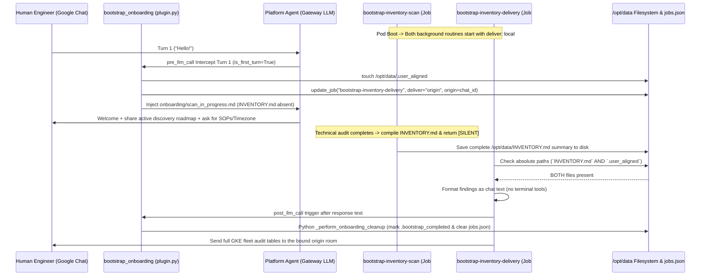
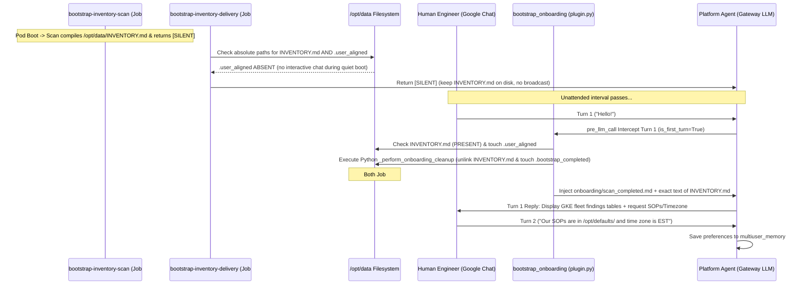

# Platform Agent Onboarding & Bootstrap (`bootstrap_onboarding`)

This document describes the first-time onboarding and GKE environment-discovery flow built into the Platform Agent. It covers how the flow works for platform engineers and the maintenance conventions and guardrails that future contributors (human or AI) must follow when changing this code.

---

## 1. System Overview

When a fresh Platform Agent pod starts on a newly onboarded Google Kubernetes Engine (GKE) cluster — or on a new persistent volume (`PVC`) — it runs a deterministic, two-part discovery and onboarding flow:

1. **Background discovery and delivery (`jobs.json`):** Two cron jobs run on independent 1-minute intervals.
   - **`bootstrap-inventory-scan`:** Surveys every cluster — node pool machine types, networking boundaries (`Dataplane V2 / eBPF`), and workload SRE compliance — then writes a single summary to `/opt/data/INVENTORY.md` and returns `[SILENT]`.
   - **`bootstrap-inventory-delivery`:** Checks whether both `/opt/data/INVENTORY.md` and the user-presence flag `/opt/data/.user_aligned` exist. It sends the findings to chat only when both are present, so completed results reach the team without racing the scan or broadcasting during an unattended boot.
2. **Lifecycle hooks (`bootstrap_onboarding` plugin):** A standalone Python plugin registers `pre_llm_call` (for the first interactive user turn) and `post_llm_call` (for background deliveries). The plugin drives all state transitions and self-cleanup (`_perform_onboarding_cleanup`) in Python, so the model never has to inspect files or run cleanup commands itself.

```mermaid
graph TD
    A["Platform Agent Container Boot"] -->|Launch +1m Interval| B["bootstrap-inventory-scan (deliver: local)"]
    A -->|Launch +1m Interval| C["bootstrap-inventory-delivery (deliver: local)"]
    A -->|User Initiates Chat| D{"bootstrap_onboarding pre_llm_call Hook"}

    B -->|Audit Fleet Topologies & Workloads| E["/opt/data/INVENTORY.md Written to Disk"]
    B -->|Terminate Without Terminal Commands| F["Return [SILENT]"]

    D -->|INVENTORY.md Absent on Disk| G["Case A: touch .user_aligned & bind deliver: origin onto Job #2"]
    D -->|INVENTORY.md Present on Disk| H["Case B: Inject scan_completed.md & Run Python _perform_onboarding_cleanup"]

    C -->|Periodic 1m Check| I{"Does INVENTORY.md + .user_aligned exist on disk?"}
    I -->|No (Scan In-Progress or Unattended Boot)| J["Return [SILENT]"]
    I -->|Yes (Scan Ready + User Connected)| K["Format Report Text for Chat Output"]
    K -->|post_llm_call Hook Trigger| L["Run Python _perform_onboarding_cleanup"]
```

---

## 2. Coordination State Markers (`/opt/data/`)

The flow coordinates state through three flag files under `/opt/data/`:

| Marker | Created By | Lifecycle & Purpose |
| :----- | :--------- | :------------------ |
| **`/opt/data/INVENTORY.md`** | `bootstrap-inventory-scan` | Holds the GKE fleet tables, workload health checks, and SRE remediation priorities produced by the scan. Its presence means technical discovery has finished. Removed by `_perform_onboarding_cleanup` (in Python) once the findings are presented in chat. |
| **`/opt/data/.user_aligned`** | Python, in `plugin.py` | Touched in `handle_pre_llm_call` on the first interactive user turn (`is_first_turn=True`). Signals to `bootstrap-inventory-delivery` that a human has joined the chat. **Safety rule:** background tasks must never create or write this marker (see Rule 4). Preserved across later cleanups. |
| **`/opt/data/.bootstrap_completed`** | Python, in `_perform_onboarding_cleanup()` | Written on the turn where the inventory is presented (Case B), or in `post_llm_call` after a background delivery (Case A). Its presence means onboarding is permanently done: `pre_llm_call` returns `None` on all later turns and the onboarding background jobs stop. |

---

## 3. Operational Cases

Because scans and human connections happen on different schedules, the flow converges through two pathways.

### Case A: User engages before the scan completes (mid-scan interaction)

A team starts a conversation while `bootstrap-inventory-scan` is still auditing clusters.

1. **Turn 1 interception (`pre_llm_call`):** The user sends an opening message (`e.g., "hello"` or `"check cluster status"`). With `is_first_turn=True`, the hook:
   - Checks `/opt/data/.bootstrap_completed` (`ABSENT`) and `/opt/data/INVENTORY.md` (`ABSENT`).
   - **Touches the presence marker:** creates `/opt/data/.user_aligned` in Python (`(data_dir / ".user_aligned").touch(exist_ok=True)`).
   - **Binds the delivery target:** reads the live session variables (`HERMES_SESSION_PLATFORM`, `HERMES_SESSION_CHAT_ID`, `HERMES_SESSION_THREAD_ID`) and calls `update_job("bootstrap-inventory-delivery", {"deliver": "origin", "origin": origin_data})`, pointing `bootstrap-inventory-delivery` at the Google Chat room where the conversation started.
   - **Injects instructions:** loads `defaults/onboarding/scan_in_progress.md` into the prompt before API call #1.
2. **Mid-scan reply:** The agent greets the team, summarizes what the scan is currently surveying, and asks for operational preferences (Standard Operating Procedures and local time zone) — without running any heavy synchronous commands.
3. **Scan completion and automatic delivery:**
   - The scan finishes writing `/opt/data/INVENTORY.md` and returns `[SILENT]`.
   - On its next 1-minute tick, `bootstrap-inventory-delivery` confirms that both `/opt/data/INVENTORY.md` and `/opt/data/.user_aligned` exist.
   - It reads `INVENTORY.md` into its response without running any terminal cleanup commands (which would delete the job mid-turn and break scheduler run recording).
   - After the response is generated, the `post_llm_call` hook runs `_perform_onboarding_cleanup(data_dir)` in Python: it touches `/opt/data/.bootstrap_completed`, removes `INVENTORY.md`, and removes both onboarding jobs.
   - The gateway sends the full fleet-discovery tables to the bound origin room, split across multiple messages so nothing is truncated.



---

### Case B: User engages after the scan has finished (quiet boot)

The pod boots unattended, with no human in chat yet.

1. **Silent completion:** `bootstrap-inventory-scan` profiles the environment, saves everything to `/opt/data/INVENTORY.md`, and returns `[SILENT]`.
2. **Delivery suppressed:** On each tick, `bootstrap-inventory-delivery` checks `/opt/data/INVENTORY.md` and `/opt/data/.user_aligned`.
   - `.user_aligned` is `ABSENT` (no human has connected yet).
   - Following its `jobs.json` instructions (`"If either file is missing... output [SILENT]"`), the job returns `[SILENT]`. This avoids an unsolicited broadcast and keeps `/opt/data/INVENTORY.md` on disk until a human arrives.
3. **Turn 1 intercept (`pre_llm_call`):** Hours or days later a user opens chat (`"hello"`). `handle_pre_llm_call` intercepts Turn 1:
   - Checks `/opt/data/.bootstrap_completed` (`ABSENT`) and `/opt/data/INVENTORY.md` (`PRESENT`).
   - **Python cleanup and marker creation:** it touches `/opt/data/.user_aligned`, reads `INVENTORY.md` into context, and runs `_perform_onboarding_cleanup(data_dir)` on this same turn. Python removes `INVENTORY.md`, writes `.bootstrap_completed`, and removes the onboarding jobs — no model tool calls or extra turns required.
   - **Instruction + inventory injection:** Python reads `defaults/onboarding/scan_completed.md` and places its presentation instructions ahead of the inventory text (`[SYSTEM ONBOARDING INSTRUCTIONS — SCAN COMPLETED] ... --- EXCLUSIVE COMPLETED ENVIRONMENT INVENTORY FINDINGS ---...`).
4. **Single-turn presentation:** With the inventory already in context and cleanup already done in Python, the model presents the full discovery tables in its response (`tool_turns=0`) and asks for the team's operational preferences (SOPs and time zone).
5. **Standard operations:** When the user replies with their preferences (`Turn 2+`), the agent records them in `multiuser_memory` and continues normal operation.



---

## 4. Architectural Rules & Implementation Principles (for future maintainers)

When changing onboarding instructions, skills, or plugins under `agents/platform/`, follow these guardrails.

### 1. Keep discovery and delivery in separate jobs (avoids a scheduler race)

- **Rule:** Never combine system auditing (`gcloud` / `kubectl` scans) and chat delivery targeting in a single cron job.
- **Why:** When `_process_due_job` runs (`cron/scheduler.py`), it snapshots the job's parameters into memory (including `job["deliver"] == "local"`). If a user opens chat while a single combined job is mid-scan, a later `deliver: origin` change on disk is ignored at turn end, because `_deliver_result` reads the in-memory snapshot. Splitting into `bootstrap-inventory-scan` and `bootstrap-inventory-delivery` means that once `INVENTORY.md` is ready, the delivery job starts on a fresh tick and reads the current `deliver: origin` target from disk.

### 2. Do cleanup in Python hooks, not via LLM terminal commands

- **Rule:** Never instruct the model — in a background task or an onboarding turn — to run terminal commands (`e.g., hermes cron rm`) to delete its own cron jobs or onboarding state. Onboarding self-cleanup (`_perform_onboarding_cleanup`) must run in the Python lifecycle hooks (`pre_llm_call` in Case B, `post_llm_call` in Case A).
- **Why:** If the model runs self-cleanup commands before its turn loop finishes, the background job erases its own entry in `jobs.json` before the post-turn scheduler steps run. That causes a race in `cron.scheduler` (`mark_job_run: job_id not found`) and can drop the message delivery.

### 3. Verify state with absolute paths, not relative queries

- **Rule:** When background checklists (`governance/inventory.md`) verify state flags, use absolute paths (`test -e /opt/data/INVENTORY.md`) or absolute reads (`read_file path="/opt/data/INVENTORY.md"`).
- **Why:** Relative or wildcard searches (`e.g., search_files for ._inventory._`) are unreliable, because jobs and turns often run from a subdirectory (`e.g., /opt/data/infra`) where the markers are outside the working tree and won't be found.

### 4. Background tasks must never touch `.user_aligned` (avoids autonomous goal-seeking)

- **Rule:** The background jobs (`bootstrap-inventory-scan` and `bootstrap-inventory-delivery`) must **never** create, write, or touch `/opt/data/.user_aligned`.
- **Why:** Given a conditional instruction (`"If .user_aligned and INVENTORY.md exist, output the report"`), a tool-capable model can treat satisfying that condition as its goal. Without an explicit prohibition, the model may create `.user_aligned` itself (via `write_file`) during a quiet boot (Case B), broadcasting unprompted and prematurely writing `.bootstrap_completed`, which shuts out real onboarding later.

### 5. Filter cron ticks inside `pre_llm_call`

- **Rule:** Every scheduled cron run starts a fresh turn loop with `is_first_turn == True`, so `handle_pre_llm_call` (`plugin.py`) must skip background ticks before touching flags or serving prompts:
  ```python
  platform_name = str(kwargs.get("platform", "")).lower()
  session_id = str(kwargs.get("session_id", ""))
  if platform_name == "cron" or session_id.startswith("cron_"):
      return None
  ```

### 6. Enable native multi-chunk delivery (`splits_long_messages`)

- **Rule:** The gateway (`gateway/delivery.py`) enforces a 4,000-character limit per message and appends `... [truncated, full output saved to...]` when an adapter does not declare `splits_long_messages = True`. `GoogleChatAdapter` already splits long text in its `send()` loop via `_chunk_text(format_message(content))`, but does not set `splits_long_messages`. So `register(ctx)` in `plugin.py` sets it explicitly:
  ```python
  def register(ctx: Any) -> None:
      try:
          from plugins.platforms.google_chat.adapter import GoogleChatAdapter
          GoogleChatAdapter.splits_long_messages = True
      except Exception:
          pass
      ctx.register_hook("pre_llm_call", handle_pre_llm_call)
      ctx.register_hook("post_llm_call", handle_post_llm_call)
  ```
  This lets full fleet summaries and SRE remediation plans reach Google Chat without gateway truncation.

---

## 5. Quick Diagnostic Commands

Check the active markers in a live pod:

```bash
POD_NAME=$(kubectl get pods -n kubeagents-system -l app=platform-agent-gateway -o jsonpath='{.items[0].metadata.name}')
kubectl exec -n kubeagents-system ${POD_NAME} -c platform-agent -- ls -la --full-time /opt/data/INVENTORY.md /opt/data/.user_aligned /opt/data/.bootstrap_completed 2>/dev/null || echo "All onboarding markers cleared"
```

Review lifecycle hook events and origin targeting in the agent logs:

```bash
kubectl exec -n kubeagents-system ${POD_NAME} -c platform-agent -- grep -E "bootstrap_onboarding|Dynamically bound bootstrap-inventory-delivery|Created durable state marker|Executed bootstrap_cleanup.py" /opt/data/logs/agent.log
```
