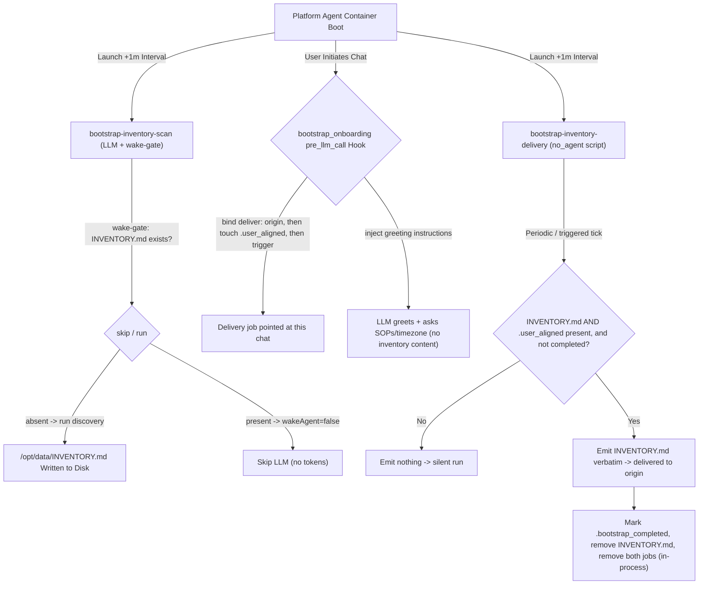
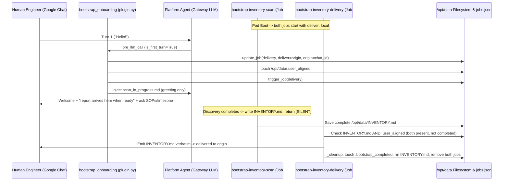

# Platform Agent Onboarding & Bootstrap (`bootstrap_onboarding`)

This document describes the first-time onboarding and GKE environment-discovery flow built into the Platform Agent. It covers how the flow works for platform engineers and the maintenance conventions and guardrails that future contributors (human or AI) must follow when changing this code.

---

## 1. System Overview

When a fresh Platform Agent pod starts on a newly onboarded Google Kubernetes Engine (GKE) cluster — or on a new persistent volume (`PVC`) — it runs a deterministic, first-time discovery and onboarding flow made of three parts:

1. **`bootstrap-inventory-scan`** — an LLM cron job (1-minute interval). It surveys the fleet (node pools, networking, Workload Identity, workload SRE posture) and writes a **complete, presentation-ready** report to `/opt/data/INVENTORY.md`, then returns `[SILENT]`. A wake-gate script skips the LLM run once the report exists, so the job stops costing tokens after it succeeds.
2. **`bootstrap-inventory-delivery`** — a `no_agent` cron job (1-minute interval). Its script emits `/opt/data/INVENTORY.md` to stdout, which the scheduler delivers **verbatim** to the chat, but only when discovery has finished _and_ a human has connected. No LLM is involved in delivery: what the scan wrote is exactly what the user receives.
3. **`bootstrap_onboarding` plugin** — a `pre_llm_call` lifecycle hook. On the first human turn it greets the user, records that a human is present, points the delivery job at this chat, and asks it to fire promptly. It never presents the report itself.

### Why two jobs? (the load-bearing reason)

The scheduler snapshots a job's delivery destination (`deliver` / `origin`) into memory **when the run starts** (`get_due_jobs` deep-copies `jobs.json`), and delivers the result to that snapshot at the end — it does not re-read the destination from disk after the turn. The scan is long-running and boots with `deliver: local` (no user yet). If the _same_ job also delivered the report, a user who connects mid-scan could not redirect it: their chat is written to disk as `deliver: origin`, but the in-flight scan already cached `deliver: local`, so the report would be lost.

Splitting delivery into a separate, short job fixes this: it starts on a fresh tick _after_ the plugin has written `deliver: origin` to disk, so it reads the correct destination. This separation is mandatory — do not merge the two jobs (see Rule 1).



---

## 2. Coordination State Markers (`/opt/data/`)

The flow coordinates state through three flag files under `/opt/data/`:

| Marker                               | Created By                           | Lifecycle & Purpose                                                                                                                                                                                                                                                                   |
| :----------------------------------- | :----------------------------------- | :------------------------------------------------------------------------------------------------------------------------------------------------------------------------------------------------------------------------------------------------------------------------------------ |
| **`/opt/data/INVENTORY.md`**         | `bootstrap-inventory-scan` (LLM)     | The complete, verbatim-delivered report. Its presence means discovery has finished and gates both the scan wake-gate and the delivery job. Removed by the delivery script (`_cleanup`) after the report is emitted.                                                                   |
| **`/opt/data/.user_aligned`**        | Python, in `plugin.py`               | Touched in `handle_pre_llm_call` on the first interactive user turn (`is_first_turn=True`). Signals to the delivery job that a human has joined the chat. **Safety rule:** background tasks must never create or write this marker (see Rule 4).                                      |
| **`/opt/data/.bootstrap_completed`** | `bootstrap_delivery.py` (`_cleanup`) | Written once the report has been emitted for delivery. Its presence means onboarding is permanently done: `pre_llm_call` returns `None` on later turns, the delivery script stays silent, and the scan wake-gate keeps the scan from re-running even after `INVENTORY.md` is removed. |

---

## 3. Operational Cases

Both cases converge on the same delivery path: the `no_agent` delivery job posts `INVENTORY.md` verbatim once discovery is done and a human is present. The only difference is timing.

### Case A: User engages before the scan completes (mid-scan)

1. **Turn 1 (`pre_llm_call`):** With `is_first_turn=True` and a non-cron session, the plugin:
   - binds the delivery job to this chat — reads `HERMES_SESSION_PLATFORM` / `HERMES_SESSION_CHAT_ID` / `HERMES_SESSION_THREAD_ID` and calls `update_job("bootstrap-inventory-delivery", {"deliver": "origin", "origin": {...}})` — **before** touching `.user_aligned`, so the job can never fire against a stale target;
   - touches `/opt/data/.user_aligned`;
   - calls `trigger_job("bootstrap-inventory-delivery")` so it fires on the next tick;
   - injects `defaults/onboarding/scan_in_progress.md` (a greeting + "the report will arrive here when ready" + a request for SOPs/timezone). It does **not** inject the inventory.
2. **Delivery job (each tick):** `INVENTORY.md` is still absent → the script emits nothing → silent run.
3. **Scan completes:** writes `/opt/data/INVENTORY.md`, returns `[SILENT]`; its wake-gate now skips further LLM runs.
4. **Next delivery tick:** both `INVENTORY.md` and `.user_aligned` exist and `.bootstrap_completed` is absent → the script prints `INVENTORY.md`, the scheduler delivers it verbatim to the bound origin chat, and `_cleanup` marks completion, removes the report, and removes both onboarding jobs.



### Case B: User engages after the scan finished (quiet boot)

1. **Silent completion:** during the unattended boot the scan writes `/opt/data/INVENTORY.md` and returns `[SILENT]`. The delivery job stays silent because `.user_aligned` is absent, so the report waits on disk.
2. **Turn 1 (`pre_llm_call`):** the plugin does exactly the same three things as in Case A (bind origin → touch `.user_aligned` → trigger delivery) and injects `defaults/onboarding/scan_completed.md` (a greeting + "the full report is being delivered now" + a request for SOPs/timezone).
3. **Next delivery tick:** both files now exist → the script delivers `INVENTORY.md` verbatim to the origin chat and runs `_cleanup`.

The report therefore arrives as its own message shortly after the greeting, identical to Case A — the user always sees the same verbatim report, never an LLM-reformatted one.

```mermaid
sequenceDiagram
    participant Scan as bootstrap-inventory-scan (Job #1, LLM)
    participant Deliver as bootstrap-inventory-delivery (Job #2, no_agent script)
    participant Disk as /opt/data Filesystem
    participant User as Human Engineer (Google Chat)
    participant Hook as bootstrap_onboarding (plugin.py)
    participant Agent as Platform Agent (Gateway LLM)

    Note over Scan: Pod Boot -> Scan writes /opt/data/INVENTORY.md & returns [SILENT]
    Deliver->>Disk: Check .user_aligned -> ABSENT (no human yet) -> silent
    Note over User,Agent: Unattended interval passes...
    User->>Agent: Turn 1 ("Hello!")
    Agent->>Hook: pre_llm_call (is_first_turn=True)
    Hook->>Disk: update_job(delivery, deliver=origin) ; touch .user_aligned ; trigger_job(delivery)
    Hook->>Agent: Inject scan_completed.md (greeting only)
    Agent->>User: Welcome + "full report incoming" + ask SOPs/timezone
    Deliver->>User: Emit INVENTORY.md verbatim -> delivered to origin
    Deliver->>Disk: _cleanup: touch .bootstrap_completed, rm INVENTORY.md, remove both jobs
```

---

## 4. Architectural Rules & Implementation Principles (for future maintainers)

When changing onboarding instructions, scripts, or the plugin under `agents/platform/`, follow these guardrails.

### 1. Keep discovery and delivery in separate jobs (avoids a scheduler race)

- **Rule:** Never merge `bootstrap-inventory-scan` and `bootstrap-inventory-delivery` into one job.
- **Why:** The scheduler caches a job's `deliver`/`origin` in memory at run start and never re-reads it. A long combined job would deliver to whatever destination it snapshotted at boot (`local`), ignoring a `deliver: origin` a user set mid-run — losing the report. The separate delivery job starts on a fresh tick and reads the current destination. (See "Why two jobs?" above.)

### 2. Do cleanup in code, not via LLM terminal commands

- **Rule:** Onboarding cleanup runs deterministically in code — the delivery script's `_cleanup` (`cron.jobs.remove_job`, in-process) — never by instructing the model to run `hermes cron rm` or delete state from a chat turn.
- **Why:** Determinism. A model may forget a step, run the wrong command, or reformat state. (Note: self-removal mid-run is otherwise harmless — the scheduler delivers this run from its cached job dict, and a later `mark_job_run` on a removed job just logs a warning; it does not crash or drop delivery.)

### 3. Verify state with absolute paths, not relative queries

- **Rule:** Scripts and checklists resolve markers under `HERMES_HOME` (`/opt/data`) — e.g. `Path(os.environ.get("HERMES_HOME", "/opt/data")) / "INVENTORY.md"`, or `test -e /opt/data/INVENTORY.md`.
- **Why:** Jobs and turns often run from a subdirectory, so relative or wildcard lookups can miss markers outside the working tree.

### 4. Background tasks must never touch `.user_aligned` (avoids autonomous goal-seeking)

- **Rule:** Only the plugin's `pre_llm_call` (a real human turn) may create `/opt/data/.user_aligned`. The scan and delivery jobs must never write it.
- **Why:** `.user_aligned` is the "a human is present" signal that unlocks delivery. If a background task could forge it, an unattended boot would broadcast the report to nobody and prematurely mark onboarding complete.

### 5. Filter cron ticks inside `pre_llm_call`

- **Rule:** Every scheduled cron run starts a fresh turn loop with `is_first_turn == True`, so `handle_pre_llm_call` must skip background ticks before touching flags or serving prompts:
  ```python
  platform_name = str(kwargs.get("platform", "")).lower()
  session_id = str(kwargs.get("session_id", ""))
  if platform_name == "cron" or session_id.startswith("cron_"):
      return None
  ```
  Cron sessions use `platform="cron"` and a `session_id` of the form `cron_<job_id>_<timestamp>`, so either check is sufficient.

### 6. Enable native multi-chunk delivery (`splits_long_messages`)

- **Rule:** `register(ctx)` sets `GoogleChatAdapter.splits_long_messages = True`.
- **Why:** The delivery router (`gateway/delivery.py`) truncates messages over `MAX_PLATFORM_OUTPUT` (4000 chars) with a `... [truncated, ...]` footer unless the adapter declares `splits_long_messages`. `GoogleChatAdapter` chunks long text in its `send()` (via `_chunk_text`) but does not declare the flag, so without this the verbose `INVENTORY.md` would be truncated before it reaches `send()`. This is more important now that the report is delivered verbatim and is expected to exceed 4000 chars.

### 7. INVENTORY.md must be complete and self-contained

- **Rule:** The scan (`governance/inventory.md`) must write a presentation-ready report — greeting header, full fleet and workload tables, and the full prioritized SRE remediation plan — with no placeholders or truncation.
- **Why:** The report is delivered verbatim by a `no_agent` script; no LLM edits, expands, or summarizes it afterward. Whatever the scan writes is exactly what the user sees.

---

## 5. Quick Diagnostic Commands

Check the active markers in a live pod:

```bash
POD_NAME=$(kubectl get pods -n kubeagents-system -l app=platform-agent-gateway -o jsonpath='{.items[0].metadata.name}')
kubectl exec -n kubeagents-system ${POD_NAME} -c platform-agent -- ls -la --full-time /opt/data/INVENTORY.md /opt/data/.user_aligned /opt/data/.bootstrap_completed 2>/dev/null || echo "All onboarding markers cleared"
```

Review onboarding hook and delivery events in the agent logs:

```bash
kubectl exec -n kubeagents-system ${POD_NAME} -c platform-agent -- grep -E "bootstrap_onboarding|Bound bootstrap-inventory-delivery|Marked .*user_aligned|bootstrap_delivery|wakeAgent" /opt/data/logs/agent.log
```

---

## 6. Tests

Unit tests cover the deterministic pieces of the flow (they mock the Hermes
`cron.jobs` / `gateway.session_context` APIs, so no running gateway is needed):

- `test_plugin.py` — the `pre_llm_call` state machine: cron/first-turn/completed
  gating, origin binding before `.user_aligned`, delivery trigger, and that the
  inventory is never injected into the turn.
- `../../scripts/test_bootstrap_onboarding_scripts.py` — the delivery decision
  and verbatim emit/cleanup, plus the scan wake-gate.

Run from the repository root:

```bash
python3 -m unittest \
  agents.platform.plugins.bootstrap_onboarding.test_plugin \
  agents.platform.scripts.test_bootstrap_onboarding_scripts
```
