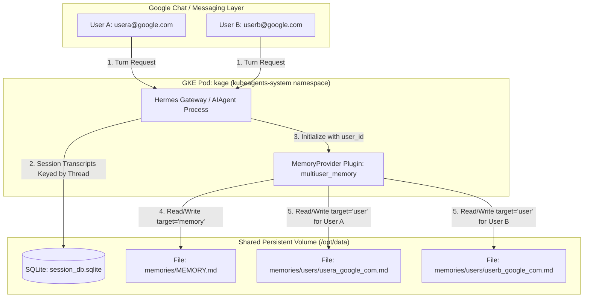

# User Memory Isolation in Multi-User Deployment

## 1. Objective

This document outlines the architectural design for per-user memory isolation, and safe system-wide Standard Operating Procedure (SOP) sharing in a multi-user deployment of the `kube-agents` project.

The primary goal is to provide a **low-maintenance, self-healing, zero-external-dependency architecture** where a single long-lived Hermes gateway container concurrently serves multiple human operators across messaging channels (e.g., Google Chat) without cross-user data leaks, while ensuring immediate recovery and zero data corruption during Kubernetes pod evictions (`SIGTERM`/`SIGKILL`).

---

## 2. Background

### 2.1 The Multi-User Gateway Challenge

In a typical desktop or single-user CLI deployment, Hermes stores its state in two local locations under `$HERMES_HOME`:

- `session_db.sqlite`: Tracks conversation transcripts.
- `memories/`: Contains `MEMORY.md` (shared instructions) and `USER.md` (personal user profile facts).

When Hermes is deployed in `kube-agents` container attached to Google Chat spaces or Slack channels, **multiple distinct human engineers interact with the same container process and shared Persistent Volume Claim (PVC)**.

### 2.2 The Danger of Unisolated State

Without strict runtime memory scoping by the incoming sender identity (`source.user_id`), the AI agent merges preferences, working contexts, and infrastructure facts across all users:

- **Concrete Example**: User A (`usera@google.com`) tells the agent: _"When I say 'my cluster', I mean `ClusterX` in `us-central1`."_ Later, User B (`userb@google.com`) asks: _"Deploy the new monitoring daemonset to my cluster."_
- **The Failure Mode**: If User A and User B share the same memory context (`USER.md`), the agent retrieves User A's fact and deploys User B's workload to `ClusterX` (`us-central1`) instead of User B's actual cluster (`ClusterY` in `europe-west1`).

Furthermore, in a Kubernetes environment, stateful pods are subject to frequent restarts due to node pool upgrades, spot VM evictions, resource contention (`OOMKills`), and configuration rollouts. The storage engine backing user memory must survive these evictions gracefully without database corruption or lengthy boot recovery times.

---

## 3. Design Overview

To satisfy strict user isolation, high reliability, and architectural simplicity **without requiring core code modifications or external database containers**, the architecture introduces a custom file-based memory provider plugin named **`multiuser_memory`**.



### 3.1 Architectural Summary & Key Benefits

1.  **Why `multiuser_memory` Was Selected (Core Advantages)**:
    - **Architectural Simplicity**: Zero extra microservices or containers required. No need to deploy, tune, or maintain an external vector database (such as Qdrant or PostgreSQL).
    - **No Embedding Model Overhead**: Eliminates the need to configure, call, or pay for embedding model APIs (`gemini-embedding-2` or `text-embedding-3-large`).
    - **Closely Follows Built-in Memory Design**: Uses the exact same `§`-delimited markdown entry format and `memory(action=read/add/replace/remove, target=memory/user)` tool schema as Hermes' built-in default memory. The agent's reasoning, tools, and behaviors remain 100% transparent and familiar.
    - **Zero Core Code Modifications**: Loaded dynamically via Hermes' `MemoryProvider` plugin API (`$HERMES_HOME/plugins/memory/multiuser_memory/`).
2.  **Private User Memory (`target="user"`)**: Automatically isolated by runtime `user_id`. When User A talks to the agent, `target="user"` reads and writes exclusively to `/opt/data/memories/users/usera_google_com.md`. When User B talks, `target="user"` reads and writes exclusively to `/opt/data/memories/users/userb_google_com.md`.
3.  **Global Shared Instructions (`target="memory"`)**: System-wide Standard Operating Procedures (SOPs), team conventions, and environment variables across the deployment are stored in `/opt/data/memories/MEMORY.md`, readable and updatable by all authorized operators.
4.  **Session Persistence (`session_db.sqlite`)**: All conversation turns are stored in `/opt/data/session_db.sqlite`. The messaging gateway natively keys every session by platform, space, and thread (`agent:main:google_chat:dm:...` or `agent:main:google_chat:group:...`), keeping short-term conversation histories isolated per chat thread.

---

## 4. Detailed Design

### 4.1 Data Flow and Lifecycle (`multiuser_memory`)

When a message arrives at the `kage` gateway (`gateway/run.py`), the gateway instantiates a fresh `AIAgent` and passes the sender identity as `user_id=source.user_id`.

Because the built-in memory is disabled (`memory.memory_enabled: false`) and `multiuser_memory` is activated (`memory.provider: multiuser_memory`), Hermes invokes the `MemoryProvider` lifecycle:

1.  **Dynamic Scoping (`initialize`)**: The plugin captures `kwargs.get("user_id")`, sanitizing it into a safe filename string (`usera_google_com`).
2.  **Prompt Assembly (`system_prompt_block`)**: At turn start, the plugin reads `/opt/data/memories/MEMORY.md` and `/opt/data/memories/users/<safe_user_id>.md`. Both blocks are formatted into markdown headers (`## System & Environment Memory` and `## User Profile Memory`) and injected cleanly into the system prompt along with guidance on using the `multiuser_memory` tool.
3.  **Tool Execution (`handle_tool_call`)**: When the LLM decides to save or update a memory during the turn using the `multiuser_memory` tool:
    - If `target == "user"`, the plugin executes `add`, `replace`, `remove`, or `read` on `/opt/data/memories/users/<safe_user_id>.md`.
    - If `target == "memory"`, the plugin executes the operation on `/opt/data/memories/MEMORY.md`.

### 4.2 Why the Tool is Named `multiuser_memory` (Bypassing Upstream Core Guards)

A critical architectural detail of this plugin is that its tool schema is named **`multiuser_memory`** rather than `memory`. If an external memory plugin names its tool `memory`, two hardcoded upstream checks in the Hermes core architecture will block it when `memory_enabled: false`:

1.  **Guard 1 (`agent/memory_manager.py:add_provider`)**:
    When `add_provider(multiuser_memory)` runs during startup, it checks whether each tool in `provider.get_tool_schemas()` matches any name in `_HERMES_CORE_TOOLS` (`"memory"` is a core tool). Because core tools always take precedence in Hermes, `add_provider` drops `"memory"`, prints `shadows a reserved core tool name; registration ignored`, and never populates `_tool_to_provider["memory"]`.
2.  **Guard 2 (`agent/tool_executor.py:1215 vs 1361`)**:
    When the LLM invokes `memory(...)`, `tool_executor.py` checks `elif function_name == "memory":` (line 1215) _before_ checking `_memory_manager.has_tool()` (line 1361). This routes `"memory"` directly to the built-in `_memory_tool(store=agent._memory_store)`. Because `memory_enabled: false` is configured to prevent un-isolated global `USER.md` writes, `agent._memory_store` is `None`, causing `_memory_tool()` to immediately fail with `{"error": "Memory is not available. It may be disabled in config or this environment."}` (`success: false`). Seeing `success: false`, `notify_memory_tool_write` aborts and drops the call without mirroring it to external providers.

**The Solution**: By giving the plugin's tool schema a unique name (`multiuser_memory`), `add_provider` cleanly registers it into `_tool_to_provider["multiuser_memory"]` (bypassing Guard 1), and `tool_executor.py` delegates `function_name == "multiuser_memory"` directly to our plugin at line 1361 (bypassing Guard 2), while leaving the un-isolated built-in `memory` tool safely disabled via `memory.memory_enabled: false`.

### 4.3 Plugin Implementation (`/opt/data/plugins/memory/multiuser_memory/__init__.py`)

The complete, self-contained implementation of the `multiuser_memory` plugin can be found directly in the source code: [**init**.py](./__init__.py).

### 4.4 Configuration (`/opt/data/config.yaml`)

To activate the `multiuser_memory` plugin in the GKE pod, update `config.yaml`:

```yaml
memory:
  memory_enabled: false # Disables built-in unpartitioned USER.md loading in agent_init.py
  user_profile_enabled: false # Disables built-in user block loading
  provider: multiuser_memory # Activates /opt/data/plugins/memory/multiuser_memory/

plugins:
  enabled:
    - hermes_otel
    # Note: Do not list multiuser_memory under plugins.enabled when loaded via memory.provider!
```

### 4.5 Pod Evictions and Crash Recovery (`SIGKILL` Safety)

A top architectural requirement is ensuring that memory writes survive abrupt Kubernetes pod evictions (`SIGTERM`/`SIGKILL` due to spot evictions or node upgrades) with zero data corruption and zero startup delay.

#### **Why File-Based `atomic_replace` Survives Evictions Cleanly**

- **Atomic Write Semantics (`utils.atomic_replace` / `os.replace`)**: When `_write_entries` updates `MEMORY.md` or `users/<user_id>.md`, it writes to a temporary file (`.tmp`) in the exact same directory on the GCE Persistent Disk (`pd-balanced`), flushes the buffer (`fsync`), and performs an atomic POSIX `rename()` system call.
- **Eviction Behavior (`SIGKILL`)**: Because the file replacement happens atomically at the filesystem layer, a pod abruptly killed mid-turn will either see 100% of the old memory state or 100% of the new memory state—**partial writes or corrupted files are mathematically impossible**.
- **Zero Day-2 Maintenance & Instant Boot**: Unlike database backends (PostgreSQL or Qdrant), there are no transaction logs to replay (`WAL`), no table bloat to `VACUUM`, no memory pool limits (`OOMKills`), and no network sockets to bind. When GKE attaches the PVC to a rescheduled pod, memory readiness is instantaneous (`< 1ms`).

---

## 5. Alternatives Considered

Every memory provider option available for Hermes was rigorously evaluated against the multi-user single-process GKE gateway model (where one container serves multiple distinct `source.user_id` humans concurrently). The following subsections detail why each alternative was not selected as the primary architecture.

### 5.1 Mem0 + Qdrant (`plugins/memory/mem0`)

- **Description**: An open-source cognitive memory controller (`mem0ai`) backed by an in-cluster **Qdrant (`:6333`)** vector database. Uses LiteLLM to extract lasting facts and `gemini-embedding-2` to vectorize them (`3,072` dimensions), filtering vector queries by `user_id`.
- **Pros**: Excellent semantic similarity search; retrieves top-k relevant facts on demand rather than loading full text files into the prompt.
- **Cons & Why Not Selected**: **Infrastructure & Operational Overhead.** Requires deploying and managing a separate stateful Qdrant microservice container (`qdrant-service`), maintaining `mem0.json` configurations, and routing embedding model requests (`gemini-embedding-2` / `text-embedding-3-large`). For this deployment, simple file-based scoping (`multiuser_memory`) achieves the exact same per-user isolation with zero additional containers, APIs, or operational overhead.

### 5.2 Honcho (`plugins/memory/honcho`)

- **Description**: A Theory-of-Mind and dialectic reasoning platform (`honchoai`). Instead of storing discrete facts, Honcho treats memory as an ongoing dialectic Q&A loop, constructing curated psychological and operational summaries called **Peer Cards** (`peer="user"`, `peer="ai"`).
- **Pros**: First-class peer modeling (`peer="user"`, `peer="ai"`); supports `{profile}-{user}` bank templates for multi-dimensional scoping across profiles.
- **Cons & Why Not Selected**: **High Day-2 Maintenance (The "Postgres Tax on K8s").** Self-hosting Honcho inside GKE (`baseUrl`) requires deploying the Honcho API server plus a stateful **PostgreSQL** relational database. Postgres accumulates dead tuples from frequent session updates, requiring active `autovacuum` and index maintenance. Furthermore, if a Postgres pod is abruptly evicted (`SIGKILL`) mid-transaction, crash recovery (`pg_wal` replay) blocks readiness for several minutes.

### 5.3 Hindsight (`plugins/memory/hindsight`)

- **Description**: An AI-native memory engine that constructs structured **Knowledge Graphs** (Entities, Relationships, and Observations) across session banks, supporting deep reflection (`reflect`, `retain`) and graph traversals.
- **Pros**: Deep multi-hop reasoning across entity relationships (`usera -> owns -> cluster-X -> runs_in -> us-central1`).
- **Cons & Why Not Selected**: **Single-Bank Turn Lock-in & Heavy In-Pod Compute.** At `initialize` time, `self._bank_id` is locked once (`hermes-UserA`). Every Hindsight tool (`hindsight_recall`, `hindsight_retain`) is locked to that single bank for the turn, preventing the agent from querying a private user bank and a global SOP bank concurrently within Hindsight. Additionally, in `local_embedded` mode, Hindsight runs heavy background Python embedding daemons (`daemon_embed_manager`) and SQLite graph traversals inside the `kage` container process, significantly increasing CPU and RAM limits.

### 5.4 Holographic (`plugins/memory/holographic`)

- **Description**: A structured fact store with algebraic entity resolution (`probe`, `related`, `reason`), trust scoring, and Holographic Reduced Representation (HRR) vectors stored inside a local SQLite database (`$HERMES_HOME/memory_store.db`).
- **Pros**: Entirely local, zero external service dependencies, sophisticated algebraic trust decay.
- **Cons & Why Not Selected (Disqualified)**: **Zero Per-User Scoping.** The SQLite schema (`facts`, `entities`, `fact_entities`) contains no `user_id` or tenant column. In a shared Google Chat space, every user's facts, preferences, and entity graphs are pooled together into a single global database file, causing severe cross-user data leakage.

### 5.5 Supermemory (`plugins/memory/supermemory`)

- **Description**: A cloud-based semantic memory provider offering static/dynamic profile recall, explicit memory CRUD tools, and turn-based conversation ingestion.
- **Pros**: Clean profile separation between static and dynamic facts, simple container tagging.
- **Cons & Why Not Selected (Disqualified)**: **Static Profile-Level Scoping (`container_tag`).** At initialization, `supermemory` resolves `_container_tag` using the `SUPERMEMORY_CONTAINER_TAG` env var or the `{identity}` template—where `identity` is the static Hermes profile name (e.g., `default`), _not_ the runtime sender `source.user_id`. Consequently, all users interacting with the `kage` pod share the exact same container tag (`hermes`). Furthermore, it requires an outbound subscription to closed cloud SaaS endpoints (`api.supermemory.ai`).

### 5.6 RetainDB (`plugins/memory/retaindb`)

- **Description**: A cross-session memory provider with local SQLite write-behind queueing (`retaindb_queue.db`), semantic search, user profile synthesis, and cloud file management tools.
- **Pros**: Correctly scopes semantic searches (`retaindb_search`) and profile queries (`retaindb_profile`) by `self._user_id` (`user_id: <sender_email>`).
- **Cons & Why Not Selected (Disqualified)**: **Closed SaaS API & Segregated Files.** RetainDB **cannot be self-hosted inside a Kubernetes cluster** (it requires `RETAINDB_API_KEY` connecting to `https://api.retaindb.com`). Furthermore, while it supports global project files (`scope="PROJECT"` via `retaindb_upload_file`), those files are separated from the semantic vector engine, forcing the agent to invoke separate file-reading tools (`retaindb_read_file`) rather than retrieving SOPs via unified search.

### 5.7 ByteRover (`plugins/memory/byterover`)

- **Description**: A local-first memory plugin that organizes knowledge into a hierarchical context tree (`$HERMES_HOME/byterover/`) managed via an external Node.js CLI binary (`brv`).
- **Pros**: Local-first context tree, tiered retrieval (fuzzy text to LLM-driven search).
- **Cons & Why Not Selected (Disqualified)**: **Zero Per-User Scoping & External Binary Dependency.** The plugin executes `brv query` and `brv curate` subprocesses directly against the single shared `$HERMES_HOME/byterover/` directory tree. It accepts no `user_id` parameter at initialization (`ByteRoverMemoryProvider.initialize`) or during query execution. All users' facts are dumped into one shared folder structure.

### 5.8 OpenViking (`plugins/memory/openviking`)

- **Description**: A virtual filesystem (`viking://` URIs) by ByteDance/Volcengine that organizes agent knowledge into hierarchical directories with tiered context loading (`L0`/`L1`/`L2`) and automatic background extraction.
- **Pros**: Elegant hierarchical directory structure (`viking://user/memories`), tiered context loading.
- **Cons & Why Not Selected (Disqualified)**: **Static Process-Scoped Credentials (`OPENVIKING_USER`).** At initialization (`initialize`), `openviking` resolves its tenant credentials from static environment variables (`OPENVIKING_USER`, `OPENVIKING_ACCOUNT`) or an `.openviking/ovcli.conf` file. It does not accept or dynamically switch by the runtime `source.user_id` of the messaging gateway on each turn. All incoming Google Chat users are authenticated and bucketed into whichever single `OPENVIKING_USER` is configured in the pod's `.env`.

---

## 6. Summary Comparison Matrix

| Plugin Option                       | Storage Engine                                   | Scoping Mechanic                                      | K8s Maintenance & Eviction Survivability                                                                                   | Primary Decision / Status                                                                                                         |
| :---------------------------------- | :----------------------------------------------- | :---------------------------------------------------- | :------------------------------------------------------------------------------------------------------------------------- | :-------------------------------------------------------------------------------------------------------------------------------- |
| **`multiuser_memory`** _(Selected)_ | Local Files (`MEMORY.md` & `users/<user_id>.md`) | Dynamic runtime `user_id` file routing in Python      | **High / Zero-Maintenance**. Atomic file rename survives `SIGKILL` cleanly; zero DB dependencies, 0 startup delay.         | **Selected Architecture**. Simplest, most resilient solution with zero external containers or embedding APIs required.            |
| **`mem0`**                          | **Qdrant** (Self-Hosted via RocksDB/Rust)        | Dynamic runtime `user_id` query/insert payload filter | **High**. LSM-tree/WAL boots in 2-5s; immune to MVCC bloat and crash corruption.                                           | **Alternative Considered**. Strong vector alternative, but not selected to avoid managing Qdrant microservice & embedding models. |
| **`honcho`**                        | **PostgreSQL** + Honcho API Server               | Dynamic `{profile}-{user}` bank templates             | **Medium / High**. Requires Postgres `autovacuum` tuning and multi-minute crash recovery on heavy evictions.               | **Alternative Considered**. Secondary choice; high Day-2 maintenance (Postgres tax) and higher pre-turn latency (`20-150ms`).     |
| **`hindsight`**                     | **PostgreSQL** / SQLite + Hindsight Engine       | Dynamic `{profile}-{user}` bank templates             | **Medium**. `local_embedded` consumes high in-pod CPU/RAM for entity graphs; `local_external` requires heavy stateful pod. | **Alternative Considered**. Single-bank turn lock-in prevents reading user bank + global SOP bank together; heavy graph overhead. |
| **`holographic`**                   | Local SQLite (`memory_store.db`)                 | None (Single Global DB)                               | **High**. Fast SQLite recovery, but zero multi-tenant partitioning.                                                        | **Disqualified**: Zero user isolation; all users pool into one local database file without tenant columns.                        |
| **`supermemory`**                   | Cloud SaaS (`api.supermemory.ai`)                | Static Profile Tag (`container_tag`)                  | **N/A** (Managed Cloud SaaS)                                                                                               | **Disqualified**: Scopes by static Hermes profile (`default`), not runtime `user_id`; requires closed cloud SaaS.                 |
| **`retaindb`**                      | Cloud SaaS (`api.retaindb.com`) + Local SQLite   | Dynamic runtime `user_id` parameter                   | **N/A** (Managed Cloud SaaS)                                                                                               | **Disqualified**: Proprietary cloud SaaS only; cannot self-host inside Kubernetes without outbound API calls.                     |
| **`byterover`**                     | Local Filesystem (`$HERMES_HOME/byterover/`)     | None (Shared Directory Tree)                          | **High**. Simple files, but no isolation across users.                                                                     | **Disqualified**: Zero user isolation; invokes `brv` CLI against a single shared directory tree.                                  |
| **`openviking`**                    | OpenViking Server                                | Static Config (`OPENVIKING_USER`)                     | **Medium**. Requires running external OpenViking stateful server.                                                          | **Disqualified**: Scopes by static environment variables (`OPENVIKING_USER`), not dynamic gateway sender IDs.                     |
