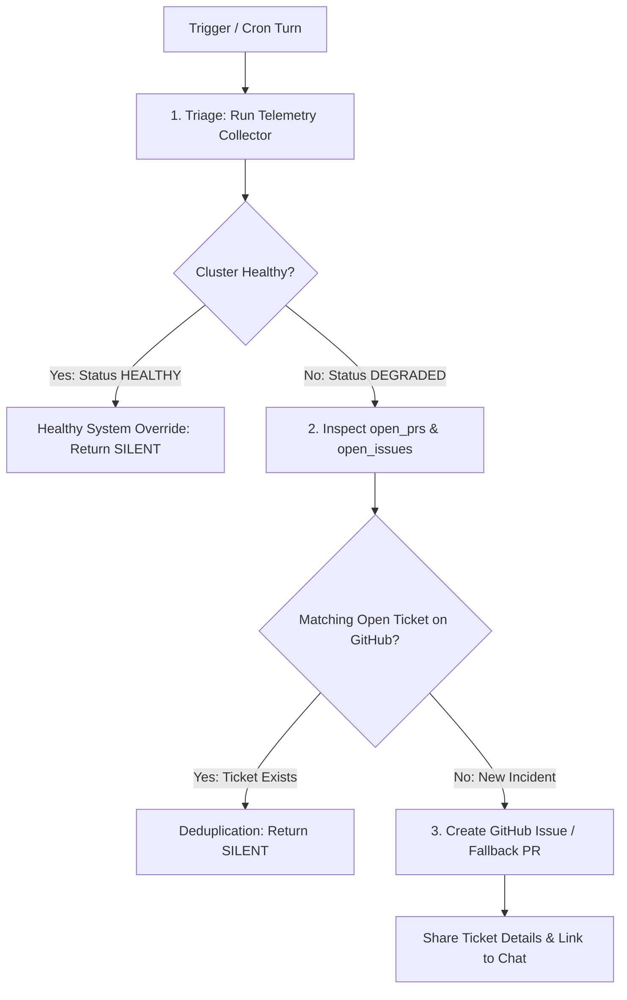

# Task

Diagnose, triage, and manage the operational health of the internal Kube-Agents Platform Agent harness in `kubeagents-system`, `agent-system`, and `kube-agents-operator-system`.

# SRE Workflow: Direct GitHub Issue & Fallback PR Escalation

When this skill is invoked or triggered via background cron ([jobs.json](../../cron/jobs.json)), follow this procedure:



### Step 1: Cluster Health Triage

Execute the telemetry collector to gather structured facts across pods, quotas, events, probes, and open GitHub tickets:

```bash
python3 /opt/data/skills/kube-agents-maintain-and-debug/scripts/maintain.py diagnose --json || python3 scripts/maintain.py diagnose --json
```

### Step 2: Dynamic Root-Cause Analysis & Deduplication

- **Healthy System Override**: If `status == "HEALTHY"` and all pods are `Running`, return **`[SILENT]`** immediately to suppress chat noise.
- **Incident & Issue Deduplication (Single Source of Truth)**: Inspect `open_prs` and `open_issues` in the telemetry. If an open PR or Issue on GitHub already exists related to the component (e.g. `github-token-minter`) OR matching the specific diagnosed failure symptom/root cause (e.g. `ImagePullBackOff`), return **`[SILENT]`** immediately to prevent creating duplicate tickets/PRs on GitHub.

---

### Step 3: Direct GitHub Issue & Fallback PR Escalation

When cluster anomalies or workload degradations are detected:

1. **Target Repository Resolution:** Dynamically extract the GitOps repository URL from `/opt/data/SETTINGS.md`.
2. **Multi-Degradation Batch Loop:**
   - Iterate through **each** unique degraded component or workload reported in `telemetry["workloads"]`.
   - For each degraded component that does NOT already have an open ticket on GitHub (checking `open_prs` and `open_issues`):
     - If Issues are enabled, open a **GitHub Issue** ticket.
     - If Issues are disabled, open a **Fallback PR** (Zero Code Lines Changed, purely an informational report card).
     ```bash
     python3 /opt/data/skills/kube-agents-maintain-and-debug/scripts/maintain.py create-gitops-pr \
       --component "<component_name>" \
       --root-cause "<diagnosed root cause>" \
       --logs "<error logs>" \
       --action "<proposed resolution instructions>"
     ```
3. **Consolidated Chat Report:** Combine all newly created Issues/PRs into a **single consolidated Google Chat message** listing each degraded component, diagnosed root cause, and direct URL link. (Never send multiple separate chat messages in a single turn).

---

# Execution Guardrails & Circuit Breakers

### ⚡ Anti-Flapping Circuit Breakers

If a container is stuck in a chronic crash loop where previous rollbacks/restarts failed to stabilize the pod:

1. Pause posting interactive chat cards to prevent human alert fatigue.
2. Mark the incident state as `"FLAPPING_CIRCUIT_BREAKER_TRIPPED"` in `incidents.json`.
3. Escalate the chronic failure directly to the GitOps Repository as an infrastructure bug.

### 🛡️ Negative Safety Red Lines (What NEVER to Touch)

- **Declarative Scope Guardrail (No Source Code Modifications)**: Automated GitOps Pull Requests must **ONLY modify declarative manifest files** (`.yaml`, `.yml`, `.template`). NEVER attempt to modify application source code files (`.go`, `.py`, `.js`, etc.) in automated remediation PRs.
- **No Storage Mutations**: NEVER delete `PersistentVolumeClaims` (PVCs), `PersistentVolumes` (PVs), `StatefulSets`, or persistent volume storage.
- **Autonomous Exclusion Boundaries**: All mutations are strictly restricted to `kubeagents-system`, `agent-system`, and `kube-agents-operator-system`. NEVER modify or restart resources in `kube-system`, `gmp-system`, or customer tenant application namespaces. NEVER run `kubectl delete namespace`.
