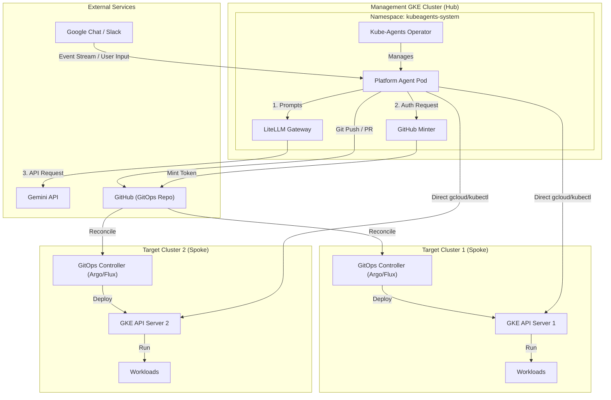

# Kube-Agents Architecture & Sizing Guide

This document provides a conceptual overview of the Kube-Agents system, its software inventory, deployment topology recommendations, and cluster sizing guidelines.

---

## Conceptual Overview

If you are new to Kubernetes or GKE, here is a brief overview of how the Kube-Agents system is structured:

- **The Agent Harness (Local/Host)**: The environment where the AI agent's reasoning logic runs (typically your local machine or a dedicated gateway service). It reads instructions from this workspace and executes tools.
- **The Kubernetes Cluster**: The managed environment (like GKE) where your application workloads run. Kube-Agents deploys an **Operator** onto this cluster to manage the agents that monitor it.
- **The Operator**: A controller running inside your cluster that manages the lifecycle of the agents.
- **Cert-Manager**: Automatically manages SSL/TLS certificates for secure webhook communication within the cluster.
- **GKE Autopilot vs. Standard**:
  - _Standard_ gives you full control over the underlying nodes.
  - _Autopilot_ is fully managed by Google and restricts certain high-privilege operations (like leader election in `kube-system`). The installation guide includes workarounds for these restrictions.

### Architecture Diagram

The following diagram illustrates the relationship between the hub GKE cluster running the agent harness, the target cluster fleet (spokes), and the secure GitOps write path:

---

## Software Inventory

When you deploy `kube-agents`, the following components are installed on your Kubernetes cluster:

| Component                       | Origin                  | Purpose                                                    | Default Namespace                |
| :------------------------------ | :---------------------- | :--------------------------------------------------------- | :------------------------------- |
| **Kube-Agents Operator**        | Custom (Go)             | Manages the lifecycle of Agent custom resources.           | `kubeagents-system`              |
| **Platform Agent Pod**          | Custom (Python/Hermes)  | The active AI agent runtime environment.                   | `kubeagents-system`              |
| **LiteLLM Gateway**             | 3rd Party (Open Source) | Proxies LLM requests, manages API keys, and logs usage.    | `kubeagents-system`              |
| **GitHub Token Minter (Minty)** | Custom (Go)             | Securely mints temporary GitHub tokens using KMS.          | `kubeagents-system`              |
| **Fluent Bit**                  | 3rd Party (Open Source) | Forward logs from the agent pod to Cloud Logging.          | `kubeagents-system` (as sidecar) |
| **cert-manager**                | 3rd Party (Open Source) | Manages TLS certificates for secure webhook communication. | `cert-manager`                   |

### Bundled Agent Skills

The **Platform Agent Pod** comes pre-packaged with GKE-specific operational runbooks and scripts (located under `/opt/hermes/skills/`). These skills are derived from the official [google/skills](https://github.com/google/skills/tree/main/skills/cloud) repository and adapted to run natively inside the Kube-Agents harness. They define the agent's capability boundaries:

| Skill Group                   | Key Skills Included                                                                                                                                                                                                                                                                                                  | Operational Purpose                                                                                                         |
| :---------------------------- | :------------------------------------------------------------------------------------------------------------------------------------------------------------------------------------------------------------------------------------------------------------------------------------------------------------------- | :-------------------------------------------------------------------------------------------------------------------------- |
| **Cluster & Lifecycle**       | [`gke-cluster-creator`](../agents/platform/skills/gke-cluster-creator/SKILL.md), [`gke-cluster-lifecycle`](../agents/platform/skills/gke-cluster-lifecycle/SKILL.md), [`gke-compute-class-creator`](../agents/platform/skills/gke-compute-class-creator/SKILL.md)                                                    | Provisioning GKE clusters, managing node pools, and configuring GKE compute classes.                                        |
| **Troubleshooting & Ops**     | [`gke-workload-troubleshooting`](../agents/platform/skills/gke-workload-troubleshooting/SKILL.md), [`gke-reliability`](../agents/platform/skills/gke-reliability/SKILL.md), [`gke-observability`](../agents/platform/skills/gke-observability/SKILL.md)                                                              | SOPs for diagnosing workload crashes (OOM, CrashLoopBackOff), checking reliability issues, and configuring metrics/logging. |
| **App & Manifest Management** | [`gke-app-onboarding`](../agents/platform/skills/gke-app-onboarding/SKILL.md), [`gke-manifest-generation`](../agents/platform/skills/gke-manifest-generation/SKILL.md), [`gke-multi-tenancy`](../agents/platform/skills/gke-multi-tenancy/SKILL.md), [`gke-storage`](../agents/platform/skills/gke-storage/SKILL.md) | Structuring multi-tenant namespaces, managing PV/PVC storage classes, generating GKE manifests, and onboarding workloads.   |
| **FinOps & Cost Management**  | [`gke-cost-analysis`](../agents/platform/skills/gke-cost-analysis/SKILL.md)                                                                                                                                                                                                                                          | Reviewing GKE resource utilization and querying BigQuery billing exports to locate cost waste.                              |
| **Workload Security**         | [`gke-workload-security`](../agents/platform/skills/gke-workload-security/SKILL.md), [`kube-agents-observability`](../agents/shared/skills/kube-agents-observability/SKILL.md)                                                                                                                                       | Auditing pod security contexts, RBAC configurations, network policies, and verifying telemetry streams.                     |
| **Scale & Advanced Compute**  | [`gke-workload-scaling`](../agents/platform/skills/gke-workload-scaling/SKILL.md), [`gke-backup-dr`](../agents/platform/skills/gke-backup-dr/SKILL.md), [`gke-inference-quickstart`](../agents/platform/skills/gke-inference-quickstart/SKILL.md)                                                                    | Configuring autoscaling (HPA/VPA), setting up Backup for GKE, and quickstarting AI/ML GPU inference workloads.              |

---

## Deployment Topology: Shared vs. Dedicated Cluster

- **Permissions**: The **Platform Agent** requires broad cluster-level permissions (RBAC) to manage namespaces, deployments, and service accounts.
- **Security Implications**: Because of these broad permissions, running Kube-Agents on a **shared production cluster** with other critical workloads poses a security risk if the agent's execution sandbox is compromised.
- **Recommendation**:
  - **Development/Testing**: A shared cluster is fine, using the `kubeagents-system` namespace for logical isolation.
  - **Production**: It is highly recommended to run Kube-Agents on a **dedicated cluster** to maintain a hard security boundary.

---

## Capacity Planning & Sizing Guidelines

Use the following guidelines to size your GKE cluster based on the number of target resources you expect the agent to manage:

| Fleet Size | GKE Node Configuration (Recommended)                          | Target Capacity                                                  | Notes                                                                    |
| :--------- | :------------------------------------------------------------ | :--------------------------------------------------------------- | :----------------------------------------------------------------------- |
| **Small**  | 1x `e2-standard-4` (4 vCPU, 16GB RAM)                         | Local cluster only + up to 10 namespaces.                        | GKE Standard or GKE Autopilot works well here.                           |
| **Medium** | 3x `e2-standard-4` or `e2-standard-8`                         | Local cluster + up to 5 remote clusters (100+ namespaces total). | Good for managing a small staging/dev fleet.                             |
| **Large**  | 3x `c2-standard-8` (Compute Optimized) + dedicated node pools | 10+ remote clusters (1000+ namespaces/workloads).                | Requires GKE Sandbox (gVisor) enabled for agent pod execution isolation. |
