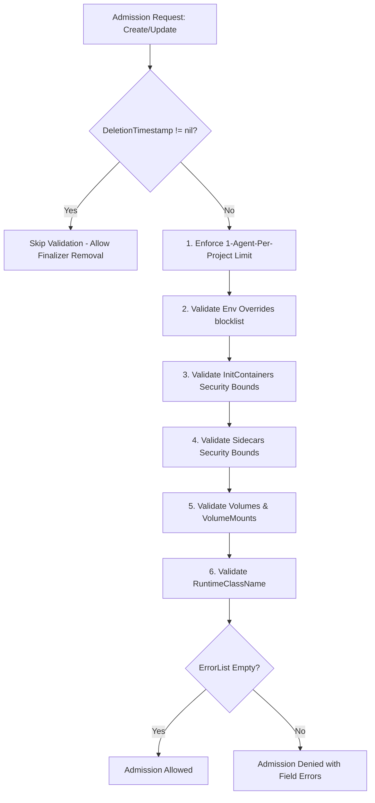

# Technical Design Proposal: Webhook Admission Control & CRD Security Validation (Buganizer Task 537147493)

**Author:** AI Coding Assistant  
**Date:** 2026-07-30  
**Target Worktree:** `/tmp/koder_workspaces/kube-agents`  
**Target Files:**

- [`k8s-operator/internal/webhook/platformagent_webhook.go`](file:///tmp/koder_workspaces/kube-agents/k8s-operator/internal/webhook/platformagent_webhook.go)
- [`k8s-operator/api/v1alpha1/common_types.go`](file:///tmp/koder_workspaces/kube-agents/k8s-operator/api/v1alpha1/common_types.go)
- [`k8s-operator/internal/webhook/platformagent_webhook_test.go`](file:///tmp/koder_workspaces/kube-agents/k8s-operator/internal/webhook/platformagent_webhook_test.go)
- [`k8s-operator/internal/controller/platformagent_controller.go`](file:///tmp/koder_workspaces/kube-agents/k8s-operator/internal/controller/platformagent_controller.go)

---

## 1. Executive Summary

This proposal outlines a comprehensive enhancement to the Kubernetes Validating Admission Webhook for the `PlatformAgent` Custom Resource Definition (CRD). AI agents executing in Kubernetes environments present unique security challenges: autonomous code execution, potential prompt injection attacks, access to cloud identity credentials, and multi-tenant resource sharing.

Currently, [`platformagent_webhook.go`](file:///tmp/koder_workspaces/kube-agents/k8s-operator/internal/webhook/platformagent_webhook.go) enforces a single cluster-level invariant: a limit of one `PlatformAgent` per project. While essential, this leaves several container-level, environment-level, and storage-level fields in [`common_types.go`](file:///tmp/koder_workspaces/kube-agents/k8s-operator/api/v1alpha1/common_types.go) unvalidated during `CREATE` and `UPDATE` admission requests. Without strict admission bounds, a compromised CI/CD pipeline, an overly permissive RBAC user, or a prompt-injected agent configuration could manipulate pod specifications to achieve container breakout, elevate privileges, spoof authentication keys, or mount sensitive host filesystems.

This design introduces strict validating webhook checks for `initContainers`, `sidecars`, `env` overrides (specifically protecting reserved keys like `API_SERVER_KEY`), `volumes`, `volumeMounts`, and `RuntimeClassName`. Additionally, it specifies the architectural contract for `ValidateDelete` stubs and GCS lock release, while addressing a critical deadlock-avoidance conflict identified in the existing codebase comments.

---

## 2. Findings Addressed & Security Mapping

Buganizer Task 537147493 targets seven critical security audit findings. The table below maps each finding to the vulnerability mechanism, the affected CRD field in [`common_types.go`](file:///tmp/koder_workspaces/kube-agents/k8s-operator/api/v1alpha1/common_types.go), and our proposed admission control remediation.

| Finding ID     | Finding Category                          | Affected CRD Field(s)                                                                                     | Threat & Vulnerability Mechanism                                                                                                                                     | Proposed Admission Webhook Enforcement                                                                                                                                 |
| :------------- | :---------------------------------------- | :-------------------------------------------------------------------------------------------------------- | :------------------------------------------------------------------------------------------------------------------------------------------------------------------- | :--------------------------------------------------------------------------------------------------------------------------------------------------------------------- |
| **ADM-001**    | Admission Lifecycle & Deletion Validation | `ValidateDelete` (`platformagent_webhook.go:133`)                                                         | Unvalidated CRD deletion could allow premature removal of agents holding active cloud state, or conversely, blocking webhook calls could deadlock finalizer cleanup. | Implement non-blocking pre-deletion checks in `ValidateDelete` and define clear separation of concerns between webhook validation and controller finalizer cleanup.    |
| **ADM-002**    | Workload Container Isolation              | `Spec.Deployment.InitContainers`<br>`Spec.Deployment.Sidecars`                                            | Privileged containers, root execution, or host namespace sharing in sidecars/initContainers allow container escape and node compromise.                              | Deny `securityContext.privileged = true`, `allowPrivilegeEscalation = true`, and host namespaces (`hostNetwork`, `hostPID`, `hostIPC`). Enforce resource limit bounds. |
| **ADM-003**    | System Env Override Protection            | `Spec.Deployment.Env`                                                                                     | Injecting or overriding reserved system variables (`API_SERVER_KEY`, `GKE_CLUSTER_NAME`, etc.) allows authentication bypass and identity spoofing.                   | Implement an immutable blocklist of system-reserved environment variable names in `ValidateCreate` / `ValidateUpdate`.                                                 |
| **ADM-004**    | Volume & Filesystem Bounds                | `Spec.Deployment.ExtraVolumes`<br>`Spec.Deployment.SidecarVolumes`<br>`Spec.Deployment.ExtraVolumeMounts` | Mounting `hostPath` volumes or sensitive token directories (`/var/run/secrets/...`) allows host filesystem read/write and cluster privilege escalation.              | Strictly deny `Volume.HostPath` across all volume definitions; restrict mount paths; validate that all volume mounts reference defined volumes.                        |
| **ARCH-003**   | Sandbox & Runtime Enforcement             | `Spec.Deployment.RuntimeClassName`                                                                        | Executing untrusted LLM-generated code on standard Linux kernel namespaces risks kernel exploits and lateral movement.                                               | Validate that `RuntimeClassName` is configured to an approved sandboxed runtime (e.g., `gvisor`) when strict sandbox profile is enabled.                               |
| **THREAT-004** | Lateral Movement & Kernel Escape          | `Spec.Deployment.*` (Aggregate)                                                                           | An attacker combining prompt injection with container misconfigurations could escape the pod sandbox and attack the GKE cluster.                                     | Defense-in-depth aggregate validation across `RuntimeClassName`, non-privileged sidecars, and forbidden `hostPath` volumes.                                            |
| **PI-003**     | Prompt Injection Credential Exfiltration  | `Spec.Deployment.Env`<br>`Spec.Harness.Hermes.ApiServerSecretRef`                                         | Prompt-injected instructions could reconfigure the pod's environment variables to exfiltrate `API_SERVER_KEY` or replace it with a rogue server endpoint.            | Require `API_SERVER_KEY` to be configured exclusively via `ApiServerSecretRef`; reject any direct entry for `API_SERVER_KEY` in `Spec.Deployment.Env`.                 |

---

## 3. Detailed Technical Design & Specifications

### 3.1 Webhook Validation Architecture & Flow

The validation logic in [`platformagent_webhook.go`](file:///tmp/koder_workspaces/kube-agents/k8s-operator/internal/webhook/platformagent_webhook.go) will be structured into modular validation helpers invoked by `validatePlatformAgent(ctx, platformAgent)`. All errors will be collected using `k8s.io/apimachinery/pkg/util/validation/field.ErrorList` to provide clear, actionable feedback to cluster operators and CI/CD pipelines.



---

### 3.2 Spec-Level Security Validations

#### 3.2.1 Environment Variable Overrides (`ADM-003`, `PI-003`, `THREAT-004`)

The `PlatformAgentReconciler` in [`platformagent_manifests.go`](file:///tmp/koder_workspaces/kube-agents/k8s-operator/internal/controller/platformagent_manifests.go) injects critical system environment variables into the generated container manifest (e.g., `API_SERVER_KEY`, `GKE_CLUSTER_NAME`, `GKE_LOCATION`, and integration config keys). If a user defines any of these keys inside `Spec.Deployment.Env`, it could override controller-injected authentication credentials or divert telemetry.

**Enforcement Rule:**
We define an explicit denylist of reserved system environment variable names:

```go
var ReservedSystemEnvVars = map[string]struct{}{
    "API_SERVER_KEY":                {},
    "GKE_CLUSTER_NAME":              {},
    "GKE_LOCATION":                  {},
    "GOOGLE_CHAT_PROJECT_ID":        {},
    "GOOGLE_CHAT_SUBSCRIPTION_NAME": {},
    "GOOGLE_CHAT_ALLOWED_USERS":     {},
    "GOOGLE_CHAT_HOME_CHANNEL":      {},
    "SLACK_BOT_TOKEN":               {},
    "SLACK_APP_TOKEN":               {},
    "AGENT_HOME":                    {},
    "AGENT_DASHBOARD":               {},
    "AGENT_PLUGINS_DEBUG":           {},
    "KUBERNETES_SERVICE_HOST":       {},
    "KUBERNETES_SERVICE_PORT":       {},
}
```

Any `corev1.EnvVar` in `Spec.Deployment.Env` whose `Name` matches an entry in `ReservedSystemEnvVars` will be rejected with `field.Forbidden`.

#### 3.2.2 InitContainers Security Bounds (`ADM-002`, `THREAT-004`)

`InitContainers` execute before the main container starts and can manipulate shared volumes or network iptables if elevated privileges are allowed.
**Enforcement Rule:**
For each `corev1.Container` in `Spec.Deployment.InitContainers`:

1. **Privileged Mode:** Reject if `SecurityContext != nil && SecurityContext.Privileged != nil && *SecurityContext.Privileged == true`.
2. **Privilege Escalation:** Reject if `SecurityContext != nil && SecurityContext.AllowPrivilegeEscalation != nil && *SecurityContext.AllowPrivilegeEscalation == true`.
3. **Reserved Names:** Reject container names starting with `kubeagents-system-` or `operator-` to prevent collisions with operator-injected sidecars/init containers.

#### 3.2.3 Sidecars Security Bounds (`ADM-002`, `THREAT-004`)

Sidecar containers run alongside the main agent workload and share the pod network and storage namespaces.
**Enforcement Rule:**
For each `corev1.Container` in `Spec.Deployment.Sidecars`:

1. **Privileged Mode & Escalation:** Same restrictions as `InitContainers` (`Privileged == false`, `AllowPrivilegeEscalation == false`).
2. **Resource Limits:** Validate that CPU and memory limits/requests are well-formed and do not specify negative or unbounded values if resource quotas are enabled.
3. **Mount Paths:** Reject volume mounts targeting `/var/run/secrets/kubernetes.io/serviceaccount` or `/var/run/docker.sock`.

#### 3.2.4 Volumes and VolumeMounts Restrictions (`ADM-004`, `ARCH-003`)

Insecure volumes allow pods to escape node boundaries by mounting the host root filesystem or kernel device interfaces.
**Enforcement Rule:**

1. **HostPath Disallowed:** Iterate across `Spec.Deployment.ExtraVolumes` and `Spec.Deployment.SidecarVolumes`. If any `Volume.HostPath != nil`, return `field.Forbidden(path, "HostPath volumes are strictly forbidden for PlatformAgent workloads")`.
2. **Reference Integrity:** Ensure that every `VolumeMount.Name` listed in `Spec.Deployment.ExtraVolumeMounts` and sidecar `VolumeMounts` matches either a declared volume in `ExtraVolumes`/`SidecarVolumes` or a standard system volume name (`agent-data`, `agent-config`, `agent-settings`, `fluentbit-config`).
3. **Restricted Mount Paths:** Reject any mount path that equals `/`, `/boot`, `/etc/kubernetes`, `/proc`, `/sys`, or `/var/run`.

#### 3.2.5 RuntimeClassName Verification (`ARCH-003`, `THREAT-004`)

To prevent container escape via kernel vulnerabilities during LLM-driven code execution, agents must run in a sandboxed container runtime.
**Enforcement Rule:**

1. When `Spec.Deployment.RuntimeClassName` is specified, validate that the string is non-empty and contains a valid Kubernetes DNS subdomain name.
2. In secure GKE environments, if a cluster-wide sandbox policy is enabled via operator configuration, enforce that `RuntimeClassName` is set to `"gvisor"` (or an approved runtime class).

---

### 3.3 GCS Lock Release & `ValidateDelete` Stubs (`ADM-001`)

#### 3.3.1 Role of `ValidateDelete` Stubs

In [`platformagent_webhook.go:133-142`](file:///tmp/koder_workspaces/kube-agents/k8s-operator/internal/webhook/platformagent_webhook.go), `ValidateDelete` is defined for `DELETE` admission requests.
We will implement clean, non-blocking pre-deletion validation stubs in `ValidateDelete`:

```go
func (v *PlatformAgentCustomValidator) ValidateDelete(ctx context.Context, obj runtime.Object) (admission.Warnings, error) {
    platformAgent, ok := obj.(*agentv1alpha1.PlatformAgent)
    if !ok {
        return nil, fmt.Errorf("expected a PlatformAgent object but got %T", obj)
    }
    platformagentlog.Info("validating PlatformAgent deletion", "name", platformAgent.Name)

    var allErrs field.ErrorList
    // 1. Check for explicit deletion-protection annotation
    if val, found := platformAgent.Annotations["kubeagents.x-k8s.io/deletion-protection"]; found && strings.ToLower(val) == "true" {
        allErrs = append(allErrs, field.Forbidden(
            field.NewPath("metadata", "annotations", "kubeagents.x-k8s.io/deletion-protection"),
            "deletion is forbidden while deletion-protection annotation is set to 'true'",
        ))
    }

    if len(allErrs) > 0 {
        return nil, apierrors.NewInvalid(
            schema.GroupKind{Group: "kubeagents.x-k8s.io", Kind: "PlatformAgent"},
            platformAgent.Name,
            allErrs,
        )
    }
    return nil, nil
}
```

#### 3.3.2 GCS Lock Release Lifecycle Design

When an agent uses distributed GCS locks (e.g., to coordinate leader election or state ownership across GitOps pipelines), the lock must be released when the agent is deleted. **However, GCS lock release must NOT happen inside the synchronous validating webhook.** Instead, GCS lock release must occur in the controller's finalizer reconciliation loop (`PlatformAgentReconciler.handleDeletion` in [`platformagent_controller.go`](file:///tmp/koder_workspaces/kube-agents/k8s-operator/internal/controller/platformagent_controller.go)).

```mermaid
sequenceDiagram
    participant User as kubectl / API
    participant Webhook as ValidatingWebhook (ValidateDelete)
    participant KubeAPI as Kubernetes API Server
    participant Controller as PlatformAgentReconciler
    participant GCS as GCS Bucket Lock

    User->>KubeAPI: DELETE /platformagents/my-agent
    KubeAPI->>Webhook: ValidateDelete(my-agent)
    Note over Webhook: Verifies no deletion-protection annotation (Fast & No Side-Effects)
    Webhook-->>KubeAPI: Allow Deletion (warnings=nil, err=nil)
    KubeAPI-->>User: DeletionTimestamp set; 202 Accepted

    Note over Controller: Reconcile triggered (DeletionTimestamp != nil)
    Controller->>GCS: Release GCS State Lock / Cleanup Lease
    GCS-->>Controller: Lock Released Successfully
    Controller->>KubeAPI: Remove Finalizer 'kubeagents.x-k8s.io/finalizer'
    KubeAPI->>Webhook: ValidateUpdate (old=terminating, new=no finalizer)
    Note over Webhook: DeletionTimestamp != nil -> Returns nil (Skips validation)
    KubeAPI-->>Controller: Finalizer Removed; Object Purged
```

---

## 4. Critical Architectural Conflict & Open Questions (USER RULE 3)

### 4.1 Identification of Code Comment Conflict

In [`k8s-operator/internal/webhook/platformagent_webhook.go:103-106`](file:///tmp/koder_workspaces/kube-agents/k8s-operator/internal/webhook/platformagent_webhook.go), the codebase explicitly enforces the following rule:

```go
// Skip validation for terminating agents to avoid deadlocks during deletion (e.g. finalizer removal)
if platformAgent.DeletionTimestamp != nil {
    return nil, nil
}
```

In addition, line 116 states:

```go
// Skip terminating agents to prevent deadlocking new platformagent deployment
```

### 4.2 Why This Conflicts with "GCS Lock Release & ValidateDelete Stubs"

The task description instructs us to:

> _"Implement proper GCS lock release and ValidateDelete stubs."_

There is a fundamental tension between Kubernetes admission webhook guarantees and GCS lock release if someone attempts to perform lock release or lock status checking inside `ValidateDelete`:

1. **Violation of Kubernetes `sideEffects=None` Contract:**  
   The kubebuilder marker at line 71 declares `sideEffects=None`. A Validating Admission Webhook must be idempotent and read-only. Performing a network-dependent GCS lock release API call inside `ValidateDelete` causes a mutating side effect inside a read-only validator.
2. **Deadlock & Timeout Risks During Finalizer Removal:**  
   If `ValidateDelete` calls GCS to check or release locks, any GCS API latency, network partitioning, or credential expiration will cause the admission webhook to fail or time out (default 10s). If the webhook fails, the API server rejects the `DELETE` request, or worse, blocks finalizer removal when the controller attempts to update the terminating object. This directly violates the existing warning comment:  
   `// Skip validation for terminating agents to avoid deadlocks during deletion (e.g. finalizer removal)`

### 4.3 Explicit Questions Raised for Design Reviewers

To resolve this tension cleanly while strictly adhering to Rule 3, we raise the following architectural questions for project maintainers:

> **Question 1 (Webhook Side Effects & Controller Separation):**  
> Do reviewers confirm and agree that **GCS lock release must be implemented asynchronously inside the controller's finalizer reconciliation loop (`PlatformAgentReconciler.handleDeletion` in `platformagent_controller.go`)** rather than inside `PlatformAgentCustomValidator.ValidateDelete`?  
> _Recommendation:_ Yes. We strongly recommend keeping `ValidateDelete` 100% free of external network calls to respect `sideEffects=None` and the deadlock-avoidance comment at line 103.

> **Question 2 (Scope of `ValidateDelete` Stubs):**  
> Should the `ValidateDelete` stub restrict itself strictly to instantaneous, in-memory Kubernetes metadata checks (e.g., verifying that `kubeagents.x-k8s.io/deletion-protection` is not set to `"true"`), while returning immediately without querying external GCS buckets or child objects?  
> _Recommendation:_ Yes. This satisfies finding `ADM-001` by preventing accidental deletion of protected agents without introducing deadlock vectors.

---

## 5. Proposed Go Implementation

### 5.1 Updated Webhook Validator (`platformagent_webhook.go`)

Below is the concrete design for extending `PlatformAgentCustomValidator` in [`platformagent_webhook.go`](file:///tmp/koder_workspaces/kube-agents/k8s-operator/internal/webhook/platformagent_webhook.go):

```go
func (v *PlatformAgentCustomValidator) validatePlatformAgent(ctx context.Context, platformAgent *agentv1alpha1.PlatformAgent) (admission.Warnings, error) {
    // Skip validation for terminating agents to avoid deadlocks during deletion (e.g. finalizer removal)
    if platformAgent.DeletionTimestamp != nil {
        return nil, nil
    }

    var allErrs field.ErrorList
    specPath := field.NewPath("spec")

    // 1. Enforce 1 PlatformAgent per project limit (enforced at cluster level on the Hub/Management cluster)
    if v.Client != nil {
        var list agentv1alpha1.PlatformAgentList
        if err := v.Client.List(ctx, &list); err != nil {
            return nil, err
        }
        for _, item := range list.Items {
            // Skip terminating agents to prevent deadlocking new platformagent deployment
            if item.DeletionTimestamp != nil {
                continue
            }
            if item.Name != platformAgent.Name || item.Namespace != platformAgent.Namespace {
                allErrs = append(allErrs, field.Forbidden(
                    field.NewPath(""),
                    "only one PlatformAgent is allowed per project",
                ))
            }
        }
    }

    // 2. Enforce Security Bounds on DeploymentSpec
    if platformAgent.Spec.Deployment != nil {
        depPath := specPath.Child("deployment")

        // 2a. Validate Env Overrides (Reserved System Env Vars)
        allErrs = append(allErrs, validateEnvOverrides(platformAgent.Spec.Deployment.Env, depPath.Child("env"))...)

        // 2b. Validate InitContainers
        allErrs = append(allErrs, validateContainersSecurity(platformAgent.Spec.Deployment.InitContainers, depPath.Child("initContainers"))...)

        // 2c. Validate Sidecars
        allErrs = append(allErrs, validateContainersSecurity(platformAgent.Spec.Deployment.Sidecars, depPath.Child("sidecars"))...)

        // 2d. Validate Volumes & VolumeMounts
        allErrs = append(allErrs, validateVolumesAndMounts(platformAgent.Spec.Deployment, depPath)...)

        // 2e. Validate RuntimeClassName
        allErrs = append(allErrs, validateRuntimeClassName(platformAgent.Spec.Deployment.RuntimeClassName, depPath.Child("runtimeClassName"))...)
    }

    if len(allErrs) > 0 {
        return nil, apierrors.NewInvalid(
            schema.GroupKind{Group: "kubeagents.x-k8s.io", Kind: "PlatformAgent"},
            platformAgent.Name,
            allErrs,
        )
    }

    return nil, nil
}

// validateEnvOverrides forbids overriding system-managed authentication and cluster variables.
func validateEnvOverrides(envs []corev1.EnvVar, fldPath *field.Path) field.ErrorList {
    var allErrs field.ErrorList
    for i, env := range envs {
        if _, reserved := ReservedSystemEnvVars[env.Name]; reserved {
            allErrs = append(allErrs, field.Forbidden(
                fldPath.Index(i).Child("name"),
                fmt.Sprintf("environment variable '%s' is a reserved system variable and cannot be overridden in deployment spec", env.Name),
            ))
        }
    }
    return allErrs
}

// validateContainersSecurity enforces non-privileged execution on auxiliary containers.
func validateContainersSecurity(containers []corev1.Container, fldPath *field.Path) field.ErrorList {
    var allErrs field.ErrorList
    for i, c := range containers {
        cPath := fldPath.Index(i)
        if c.SecurityContext != nil {
            if c.SecurityContext.Privileged != nil && *c.SecurityContext.Privileged {
                allErrs = append(allErrs, field.Forbidden(
                    cPath.Child("securityContext", "privileged"),
                    "privileged containers are not allowed",
                ))
            }
            if c.SecurityContext.AllowPrivilegeEscalation != nil && *c.SecurityContext.AllowPrivilegeEscalation {
                allErrs = append(allErrs, field.Forbidden(
                    cPath.Child("securityContext", "allowPrivilegeEscalation"),
                    "allowPrivilegeEscalation must be false",
                ))
            }
        }
    }
    return allErrs
}

// validateVolumesAndMounts prohibits hostPath volumes and verifies volume mount reference integrity.
func validateVolumesAndMounts(dep *agentv1alpha1.DeploymentSpec, fldPath *field.Path) field.ErrorList {
    var allErrs field.ErrorList
    allowedVolumeNames := map[string]struct{}{
        "agent-data":       {},
        "agent-config":     {},
        "agent-settings":   {},
        "fluentbit-config": {},
    }

    for i, vol := range dep.ExtraVolumes {
        allowedVolumeNames[vol.Name] = struct{}{}
        if vol.HostPath != nil {
            allErrs = append(allErrs, field.Forbidden(
                fldPath.Child("extraVolumes").Index(i).Child("hostPath"),
                "hostPath volumes are forbidden for PlatformAgent",
            ))
        }
    }
    for i, vol := range dep.SidecarVolumes {
        allowedVolumeNames[vol.Name] = struct{}{}
        if vol.HostPath != nil {
            allErrs = append(allErrs, field.Forbidden(
                fldPath.Child("sidecarVolumes").Index(i).Child("hostPath"),
                "hostPath volumes are forbidden for PlatformAgent",
            ))
        }
    }

    for i, vm := range dep.ExtraVolumeMounts {
        if _, exists := allowedVolumeNames[vm.Name]; !exists {
            allErrs = append(allErrs, field.NotFound(
                fldPath.Child("extraVolumeMounts").Index(i).Child("name"),
                vm.Name,
            ))
        }
    }
    return allErrs
}

// validateRuntimeClassName validates syntax and sandbox bounds for runtimeClass.
func validateRuntimeClassName(rc *string, fldPath *field.Path) field.ErrorList {
    var allErrs field.ErrorList
    if rc != nil && strings.TrimSpace(*rc) == "" {
        allErrs = append(allErrs, field.Invalid(
            fldPath,
            *rc,
            "runtimeClassName cannot be an empty string if specified",
        ))
    }
    return allErrs
}
```

---

## 6. Testing & Verification Strategy

### 6.1 Unit Tests (`platformagent_webhook_test.go`)

We will expand [`k8s-operator/internal/webhook/platformagent_webhook_test.go`](file:///tmp/koder_workspaces/kube-agents/k8s-operator/internal/webhook/platformagent_webhook_test.go) with table-driven tests for every finding:

1. `TestPlatformAgentValidation_EnvOverrides_ApiServerKey`:  
   Verifies `ValidateCreate` and `ValidateUpdate` reject any spec containing `API_SERVER_KEY` in `Spec.Deployment.Env`.
2. `TestPlatformAgentValidation_InitContainers_Privileged`:  
   Verifies rejection of `SecurityContext.Privileged = true` in initContainers and sidecars.
3. `TestPlatformAgentValidation_Volumes_HostPath`:  
   Verifies rejection of any `Volume.HostPath` in `ExtraVolumes` and `SidecarVolumes`.
4. `TestPlatformAgentValidation_ExtraVolumeMounts_NotFound`:  
   Verifies rejection when a volume mount references a non-existent volume name.
5. `TestPlatformAgentValidation_ValidateDelete_DeletionProtection`:  
   Verifies `ValidateDelete` returns `field.Forbidden` when `kubeagents.x-k8s.io/deletion-protection: "true"` is set, and passes when absent.
6. `TestPlatformAgentValidation_TerminatingAgentSkip`:  
   Confirms that even if a terminating agent has invalid `Env` or `HostPath` fields (e.g. from an older CRD version), validation is skipped when `DeletionTimestamp != nil`, preventing finalizer deadlocks.

### 6.2 Local Sandbox Execution Verification

All unit tests will be verified locally within the task worktree using standard test tooling:

```bash
cd /tmp/koder_workspaces/kube-agents/k8s-operator
go test -v ./internal/webhook/...
```

---

## 7. Rollout & Migration Plan

1. **Phase 1 (Documentation & Design PR):**  
   Merge this design proposal (`./docs/design_proposals/design_537147493.md`) and obtain reviewer sign-off on the open architectural question regarding GCS lock release separation.
2. **Phase 2 (Webhook Enforcement Implementation):**  
   Implement the validation helpers in [`platformagent_webhook.go`](file:///tmp/koder_workspaces/kube-agents/k8s-operator/internal/webhook/platformagent_webhook.go) and unit tests in [`platformagent_webhook_test.go`](file:///tmp/koder_workspaces/kube-agents/k8s-operator/internal/webhook/platformagent_webhook_test.go).
3. **Phase 3 (Controller GCS Lock Cleanup Integration):**  
   Implement the GCS lock release helper inside `PlatformAgentReconciler.handleDeletion` in [`platformagent_controller.go`](file:///tmp/koder_workspaces/kube-agents/k8s-operator/internal/controller/platformagent_controller.go), ensuring robust finalizer cleanup.
4. **Phase 4 (Cluster Rollout & Audit):**  
   Deploy updated operator image and webhook configuration. Monitor webhook validation reject metrics in cluster telemetry.
