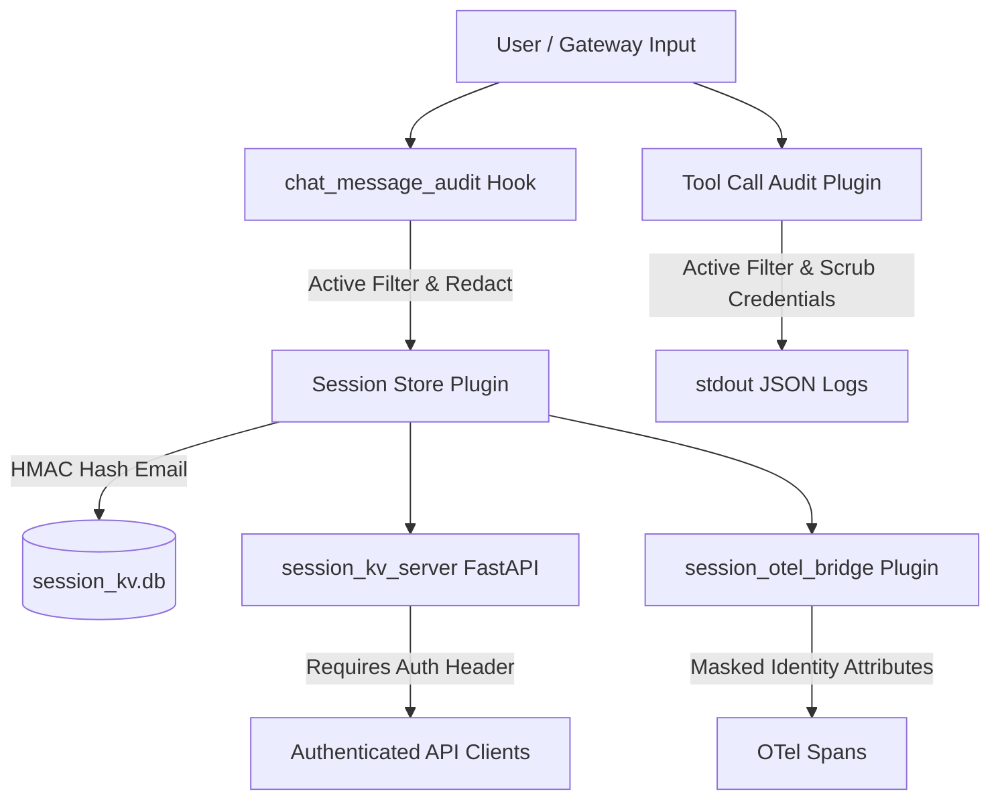

# Technical Design Proposal: Audit Redaction & PII Telemetry Protection

**Task ID:** Buganizer Task 537148132  
**Title:** Audit Redaction & PII Telemetry Protection  
**Target Worktree:** `/tmp/koder_workspaces/kube-agents`  
**Branch:** `feature/design-537148132`  
**Target Files:**
- `agents/platform/defaults/plugins/tool_call_audit/audit.py`
- `agents/platform/scripts/session_kv_server.py`
- `agents/platform/defaults/plugins/session_store/store.py`
- `agents/platform/defaults/plugins/session_otel_bridge/bridge.py`
- `agents/platform/defaults/hooks/chat_message_audit/handler.py`
- `k8s-operator/internal/testing/testdata/platform/expected/platformagent.yaml`

---

## 1. Executive Summary

This proposal outlines the technical design to resolve Buganizer Task 537148132 by addressing key data protection and telemetry security findings (**DATA-001**, **DATA-002**, **DATA-003**, **DATA-004**, **DATA-005**, **PI-007**, **DATA-007**). 

The platform agent currently logs unredacted tool arguments, approval commands, and user messages to stdout, stores plaintext user email addresses in SQLite session stores and OpenTelemetry (OTel) span attributes, exposes unauthenticated HTTP endpoints on `session_kv_server.py`, and executes audit plugins as passive observers rather than active filtering controls.

This proposal introduces a comprehensive redaction and security architecture that sanitizes audit logs, authenticates session metadata endpoints, anonymizes PII telemetry, and converts audit plugins into active enforcement filters.

---

## 2. Findings Analysis & Scope

| Finding ID | Scope & Target File | Problem Summary | Remediation Strategy |
| :--- | :--- | :--- | :--- |
| **DATA-001** | `agents/platform/defaults/plugins/tool_call_audit/audit.py` | Tool arguments, approval commands, and execution results log credentials (API keys, tokens, passwords) and PII to stdout. | Implement regex-based secret and PII scrubbers prior to `_serialize()` and stdout log emission. |
| **DATA-002** | `agents/platform/defaults/hooks/chat_message_audit/handler.py` | Chat input messages and assistant responses log raw user text containing PII/secrets to stdout. | Apply redaction patterns to `message` and `response` payload attributes prior to log emission. |
| **DATA-003** | `agents/platform/scripts/session_kv_server.py` | Endpoint `/v1/sessions` and `/v1/sessions/{session_id}/metadata` accept unauthenticated HTTP requests. | Add API key / Bearer token authentication middleware while leaving `/healthz` open for K8s probes. |
| **DATA-004** | `agents/platform/defaults/plugins/session_store/store.py` | Plaintext user emails (`user_email`) stored in SQLite database (`session_kv.db`). | Hash user emails using HMAC-SHA256 with a salt or encrypt emails before persisting into `session_kv.db`. |
| **DATA-005** | `agents/platform/defaults/plugins/session_otel_bridge/bridge.py` | Plaintext user emails populated into OpenTelemetry span attributes (`user.id`, `hermes.sender.id`). | Map span identity attributes to anonymized/hashed user identifiers. |
| **PI-007 / DATA-007** | `tool_call_audit/audit.py`, `chat_message_audit/handler.py` | Audit plugins function as passive observers; exceptions are caught and swallowed, leaving no ability to filter or block malicious calls. | Convert plugins to active filters capable of payload mutation/sanitization and raising security enforcement exceptions on high-risk policy violations. |

---

## 3. Proposed Technical Architecture



### 3.1 Redaction Engine (`agents/platform/defaults/plugins/common/redactor.py`)

A centralized, thread-safe `AuditRedactor` module will be created to handle regex matching and dictionary/string scrubbing.

#### Redaction Patterns
- **GCP / Google API Keys:** `AIza[0-9A-Za-z-_]{35}`
- **Bearer & OAuth Tokens:** `(?i)bearer\s+[a-zA-Z0-9_\-\.=]+`, `ghp_[a-zA-Z0-9]{36}`, `sk-[a-zA-Z0-9]{48}`
- **Passwords & Client Secrets:** `(?i)(password|secret|token|api_key)\s*[:=]\s*["']?([^"'\s]+)["']?`
- **Private Keys:** `-----BEGIN\s+(?:RSA\s+)?PRIVATE\s+KEY-----[\s\S]*?-----END\s+(?:RSA\s+)?PRIVATE\s+KEY-----`
- **Email Addresses (PII):** `[a-zA-Z0-9._%+-]+@[a-zA-Z0-9.-]+\.[a-zA-Z]{2,}`

#### Implementation in `tool_call_audit/audit.py` & `chat_message_audit/handler.py`
- In `tool_call_audit/audit.py`, wrap `_serialize()` and `_emit()` to pass dictionary values and raw text through `AuditRedactor.redact()`.
- In `chat_message_audit/handler.py`, sanitize `context.get("message")` and `context.get("response")` prior to `_truncate()` and emission.

---

### 3.2 Endpoint Authentication in `session_kv_server.py`

Modify `session_kv_server.py` to enforce authentication on all session metadata routes:

- Extract `API_SERVER_KEY` or `SESSION_KV_API_KEY` from the environment.
- Implement a FastAPI dependency `verify_api_key(x_api_key: Header)` checking `X-API-Key` or `Authorization: Bearer <key>`.
- Protect `/v1/sessions` and `/v1/sessions/{session_id}/metadata`.
- Maintain `/healthz` without authentication for Kubernetes readiness and liveness probes.

---

### 3.3 PII Protection in `session_store` & `session_otel_bridge`

#### `session_store/store.py`
- Replace raw email storage with HMAC-SHA256 hashed representations (using a secret salt derived from `SESSION_KV_SALT` or `API_SERVER_KEY`).
- `SessionMetadata.from_event` will set:
  ```python
  user_email_hash = hmac_sha256(user_email, salt)
  ```
- Store `user_email_hash` in `session_kv.db` while keeping raw emails out of persistent disk storage.

#### `session_otel_bridge/bridge.py`
- In `_span_attributes_for_session()`, construct `user.id` and `hermes.sender.id` using the hashed/anonymized email identity rather than plaintext email addresses.

---

### 3.4 Active Filtering Transformation for Audit Plugins

To resolve **PI-007** and **DATA-007**, audit plugins will be converted from passive observers to active filters:

1. **In-place Sanitization:** `log_pre_tool_call` and `handle("agent:start")` will actively mutate context dictionaries to replace sensitive parameters with redacted representations before downstream tool invocation.
2. **Policy Enforcement & Blocking:** When high-risk patterns (e.g. unredactable prompt injection payloads or unauthorized access command strings) are detected, plugins will raise a custom `SecurityAuditViolationError`, halting execution.
3. **Explicit Error Propagation:** Remove silent exception swallowing (`except Exception: pass`) in audit critical paths to ensure security policy enforcement cannot be bypassed by unhandled exceptions.

---

### 3.5 Manifest & Configuration Updates (`platformagent.yaml`)

Update `k8s-operator/internal/testing/testdata/platform/expected/platformagent.yaml`:
- Inject `API_SERVER_KEY` and `SESSION_KV_SALT` into the container environment definitions for `platform-agent` and dashboard containers.
- Verify ConfigMap settings for audit plugins and fluent-bit regex parsers.

---

## 4. Analysis of Code Comments & Technical Questions

### Code Comment in `agents/platform/defaults/plugins/session_otel_bridge/bridge.py` (Lines 39–41):
```python
# Hermes does not currently expose a span-attribute provider hook. Patch
# the Hermes OTel tracer method once so every future span gets fixed
# session metadata while preserving Hermes' own session_id handling.
```

### Technical Questions & Risks Raised:

1. **Monkey-Patching Stability vs. Active Filtering:**  
   *Question:* The comment highlights that `session_otel_bridge` monkey-patches `tracer.start_span` because Hermes lacks a native span-attribute provider hook. If we modify `session_otel_bridge` to actively anonymize identities, does monkey-patching remain resilient across Hermes runtime upgrades? Should an upstream request be made to Hermes for a formal span processor hook?

2. **Sanitization Timing & Downstream Tool Execution:**  
   *Question:* When converting `tool_call_audit` to an active filter that mutates arguments in-place, could redacting credentials before tool execution break tools that genuinely require those credentials (e.g., API server tools)?  
   *Design Decision:* Audit log redactors must sanitize output *streams* and *logged records* while allowing authorized internal tool handlers to receive raw credentials via secure environment or context bindings.

3. **Reversibility of Hashed Identities for Security Incident Response:**  
   *Question:* HMAC-SHA256 email hashing prevents PII leaks in telemetry, but during a security incident investigation, compliance teams may need to resolve a hashed telemetry span back to a real user. Should we use key-salted HMAC lookup tables or AES-256-GCM authenticated encryption with restricted key access?

---

## 5. Verification & Testing Plan

1. **Unit Testing:**
   - Execute `python3 -m unittest` on `agents/platform/scripts` and new test modules for `audit_redactor`.
   - Test `session_kv_server.py` auth verification with valid and invalid API keys.
   - Verify `SessionMetadata` hashes emails before SQLite insertion.
   - Verify `OtelSessionBridge` span attribute outputs contain hashed identity strings.
2. **Integration Verification:**
   - Run Kubernetes operator manifest validation tests to ensure `platformagent.yaml` matches expected manifests.
