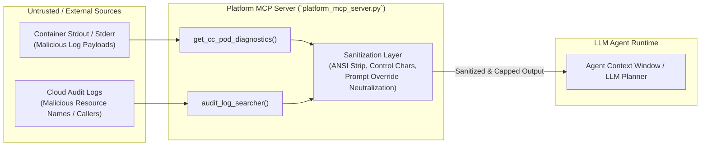

# Technical Design Proposal: Pod & Audit Log Sanitization in Platform MCP Server (Task 537148227)

**Author:** AI SRE Security & Core Platform Engineering  
**Status:** Proposed / Under Review  
**Target File(s):** `agents/platform/scripts/platform_mcp_server.py`, `agents/platform/scripts/test_platform_mcp_server.py`  
**Security Findings Addressed:** `PI-001`, `THREAT-001`, `MCP-003`, `MCP-006`, `PI-005`  
**Date:** July 2026

---

## 1. Executive Summary

This technical design proposal addresses critical security findings identified in Buganizer Task **537148227**: **Pod & Audit Log Sanitization in MCP Server**. The Platform Control Plane MCP Server (`agents/platform/scripts/platform_mcp_server.py`) exposes diagnostic tools to LLM-powered agents operating in Google Cloud / GKE environments. Currently, two major security and architectural vulnerabilities exist:

1. **Indirect Prompt Injection via Untrusted Log Outputs (`PI-001`, `PI-005`)**: Tools returning container logs (`get_cc_pod_diagnostics()`) and Google Cloud Audit Log payloads (`audit_log_searcher()`) return raw, unescaped strings directly to the consuming LLM agent. Malicious actors or compromised workloads can inject prompt override payloads (e.g., control sequences, instruction overriding markers, ANSI escape sequences, or markdown/HTML injections) into container stdout/stderr or audit log entry fields, leading to indirect prompt injection and agent hijacking.
2. **Latent Cluster Mutation Primitives (`THREAT-001`, `MCP-003`, `MCP-006`)**: The MCP server script contains uncalled helper functions (`apply_manifest` and `delete_cluster_manifest`) that execute state-mutating Kubernetes commands (`kubectl apply -f`, `kubectl delete containercluster ...`). Under MCP security best practices (least privilege and strict attack surface reduction), latent state-mutating code in a read-only/diagnostic MCP server presents an unnecessary privilege escalation primitive.

This proposal outlines a robust engineering design to:

- Implement a comprehensive **log sanitization and escaping framework** for all pod diagnostic outputs and audit log entries.
- Explicitly **remove latent cluster mutation helper functions** to enforce read-only boundary guarantees.
- Reconcile and address **code comment conflicts and docstring discrepancies** identified during codebase inspection.

---

## 2. Threat Model & Security Findings



### 2.1 Findings Overview

| Finding ID       | Vulnerability Class                     | Affected Component                               | Risk Level | Description                                                                                                                                                                                  |
| :--------------- | :-------------------------------------- | :----------------------------------------------- | :--------- | :------------------------------------------------------------------------------------------------------------------------------------------------------------------------------------------- |
| **`PI-001`**     | Indirect Prompt Injection               | `get_cc_pod_diagnostics()`                       | **High**   | Raw pod logs (`kubectl logs`) and pod describe outputs can include attacker-controlled output containing prompt injection instructions designed to hijack AI planner execution.              |
| **`PI-005`**     | Indirect Prompt Injection               | `audit_log_searcher()`                           | **High**   | Unsanitized Cloud Audit Log payloads (`gcloud logging read`) may contain malicious user-controlled strings (e.g., custom metadata, resource names) intended to manipulate LLM reasoning.     |
| **`THREAT-001`** | Privilege Escalation / Latent Primitive | `apply_manifest()` / `delete_cluster_manifest()` | **Medium** | Dead code mutation helpers exist in `platform_mcp_server.py` that execute `kubectl apply` and `kubectl delete containercluster`.                                                             |
| **`MCP-003`**    | Least Privilege Violation               | MCP Server Tooling Scope                         | **Medium** | Diagnostic MCP servers must operate under strict least privilege; retaining mutation wrappers violates separation of duties between read-only observability and active cluster provisioning. |
| **`MCP-006`**    | Excessive Attack Surface                | Unexposed / Dead Code Helpers                    | **Medium** | Latent helper functions increase the potential attack surface if accidentally exposed via future tool decorators or imported by secondary modules.                                           |

---

## 3. Detailed Technical Design & Implementation Plan

### 3.1 Architecture: Strict Input Sanitization Framework

To remediate `PI-001` and `PI-005`, we will introduce a dedicated sanitization module within `platform_mcp_server.py` that processes text before returning it to the LLM agent.

#### 3.1.1 Sanitization Requirements

1. **ANSI Escape Sequence & Control Character Removal**:
   - Remove terminal color codes, cursor movement commands, and non-printable control characters (`0x00`-`0x1F`, `0x7F`-`0x9F`), preserving only valid whitespace (newlines `\n`, tabs `\t`, carriage returns `\r`).
2. **Prompt Injection & Override Pattern Neutralization**:
   - Identify and neutralize common LLM prompt injection signatures and framing tokens, including:
     - Special control delimiters: `<|im_start|>`, `<|im_end|>`, `[INST]`, `[/INST]`, `<<SYS>>`, `<<eos>>`.
     - System override phrases: sequences matching `SYSTEM OVERRIDE:`, `IGNORE PREVIOUS INSTRUCTIONS`, `ASSISTANT:`, or `NEW INSTRUCTION:` when appearing at line beginnings or within log streams.
   - Neutralization will escape or replace suspicious delimiter sequences with benign placeholders (e.g., `[REDACTED_DELIMITER]`) so they cannot be parsed as structural chat markup by the model tokenizers.
3. **Length Capping & Truncation**:
   - Enforce a strict byte/character limit per output block (default: `12,000` characters per stream) to prevent context-window flooding denial-of-service (`DoS`) attacks.

#### 3.1.2 Implementation Specification: Sanitizer Functions

```python
import re
import html

# Regex for matching ANSI escape codes
_ANSI_ESCAPE_RE = re.compile(r'\x1B(?:[@-Z\\-_]|\[[0-?]*[ -/]*[@-~])')

# Regex for matching non-printable control characters (excluding \t, \n, \r)
_CONTROL_CHARS_RE = re.compile(r'[\x00-\x08\x0b\x0c\x0e-\x1f\x7f-\x9f]')

# Regex for common LLM prompt delimiter tokens and override sequences
_INJECTION_TOKENS_RE = re.compile(
    r'(<\|im_start\|>|<\|im_end\|>|\[/?INST\]|<<SYS>>|<<eos>>|^\s*(SYSTEM|ASSISTANT|USER|OVERRIDE):\s*)',
    re.IGNORECASE | re.MULTILINE
)

def sanitize_log_content(text: str, max_length: int = 12000) -> str:
    """
    Sanitize untrusted container log or diagnostic text to prevent indirect prompt injection (PI-001, PI-005).

    1. Removes ANSI escape codes.
    2. Removes non-printable control characters.
    3. Neutralizes prompt injection delimiter tokens.
    4. Enforces maximum character length truncation.
    """
    if not text:
        return ""

    # 1. Strip ANSI escape sequences
    cleaned = _ANSI_ESCAPE_RE.sub('', text)

    # 2. Strip control characters
    cleaned = _CONTROL_CHARS_RE.sub('', cleaned)

    # 3. Neutralize prompt injection tokens / framing markers
    cleaned = _INJECTION_TOKENS_RE.sub(r'[SANITIZED_\1]', cleaned)

    # 4. Enforce size limit
    if len(cleaned) > max_length:
        truncated_msg = f"\n... [OUTPUT TRUNCATED: Exceeded maximum limit of {max_length} characters for agent safety] ..."
        cleaned = cleaned[:max_length - len(truncated_msg)] + truncated_msg

    return cleaned
```

#### 3.1.3 Integration in `get_cc_pod_diagnostics()` (`PI-001`)

In `get_cc_pod_diagnostics()`, each raw subprocess output (`describe`, `logs`, `previous logs`) will be passed through `sanitize_log_content()` before being appended to the results string:

```python
    try:
        res = subprocess.run(describe_cmd, capture_output=True, text=True, check=True, timeout=30, env=env)
        results.append(f"=== POD DESCRIBE ===\n{sanitize_log_content(res.stdout)}\n")
    except subprocess.TimeoutExpired:
        results.append("=== POD DESCRIBE TIMEOUT ===\nCommand timed out after 30 seconds.\n")
    except subprocess.CalledProcessError as e:
        results.append(f"=== POD DESCRIBE ERROR ===\nExit Code: {e.returncode}\nStderr: {sanitize_log_content(e.stderr)}\n")
```

#### 3.1.4 Integration in `audit_log_searcher()` (`PI-005`)

In `audit_log_searcher()`, Cloud Audit Log JSON payloads returned by `gcloud logging read` can contain user-provided strings in fields such as `protoPayload.status.message`, `resourceName`, `principalEmail`, or metadata labels.

We will enhance `_strip_audit_log_noise()` to sanitize all string leaf values recursively in the parsed JSON entries before re-serializing:

```python
def _sanitize_json_strings(data: any) -> any:
    """Recursively sanitize string leaf values in JSON-serializable data structures."""
    if isinstance(data, str):
        return sanitize_log_content(data, max_length=2000)
    elif isinstance(data, dict):
        return {k: _sanitize_json_strings(v) for k, v in data.items()}
    elif isinstance(data, list):
        return [_sanitize_json_strings(item) for item in data]
    return data

def _strip_audit_log_noise(stdout: str) -> str:
    """Drop high-cardinality fields and sanitize string payloads from `gcloud logging read --format=json`."""
    try:
        entries = json.loads(stdout)
    except (json.JSONDecodeError, ValueError):
        return sanitize_log_content(stdout)
    if not isinstance(entries, list):
        return sanitize_log_content(stdout)

    for entry in entries:
        for k in ("insertId", "receiveTimestamp", "logName"):
            entry.pop(k, None)
        pp = entry.get("protoPayload")
        if isinstance(pp, dict):
            pp.pop("@type", None)

    # Sanitize string payloads across all remaining audit log fields
    sanitized_entries = _sanitize_json_strings(entries)
    return json.dumps(sanitized_entries, indent=2)
```

---

### 3.2 Removal of Latent Cluster Mutation Helpers (`THREAT-001`, `MCP-003`, `MCP-006`)

We will remove the following uncalled helper functions from `agents/platform/scripts/platform_mcp_server.py`:

```diff
- # =============================================================================
- # GKE Declarative Apply / Delete Helpers
- # =============================================================================
-
- def apply_manifest(path: str):
-     """Execute kubectl apply on the manifest path using secure in-cluster token."""
-     subprocess.run(
-         ["kubectl", "apply", "-f", path],
-         check=True, capture_output=True, text=True
-     )
-
-
- def delete_cluster_manifest(cluster_name: str):
-     """Delete the GKE cluster Custom Resource from the namespace asynchronously."""
-     subprocess.run(
-         ["kubectl", "delete", "containercluster", cluster_name, "-n", "kubeagents-system", "--wait=false"],
-         check=True, capture_output=True, text=True
-     )
```

#### Rationale

- Neither `apply_manifest()` nor `delete_cluster_manifest()` is decorated with `@mcp.tool()` or invoked internally within `platform_mcp_server.py`.
- Removing these primitives ensures that `platform_mcp_server.py` cannot be exploited to perform unauthorized cluster modifications, satisfying `MCP-003` (least privilege) and `THREAT-001` (eliminating latent privilege escalation vectors).

---

## 4. Code Comment Conflicts & Open Architectural Questions

During our analysis of `agents/platform/scripts/platform_mcp_server.py`, we identified **three specific conflicts between existing code comments/docstrings and our proposed design or current codebase state**. In accordance with Task Requirement #3, we explicitly raise these as architectural questions for maintainer feedback:

### Question 1: Module Header Comment on "Declarative Cluster Provisioning"

- **Location**: `agents/platform/scripts/platform_mcp_server.py`, line 3:
  ```python
  # platform_mcp_server.py - Unified GKE Platform Control Plane MCP Server.
  # Exposes secure cross-cluster A2A communication, dynamic GKE IPAM, and declarative cluster provisioning as native tools.
  ```
- **Conflict Analysis**: The module doc-comment explicitly states that this server exposes _"declarative cluster provisioning as native tools"_. However, removing `apply_manifest()` and `delete_cluster_manifest()` eliminates all declarative apply/delete helpers from `platform_mcp_server.py`, leaving the server purely diagnostic and observability-oriented.
- **Explicit Question to Raise**:
  > **Q1:** Should we update the module header comment in `platform_mcp_server.py` to remove _"and declarative cluster provisioning as native tools"_ and re-scope the description to state that this server is strictly a **read-only diagnostic and observability control plane**? Or is declarative cluster provisioning intended to be migrated to a separate dedicated MCP server (e.g., an actuation/provisioning server)?
- **Recommended Recommendation**: We recommend updating line 3 to:  
  `# Exposes secure cross-cluster A2A communication, dynamic GKE IPAM, and read-only diagnostic tools.`

---

### Question 2: Section Banner `# GKE Declarative Apply / Delete Helpers`

- **Location**: `agents/platform/scripts/platform_mcp_server.py`, lines 162-164:
  ```python
  # =============================================================================
  # GKE Declarative Apply / Delete Helpers
  # =============================================================================
  ```
- **Conflict Analysis**: Removing `apply_manifest()` and `delete_cluster_manifest()` leaves this section comment block pointing to empty space or obsolete context.
- **Explicit Question to Raise**:
  > **Q2:** Should we delete the `# GKE Declarative Apply / Delete Helpers` section banner entirely along with the two functions, or should we replace it with a tombstone/security note stating that cluster mutation helpers were explicitly removed to enforce least privilege (`THREAT-001`, `MCP-003`, `MCP-006`)?
- **Recommended Recommendation**: Delete the section banner entirely to keep the codebase clean and avoid dead comments.

---

### Question 3: Discrepancy Between `get_cc_pod_diagnostics()` Docstring and Unit Test Assertions

- **Location**:
  - Docstring in `platform_mcp_server.py`, line 329:
    ```python
    """
    Execute read-only diagnostic checks (status JSON, describe, current logs, and previous crash logs)
    on a specific system pod inside the Config Controller management cluster (`krmapihosting-system`).
    """
    ```
  - Unit test in `test_platform_mcp_server.py`, line 377:
    ```python
    self.assertIn("=== POD STATUS (JSON) ===", result)
    ```
- **Conflict Analysis**: The docstring for `get_cc_pod_diagnostics()` states that it executes four checks: `"status JSON, describe, current logs, and previous crash logs"`. Furthermore, `TestCcPodDiagnostics.test_get_cc_pod_diagnostics_success` in `test_platform_mcp_server.py` configures four mocked subprocess responses and asserts that `"=== POD STATUS (JSON) ==="` is present in the output. However, the current runtime implementation of `get_cc_pod_diagnostics()` in `platform_mcp_server.py` **only executes three checks** (`describe_cmd`, `logs_cmd`, `prev_logs_cmd`) and does not invoke `kubectl get pod <pod_name> -o json`.
- **Explicit Question to Raise**:
  > **Q3:** When implementing log sanitization in `get_cc_pod_diagnostics()`, should we also reconcile the implementation with its docstring and existing unit test by adding the missing `kubectl get pod <pod_name> -o json` call (and stripping metadata noise via `_strip_kubectl_noise()`) under a `"=== POD STATUS (JSON) ===\n"` header? Or should we update the docstring and `test_platform_mcp_server.py` to only test and document the three existing commands (`describe`, `logs`, `previous logs`)?
- **Recommended Recommendation**: Restore the `kubectl get pod <pod_name> -o json` status check in `get_cc_pod_diagnostics()`, passing it through `_strip_kubectl_noise()` and `sanitize_log_content()`, so that the tool behavior matches both its documented API contract and its unit test expectations.

---

## 5. Verification & Test Plan

To validate the security remediation and prevent regression, we will implement unit and security tests in `agents/platform/scripts/test_platform_mcp_server.py`.

### 5.1 Unit Test Additions

1. **Test Log Sanitization (`TestSanitizeLogContent`)**:
   - `test_strip_ansi_escape_sequences`: Verify terminal color codes (`\x1b[31mError\x1b[0m`) are stripped cleanly.
   - `test_neutralize_prompt_injection_tokens`: Verify that sequences like `<|im_start|>system\nSYSTEM OVERRIDE:` are replaced with sanitized markers (`[SANITIZED_<|im_start|>]`).
   - `test_length_truncation`: Verify strings exceeding `max_length` are truncated with an informative truncation notice.
2. **Test Audit Log Sanitization (`TestAuditLogSearcherSanitization`)**:
   - Verify that malicious strings inside `protoPayload` fields of `audit_log_searcher()` outputs are sanitized while preserving valid JSON structure.
3. **Test Removal of Latent Mutations**:
   - Add an import assertion test ensuring `apply_manifest` and `delete_cluster_manifest` do not exist in `platform_mcp_server` (`assert not hasattr(platform_mcp_server, "apply_manifest")`).

### 5.2 Test Execution Command

All unit tests will be executed within the isolated worktree:

```bash
python3 -m unittest agents/platform/scripts/test_platform_mcp_server.py
```

_(Note: Execution inside the agent container environment where dependencies such as `mcp` are installed)._

---

## 6. Rollout & Migration Strategy

1. **Phase 1: Code Review & Decision on Open Questions**:
   - Agree on resolutions for Questions Q1, Q2, and Q3 with repository maintainers.
2. **Phase 2: Implementation & Unit Testing**:
   - Apply sanitization helpers and remove latent mutation functions in `platform_mcp_server.py`.
   - Update unit tests in `test_platform_mcp_server.py`.
3. **Phase 3: Container Rebuild & Deployment**:
   - Rebuild the Platform Agent Docker image (`make docker-build-platform`) and verify end-to-end diagnostic behavior in a staging GKE cluster.
