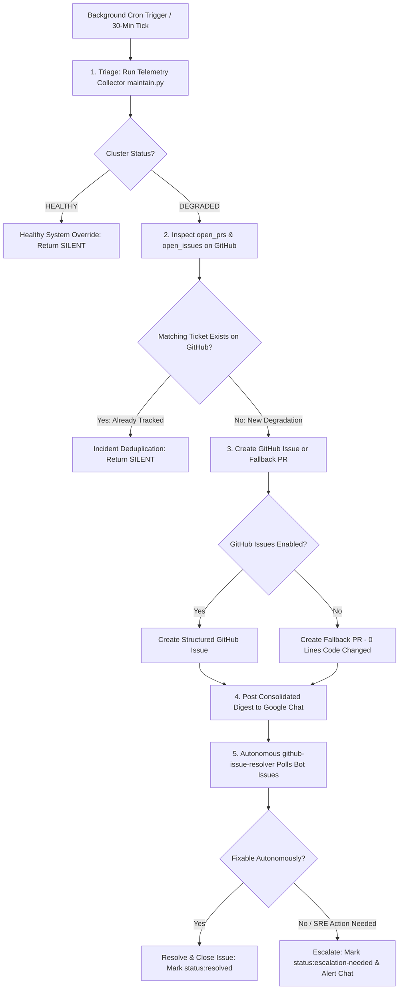

# Design: Autonomous SRE Maintenance, Interactive Approvals, and GitOps Escalation

**Status:** Implemented & Active  
**Priority:** P0 — Core Platform SRE Framework, Single-Source-of-Truth Deduplication, and Interactive Self-Healing  
**Target Systems:** Google Chat / Slack Gateway (`deliver: "all"`), GitOps Repository Sync (`SETTINGS.md`), GitHub Issue & Fallback PR Escalation Engine (`maintain.py`), Autonomous Issue Resolver (`github-issue-resolver`), and Persistent Incident Memory (`incidents.json`)

---

## TL;DR

The `kube-agents` platform uses an autonomous SRE maintenance and self-healing subsystem to patrol cluster health, detect anomalies, remediate runtime failures, and escalate declarative code/infra bugs.

This system is built on **`kube-agents-maintain-and-debug`** and **`github-issue-resolver`**, following a **"Zero-Surprise Autonomous SRE"** framework:

1. **Dynamic Triage & Live Deduplication (Single Source of Truth):** `maintain.py diagnose --json` inspects cluster workloads, warning events, heartbeat states, gateway probes, and live GitHub `open_prs` / `open_issues`. If an issue or PR is already open for a degraded component, the agent returns **`[SILENT]`** to suppress alert noise.
2. **Direct GitHub Issue & Fallback PR Escalation:** When a new cluster anomaly is detected:
   - If repository Issues are enabled, the agent creates a structured **GitHub Issue**.
   - If repository Issues are disabled, the agent creates a **Fallback PR** (with zero code lines changed — purely an informational incident report card).
3. **Consolidated Google Chat Notifications:** Rather than flooding chat rooms with individual alerts during cascading failures, the agent compiles all newly created Issues/PRs into a **single consolidated Google Chat digest**.
4. **Autonomous Resolution & Escalation Guardrails:**
   - [github-issue-resolver](file:///usr/local/google/home/shalinibhatia/src/gke-agentic/kube-agents-webhook/agents/platform/skills/github-issue-resolver/SKILL.md) polls, triages, investigates, and resolves unaddressed bot-authored issues autonomously.
   - Issues requiring human SRE action or infrastructure modifications are transitioned to `status:escalation-needed` and posted to chat.
5. **Declarative Scope Guardrail:** Automated PRs **ONLY modify declarative manifest files** (`.yaml`, `.yml`, `.template`). Source code files (`.go`, `.py`, `.js`) are NEVER modified in automated PRs.

---

## 1. Problem Statement & Motivation

### Operational Requirements

- **Manual SRE Overhead:** Eliminates manual `kubectl` and `gcloud` debugging runs for routine operational outages (e.g. bad startup flags, rotated secrets, stale webhooks).
- **Single Source of Truth Deduplication:** Prevents duplicate GitHub issues and chat spam by cross-checking active GitHub tickets before alerting or creating PRs.
- **GitOps Separation of Concerns:** Separates runtime terminal commands from declarative code bugs (missing container images, quota limits, stack panics), ensuring code/infra bugs are filed directly in GitOps.
- **Zero Unapproved Mutations:** Ensures no destructive or unexpected mutations are made in production without explicit human approval.

### Non-Goals

- Auto-applying unreviewed mutations when a user is inactive.
- Modifying application source code (`.go`, `.py`, `.js`, etc.) in automated remediation PRs.
- Modifying resources in `kube-system`, Google-managed control planes (`gke-managed-*`), or customer tenant application namespaces.
- Deleting `PersistentVolumeClaims` (PVCs), `PersistentVolumes` (PVs), `StatefulSets`, or persistent volume storage directories.

---

## 2. End-to-End System Architecture



---

## 3. Issue Classification & Routing Boundary Matrix

The agent routes issues strictly based on **where the remediation must occur**:

| Failure Category          | Technical Signature                          | Destination             | Action Taken by Agent                                        |
| :------------------------ | :------------------------------------------- | :---------------------- | :----------------------------------------------------------- |
| **Breaking Rollout**      | Pod `CrashLoopBackOff` (bad argument/flag)   | **GitHub Issue / Chat** | Files GitHub Issue; proposes `kubectl rollout undo`          |
| **Container Hang**        | Health probe timeout / socket deadlock       | **GitHub Issue / Chat** | Files GitHub Issue; proposes `kubectl rollout restart`       |
| **Secret Key Drift**      | Probe `401 Unauthorized` / `invalid_api_key` | **GitHub Issue / Chat** | Files GitHub Issue; proposes Secret merge-patch              |
| **IAM Annotation Loss**   | Probe `403 PermissionDenied`                 | **GitHub Issue / Chat** | Files GitHub Issue; proposes `kubectl annotate sa`           |
| **Stale Webhook Block**   | K8s Warning `WebhookTimeout` / `x509`        | **GitHub Issue / Chat** | Files GitHub Issue; proposes Webhook deletion                |
| **Corrupted Memory File** | `heartbeat-state.json` syntax error          | **GitHub Issue / Chat** | Files GitHub Issue; proposes archiving bad JSON & reinit     |
| **Missing Docker Image**  | K8s Event `ImagePullBackOff`                 | **GitOps Repo**         | Opens GitHub Issue / Fallback PR in `SETTINGS.md` repo       |
| **Code Panic / Bug**      | Container stderr stack trace / Python panic  | **GitOps Repo**         | Opens GitHub Issue / Fallback PR with log snippet            |
| **Quota Ceiling**         | K8s Event `FailedCreate: exceeded quota`     | **GitOps Repo**         | Opens GitHub Issue / Fallback PR to scale quota in Terraform |
| **NetworkPolicy Block**   | Egress connection timeout to external APIs   | **GitOps Repo**         | Opens GitHub Issue / Fallback PR with proposed YAML patch    |

---

## 4. End-User Chat Message Formats & Multi-Issue Consolidation

### 4.1 Interactive Action Proposal Card Format

When an actionable runtime anomaly is detected in the cluster:

```markdown
⚠️ **[P0 SRE PROPOSAL] Actionable Cluster Incident Detected**
━━━━━━━━━━━━━━━━━━━━━━━━━━━━━━━━━━━━━━━━━━━━━━━━━
📌 **Component:** `deployment/github-token-minter` (`kubeagents-system`)
🔍 **Diagnosed Root Cause:** Container startup crash (CrashLoopBackOff)
📋 **Forensic Log Proof:** `stderr: minty: error: unrecognized option '--invalid-flag'`
🛠️ **Proposed Fix:** `kubectl rollout undo deployment/github-token-minter -n kubeagents-system`
🛡️ **Safety Guardrail:** 60s Verification + Auto-Revert on failure

👉 **Reply `Approve` to execute.**
👉 **Reply `Reject` to escalate to GitOps.**
━━━━━━━━━━━━━━━━━━━━━━━━━━━━━━━━━━━━━━━━━━━━━━━━━
```

---

## 4.2 Consolidated Multi-Issue Digest Format

**Anti-Noise Rule:** The agent **never sends multiple separate messages** in a single turn. All newly opened Issues/PRs are merged into a single consolidated digest:

```markdown
🚨 **[SRE INCIDENT REPORT] 2 Degraded Components Detected**
━━━━━━━━━━━━━━━━━━━━━━━━━━━━━━━━━━━━━━━━━━━━━━━━━

1. **`deployment/github-token-minter` (`kubeagents-system`)**
   • **Root Cause:** CrashLoopBackOff (Unrecognized startup argument in revision #5)
   • **Ticket:** 🐙 [#142 (fix(sre): declarative fix for deployment/github-token-minter)](https://github.com/owner/repo/issues/142)

2. **`pod/custom-collector` (`agent-system`)**
   • **Root Cause:** `ImagePullBackOff` (Docker image tag `v99` does not exist)
   • **Ticket:** 🐙 [#143 (fix(sre): declarative fix for pod/custom-collector)](https://github.com/owner/repo/issues/143)
   ━━━━━━━━━━━━━━━━━━━━━━━━━━━━━━━━━━━━━━━━━━━━━━━━━
```

---

## 5. Persistent Incident Memory & Fallback PR Mechanics

### 5.1 Persistent Incident Memory (`/opt/data/memory/incidents.json`)

Incident states are persisted to disk at `/opt/data/memory/incidents.json` to track lifecycle states across background cron runs.

#### Lifecycle State Transitions:

```text
[DETECTED] ──> [AWAITING_APPROVAL] ──┬──> [APPROVED] ──> [VERIFYING] ──> [RESOLVED]
                                     │
                                     ├──> [USER_INACTIVE] ──> [NO_ACTION_TAKEN]
                                     └──> [FLAPPING_CIRCUIT_BREAKER_TRIPPED] ──> [GITOPS_ESCALATED]
```

### 5.2 Fallback PR Engine

When GitHub Issues are disabled on the target repository, `maintain.py create-gitops-pr` dynamically creates an informational **Fallback PR**:

1. Fetches the `main` branch SHA from GitHub.
2. Creates a unique Git branch `fix/<component>-<timestamp>`.
3. Commits an incident report file `docs/incidents/<component>-<timestamp>.md` (0 application code lines changed).
4. Opens a Pull Request targeted against `main` containing the full forensic log report and LLM-diagnosed manifest fix.

---

## 6. Autonomous Issue Resolution & Safety Red Lines

### 6.1 `github-issue-resolver` Skill Protocol

The [github-issue-resolver](file:///usr/local/google/home/shalinibhatia/src/gke-agentic/kube-agents-webhook/agents/platform/skills/github-issue-resolver/SKILL.md) skill polls and resolves open issues using [resolver.py](file:///usr/local/google/home/shalinibhatia/src/gke-agentic/kube-agents-webhook/agents/platform/skills/github-issue-resolver/scripts/resolver.py):

- **Polling:** Executes `python3 scripts/resolver.py poll` every 30 minutes. Returns `[SILENT]` if no unaddressed bot issues exist.
- **Claiming:** Executes `python3 scripts/resolver.py claim --issue <number>` to apply label `status:in-progress`.
- **Investigation:** Conducts diagnostic investigation using `kubectl`, `gcloud`, and system logs.
- **Transition:**
  - If fixed/false alarm ➔ `resolver.py transition --state resolved` (closes issue).
  - If human/SRE action needed ➔ `resolver.py transition --state escalation-needed` (alerts chat).

---

### 6.2 Security Constraints & Inviolable Safety Red Lines

- **Bot Author Restriction:** ONLY inspect, triage, or modify Issues/PRs opened by the platform bot (`shalini-openclaw-bot[bot]`). NEVER inspect, claim, comment on, edit, close, or modify PRs or Issues opened by human developers or external users!
- **Locked Escalations:** NEVER modify or close any issue/PR labeled `status:escalation-needed` or `agent:ignore`.
- **Declarative Scope Guardrail:** Automated PRs must **ONLY modify declarative manifest files** (`.yaml`, `.yml`, `.template`). NEVER attempt to modify application source code files (`.go`, `.py`, `.js`, etc.).
- **No Storage Mutations:** Strictly forbidden from deleting `PersistentVolumeClaims` (PVCs), `PersistentVolumes` (PVs), `StatefulSets`, or persistent volume storage.
- **Autonomous Exclusion Boundaries:** All mutations are strictly restricted to `kubeagents-system`, `agent-system`, and `kube-agents-operator-system`. NEVER modify or restart resources in `kube-system`, `gmp-system`, or tenant application namespaces. NEVER run `kubectl delete namespace`.
