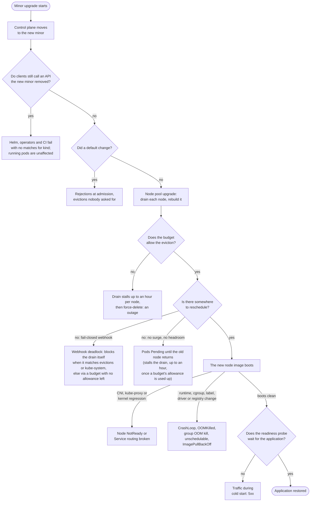

# Upgrade failure catalogue: what a GKE minor upgrade breaks, and the signal for each

A GKE minor upgrade does two things to a running application. It replaces the API server with a
newer one that may refuse requests the old one accepted, and it drains and rebuilds every node, so
every pod is killed and rescheduled once. Nearly every upgrade outage is one of those two events
landing on something that assumed it would never happen. This document lists those failures, with
the read-only signal that predicts each one before the upgrade, the signal that confirms it
afterwards, and why it is on the list. The checks a scheduled run should perform are specified in
[`upgrade-readiness-checks.md`](upgrade-readiness-checks.md); this catalogue is the list those
checks are chosen from, and its
[public incidents](upgrade-readiness-checks.md#upgrades-that-went-wrong-in-public) are the evidence
cited below.

## For a reader who does not run Kubernetes

A cluster is a group of rented computers, called nodes, that run an application in small pieces,
called pods, under a control program called the API server. An upgrade replaces the control
program with a newer edition and then rebuilds every computer, one at a time, while the
application keeps running. Each rebuild stops the application's pieces on that computer and starts
them again somewhere else. Almost every upgrade outage is one of two things: the newer control
program refuses a request the old one accepted, or the stop-and-restart lands on a piece that
cannot be stopped or restarted safely.

In plain words, here is what can go wrong. The numbers match the technical list further down, so
each item can be followed to its detail.

While the computers are being rebuilt:

1. A safety rule says "never stop this piece". The rebuild waits an hour, then stops it anyway,
   and the application goes down.
2. There is no free computer to move a piece to, so it waits, offline, until its old computer is
   back.
3. All copies of a piece live on the same computer or in the same building, so one rebuild takes
   them all down at once.
4. A piece takes minutes to warm up after a restart but reports itself ready at once, so users
   reach it while it is still loading.
5. A piece kept data on the computer's own disk, and the rebuild wipes that disk.
6. The allowed maintenance hours are too short for the number of computers, so the fleet sits
   half-upgraded for days.

Once the newer control program is in charge:

7. Tools still speak an old dialect the new control program dropped, and fail with "I do not
   understand that request". The application itself keeps running; the tools that manage it do
   not.
8. A gatekeeper that inspects every change is offline, and it was set to "block everything if I
   cannot answer", so nothing new can start, including the pieces the rebuild is trying to move.
9. A rule that used to be off is now on by default, and it rejects or removes pieces that were
   fine yesterday.
10. A feature is marked "going away later". Nothing breaks yet, but it will if nobody moves off
    it in time.
11. Add-ons and tools are too old for the new control program and stop working.
12. On a single-location cluster the control program is unreachable for a few minutes during its
    swap, and automation that does not retry fails.

On the freshly rebuilt computers:

13. A label that pieces used to choose their computer is gone, so they can never be placed.
14. The engine that runs the pieces changed, and tools that talked to the old engine break.
15. The new computers account for memory differently, and older programs misjudge how much they
    may use and are killed for using too much.
16. When one part of a piece runs out of memory, the system now kills the whole piece instead of
    that one part.
17. Network rules or name lookup behave differently, and some connections drop.
18. The networking helper on each computer fails on the new build, and traffic stops reaching
    the application.
19. The graphics-card driver on the new computers does not match what the application was built
    for.
20. Older storage attachments rely on a helper that is switched off, and the disks cannot be
    attached.
21. The new computers must download their software images from a source that has since closed,
    and cannot.

The rest of this document says, for each of these, how to see it coming, how to recognise it
afterwards, how to prevent or repair it, and whether Google's own advisor for GKE reports it.

## The list

A signal marked _before_ is something a read-only check can observe on the cluster, in the GKE
API or in the target version's release notes before any upgrade is scheduled. A signal marked
_after_ is what an operator watching the operation, the pods and a service probe sees when the
failure happens. The tag after each entry says where the before-signal is read: `GKE` is the GKE
and Compute Engine APIs and Recommender through `gcloud`, `k8s` is the Kubernetes API through `kubectl get`, `logs` is
Cloud Logging audit logs, `metrics` is the API server's own counters, `git` is the manifests and
charts a GitOps repository declares, `image` is what a container image contains (its runtime,
CUDA build or entrypoint), `notes` is the target version's release notes, node image notes and
vendor support matrices, and `node` is a read-only look inside a node or container. None of the
entries needs application source code. Each entry links to its own section, which names the
evidence; an entry with no public incident and no planted fixture says so there.

During the drain and reschedule:

1. [A PodDisruptionBudget forbids the eviction](#1-a-poddisruptionbudget-forbids-the-eviction):
   the drain stalls an hour, then GKE force-deletes the pod anyway. `k8s`
2. [No spare capacity for the displaced pods](#2-no-spare-capacity-for-the-displaced-pods): pods
   sit Pending until the old node returns. `GKE, k8s`
3. [Every replica in one zone or on one node](#3-every-replica-in-one-zone-or-on-one-node): a
   redundant-looking application loses all replicas at once. `k8s`
4. [Slow cold start](#4-slow-cold-start): the pod is back but cannot serve, and a loose readiness
   probe lets traffic in. `k8s, image`
5. [Data on the node is gone](#5-data-on-the-node-is-gone): Local SSD and `emptyDir` do not
   survive the rebuild. `k8s`
6. [Maintenance window too short, or an exclusion ends mid-roll](#6-maintenance-window-too-short-or-an-exclusion-ends-mid-roll):
   the pool runs two versions for days. `GKE`

Once the control plane moves:

7. [A served API version is removed](#7-a-served-api-version-is-removed): Helm, operators and CI
   fail with `no matches for kind`. `GKE, logs, metrics, git, k8s`
8. [A fail-closed webhook whose backend is not up](#8-a-fail-closed-webhook-whose-backend-is-not-up):
   nothing can be created or rescheduled where it matches. `k8s`
9. [A default changes in the new minor](#9-a-default-changes-in-the-new-minor): pods rejected or
   evicted by a rule that did not exist before. `notes, k8s`
10. [A feature is deprecated but still served](#10-a-feature-is-deprecated-but-still-served):
    nothing breaks yet; the count is what to track. `logs, k8s`
11. [Add-on and client skew](#11-add-on-and-client-skew): operators and tools that do not support
    the new server. `k8s, GKE, notes`
12. [The control plane is unreachable for minutes on a zonal cluster](#12-the-control-plane-is-unreachable-for-minutes-on-a-zonal-cluster):
    clients without retry fail during the control-plane step. `GKE`

On the new node image:

13. [A node label or taint is removed](#13-a-node-label-or-taint-is-removed): pods selecting on
    it never schedule. `k8s, notes`
14. [The container runtime changes](#14-the-container-runtime-changes): anything using the Docker
    socket breaks. `k8s, GKE`
15. [cgroup v2 under a runtime that cannot read it](#15-cgroup-v2-under-a-runtime-that-cannot-read-it):
    old Java and .NET size their heaps from the host and are OOM-killed. `GKE, node, image`
16. [The OOM killer starts killing the whole container](#16-the-oom-killer-starts-killing-the-whole-container):
    multi-process containers that used to lose one worker now die outright. `GKE, node, image`
17. [The network dataplane changes](#17-the-network-dataplane-changes): policy, DNS or specific
    flows behave differently. `GKE, k8s, notes`
18. [A node networking agent fails on the new image](#18-a-node-networking-agent-fails-on-the-new-image):
    Service routing stops on rebuilt nodes, or cluster-wide. `notes, k8s`
19. [GPU driver mismatch](#19-gpu-driver-mismatch): CUDA containers cannot open the device. `notes, image`
20. [In-tree volumes lose their CSI path](#20-in-tree-volumes-lose-their-csi-path): old
    PersistentVolumes stop attaching. `GKE, k8s`
21. [Images on a retired registry](#21-images-on-a-retired-registry): new nodes cannot pull what
    old nodes had cached. `k8s, git, GKE`

## Where each failure lands in the upgrade

The list groups failures by moment. The diagram puts them in order, with one fact the list cannot
show: which failures hold GKE's drain, and for how long. A refused eviction holds it, for at most
one hour per node before GKE force-evicts, and three entries reach that: a budget with no allowance
left (1), and the two cases where replacements never become Ready, because there was nowhere to
schedule them (2) or a fail-closed webhook rejected them (8); a budget counts those replacements
unavailable, and once its allowance is used up it refuses the next eviction. A webhook that matches
the eviction call itself, or `kube-system`, blocks the drain with no budget involved. A maintenance
window that closes mid-roll (6) pauses the operation between nodes, and the diagram leaves that
case out. Every other failure lets the upgrade finish, and the break lands afterwards on an
upgraded cluster, which is why the post-upgrade signals are worth reading even when the operation
reports success.

## The scenarios

Each section gives the mechanism, the signal before, where to look for it, the signal after, how
to mitigate before and after, what already reads the signal in this repository, what GKE's own
[recommender](https://docs.cloud.google.com/kubernetes-engine/docs/how-to/optimize-with-recommenders)
publishes for it, and why the entry is on the list. The recommender's insights all arrive through
one call, `google.container.DiagnosisInsight` per location, and the disruption-readiness family is
not shown in the console at all, so a check that reads them gets more than the console shows. One
mitigation is general to every after-signal on a node pool: the blue-green upgrade strategy keeps
the old nodes until a soak passes and can be rolled back until the blue pool's deletion begins. The
[Scope table](upgrade-readiness-checks.md#scope) in the readiness requirements is the record of
which audit or skill reads what; the "read today" lines here are the delta against it.

### 1. A PodDisruptionBudget forbids the eviction

A node drain evicts pods through the eviction API, and a budget whose `disruptionsAllowed` is 0
refuses every eviction. GKE respects the budget for up to one hour per node, then force-evicts,
so the application goes down after an hour of stall instead of after a clean handover.

- Before: a budget whose `disruptionsAllowed` is 0 for a reason that will not clear, which is
  `maxUnavailable` 0, `minAvailable` equal to the replica count, or a single-replica workload
  behind a budget whose `minAvailable` demands its only pod.
- Where to look: the Kubernetes API: each budget's `spec` and `status`, and the owner's `.spec.replicas` behind it.
- After: the node sits `SchedulingDisabled` with the pod still on it, `Cannot evict pod` events,
  the `UPGRADE_NODES` operation running far longer than one node should take, then the pod deleted.
- Mitigate before: give the budget room: `maxUnavailable` at least 1 or `minAvailable` below the replica count, and a second replica so the budget can be honoured; for a true singleton, accept the outage inside a maintenance window; blue-green with a longer soak postpones it, since the blue pool's deletion phase ignores budgets, but never avoids it.
- Mitigate after: fix the budget and the stalled drain resumes at once; never delete the budget without replacing it, since that trades a stall for an unprotected workload.
- Read today: the readiness mode of `fleet-upgrade-verification` grades it `blocked`.
- GKE recommender: `PDB_UNPERMISSIVE` flags a budget that allows zero evictions; `DEPLOYMENT_MISSING_PDB` and `PDB_UNPROTECTED_STATEFULSET` flag the opposite gap. All from the [disruption-readiness insights](https://docs.cloud.google.com/kubernetes-engine/docs/how-to/workload-disruption-readiness), reassessed daily.
- Why it is on the list: the one-hour grace and the forced eviction are in GKE's
  [node upgrade strategies](https://docs.cloud.google.com/kubernetes-engine/docs/concepts/node-pool-upgrade-strategies).
  The seeded fleet plants no drain-blocking budget.

### 2. No spare capacity for the displaced pods

Draining a node only works if the pods it carries can start somewhere else. With no surge node,
no headroom, an autoscaler at its ceiling or exhausted accelerator quota, they wait for the node
that was just taken away, and a single-replica application has a guaranteed outage.

- Before: the pool's `maxSurge` is 0, requests already close to allocatable minus one node, the
  autoscaler at its maximum, or accelerator quota exhausted.
- Where to look: the GKE API for the pool's `upgradeSettings`, autoscaler limits, and Compute Engine for accelerator quota; the Kubernetes API for the sum of requests against allocatable.
- After: Pending pods with `Insufficient cpu` or `Insufficient nvidia.com/gpu`, autoscaler events
  citing quota.
- Mitigate before: `maxSurge` at least 1, one node of headroom in the pool, an autoscaler ceiling and accelerator quota that allow it; for accelerator pools surge is the strategy that fits a small quota, since `maxSurge` 1 needs one extra node's quota while blue-green needs a whole second pool's.
- Mitigate after: add a node or raise the ceiling and the Pending pods schedule.
- Read today: nothing.
- GKE recommender: partial: `CLUSTER_UNDERPROVISIONED` from the [utilisation insights](https://docs.cloud.google.com/kubernetes-engine/docs/how-to/optimize-cluster-utilization); nothing reads `maxSurge` or quota. The Network Analyzer's separate `google.networkanalyzer.container.ipAddressInsight` covers pod IP exhaustion.
- Why it is on the list: it follows from how a drain works, not from an incident; no public story
  verified and no fixture. Accelerator pools are the common case because their quota is small.

### 3. Every replica in one zone or on one node

Replicas protect against losing one node only if they are on different nodes. When they share a
node, or a zone whose nodes roll together, the upgrade takes every replica at once.

- Before: replica placement per Deployment, by zone and by node; missing topology spread or
  anti-affinity.
- Where to look: the Kubernetes API: each pod's node and zone, and the owning Deployment's spread and affinity terms.
- After: availability falls to zero for a workload with more than one replica.
- Mitigate before: `topologySpreadConstraints` across zones and hosts, or pod anti-affinity, and a budget so the drain waits between replicas.
- Mitigate after: the next rollout re-spreads the pods once the constraints are in place.
- Read today: the obtainability audit's spread and pinning checks.
- GKE recommender: none.
- Why it is on the list: a consequence of scheduling, not an incident; no fixture on the seeded
  fleet and no public story verified.

### 4. Slow cold start

After the rebuild the pod restarts from nothing. If the readiness probe passes before the
application can serve, or there is no probe, the load balancer sends traffic to a pod that is
still loading.

- Before: a missing startup or readiness probe, a probe that passes before the application can
  serve, or a model or image cache on an `emptyDir` that a rebuild empties.
- Where to look: the Kubernetes API for probe specs and `emptyDir` volumes; the image, or the pod's own history of time from start to Ready, for how long the application really takes.
- After: Ready flapping, 5xx from the load balancer immediately after the node returns.
- Mitigate before: a `startupProbe` that covers the real load time, a readiness probe that checks serving rather than process liveness, `minReadySeconds`, and a cache that survives a rebuild (a PersistentVolume, or an image that carries the data).
- Mitigate after: nothing shortens the load; the readiness probe is what keeps traffic away until it finishes.
- Read today: the obtainability audit flags a missing readiness probe; a probe that passes too
  early is unread.
- GKE recommender: `PDB_STATEFULSET_WITHOUT_PROBES`, for StatefulSets only and for the missing-probe case only.
- Why it is on the list: no public incident verified. A model server that reloads its weights for
  minutes after every recreate is the common shape.

### 5. Data on the node is gone

A rebuilt node is a new machine. Local SSD and `emptyDir` contents do not come back.

- Before: pods mounting Local SSD or `emptyDir` for anything they cannot rebuild.
- Where to look: the Kubernetes API: volumes on Local SSD storage classes, `hostPath` and `emptyDir`.
- After: application errors reading state, empty caches or queues.
- Mitigate before: state on PersistentVolumes or object storage; Local SSD and `emptyDir` only for what the application can rebuild.
- Mitigate after: restore from the source of truth.
- Read today: nothing.
- GKE recommender: none.
- Why it is on the list: GKE's statement that Local SSD data does not survive a node upgrade is
  quoted at the end of the readiness requirements'
  [incidents section](upgrade-readiness-checks.md#upgrades-that-went-wrong-in-public); no public
  incident verified.

### 6. Maintenance window too short, or an exclusion ends mid-roll

A surge upgrade pauses when the maintenance window closes and resumes at the next one, so a large
pool can run two versions for days. An exclusion whose scope covers the needed upgrade holds
back the automatic one, while a manual upgrade still runs, and one that ends inside a planned change lets an unplanned upgrade start.

- Before: window length against node count times drain time; an exclusion in effect whose scope
  covers the upgrade the target needs; exclusion end dates inside the planned change.
- Where to look: the GKE API: the cluster's `maintenancePolicy`, its exclusions with their scopes and end dates, and the pool's node count.
- After: the operation still open after the window closes, with mixed node versions in one pool.
  Surge upgrades pause this way; blue-green ones
  [run to completion](https://docs.cloud.google.com/kubernetes-engine/docs/concepts/node-pool-upgrade-strategies).
- Mitigate before: a window long enough for node count times drain time, exclusions that end outside the planned change, and blue-green upgrades where the window is tight.
- Mitigate after: extend the window or finish the upgrade manually so the pool stops running two versions.
- Read today: the readiness mode grades the covering exclusion; the security-patch orchestrator
  reads the window.
- GKE recommender: `CLUSTER_MAINTENANCE_WINDOW_AND_EXCLUSIONS` recommends configuring a window and `CLUSTER_RELEASE_CHANNEL_UNSPECIFIED` a channel; neither checks a window's length against the pool.
- Why it is on the list: a common support case; no single public story verified.

### 7. A served API version is removed

Kubernetes stops serving deprecated API versions on a schedule. Objects already stored survive,
because the server keeps serving them through the versions that remain, but every client still
asking for the removed version fails. The last minor that removed a served version is 1.32, which
dropped `flowcontrol.apiserver.k8s.io/v1beta3`.

- Before: GKE's deprecation insight for the target minor (`google.container.DiagnosisInsight`,
  subtypes `DEPRECATION_K8S_*` for API and feature removals and `DEPRECATION_CONTAINERD_*` for the
  runtime), the audit annotation `k8s.io/removed-release`, a label in Cloud Logging, the `apiserver_requested_deprecated_apis`
  metric, and a scan of Helm release manifests and stored CRD versions. GKE pauses the cluster's
  automatic upgrade while it sees the calls, so the pause itself is a signal.
- Where to look: the GKE Recommender for the insight; Cloud Logging for the audit entries labelled `k8s.io/removed-release`; the `apiserver_requested_deprecated_apis` metric; the GitOps repository's manifests and charts; the Kubernetes API for CRD `storedVersions`. Helm release state lives in Secrets, which this repository's agents may not read, so that part is a human's `helm get manifest` or a release storage driver other than Secrets.
- After: controller logs full of 404s, `helm upgrade` refusing, the objects invisible to old
  clients.
- Mitigate before: migrate the callers, not the objects: bump client libraries and `kubectl`, rewrite manifests to the new version, and rewrite Helm release state with `helm mapkubeapis`; GKE pauses the automatic upgrade for 30 days after the last call, so the pause clearing is the sign the migration is done.
- Mitigate after: the stored objects still exist; re-apply them through the new version and rewrite release state, and the clients recover.
- Read today: the deprecation scan in `fleet-upgrade-verification` reads the `apiVersion`s a
  linked GitOps repository declares in raw YAML and JSON, skipping Helm templates. The insights
  themselves are quoted by the skill as a command for a human, because the agent's `gcloud`
  allowlist excludes them; stored Helm release state and CRD `storedVersions` are unread.
- GKE recommender: the [deprecation insights](https://docs.cloud.google.com/kubernetes-engine/docs/deprecations/viewing-deprecation-insights-and-recommendations), one subtype per removal (`DEPRECATION_K8S_1_32_API` and its predecessors), generated from observed API calls and naming the calling user agents.
- Why it is on the list: Helm and Spinnaker on 1.25 in the
  [incidents](upgrade-readiness-checks.md#upgrades-that-went-wrong-in-public); the 1.32 removal is
  in GKE's [deprecation notes](https://docs.cloud.google.com/kubernetes-engine/docs/deprecations/apis-1-32).

### 8. A fail-closed webhook whose backend is not up

An admission webhook with `failurePolicy: Fail` rejects every matching request when its backend
does not answer. During a node upgrade the backend itself gets drained, and while it is down
nothing it matches can be created, including the replacement pods the drain needs, and in the worst
case `kube-system`.

- Before: webhooks with `failurePolicy: Fail`, a long timeout, a Service with no endpoints, and no
  `namespaceSelector` exempting `kube-system`.
- Where to look: the Kubernetes API: `ValidatingWebhookConfiguration` and `MutatingWebhookConfiguration` objects, the Services they name, and those Services' endpoints.
- After: `failed calling webhook` events, Pending pods, drains that never finish.
- Mitigate before: a `namespaceSelector` that excludes `kube-system`, a timeout of a few seconds, `failurePolicy: Ignore` for webhooks that are not security controls, at least two backend replicas behind a budget, and a valid backend certificate.
- Mitigate after: set `failurePolicy: Ignore` or remove the webhook configuration to unwedge the cluster, then restore it once the backend is up.
- Read today: nothing.
- GKE recommender: `K8S_ADMISSION_WEBHOOK_UNAVAILABLE` flags a webhook whose Service has no endpoints and `K8S_ADMISSION_WEBHOOK_UNSAFE` one that intercepts `kube-system` or cluster-scoped system resources ([webhook insights](https://docs.cloud.google.com/kubernetes-engine/docs/how-to/optimize-webhooks)); the certificate subtypes (`DEPRECATION_K8S_1_23_CERTIFICATE`, `DEPRECATION_K8S_SHA_1_CERTIFICATE`) covered backend certificates the 1.23 and 1.29 removals rejected; `K8S_CRD_WITH_INVALID_CA_BUNDLE` flags CRDs with an invalid CA bundle.
- Why it is on the list: Jetstack's Open Policy Agent webhook outage in the incidents; no fixture
  on the seeded fleet.

### 9. A default changes in the new minor

Each minor turns some behaviour on by default. A pod admitted yesterday can be rejected today
without anyone changing it.

- Before: the target minor's release notes read against the cluster: Pod Security Admission
  enforcement, seccomp defaults, eviction thresholds, feature gates that flip on.
- Where to look: the target minor's release notes, then the Kubernetes API for the objects each changed default touches (namespace Pod Security labels, pod security contexts).
- After: rejections at admission, evictions nobody asked for.
- Mitigate before: read the target minor's notes, run Pod Security Admission in `warn` and `audit` before `enforce`, and rehearse on a staging cluster already at the target version.
- Mitigate after: the audit log names the rejecting rule; relabel the namespace or adjust the pod.
- Read today: nothing.
- GKE recommender: only where the default change is also a removal, such as `DEPRECATION_K8S_1_25_PODSECURITYPOLICY`.
- Why it is on the list: the PodSecurityPolicy removal in 1.25; the `gitRepo` volume the kubelet
  refuses from [1.36](https://kubernetes.io/blog/2026/04/22/kubernetes-v1-36-release/).

### 10. A feature is deprecated but still served

A deprecation breaks nothing on the day it lands; the removal does, minors later. Tracking the
count across runs is what turns a future removal from a surprise into a plan.

- Before: warnings in the API server's response headers and audit logs for `Endpoints`
  (deprecated in 1.33), kube-proxy IPVS mode (1.35) and Service `externalIPs` (1.36, removal
  planned for 1.43).
- Where to look: Cloud Logging for audit entries carrying the `k8s.io/deprecated` annotation (a label there), or the `Warning` headers the API server returns to any client; the Kubernetes API for the objects still using the feature.
- After: none yet.
- Mitigate before: plan the migration while the feature still works: EndpointSlices for `Endpoints`, a LoadBalancer Service or the Gateway API for `externalIPs`.
- Mitigate after: none needed yet.
- Read today: nothing.
- GKE recommender: none; the insights start when the removal is in the next minor.
- Why it is on the list: the
  [1.36 externalIPs notice](https://kubernetes.io/blog/2026/05/14/kubernetes-v1-36-deprecation-and-removal-of-service-externalips/)
  is the current example of a deprecation with a removal date attached.

### 11. Add-on and client skew

Operators, `kubectl`, `client-go` builds, service meshes and GPU operators each support a range of
server versions. A control plane that moves past that range breaks them, and a node pool too far
behind the control plane breaks the kubelet's own contract.

- Before: installed versions of cert-manager, Istio, the NVIDIA operator, Argo and the like against
  their support matrices for the target minor; a node pool more minors behind the target control
  plane than the skew policy allows.
- Where to look: the Kubernetes API for the installed versions (image tags of the add-ons' Deployments) against each vendor's support matrix for the target minor; the GKE API for node-pool versions against the control plane.
- After: controller crash loops; reconciles that stop.
- Mitigate before: upgrade add-ons to a version whose matrix includes the target before the cluster moves; keep `kubectl` within one minor; keep node pools inside the skew window.
- Mitigate after: upgrade the add-on.
- Read today: the readiness mode grades node-pool skew; add-on skew is unread.
- GKE recommender: `CLUSTER_VERSION_SKEW_UNSUPPORTED` for node pools too far behind and `CLUSTER_VERSION_END_OF_LIFE` for a control plane past standard support ([versioning](https://docs.cloud.google.com/kubernetes-engine/versioning)); nothing for add-ons.
- Why it is on the list: the Calico teardown race on GKE 1.22 in the incidents, an add-on known
  issue.

### 12. The control plane is unreachable for minutes on a zonal cluster

A zonal cluster has one control-plane replica, and it is replaced during the upgrade. Anything
that talks to the API without retrying fails for those minutes.

- Before: the cluster is zonal. Whether its clients retry is not readable from the cluster, so the check reports the exposure and the operator answers the rest.
- Where to look: the GKE API for the cluster's location type.
- After: API 5xx for a few minutes, GitOps out of sync.
- Mitigate before: a regional cluster for anything automation depends on, and retries with backoff in the clients that cannot tolerate a few minutes of 5xx.
- Mitigate after: wait for the control plane; GitOps resyncs on its own.
- Read today: nothing.
- GKE recommender: none.
- Why it is on the list: GKE's
  [cluster availability types](https://docs.cloud.google.com/kubernetes-engine/docs/concepts/types-of-clusters)
  document the behaviour.

### 13. A node label or taint is removed

A pod whose `nodeSelector` names a label the new kubelet or node image no longer sets can never
schedule again.

- Before: `nodeSelector` and affinity terms naming a label the target minor's kubelet or node
  image stops setting.
- Where to look: the Kubernetes API for every `nodeSelector` and affinity term in use, against the target minor's notes on labels dropped.
- After: Pending with `didn't match node selector`.
- Mitigate before: replace deprecated labels in selectors with their GA names (`kubernetes.io/arch`, `topology.kubernetes.io/zone`).
- Mitigate after: patch the selector; the pods schedule.
- Read today: nothing.
- GKE recommender: none.
- Why it is on the list: no GKE label removal verified. The public case, Reddit's 1.24 outage, was
  a kubeadm label read by a CNI selector rather than a pod selector, and is entry 18's evidence.

### 14. The container runtime changes

GKE moved from Docker to containerd between 1.19 and 1.24. Anything that mounted the Docker socket
or shelled out to `docker` lost it.

- Before: DaemonSets and pods mounting `docker.sock`; images built around Docker-only tooling.
- Where to look: the Kubernetes API for volume mounts of `docker.sock`; the GKE API for the pool's node image type.
- After: crash loops in logging and security agents.
- Mitigate before: replace agents that mount the Docker socket with CRI-based ones.
- Mitigate after: the same replacement, under pressure.
- Read today: the security-patch orchestrator flags a pool whose `config.imageType` is a pre-containerd `COS` or `UBUNTU` variant and names the `_CONTAINERD` move; `docker.sock` mounts and Docker-only images are unread.
- GKE recommender: `DEPRECATION_K8S_1_24_DOCKERSHIM`, `DEPRECATION_CONTAINERD_V1_SCHEMA_IMAGES` and `DEPRECATION_CONTAINERD_V1ALPHA2_CRI_API`, for the migrations that have happened.
- Why it is on the list: the Docker to containerd migration on GKE 1.19 to 1.24.

### 15. cgroup v2 under a runtime that cannot read it

Older Java, .NET and Go runtimes read their memory limit from cgroup v1 paths. On a cgroup v2 node
they see the host's memory instead, size their heaps from it, and are OOM-killed at the container
limit. On GKE the mode is per node pool: cgroup v2 has been the default for new nodes since 1.26,
and a pool still on v1 is
[migrated at 1.33 and loses v1 support at 1.35](https://docs.cloud.google.com/kubernetes-engine/docs/how-to/migrate-cgroupv2),
so for such a pool the flip does arrive with the minor.

- Before: the node pool's `effectiveCgroupMode` in the GKE API and `stat -fc %T /sys/fs/cgroup`
  on a node (`cgroup2fs`); container images with a JDK older than 8u372 or 11.0.16, the versions
  the [cgroup v2 page](https://kubernetes.io/docs/concepts/architecture/cgroups/) names.
- Where to look: the GKE API for each pool's `effectiveCgroupMode` and the target version; a read-only node check of the cgroup filesystem; the images for the runtime version they ship.
- After: `OOMKilled` with no code change, on the migrated nodes only.
- Mitigate before: a runtime that reads cgroup v2 (JDK 8u372 or 11.0.16 and later, and the other runtimes the cgroup v2 page names), or explicit heap flags; until 1.35 a pool can be pinned to cgroup v1 through its node system config to buy time.
- Mitigate after: the same, plus a temporary limit increase.
- Read today: nothing.
- GKE recommender: none verified.
- Why it is on the list: the Kubernetes cgroup v2 documentation names the runtime versions; no
  public incident verified.

### 16. The OOM killer starts killing the whole container

From Kubernetes 1.28 the kubelet sets `memory.oom.group` on every container on a cgroup v2 node,
so an out-of-memory event kills the whole container instead of the one process that overran. A
multi-process container that used to lose one worker and carry on (nginx, PHP-FPM, Postgres,
notebook servers, CI runners) now dies at exit 137. The
[`singleProcessOOMKill`](https://github.com/kubernetes/kubernetes/pull/126096) opt-out exists only
from 1.32. This is the one way an upgrade produces `OOMKilled` on its own, without a runtime that
misreads its limit.

- Before: a kubelet at 1.28 or later on a cgroup v2 node, reached by crossing 1.28 or, for a fleet
  already past it, by a v1 pool being migrated to cgroup v2, which GKE does at 1.33. Read
  `/sys/fs/cgroup/memory.oom.group` in a container (1 means group kill) and list containers
  running more than one process.
- Where to look: the GKE API for the kubelet version and cgroup mode of each pool; a read-only look at `memory.oom.group` in a container; the images for entrypoints that run more than one process.
- After: `OOMKilled` on containers whose logs previously showed worker restarts under the same
  load.
- Mitigate before: raise the limit for multi-process containers, split workers into their own containers or pods, or set `singleProcessOOMKill` in the pool's node system config, available from GKE 1.32.4-gke.1132000 and 1.33.0-gke.1748000.
- Mitigate after: the same; the container's own logs before the upgrade show which worker used to die.
- Read today: nothing.
- GKE recommender: none.
- Why it is on the list:
  [kubernetes#117070](https://github.com/kubernetes/kubernetes/issues/117070) is the change, the
  [write-up by the opt-out's authors](https://tech.preferred.jp/en/blog/kubernetes-single-process-oom-kill/)
  the explanation, and 2i2c's
  [EKS 1.32 to 1.34 regression](https://2i2c.org/blog/kubernetes-cgroup-changes/), where a node
  image change turned cgroup v2 on under a kubelet already past 1.28, the incident.

### 17. The network dataplane changes

A new version can change how NetworkPolicy is enforced, which DNS serves the cluster, or how a
specific flow is handled.

- Before: dataplane and DNS provider, policy count, the known issues for the target version.
- Where to look: the GKE API for the dataplane and DNS provider; the Kubernetes API for the policy count; the target version's known-issue notes.
- After: connection resets, policy drops in flow logs, DNS timeouts.
- Mitigate before: rehearse the target version on a staging cluster with the same dataplane, and keep NetworkPolicy explicit rather than relying on defaults.
- Mitigate after: a completed node pool can be downgraded in place to the previous version while GKE still offers it; the control plane cannot go back.
- Read today: nothing.
- GKE recommender: none. The Network Analyzer's separate connectivity insight covers control-plane and node reachability, not policy behaviour.
- Why it is on the list: no public incident verified; the per-version known-issue notes are the
  signal.

### 18. A node networking agent fails on the new image

The CNI, `kube-proxy` and node-local DNS run on every node and depend on the node's labels,
kernel and packages. A change under them stops Service routing on the rebuilt nodes, and if the
CNI's own control components are hit, cluster-wide within minutes.

- Before: the target node image's release notes and known issues; the CNI's dependence on node
  labels or kernel modules the image changes.
- Where to look: the target node image's release notes and known issues; the Kubernetes API for what the CNI's components select on.
- After: nodes `NotReady` or `NetworkUnavailable`, CNI or `kube-proxy` pods crash-looping, Service
  VIP probes failing from inside the cluster.
- Mitigate before: upgrade a canary pool first and watch Service routing from inside the cluster before the rest; surge upgrades with `maxUnavailable` 0 so a broken node never takes capacity with it.
- Mitigate after: downgrade the pool to the previous version while it is offered, and fix whatever the CNI selected on.
- Read today: nothing.
- GKE recommender: none.
- Why it is on the list: Reddit's 1.24 outage was the CNI losing its route reflectors when a node
  label went away; the Datadog and Heroku outages in the incidents are the same shape, triggered by
  an OS update rather than an upgrade.

### 19. GPU driver mismatch

The node image ships a GPU driver; the containers ship a CUDA version. When the new image's driver
is older than what the CUDA build requires, the device cannot be opened.

- Before: the driver version the target node image ships against the CUDA version the images need.
- Where to look: the GPU how-to page's table of driver versions per GKE version, for the target version, since the GKE API only records `DEFAULT` or `LATEST`; the images for the CUDA version they need.
- After: pods Pending on `nvidia.com/gpu`, or crashing in `nvidia-smi`.
- Mitigate before: match the driver to the images before the upgrade: the GPU how-to page's table gives the driver per GKE version, and NVIDIA's minimum-driver matrix per CUDA major gives the floor the images accept; upgrade a canary GPU pool first.
- Mitigate after: recreate the pool with the driver version the images need.
- Read today: nothing.
- GKE recommender: none.
- Why it is on the list: frequent on accelerator pools; no public incident verified.

### 20. In-tree volumes lose their CSI path

PersistentVolumes written against the in-tree `gce-pd` plugin attach only through CSI migration to
the PD CSI driver, which GKE switched on at 1.22. The minor upgrade that meets this entry is the
1.22 crossing on a Standard cluster with the driver add-on disabled; past that version the same
configuration breaks with or without an upgrade, and the entry stays because the pre-upgrade read
is the same.

- Before: PersistentVolumes with an in-tree `gcePersistentDisk` spec while the cluster's
  `gcePersistentDiskCsiDriverConfig` add-on is disabled; StorageClasses naming a provisioner that
  no longer exists.
- Where to look: the GKE API for the `gcePersistentDiskCsiDriverConfig` add-on; the Kubernetes API for PersistentVolume specs and StorageClass provisioners.
- After: attach errors, pods stuck `ContainerCreating`.
- Mitigate before: enable the PD CSI driver add-on and move StorageClasses to `pd.csi.storage.gke.io`.
- Mitigate after: enable the add-on; the volumes attach.
- Read today: nothing.
- GKE recommender: none.
- Why it is on the list: the
  [1.25 CSI migration status](https://kubernetes.io/blog/2022/09/26/storage-in-tree-to-csi-migration-status-update-1.25/)
  and GKE's
  [PD CSI driver page](https://cloud.google.com/kubernetes-engine/docs/how-to/persistent-volumes/gce-pd-csi-driver).

### 21. Images on a retired registry

Old nodes had the image cached; a rebuilt node has to pull it. If the registry hostname has
stopped publishing, or an egress allowlist admits only the old hostname, only the new nodes fail.

- Before: image references on a registry hostname that has stopped publishing or is being retired,
  such as `k8s.gcr.io`, and egress allowlists that admit only the old hostname.
- Where to look: the Kubernetes API for the image references in use and the GitOps repository for the ones declared; the egress policy for what it admits: NetworkPolicy CIDRs, GKE's FQDN network policy on Dataplane V2, and Compute Engine firewall rules.
- After: `ImagePullBackOff` only on new nodes.
- Mitigate before: mirror every image a default install pulls into a registry you own, which is what `images.json` and `make mirror-images` do in this repository, and keep egress allowlists in step.
- Mitigate after: retag or redirect the reference; the new nodes pull.
- Read today: nothing.
- GKE recommender: none.
- Why it is on the list: the
  [`k8s.gcr.io` freeze](https://kubernetes.io/blog/2023/02/06/k8s-gcr-io-freeze-announcement/) and
  its [redirect](https://kubernetes.io/blog/2023/03/10/image-registry-redirect/): tags published
  after the freeze exist only on the new host, and allowlists naming only the old one broke.

## The order to add checks

The order is by how often each failure appears in the public record and how cheap its signal is to
read. GKE's recommender comes first, because one call per location returns the deprecation
insights (7) together with the budget (1), webhook (8), skew (11), runtime (14) and window (6)
insights; the readiness requirements'
[deprecation-insights section](upgrade-readiness-checks.md#gke-deprecation-insights) says what else
the pause the deprecation family puts on automatic upgrades explains. Fail-closed webhooks (8) and capacity headroom
(2) come next, because both turn a routine drain into an outage and both are a few list calls.
Replica placement (3) follows, and then the node-image entries (13 to 21), which need the target
version to be known before they mean anything. Post-upgrade detection is one mechanism for every
entry: watch the operation, then compare Pending and crash-looping pod counts, readiness flapping
and a live service probe against the same measurements taken before the upgrade started, as the
readiness requirements' [rollout section](upgrade-readiness-checks.md#rollout-and-verification)
specifies.
