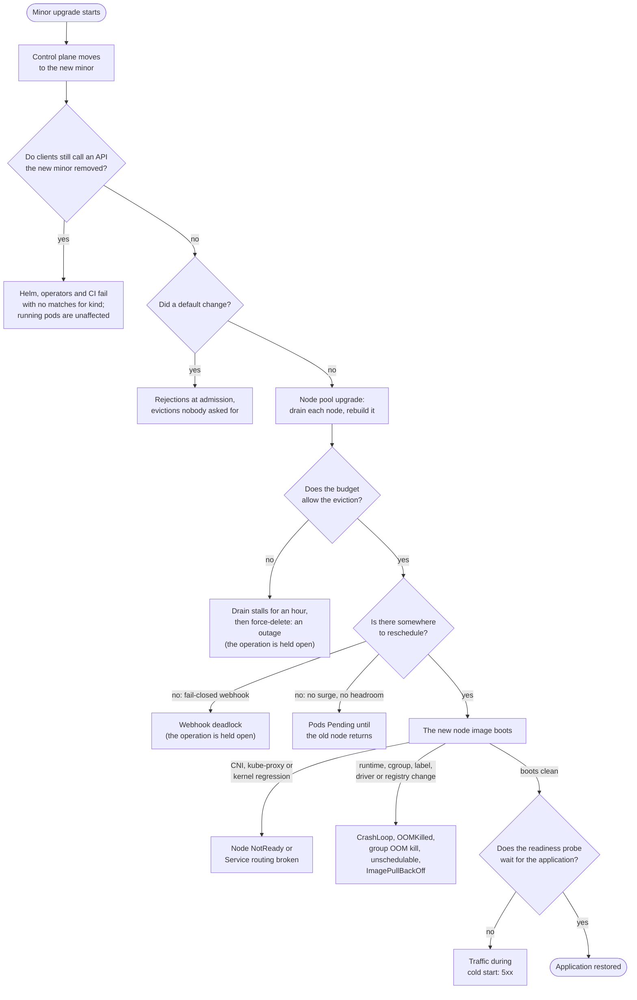

# Upgrade failure catalogue: what a GKE minor upgrade breaks, and the signal for each

A GKE minor upgrade does two things to a running application. It replaces the API server with a
newer one that may refuse requests the old one accepted, and it drains and rebuilds every node, so
every pod is killed and rescheduled once. Nearly every upgrade outage is one of those two events
landing on something that assumed it would never happen. This document lists those failures, one
row each, with the read-only signal that predicts each one before the upgrade and the signal that
confirms it afterwards. The checks a scheduled run should perform are specified in
[`upgrade-readiness-checks.md`](upgrade-readiness-checks.md); this catalogue is the list that
document's checks are chosen from, and its
[public incidents](upgrade-readiness-checks.md#upgrades-that-went-wrong-in-public) are the evidence
column here.

## For a reader who does not run Kubernetes

A cluster is a set of rented machines, called nodes, running an application in small units called
pods, coordinated by a control program called the API server. Upgrading the cluster means
replacing the control program with a newer edition and then rebuilding every machine while the
application keeps running. Two things can go wrong. The newer control program may no longer
understand a request the application still makes, in the way a newer form may drop a field an old
script still fills in. And rebuilding a machine means stopping the pods on it and starting them
somewhere else, which only works if there is somewhere else to start them and if nothing forbids
stopping them. Each row below is one way those two steps fail, what an operator can look at
beforehand to see it coming, and what they see afterwards when it has happened.

## How to read the tables

Each row has a failure, what a user sees, a pre-upgrade signal, a post-upgrade signal, and
evidence. A pre-upgrade signal is something a read-only check can observe on the cluster, in the
GKE API or in the release notes of the target version, before any upgrade is scheduled. A
post-upgrade signal is what an operator watching the upgrade operation, the pods and a service
probe sees when the failure happens. The evidence column names an incident from the public record
or a fixture this repository plants; a row with neither says so.

## Failures during the drain and reschedule

| Failure                                                     | What the user sees                                                                                                     | Pre-upgrade signal                                                                                                                                                                       | Post-upgrade signal                                                                                                                                                                      | Evidence                                                                                                                                                                  |
| ----------------------------------------------------------- | ---------------------------------------------------------------------------------------------------------------------- | ---------------------------------------------------------------------------------------------------------------------------------------------------------------------------------------- | ---------------------------------------------------------------------------------------------------------------------------------------------------------------------------------------- | ------------------------------------------------------------------------------------------------------------------------------------------------------------------------- |
| A PodDisruptionBudget forbids the eviction                  | The drain stalls for GKE's grace period, one hour, then GKE force-deletes the pod and the application goes down anyway | A budget whose `disruptionsAllowed` is 0 for a reason that will not clear: `maxUnavailable` 0, `minAvailable` equal to the replica count, or a single-replica workload behind any budget | The node sits `SchedulingDisabled` with the pod still on it, `Cannot evict pod` events, the `UPGRADE_NODES` operation running far longer than one node should take, then the pod deleted | GKE's [drain documentation](https://docs.cloud.google.com/kubernetes-engine/docs/concepts/node-pool-upgrade-strategies); the seeded fleet plants no drain-blocking budget |
| No spare capacity for the displaced pods                    | Pods stay Pending until the old node returns; a single-replica application has a guaranteed outage                     | The pool's `maxSurge` is 0, or requests are already close to allocatable minus one node, or the autoscaler is at its maximum, or accelerator quota is exhausted                          | Pending pods with `Insufficient cpu` or `Insufficient nvidia.com/gpu`, autoscaler events citing quota                                                                                    | No fixture and no public incident verified; accelerator pools are the common case because their quota is small                                                            |
| Every replica in one zone or on one node                    | An application that looks redundant loses all replicas when that zone's nodes roll                                     | Pod placement skew per Deployment: replicas per zone and per node, missing topology spread or anti-affinity                                                                              | Availability falls to zero for a workload with more than one replica                                                                                                                     | No fixture on the seeded fleet; the obtainability audit's spread check reads the signal                                                                                   |
| Slow cold start                                             | The pod is back but cannot serve for minutes; the load balancer sends traffic anyway if the readiness probe is loose   | A missing startup or readiness probe, a probe that passes before the application can serve, or a model or image cache on an `emptyDir` that a rebuild empties                            | Ready flapping, 5xx from the load balancer immediately after the node returns                                                                                                            | A model server that reloads its weights for ten minutes after every recreate                                                                                              |
| Data on the node is gone                                    | State on Local SSD or `emptyDir` does not survive the rebuild                                                          | Pods mounting Local SSD or `emptyDir` for anything they cannot rebuild                                                                                                                   | Application errors reading state, empty caches or queues                                                                                                                                 | GKE's Local SSD documentation states the data is lost on node recreate; no public incident verified                                                                       |
| Maintenance window too short, or an exclusion ends mid-roll | The upgrade pauses between nodes and a pool runs two versions for days                                                 | Window length against node count times drain time; an exclusion in effect whose scope covers the upgrade the target needs; exclusion end dates inside the planned change                 | The operation `PAUSED`; mixed node versions in one pool                                                                                                                                  | Common support case, no single public story verified; the readiness skill grades the exclusion and the security-patch orchestrator reads the window                       |

## Failures once the control plane moves

| Failure                                                         | What the user sees                                                                                                                                                     | Pre-upgrade signal                                                                                                                                                                                                                                                                                                                                                                              | Post-upgrade signal                                                                            | Evidence                                                                                                                                                                                                                                                            |
| --------------------------------------------------------------- | ---------------------------------------------------------------------------------------------------------------------------------------------------------------------- | ----------------------------------------------------------------------------------------------------------------------------------------------------------------------------------------------------------------------------------------------------------------------------------------------------------------------------------------------------------------------------------------------- | ---------------------------------------------------------------------------------------------- | ------------------------------------------------------------------------------------------------------------------------------------------------------------------------------------------------------------------------------------------------------------------- |
| A served API version is removed                                 | Helm releases, operators and CI fail with `no matches for kind`; existing objects keep running but cannot be edited through the old version                            | GKE's deprecation insight for the target minor (`google.container.DiagnosisInsight`, subtypes `DEPRECATION_K8S_<minor>_API`), the audit-log label `k8s.io/removed-release`, the `apiserver_requested_deprecated_apis` metric, and a scan of Helm release manifests and stored CRD versions. GKE pauses the cluster's automatic upgrade while it sees the calls, so the pause itself is a signal | Controller logs full of 404s, `helm upgrade` refusing, the objects invisible to old clients    | Helm and Spinnaker on 1.25 in the [incidents](upgrade-readiness-checks.md#upgrades-that-went-wrong-in-public); the last removal of a served version is `flowcontrol/v1beta3` in [1.32](https://docs.cloud.google.com/kubernetes-engine/docs/deprecations/apis-1-32) |
| A fail-closed webhook whose backend is not up                   | Nothing can be created or rescheduled in the namespaces it matches, so drains stall because replacements never schedule; in the worst case that includes `kube-system` | Webhooks with `failurePolicy: Fail`, a long timeout, a Service with no endpoints, and no `namespaceSelector` exempting `kube-system`                                                                                                                                                                                                                                                            | `failed calling webhook` events, Pending pods, drains that never finish                        | Jetstack's Open Policy Agent webhook outage in the incidents; no fixture on the seeded fleet                                                                                                                                                                        |
| A default changes in the new minor                              | Pods rejected or evicted by a rule that did not exist before                                                                                                           | The target minor's release notes read against the cluster: Pod Security Admission enforcement, seccomp defaults, eviction thresholds, feature gates that flip on                                                                                                                                                                                                                                | Rejections at admission, evictions nobody asked for                                            | The PodSecurityPolicy removal in 1.25; the `gitRepo` volume refused by the kubelet in [1.36](https://kubernetes.io/blog/2026/04/22/kubernetes-v1-36-release/)                                                                                                       |
| A feature is deprecated but still served                        | Nothing breaks now; warnings appear, and the removal lands in a later minor                                                                                            | Warnings in the API server's response headers and audit logs for `Endpoints` (deprecated in 1.33), kube-proxy IPVS mode (1.35) and Service `externalIPs` (1.36, removal planned for 1.43)                                                                                                                                                                                                       | None yet; the row exists so the count is tracked across runs rather than discovered at removal | The [1.36 externalIPs deprecation notice](https://kubernetes.io/blog/2026/05/14/kubernetes-v1-36-deprecation-and-removal-of-service-externalips/)                                                                                                                   |
| Add-on and client skew                                          | Operators, `kubectl`, `client-go` builds, service meshes and GPU operators that do not support the new server                                                          | Installed versions of cert-manager, Istio, the NVIDIA operator, Argo and the like against their support matrices for the target minor; a node pool more minors behind the target control plane than the skew policy allows                                                                                                                                                                      | Controller crash loops; reconciles that stop                                                   | The readiness skill grades node-pool skew; add-on skew is not read anywhere                                                                                                                                                                                         |
| The control plane is unreachable for minutes on a zonal cluster | CI, GitOps and operators that do not retry fail during the control-plane step                                                                                          | The cluster is zonal and clients lack retry                                                                                                                                                                                                                                                                                                                                                     | API 5xx for a few minutes, GitOps out of sync                                                  | Documented GKE behaviour for zonal clusters                                                                                                                                                                                                                         |

## Failures on the new node image

| Failure                                           | What the user sees                                                                                                                                                | Pre-upgrade signal                                                                                                                                                                                                                                                                                                                                                                                                                                                                                                                                                                 | Post-upgrade signal                                                                                                                  | Evidence                                                                                                                                                                                                                                                                                                                              |
| ------------------------------------------------- | ----------------------------------------------------------------------------------------------------------------------------------------------------------------- | ---------------------------------------------------------------------------------------------------------------------------------------------------------------------------------------------------------------------------------------------------------------------------------------------------------------------------------------------------------------------------------------------------------------------------------------------------------------------------------------------------------------------------------------------------------------------------------- | ------------------------------------------------------------------------------------------------------------------------------------ | ------------------------------------------------------------------------------------------------------------------------------------------------------------------------------------------------------------------------------------------------------------------------------------------------------------------------------------- |
| A node label or taint is removed                  | Pods with a `nodeSelector` on the removed label never schedule                                                                                                    | `nodeSelector` and affinity terms naming labels the target minor drops, such as `node-role.kubernetes.io/master`, removed in 1.24                                                                                                                                                                                                                                                                                                                                                                                                                                                  | Pending with `didn't match node selector`                                                                                            | Reddit's 1.24 outage in the incidents                                                                                                                                                                                                                                                                                                 |
| The container runtime changes                     | Anything mounting the Docker socket or shelling out to `docker` breaks                                                                                            | DaemonSets and pods mounting `docker.sock`; images built around Docker-only tooling                                                                                                                                                                                                                                                                                                                                                                                                                                                                                                | Crash loops in logging and security agents                                                                                           | The Docker to containerd migration on 1.19 to 1.24; containerd 1.x is unsupported after [1.35](https://kubernetes.io/blog/2025/12/17/kubernetes-v1-35-release/)                                                                                                                                                                       |
| cgroup v2 under a runtime that cannot read it     | Older Java, .NET and Go runtimes size their heaps from the host's memory rather than the container's limit and are OOM-killed                                     | The node pool's `effectiveCgroupMode` in the GKE API and `stat -fc %T /sys/fs/cgroup` on a node (`cgroup2fs`); container images with a JDK older than 8u372 or 11.0.16, the versions the [cgroup v2 page](https://kubernetes.io/docs/concepts/architecture/cgroups/) names. On GKE the mode is per node pool and cgroup v2 has been the default for new nodes since 1.26; upgrading an existing pool [does not change it](https://docs.cloud.google.com/kubernetes-engine/docs/how-to/migrate-cgroupv2), so the flip arrives with a pool recreated or migrated, not with the minor | `OOMKilled` with no code change, on the recreated nodes only                                                                         | The Kubernetes cgroup v2 documentation; no public incident verified                                                                                                                                                                                                                                                                   |
| The OOM killer starts killing the whole container | A multi-process container that used to lose one worker and carry on (nginx, PHP-FPM, Postgres, notebook servers, CI runners) is now killed outright at exit 137   | A kubelet at 1.28 or later on a cgroup v2 node, reached either by crossing 1.28 or by a pool arriving on cgroup v2: from 1.28 the kubelet sets `memory.oom.group` on every container there, and the [`singleProcessOOMKill`](https://github.com/kubernetes/kubernetes/pull/126096) opt-out exists only from 1.32. Read `/sys/fs/cgroup/memory.oom.group` in a container (1 means group kill) and list containers running more than one process                                                                                                                                     | `OOMKilled` on containers whose logs previously showed worker restarts under the same load                                           | [kubernetes#117070](https://github.com/kubernetes/kubernetes/issues/117070) and the [write-up by the opt-out's authors](https://tech.preferred.jp/en/blog/kubernetes-single-process-oom-kill/); 2i2c's [EKS 1.32 to 1.34 regression](https://2i2c.org/blog/kubernetes-cgroup-changes/), where a node image change turned cgroup v2 on |
| The network dataplane changes                     | NetworkPolicy behaves differently, DNS latency rises, or specific flows drop                                                                                      | Dataplane and DNS provider, policy count, the known issues for the target version                                                                                                                                                                                                                                                                                                                                                                                                                                                                                                  | Connection resets, policy drops in flow logs, DNS timeouts                                                                           | The Calico incident on 1.22 in the incidents                                                                                                                                                                                                                                                                                          |
| A node networking agent fails on the new image    | Service addresses and ingress stop routing on the rebuilt nodes; a whole cluster can lose its network in minutes if the CNI's own control components are affected | The target node image's release notes and known issues; the CNI's dependence on node labels or kernel modules the image changes; a canary pool upgraded first                                                                                                                                                                                                                                                                                                                                                                                                                      | Nodes `NotReady` or `NetworkUnavailable`, CNI or `kube-proxy` pods crash-looping, Service VIP probes failing from inside the cluster | Reddit's 1.24 outage was the CNI losing its route reflectors; the Datadog and Heroku outages in the incidents are the same shape, triggered by an OS update rather than an upgrade                                                                                                                                                    |
| GPU driver mismatch                               | CUDA containers cannot open the device                                                                                                                            | The driver version the target node image ships against the CUDA version the images need                                                                                                                                                                                                                                                                                                                                                                                                                                                                                            | Pods Pending on `nvidia.com/gpu`, or crashing in `nvidia-smi`                                                                        | Frequent on accelerator pools; no public incident verified                                                                                                                                                                                                                                                                            |
| An in-tree volume plugin is removed               | Old PersistentVolumes no longer attach after the CSI migration                                                                                                    | PersistentVolumes on the in-tree `gce-pd` plugin without CSI migration; StorageClass provisioner names                                                                                                                                                                                                                                                                                                                                                                                                                                                                             | Attach errors, pods stuck `ContainerCreating`                                                                                        | The 1.25 storage migrations                                                                                                                                                                                                                                                                                                           |
| Images on a retired registry                      | New nodes cannot pull images the old nodes had cached                                                                                                             | Image references on `k8s.gcr.io` or another frozen registry                                                                                                                                                                                                                                                                                                                                                                                                                                                                                                                        | `ImagePullBackOff` only on new nodes                                                                                                 | The [`k8s.gcr.io` freeze](https://kubernetes.io/blog/2023/02/06/k8s-gcr-io-freeze-announcement/)                                                                                                                                                                                                                                      |

## Where each failure lands in the upgrade

The tables group failures by moment. The diagram puts them in order, with one fact the tables
cannot show: only two of the boxes hold GKE's operation open, the budget that refuses an eviction
and the fail-closed webhook that blocks rescheduling. A maintenance window that closes mid-roll
pauses the operation too, between nodes, and the diagram leaves that case out. Every other failure
lets the upgrade finish, and the break lands afterwards on an upgraded cluster, which is why the
post-upgrade signals are worth reading even when the operation reports success.

## What reads which signal today

The [Scope table](upgrade-readiness-checks.md#scope) in the readiness requirements is the record
of which audit or skill already reads which signal; this section states only the delta against the
tables above. Read today: the drain-blocking budget, the covering exclusion and node-pool skew, by
the readiness mode of `fleet-upgrade-verification`; replica pins, missing spread and missing readiness and liveness probes, by the
obtainability audit; the maintenance window, by the security-patch orchestrator; and the removed
`apiVersion`s a linked GitOps repository declares in raw YAML and JSON, by the same skill's
deprecation scan, which skips Helm templates. Unread: GKE's deprecation insights, which the skill
quotes as a command for a human because the agent's `gcloud` allowlist excludes it; stored Helm
release state and CRD `storedVersions`; fail-closed webhooks; capacity headroom and surge
settings; a readiness probe that passes before the application can serve; add-on compatibility; and every node-image row.

## The order to add checks

The order is by how often each failure appears in the public record and how cheap its signal is to
read. Deprecation insights come first: GKE already computes them, the same call reads every cluster
in a project, and the pause they put on automatic upgrades explains version lag the fleet tables
otherwise report as unexplained. Fail-closed webhooks and capacity headroom come next, because both
turn a routine drain into an outage and both are a few list calls. Replica placement follows, and
then the node-image checks, which need the target version to be known before they mean anything.
Post-upgrade detection is one mechanism for every row: watch the operation, then compare Pending
and crash-looping pod counts, readiness flapping and a live service probe against the same
measurements taken before the upgrade started.
