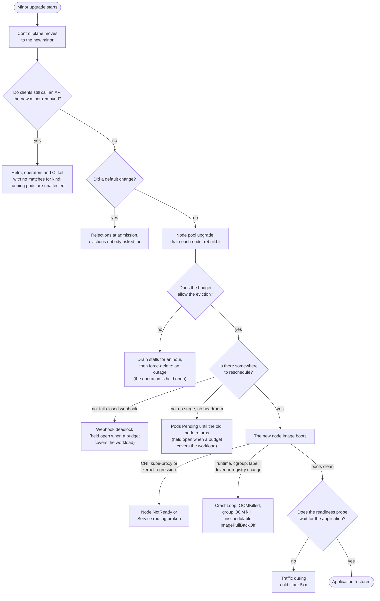

# Upgrade failure catalogue: what a GKE minor upgrade breaks, and the signal for each

A GKE minor upgrade does two things to a running application. It replaces the API server with a
newer one that may refuse requests the old one accepted, and it drains and rebuilds every node, so
every pod is killed and rescheduled once. Nearly every upgrade outage is one of those two events
landing on something that assumed it would never happen. This document lists those failures, with
the read-only signal that predicts each one before the upgrade, the signal that confirms it
afterwards, and why it is on the list. The checks a scheduled run should perform are specified in
[`upgrade-readiness-checks.md`](upgrade-readiness-checks.md); this catalogue is the list those
checks are chosen from, and its
[public incidents](upgrade-readiness-checks.md#upgrades-that-went-wrong-in-public) are the evidence
cited below.

## For a reader who does not run Kubernetes

A cluster is a set of rented machines, called nodes, running an application in small units called
pods, coordinated by a control program called the API server. Upgrading the cluster means
replacing the control program with a newer edition and then rebuilding every machine while the
application keeps running. Two things can go wrong. The newer control program may no longer
understand a request the application still makes, in the way a newer form may drop a field an old
script still fills in. And rebuilding a machine means stopping the pods on it and starting them
somewhere else, which only works if there is somewhere else to start them and if nothing forbids
stopping them. Each entry below is one way those two steps fail, what an operator can look at
beforehand to see it coming, and what they see afterwards when it has happened.

## The list

A signal marked _before_ is something a read-only check can observe on the cluster, in the GKE
API or in the target version's release notes before any upgrade is scheduled. A signal marked
_after_ is what an operator watching the operation, the pods and a service probe sees when the
failure happens. Each entry links to its own section, which names the evidence; an entry with no
public incident and no planted fixture says so there.

During the drain and reschedule:

1. [A PodDisruptionBudget forbids the eviction](#1-a-poddisruptionbudget-forbids-the-eviction):
   the drain stalls an hour, then GKE force-deletes the pod anyway.
2. [No spare capacity for the displaced pods](#2-no-spare-capacity-for-the-displaced-pods): pods
   sit Pending until the old node returns.
3. [Every replica in one zone or on one node](#3-every-replica-in-one-zone-or-on-one-node): a
   redundant-looking application loses all replicas at once.
4. [Slow cold start](#4-slow-cold-start): the pod is back but cannot serve, and a loose readiness
   probe lets traffic in.
5. [Data on the node is gone](#5-data-on-the-node-is-gone): Local SSD and `emptyDir` do not
   survive the rebuild.
6. [Maintenance window too short, or an exclusion ends mid-roll](#6-maintenance-window-too-short-or-an-exclusion-ends-mid-roll):
   the pool runs two versions for days.

Once the control plane moves:

7. [A served API version is removed](#7-a-served-api-version-is-removed): Helm, operators and CI
   fail with `no matches for kind`.
8. [A fail-closed webhook whose backend is not up](#8-a-fail-closed-webhook-whose-backend-is-not-up):
   nothing can be created or rescheduled where it matches.
9. [A default changes in the new minor](#9-a-default-changes-in-the-new-minor): pods rejected or
   evicted by a rule that did not exist before.
10. [A feature is deprecated but still served](#10-a-feature-is-deprecated-but-still-served):
    nothing breaks yet; the count is what to track.
11. [Add-on and client skew](#11-add-on-and-client-skew): operators and tools that do not support
    the new server.
12. [The control plane is unreachable for minutes on a zonal cluster](#12-the-control-plane-is-unreachable-for-minutes-on-a-zonal-cluster):
    clients without retry fail during the control-plane step.

On the new node image:

13. [A node label or taint is removed](#13-a-node-label-or-taint-is-removed): pods selecting on
    it never schedule.
14. [The container runtime changes](#14-the-container-runtime-changes): anything using the Docker
    socket breaks.
15. [cgroup v2 under a runtime that cannot read it](#15-cgroup-v2-under-a-runtime-that-cannot-read-it):
    old Java and .NET size their heaps from the host and are OOM-killed.
16. [The OOM killer starts killing the whole container](#16-the-oom-killer-starts-killing-the-whole-container):
    multi-process containers that used to lose one worker now die outright.
17. [The network dataplane changes](#17-the-network-dataplane-changes): policy, DNS or specific
    flows behave differently.
18. [A node networking agent fails on the new image](#18-a-node-networking-agent-fails-on-the-new-image):
    Service routing stops on rebuilt nodes, or cluster-wide.
19. [GPU driver mismatch](#19-gpu-driver-mismatch): CUDA containers cannot open the device.
20. [In-tree volumes lose their CSI path](#20-in-tree-volumes-lose-their-csi-path): old
    PersistentVolumes stop attaching.
21. [Images on a retired registry](#21-images-on-a-retired-registry): new nodes cannot pull what
    old nodes had cached.

## Where each failure lands in the upgrade

The list groups failures by moment. The diagram puts them in order, with one fact the list cannot
show: which failures hold GKE's operation open. One mechanism does it, an eviction a budget
refuses, and three entries reach it: the rigid budget itself (1), and the two cases where
replacements never become Ready, because there was nowhere to schedule them (2) or a fail-closed
webhook rejected them (8), so the budget over the workload counts them unavailable and refuses the
next eviction. A maintenance window that closes mid-roll (6) pauses the operation between nodes,
and the diagram leaves that case out. Every other failure lets the upgrade finish, and the break
lands afterwards on an upgraded cluster, which is why the post-upgrade signals are worth reading
even when the operation reports success.

## The scenarios

Each section gives the mechanism, the signal before, the signal after, what already reads the
signal in this repository, and why the entry is on the list. The
[Scope table](upgrade-readiness-checks.md#scope) in the readiness requirements is the record of
which audit or skill reads what; the "read today" lines here are the delta against it.

### 1. A PodDisruptionBudget forbids the eviction

A node drain evicts pods through the eviction API, and a budget whose `disruptionsAllowed` is 0
refuses every eviction. GKE respects the budget for up to one hour per node, then force-evicts,
so the application goes down after an hour of stall instead of after a clean handover.

- Before: a budget whose `disruptionsAllowed` is 0 for a reason that will not clear, which is
  `maxUnavailable` 0, `minAvailable` equal to the replica count, or a single-replica workload
  behind a budget whose `minAvailable` demands its only pod.
- After: the node sits `SchedulingDisabled` with the pod still on it, `Cannot evict pod` events,
  the `UPGRADE_NODES` operation running far longer than one node should take, then the pod deleted.
- Read today: the readiness mode of `fleet-upgrade-verification` grades it `blocked`.
- Why it is on the list: the one-hour grace and the forced eviction are in GKE's
  [node upgrade strategies](https://docs.cloud.google.com/kubernetes-engine/docs/concepts/node-pool-upgrade-strategies).
  The seeded fleet plants no drain-blocking budget.

### 2. No spare capacity for the displaced pods

Draining a node only works if the pods it carries can start somewhere else. With no surge node,
no headroom, an autoscaler at its ceiling or exhausted accelerator quota, they wait for the node
that was just taken away, and a single-replica application has a guaranteed outage.

- Before: the pool's `maxSurge` is 0, requests already close to allocatable minus one node, the
  autoscaler at its maximum, or accelerator quota exhausted.
- After: Pending pods with `Insufficient cpu` or `Insufficient nvidia.com/gpu`, autoscaler events
  citing quota.
- Read today: nothing.
- Why it is on the list: it follows from how a drain works, not from an incident; no public story
  verified and no fixture. Accelerator pools are the common case because their quota is small.

### 3. Every replica in one zone or on one node

Replicas protect against losing one node only if they are on different nodes. When they share a
node, or a zone whose nodes roll together, the upgrade takes every replica at once.

- Before: replica placement per Deployment, by zone and by node; missing topology spread or
  anti-affinity.
- After: availability falls to zero for a workload with more than one replica.
- Read today: the obtainability audit's spread and pinning checks.
- Why it is on the list: a consequence of scheduling, not an incident; no fixture on the seeded
  fleet and no public story verified.

### 4. Slow cold start

After the rebuild the pod restarts from nothing. If the readiness probe passes before the
application can serve, or there is no probe, the load balancer sends traffic to a pod that is
still loading.

- Before: a missing startup or readiness probe, a probe that passes before the application can
  serve, or a model or image cache on an `emptyDir` that a rebuild empties.
- After: Ready flapping, 5xx from the load balancer immediately after the node returns.
- Read today: the obtainability audit flags a missing readiness probe; a probe that passes too
  early is unread.
- Why it is on the list: no public incident verified. A model server that reloads its weights for
  minutes after every recreate is the common shape.

### 5. Data on the node is gone

A rebuilt node is a new machine. Local SSD and `emptyDir` contents do not come back.

- Before: pods mounting Local SSD or `emptyDir` for anything they cannot rebuild.
- After: application errors reading state, empty caches or queues.
- Read today: nothing.
- Why it is on the list: the readiness requirements'
  [drain-safety section](upgrade-readiness-checks.md#drain-safety) covers it; no public incident
  verified.

### 6. Maintenance window too short, or an exclusion ends mid-roll

A surge upgrade pauses when the maintenance window closes and resumes at the next one, so a large
pool can run two versions for days. An exclusion whose scope covers the needed upgrade holds it
back entirely, and one that ends inside a planned change lets an unplanned upgrade start.

- Before: window length against node count times drain time; an exclusion in effect whose scope
  covers the upgrade the target needs; exclusion end dates inside the planned change.
- After: the operation still open after the window closes, with mixed node versions in one pool.
  Surge upgrades pause this way; blue-green ones
  [run to completion](https://docs.cloud.google.com/kubernetes-engine/docs/concepts/node-pool-upgrade-strategies).
- Read today: the readiness mode grades the covering exclusion; the security-patch orchestrator
  reads the window.
- Why it is on the list: a common support case; no single public story verified.

### 7. A served API version is removed

Kubernetes stops serving deprecated API versions on a schedule. Objects already stored survive,
because the server keeps serving them through the versions that remain, but every client still
asking for the removed version fails. The last minor that removed a served version is 1.32, which
dropped `flowcontrol.apiserver.k8s.io/v1beta3`.

- Before: GKE's deprecation insight for the target minor (`google.container.DiagnosisInsight`,
  subtypes `DEPRECATION_K8S_*` for API and feature removals and `DEPRECATION_CONTAINERD_*` for the
  runtime), the audit-log label `k8s.io/removed-release`, the `apiserver_requested_deprecated_apis`
  metric, and a scan of Helm release manifests and stored CRD versions. GKE pauses the cluster's
  automatic upgrade while it sees the calls, so the pause itself is a signal.
- After: controller logs full of 404s, `helm upgrade` refusing, the objects invisible to old
  clients.
- Read today: the deprecation scan in `fleet-upgrade-verification` reads the `apiVersion`s a
  linked GitOps repository declares in raw YAML and JSON, skipping Helm templates. The insights
  themselves are quoted by the skill as a command for a human, because the agent's `gcloud`
  allowlist excludes them; stored Helm release state and CRD `storedVersions` are unread.
- Why it is on the list: Helm and Spinnaker on 1.25 in the
  [incidents](upgrade-readiness-checks.md#upgrades-that-went-wrong-in-public); the 1.32 removal is
  in GKE's [deprecation notes](https://docs.cloud.google.com/kubernetes-engine/docs/deprecations/apis-1-32).

### 8. A fail-closed webhook whose backend is not up

An admission webhook with `failurePolicy: Fail` rejects every matching request when its backend
does not answer. During a node upgrade the backend itself gets drained, and while it is down
nothing it matches can be created, including the replacement pods the drain needs, and in the worst
case `kube-system`.

- Before: webhooks with `failurePolicy: Fail`, a long timeout, a Service with no endpoints, and no
  `namespaceSelector` exempting `kube-system`.
- After: `failed calling webhook` events, Pending pods, drains that never finish.
- Read today: nothing.
- Why it is on the list: Jetstack's Open Policy Agent webhook outage in the incidents; no fixture
  on the seeded fleet.

### 9. A default changes in the new minor

Each minor turns some behaviour on by default. A pod admitted yesterday can be rejected today
without anyone changing it.

- Before: the target minor's release notes read against the cluster: Pod Security Admission
  enforcement, seccomp defaults, eviction thresholds, feature gates that flip on.
- After: rejections at admission, evictions nobody asked for.
- Read today: nothing.
- Why it is on the list: the PodSecurityPolicy removal in 1.25; the `gitRepo` volume the kubelet
  refuses from [1.36](https://kubernetes.io/blog/2026/04/22/kubernetes-v1-36-release/).

### 10. A feature is deprecated but still served

A deprecation breaks nothing on the day it lands; the removal does, minors later. Tracking the
count across runs is what turns a future removal from a surprise into a plan.

- Before: warnings in the API server's response headers and audit logs for `Endpoints`
  (deprecated in 1.33), kube-proxy IPVS mode (1.35) and Service `externalIPs` (1.36, removal
  planned for 1.43).
- After: none yet.
- Read today: nothing.
- Why it is on the list: the
  [1.36 externalIPs notice](https://kubernetes.io/blog/2026/05/14/kubernetes-v1-36-deprecation-and-removal-of-service-externalips/)
  is the current example of a deprecation with a removal date attached.

### 11. Add-on and client skew

Operators, `kubectl`, `client-go` builds, service meshes and GPU operators each support a range of
server versions. A control plane that moves past that range breaks them, and a node pool too far
behind the control plane breaks the kubelet's own contract.

- Before: installed versions of cert-manager, Istio, the NVIDIA operator, Argo and the like against
  their support matrices for the target minor; a node pool more minors behind the target control
  plane than the skew policy allows.
- After: controller crash loops; reconciles that stop.
- Read today: the readiness mode grades node-pool skew; add-on skew is unread.
- Why it is on the list: the Calico teardown race on GKE 1.22 in the incidents, an add-on known
  issue.

### 12. The control plane is unreachable for minutes on a zonal cluster

A zonal cluster has one control-plane replica, and it is replaced during the upgrade. Anything
that talks to the API without retrying fails for those minutes.

- Before: the cluster is zonal and clients lack retry.
- After: API 5xx for a few minutes, GitOps out of sync.
- Read today: nothing.
- Why it is on the list: GKE's
  [cluster availability types](https://docs.cloud.google.com/kubernetes-engine/docs/concepts/types-of-clusters)
  document the behaviour.

### 13. A node label or taint is removed

A pod whose `nodeSelector` names a label the new kubelet or node image no longer sets can never
schedule again.

- Before: `nodeSelector` and affinity terms naming a label the target minor's kubelet or node
  image stops setting.
- After: Pending with `didn't match node selector`.
- Read today: nothing.
- Why it is on the list: no GKE label removal verified. The public case, Reddit's 1.24 outage, was
  a kubeadm label read by a CNI selector rather than a pod selector, and is entry 18's evidence.

### 14. The container runtime changes

GKE moved from Docker to containerd between 1.19 and 1.24. Anything that mounted the Docker socket
or shelled out to `docker` lost it.

- Before: DaemonSets and pods mounting `docker.sock`; images built around Docker-only tooling.
- After: crash loops in logging and security agents.
- Read today: nothing.
- Why it is on the list: the Docker to containerd migration on GKE 1.19 to 1.24.

### 15. cgroup v2 under a runtime that cannot read it

Older Java, .NET and Go runtimes read their memory limit from cgroup v1 paths. On a cgroup v2 node
they see the host's memory instead, size their heaps from it, and are OOM-killed at the container
limit. On GKE the mode is per node pool: cgroup v2 has been the default for new nodes since 1.26,
and a pool still on v1 is
[migrated at 1.33 and loses v1 support at 1.35](https://docs.cloud.google.com/kubernetes-engine/docs/how-to/migrate-cgroupv2),
so for such a pool the flip does arrive with the minor.

- Before: the node pool's `effectiveCgroupMode` in the GKE API and `stat -fc %T /sys/fs/cgroup`
  on a node (`cgroup2fs`); container images with a JDK older than 8u372 or 11.0.16, the versions
  the [cgroup v2 page](https://kubernetes.io/docs/concepts/architecture/cgroups/) names.
- After: `OOMKilled` with no code change, on the migrated nodes only.
- Read today: nothing.
- Why it is on the list: the Kubernetes cgroup v2 documentation names the runtime versions; no
  public incident verified.

### 16. The OOM killer starts killing the whole container

From Kubernetes 1.28 the kubelet sets `memory.oom.group` on every container on a cgroup v2 node,
so an out-of-memory event kills the whole container instead of the one process that overran. A
multi-process container that used to lose one worker and carry on (nginx, PHP-FPM, Postgres,
notebook servers, CI runners) now dies at exit 137. The
[`singleProcessOOMKill`](https://github.com/kubernetes/kubernetes/pull/126096) opt-out exists only
from 1.32. This is the one way an upgrade produces `OOMKilled` on its own, without a runtime that
misreads its limit.

- Before: a kubelet at 1.28 or later on a cgroup v2 node, reached by crossing 1.28 or, for a fleet
  already past it, by a v1 pool being migrated to cgroup v2, which GKE does at 1.33. Read
  `/sys/fs/cgroup/memory.oom.group` in a container (1 means group kill) and list containers
  running more than one process.
- After: `OOMKilled` on containers whose logs previously showed worker restarts under the same
  load.
- Read today: nothing.
- Why it is on the list:
  [kubernetes#117070](https://github.com/kubernetes/kubernetes/issues/117070) is the change, the
  [write-up by the opt-out's authors](https://tech.preferred.jp/en/blog/kubernetes-single-process-oom-kill/)
  the explanation, and 2i2c's
  [EKS 1.32 to 1.34 regression](https://2i2c.org/blog/kubernetes-cgroup-changes/), where a node
  image change turned cgroup v2 on under a kubelet already past 1.28, the incident.

### 17. The network dataplane changes

A new version can change how NetworkPolicy is enforced, which DNS serves the cluster, or how a
specific flow is handled.

- Before: dataplane and DNS provider, policy count, the known issues for the target version.
- After: connection resets, policy drops in flow logs, DNS timeouts.
- Read today: nothing.
- Why it is on the list: no public incident verified; the per-version known-issue notes are the
  signal.

### 18. A node networking agent fails on the new image

The CNI, `kube-proxy` and node-local DNS run on every node and depend on the node's labels,
kernel and packages. A change under them stops Service routing on the rebuilt nodes, and if the
CNI's own control components are hit, cluster-wide within minutes.

- Before: the target node image's release notes and known issues; the CNI's dependence on node
  labels or kernel modules the image changes.
- After: nodes `NotReady` or `NetworkUnavailable`, CNI or `kube-proxy` pods crash-looping, Service
  VIP probes failing from inside the cluster.
- Read today: nothing.
- Why it is on the list: Reddit's 1.24 outage was the CNI losing its route reflectors when a node
  label went away; the Datadog and Heroku outages in the incidents are the same shape, triggered by
  an OS update rather than an upgrade.

### 19. GPU driver mismatch

The node image ships a GPU driver; the containers ship a CUDA version. When the new image's driver
is older than what the CUDA build requires, the device cannot be opened.

- Before: the driver version the target node image ships against the CUDA version the images need.
- After: pods Pending on `nvidia.com/gpu`, or crashing in `nvidia-smi`.
- Read today: nothing.
- Why it is on the list: frequent on accelerator pools; no public incident verified.

### 20. In-tree volumes lose their CSI path

PersistentVolumes written against the in-tree `gce-pd` plugin attach only through CSI migration to
the PD CSI driver. With the driver add-on disabled they stop attaching.

- Before: PersistentVolumes with an in-tree `gcePersistentDisk` spec while the cluster's
  `gcePersistentDiskCsiDriverConfig` add-on is disabled; StorageClasses naming a provisioner that
  no longer exists.
- After: attach errors, pods stuck `ContainerCreating`.
- Read today: nothing.
- Why it is on the list: the
  [1.25 CSI migration status](https://kubernetes.io/blog/2022/09/26/storage-in-tree-to-csi-migration-status-update-1.25/)
  and GKE's
  [PD CSI driver page](https://cloud.google.com/kubernetes-engine/docs/how-to/persistent-volumes/gce-pd-csi-driver).

### 21. Images on a retired registry

Old nodes had the image cached; a rebuilt node has to pull it. If the registry hostname has
stopped publishing, or an egress allowlist admits only the old hostname, only the new nodes fail.

- Before: image references on a registry hostname that has stopped publishing or is being retired,
  such as `k8s.gcr.io`, and egress allowlists that admit only the old hostname.
- After: `ImagePullBackOff` only on new nodes.
- Read today: nothing.
- Why it is on the list: the
  [`k8s.gcr.io` freeze](https://kubernetes.io/blog/2023/02/06/k8s-gcr-io-freeze-announcement/) and
  its [redirect](https://kubernetes.io/blog/2023/03/10/image-registry-redirect/): tags published
  after the freeze exist only on the new host, and allowlists naming only the old one broke.

## The order to add checks

The order is by how often each failure appears in the public record and how cheap its signal is to
read. Deprecation insights (7) come first: GKE already computes them, the same call reads every
cluster in a project, and the readiness requirements'
[deprecation-insights section](upgrade-readiness-checks.md#gke-deprecation-insights) says what else
the pause they put on automatic upgrades explains. Fail-closed webhooks (8) and capacity headroom
(2) come next, because both turn a routine drain into an outage and both are a few list calls.
Replica placement (3) follows, and then the node-image entries (13 to 21), which need the target
version to be known before they mean anything. Post-upgrade detection is one mechanism for every
entry: watch the operation, then compare Pending and crash-looping pod counts, readiness flapping
and a live service probe against the same measurements taken before the upgrade started, as the
readiness requirements' [rollout section](upgrade-readiness-checks.md#rollout-and-verification)
specifies.
