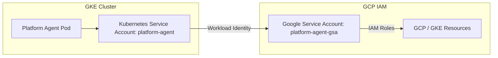

# Kube-Agents Security & IAM Guide

This guide details the security model of Kube-Agents, explains the default permissions granted to the system, and provides instructions on configuring a strict **Read-Only (Auditing) Mode** following the principle of least privilege.

---

## Identity Model Overview

Kube-Agents utilizes GKE Workload Identity to securely bind Kubernetes Service Accounts (KSAs) running inside the cluster to Google Service Accounts (GSAs) in your GCP project.



This model eliminates the need to store static GCP credentials (like JSON keys) inside the cluster.

---

## Default Permissions (Administrative Mode)

By default, the automated provisioning pipeline (`provision.sh`) configures the system with administrative privileges to allow the Platform Agent to manage cluster lifecycles and perform troubleshooting.

### 1. GCP IAM Roles (Assigned to the GSA)

The default GSA (`kubeagents-platform-agent-gsa`) is granted:

- `roles/container.clusterAdmin` & `roles/container.admin`: Full control over GKE clusters.
- `roles/monitoring.admin`: Manage monitoring configurations.
- `roles/logging.admin`: Manage logging configurations.
- `roles/iam.serviceAccountUser`: Allows the agent to run jobs/VMs as other service accounts.
- `roles/iam.securityReviewer`: Read-only access to review IAM policies.

### 2. Kubernetes RBAC (Assigned to the KSA)

Despite having broad GCP permissions, the agent's direct interaction with the Kubernetes API is restricted by the operator to:

- `view` (Standard ClusterRole): Read-only access to most API resources (excluding Secrets).
- `kubeagents:explorer` (Custom ClusterRole): Read-only access to `nodes`, `pods`, `namespaces`, and `customresourcedefinitions`.

---

## Configuring Read-Only (Auditing) Mode

If you want to use Kube-Agents solely for auditing, monitoring, and trend analysis without allowing it to modify any cloud resources, you should configure it in **Read-Only Mode**.

### Step 1: Restrict GCP IAM Roles

When provisioning or updating the GCP IAM permissions, substitute the administrative roles with their viewer/reader equivalents.

Modify your `scripts/vars.sh` or run the following GCP commands to bind the restricted roles to your GSA:

```bash
# Define variables
PROJECT_ID="your-gcp-project-id"
GSA_EMAIL="kubeagents-platform-agent-gsa@${PROJECT_ID}.iam.gserviceaccount.com"

# 1. Remove Administrative Roles
gcloud projects remove-iam-policy-binding "${PROJECT_ID}" \
    --member="serviceAccount:${GSA_EMAIL}" \
    --role="roles/container.clusterAdmin"
gcloud projects remove-iam-policy-binding "${PROJECT_ID}" \
    --member="serviceAccount:${GSA_EMAIL}" \
    --role="roles/container.admin"
gcloud projects remove-iam-policy-binding "${PROJECT_ID}" \
    --member="serviceAccount:${GSA_EMAIL}" \
    --role="roles/monitoring.admin"
gcloud projects remove-iam-policy-binding "${PROJECT_ID}" \
    --member="serviceAccount:${GSA_EMAIL}" \
    --role="roles/logging.admin"
gcloud projects remove-iam-policy-binding "${PROJECT_ID}" \
    --member="serviceAccount:${GSA_EMAIL}" \
    --role="roles/iam.serviceAccountUser"

# 2. Add Read-Only Roles
gcloud projects add-iam-policy-binding "${PROJECT_ID}" \
    --member="serviceAccount:${GSA_EMAIL}" \
    --role="roles/container.viewer"
gcloud projects add-iam-policy-binding "${PROJECT_ID}" \
    --member="serviceAccount:${GSA_EMAIL}" \
    --role="roles/monitoring.viewer"
gcloud projects add-iam-policy-binding "${PROJECT_ID}" \
    --member="serviceAccount:${GSA_EMAIL}" \
    --role="roles/logging.viewer"
gcloud projects add-iam-policy-binding "${PROJECT_ID}" \
    --member="serviceAccount:${GSA_EMAIL}" \
    --role="roles/iam.securityReviewer"
```

### Step 2: Verify Kubernetes RBAC

Ensure that the Kube-Agents operator is not granting write permissions. By default, the operator only assigns the `view` and `explorer` roles. You can verify this by checking the active bindings:

```bash
kubectl describe clusterrolebinding kubeagents:viewer:kubeagents-system:platformagent
kubectl describe clusterrolebinding kubeagents:explorer:kubeagents-system:platformagent
```

---

## Secure Write Path: GitOps

To perform write actions (such as deploying applications or fixing drift) while keeping the GKE cluster permissions strictly read-only, configure **GitOps-driven writes**:

1.  **Configure GitHub Integration**: Set up the GitHub Token Minter (Minty) as detailed in the [Integrations Guide](integrations.md#github-integration-minty).
2.  **ReadOnly Cluster + Writeable Git**: The Platform Agent remains read-only on the GKE cluster, but has write access to your GitOps repository.
3.  **Pull Request Workflow**: When the agent wants to make a change, it creates a Pull Request in your Git repository.
4.  **Reconciliation**: A GitOps controller (like ArgoCD or Flux) running in the cluster (configured with its own write permissions) reconciles the changes from Git to the cluster once the PR is merged by a human.

This ensures that the AI agent never has direct write access to your running infrastructure.
