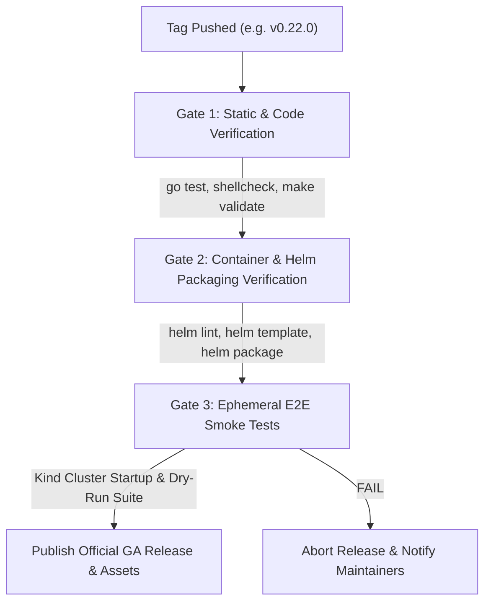

# Release Engineering Program & Strategy

This document describes the release engineering architecture, versioning guarantees, release train cadence, and automated CI/CD verification pipelines for **`kube-agents`**.

---

## 1. Versioning Model & Semantic Guarantees (`vX.Y.Z`)

`kube-agents` strictly follows **Semantic Versioning 2.0.0**:

- **Pre-1.0 Era (`v0.X.Y`)**: Weekly minor releases (`v0.1.0`, `v0.2.0`) starting from initial version `v0.1.0` during active feature development. Patch releases (`v0.1.1`) for critical hotfixes.
- **1.0+ GA Era (`v1.X.Y`)**:
  - `X` (Major): Breaking changes to Custom Resource Definitions (CRDs), CLI flags, or agent API protocols.
  - `Y` (Minor): Backward-compatible new capabilities, agent skills, and operator features.
  - `Z` (Patch): Backward-compatible bug fixes and security hardening.

---

## 2. Release Train Cadence & Rationale

### Transition Schedule

1. **Phase A (Initial - Pre-1.0)**: **Weekly Release Train**
   - **Schedule**: Every Tuesday at **14:00 UTC**.
   - **Goal**: Rapid iteration, fast feedback loops for agent skill development and installer enhancements.
2. **Phase B (GA Stability)**: **Fortnightly (Bi-Weekly) Release Train**
   - **Schedule**: Every second Tuesday at **14:00 UTC**.
   - **Goal**: Operational predictability for enterprise SRE teams.

---

### Why Tuesday at 14:00 UTC?

#### A. The 3-Day Engineering Buffer Rule (Why Tuesday?)

- **Avoid Friday Releases**: Releasing right before the weekend leaves on-call engineers exposed to unexpected production regressions without full engineering team support.
- **Avoid Monday Releases**: Mondays are filled with weekend triage, team syncs, and clearing PR backlogs.
- **Tuesday Peak Engineering Health**: Releasing on Tuesday provides **3 full business days (Tuesday, Wednesday, Thursday)** for the team to monitor customer adoption, triage early feedback, and issue patch releases (`v0.22.1`) before the weekend.

#### B. Global Working Hours Overlap (Why 14:00 UTC?)

14:00 UTC aligns active working hours across global maintainer timezones:

| Region / Timezone              | Local Time at 14:00 UTC | Operational Benefit                  |
| :----------------------------- | :---------------------- | :----------------------------------- |
| **US West Coast (PST/PDT)**    | **07:00 AM**            | Start of the US engineering workday. |
| **US East Coast (EST/EDT)**    | **10:00 AM**            | Mid-morning peak activity window.    |
| **Europe / UK (UTC/BST/CEST)** | **15:00 / 16:00**       | Mid-afternoon working hours.         |

---

## 3. GitHub Milestones & Automated Milestone Assignment

Every issue, pull request, and Buganizer item is assigned a **GitHub Milestone** (e.g. `v0.22.0`):

- **Automated Milestone Assignment on Merge**:
  - The repository workflow `.github/workflows/auto-assign-milestone.yml` automatically triggers whenever a PR is merged into `main`.
  - If a merged PR does not have an explicit milestone set, the workflow queries active open release milestones and automatically tags the PR with the current release milestone (e.g., `v0.22.0`).
- **Customer Communication**:
  > _"To get the gVisor sandbox feature, upgrade to **`v0.22.0`**."_  
  > _"Bug `b/422969391` was resolved in patch **`v0.22.1`**."_

---

## 4. 3-Gate Release Verification Pipeline

Official GA Releases (`v0.22.0`) are guarded by `.github/workflows/release-build-publish.yml` which enforces 3 sequential verification gates before publishing assets:



1. **Gate 1: Static, Security & Code Verification (`gate-1-static-build-verification`)**:
   - Operator Go unit tests (`go test ./...` in `k8s-operator/`).
   - Google OSV Vulnerability Scanner (`google/osv-scanner-action`) checking dependencies against the Open Source Vulnerability database.
   - `shellcheck` for all shell scripts (`install.sh`, `uninstall.sh`, `upgrade.sh`).
   - Repository structure validation (`make validate`) and link checks (`make docs-check`).
2. **Gate 2: Container, Helm, Archive & SBOM Packaging (`gate-2-packaging-verification`)**:
   - `helm lint charts/kube-agents` and `helm template` rendering validation.
   - Helm chart packaging (`kube-agents-0.22.0.tgz`).
   - Generates an official **SPDX Software Bill of Materials (SBOM)** (`kube-agents-v0.22.0.spdx.json`) via Anchore Syft for compliance auditing.
   - Packages self-contained release bundles (`kube-agents-v0.22.0.tar.gz`, `.tgz`, `.zip`) for enterprise/offline customers who cannot use `git clone` from the command line.
   - Generates SHA256 checksums (`checksums.txt`) for file integrity verification.
3. **Gate 3: Ephemeral E2E Smoke Test Suite (`gate-3-e2e-smoke-tests`)**:
   - Provisions an ephemeral `Kind` Kubernetes cluster inside the runner.
   - Validates installer, upgrade, and teardown execution against a live API server.
4. **Publish Official GA Release (`create-github-release`)**:
   - Auto-generates release notes grouped by Conventional Commits (`feat`, `fix`, `sec`) and attaches Helm chart bundles, `.tar.gz`, `.tgz`, `.zip` web download archives, `.spdx.json` SBOM, and `checksums.txt`.

---

## 6. Enterprise Air-Gapped & Security Governance

For enterprise deployments with strict InfoSec policies or air-gapped network environments:

### A. Air-Gapped Private Registry Support

Clusters blocking outbound internet traffic (`ghcr.io`) can mirror container images to an internal private container registry (Artifact Registry, Harbor, Nexus) using the `--registry-override` flag during installation and upgrade:

```bash
./install.sh --registry-override="us-docker.pkg.dev/my-company-registry/kube-agents"
```

### B. Software Bill of Materials (SBOM)

Every official release publishes a machine-readable **SPDX SBOM** (`kube-agents-v0.22.0.spdx.json`) detailing all Go modules, system packages, and open-source licenses for security vulnerability and license auditing.

### C. Declarative GitOps Compatibility

Environments restricting raw shell script execution in production can deploy via declarative **Helm Charts** (`charts/kube-agents`) or **Terraform Modules** (`terraform/`) wired directly into ArgoCD or Flux GitOps pipelines.

### D. Installation & Upgrades via Downloadable Web Release Archives

For environments without CLI `git` access or where streaming remote scripts via `curl | bash` is restricted:

1. **Download Release Archive & Checksums**: Download `.tar.gz`, `.tgz`, or `.zip` archives directly from the [GitHub Release Page](https://github.com/gke-labs/kube-agents/releases/tag/v0.1.0):
   ```bash
   curl -LO https://github.com/gke-labs/kube-agents/releases/download/v0.1.0/kube-agents-v0.1.0.tar.gz
   curl -LO https://github.com/gke-labs/kube-agents/releases/download/v0.1.0/checksums.txt
   ```
2. **Verify Integrity**:
   ```bash
   sha256sum -c checksums.txt --ignore-missing
   ```
3. **Execute Local Unpacked Scripts**:
   ```bash
   tar -xzf kube-agents-v0.1.0.tar.gz
   cd kube-agents-v0.1.0/
   ./install.sh --project-id="my-gcp-project" --cluster-name="platform-agent"
   ./upgrade.sh --upgrade-mode=skills
   ```

---

## 5. Hotfix & Patch Release Procedure (`vX.Y.Z+1`)

When a bug or regression is discovered in a release (e.g. `v0.22.0`) that requires an immediate fix without introducing new functionality:

### Semantic Patch Rules

- **Increment Patch Digit**: Move from `v0.22.0` to **`v0.22.1`**.
- **Zero New Features**: Patch releases must contain **only the isolated bug fix** (`fix: ...`) to guarantee zero risk of secondary regressions.

### Hotfix Git & Release Workflow

1. **Submit Bugfix PR**: Merge the bug fix into `main` with Conventional Commit prefix `fix:`.
2. **Tag Patch Release**: Create and push the patch tag:
   ```bash
   git tag -a v0.22.1 -m "Hotfix release v0.22.1: fix gVisor sandbox flag resolution"
   git push origin v0.22.1
   ```
3. **Automated Pipeline Execution**:
   - Pushing `v0.22.1` automatically triggers the **3-Gate Verification Pipeline**.
   - Publishes tagged container images `ghcr.io/gke-labs/kube-agents/*:v0.22.1` and Helm charts (`kube-agents-0.22.1.tgz`).
4. **Zero-Downtime Customer Upgrade**:
   - Customers upgrade instantly to the patch release via `upgrade.sh`:
     ```bash
     curl -fsSL https://gke-labs.github.io/kube-agents/upgrade.sh | bash -s -- --version=v0.22.1
     ```
