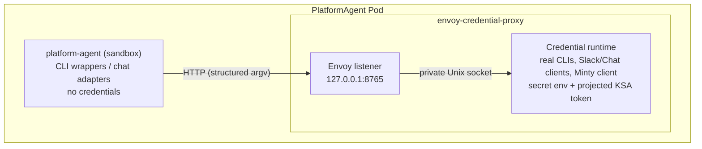

The PlatformAgent sandbox container never receives API keys, access tokens, refresh tokens, or Kubernetes ServiceAccount tokens through its environment or filesystem. Credentials live exclusively in a trusted **Envoy credential-proxy sidecar** inside the same Pod, and the sandbox reaches credentialed capabilities only through a policy-enforced local proxy.

This page summarizes the architecture. The canonical design — including scope, deny-policy details, migration steps, and CI verification assertions — is [`docs/credential-isolation-design.md`](https://github.com/gke-labs/kube-agents/blob/main/docs/credential-isolation-design.md).

## Pod anatomy

Each PlatformAgent runs as one long-lived Pod with these managed containers:

| Container                  | Trust level | Role                                                                 |
| -------------------------- | ----------- | -------------------------------------------------------------------- |
| `platform-agent`           | Untrusted   | The agent sandbox — credential-free env and mounts, CLI wrappers.    |
| `envoy-credential-proxy`   | Trusted     | Envoy plus the credentialed command and chat runtime.                |
| `event-watcher`            | Trusted     | Cluster-event forwarding with its own separate Kubernetes-API token. |
| `fluent-bit`               | Trusted     | Log forwarding.                                                      |
| `platform-agent-dashboard` | Untrusted   | Optional local dashboard (also credential-free).                     |

The sandbox image contains only **wrapper binaries** for `gcloud`, `kubectl`, `gh`, and `git`. A wrapper sends the executable name and argument array to Envoy at `127.0.0.1:8765`; the credential runtime executes the corresponding real CLI and returns output and exit status. It never evaluates an agent-supplied shell command, and the runtime's Unix socket is mounted only in the sidecar, so the sandbox cannot bypass Envoy. The real credential-aware CLIs ship in a separate `credential-proxy` image that the sandbox never runs.

## Credential placement

| Data                            | Sandbox     | Credential sidecar        |
| ------------------------------- | ----------- | ------------------------- |
| `spec.deployment.env`           | No          | Yes                       |
| Slack tokens                    | No          | Yes, Secret-backed env    |
| PlatformAgent external API key  | No          | Yes, Secret-backed env    |
| Automatic KSA token mount       | Disabled    | Disabled                  |
| Explicit projected KSA token    | Not mounted | Read-only, one-hour token |
| gcloud/kubectl configuration    | No          | Private `emptyDir`        |
| GitHub installation token/cache | No          | Private `emptyDir`        |
| Agent workspace                 | Yes         | Yes, for proxied commands |

Pod-wide `automountServiceAccountToken` is `false`. The sidecar's projected token uses the audience `kubeagents-credential-proxy` and expires after one hour; the event watcher gets a separate one-hour Kubernetes-API token projection. Neither token is mounted in the agent or dashboard containers.

## Request paths

- **CLI commands** — only `gcloud`, `kubectl`, `gh`, and `git` are accepted. The proxy rejects known credential-disclosure, credential-replacement, and self-modification operations; interactive TTY programs, unbounded streaming, sandbox-only file paths, and background processes fail closed.
- **Chat** — Slack and Google Chat adapters send credential-free payloads to Envoy; the credential runtime owns the platform tokens and performs the external API calls, enforcing user allowlists and payload limits.
- **PlatformAgent API** — the Service targets port 8643 on the sidecar, which validates the external bearer key and forwards to the sandbox API on loopback (port 8642) with a non-secret sentinel. The real key never enters the sandbox.
- **GitHub** — the sidecar obtains a Google OIDC identity token and calls [Minty](/kube-agents/deploy/token-minter/), which brokers a repository-scoped GitHub App installation token with a maximum one-hour lifetime. The App's private key stays in Cloud KMS.

## Guarantee and limitation

**Guarantee:** the operator does not place managed credentials in the sandbox container's environment, root filesystem, persistent agent volume, or mounted ServiceAccount token path. `spec.deployment.env` is applied to the credential sidecar because it may contain credentials (only four allowlisted OpenTelemetry settings are copied to the sandbox, as literal values only).

**Limitation:** containers in one Pod share a network namespace and one Pod identity. The sandbox has no KSA token file, but it can technically reach the GKE metadata server used by the sidecar — a Pod-level NetworkPolicy cannot block metadata for one container while allowing it for another. The design meets the scoped filesystem-and-environment goal but does not provide the stronger identity boundary of separate Pods.

## Where to go next

- [Security & IAM](/kube-agents/reference/security-and-iam/) — Workload Identity, the GCP permission sets, and the read-only Kubernetes RBAC.
- [Token minter (Minty)](/kube-agents/deploy/token-minter/) — short-lived GitHub App tokens via KMS.
- [Full design doc](https://github.com/gke-labs/kube-agents/blob/main/docs/credential-isolation-design.md) — scope, deny policy, migration, and CI verification assertions.
