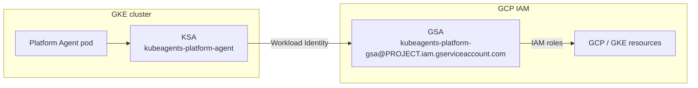

## What the agent can and cannot do

This is the canonical answer. Other pages summarize it and link here; if they appear to disagree, this page is correct.

"Is the agent read-only?" has **three different answers depending on which plane you mean.** Conflating them is the most common misreading of this project's security posture.

| Plane                         | What it governs                                                   | Can the agent write?                                                                                                                                                                                  |
| ----------------------------- | ----------------------------------------------------------------- | ----------------------------------------------------------------------------------------------------------------------------------------------------------------------------------------------------- |
| **Kubernetes RBAC** (the KSA) | Everything the agent does against a cluster's Kubernetes API      | **No** for workloads and cluster state — read-only in every configuration apart from a leader-election housekeeping Role confined to its own namespace, and it cannot read Secrets. Enforced by RBAC. |
| **GCP IAM** (the GSA)         | GKE/Google Cloud control-plane calls, including via the `gke` MCP | **No, with the default `read-only` permission set.** Yes, if you opt in to `gke-admin`. Enforced by IAM, chosen at provisioning.                                                                      |
| **The GitOps path**           | Changes to your infrastructure-as-code repository                 | Yes — by opening a pull request a human must review and merge.                                                                                                                                        |

### What that means in practice

- **Workloads and cluster state cannot be mutated through the Kubernetes API by this agent.** The KSA's only write grant is the housekeeping Role `kubeagents:leader:<namespace>:<name>` — write on leader-election `leases` plus `get`/`patch` on `pods`, both confined to the agent's own namespace. Beyond that it holds no write verb (see [Kubernetes RBAC](#kubernetes-rbac)). This holds regardless of any other setting.
- **GCP control-plane mutation is enforced off by default.** The default `read-only` permission set gives the GSA viewer roles only, so cloud-side writes fail at IAM. If you opt in to `gke-admin` at provisioning, that changes: the GSA then holds `roles/container.admin`, and the agent's `gke` MCP server proxies `container.googleapis.com`, which exposes cluster-management tools. In that configuration, what stops the agent using them is its **persona** (`SOUL.md §1`, "automation first" — infrastructure changes go through Git), not a permission boundary.
- **Persona rules are guidance, not enforcement.** A prompt-injection or reasoning failure is bounded by IAM, not by `SOUL.md`. Keep the default `read-only` set if "read-only on the cloud plane" must be an enforced property of the deployment rather than an intended behaviour of the model (see [Configuring read-only mode](#configuring-read-only-auditing-mode)).
- **The intended write path is always GitOps** — the agent proposes, a human merges, your reconciler applies. See [Secure write path](#secure-write-path-gitops).
- **The chat front door holds no infrastructure tools at all.** Chat ingress terminates at the Chat Agent (the pod's `default` Hermes profile), whose config pins every surface to routing, kanban-delegation, and per-user memory tools only — no GKE, file, or GitOps write tools. A prompt injected through chat must still be delegated to the Platform Agent, where the IAM and RBAC boundaries above apply. See [ChatOps](/kube-agents/concepts/chatops/).
- **Cluster Agents are scoped-down, not scoped-up.** Each per-cluster [Cluster Agent](/kube-agents/concepts/cluster-agents/) profile shares the pod's identity (same KSA/GSA, so the same IAM and RBAC ceilings apply), but its config template exposes only the read-only `gke` and `developer_knowledge` MCP servers — no `platform_control`, no GitOps write path — and its `KUBECONFIG` is pinned to one cluster. It proposes fixes back over the kanban card; only the Platform Agent can turn them into PRs.

> The [end-state design](https://github.com/gke-labs/kube-agents/blob/main/docs/architecture/01-vision-scope.md) removes the second row's opt-in escalation entirely: agents stay read-only on cloud APIs in every configuration, and the `create_cluster` tool is withdrawn. That is a target, not current behaviour.

---

The rest of this page details the two enforced planes.

## Identity model

The agent uses [GKE Workload Identity](https://cloud.google.com/kubernetes-engine/docs/how-to/workload-identity) to bind its in-cluster KSA to a GSA, so no static GCP key ever lands in the cluster.



The IAM side of the binding is pre-provisioned by [`provision_04_gcp_iam.sh`](https://github.com/gke-labs/kube-agents/blob/main/k8s-operator/scripts/provision_04_gcp_iam.sh), which grants `roles/iam.workloadIdentityUser` on the GSA to the KSA member `<project>.svc.id.goog[kubeagents-system/kubeagents-platform-agent]`. The KSA-side annotation `iam.gke.io/gcp-service-account: kubeagents-platform-gsa@<project>.iam.gserviceaccount.com` is applied by the operator from `spec.security.serviceAccountAnnotations` on the [`PlatformAgent` CR](/kube-agents/operator/platformagent-crd/).

## GCP IAM permission sets

`provision_04_gcp_iam.sh` grants the agent GSA one of three permission sets, chosen with the `PLATFORM_AGENT_PERMISSION_SET` variable (prompted during provisioning, cached in `vars.sh`):

| Permission set | `PLATFORM_AGENT_PERMISSION_SET` | Use it when                                                    |
| -------------- | ------------------------------- | -------------------------------------------------------------- |
| **gke-admin**  | `gke-admin`                     | The agent should manage GKE lifecycle and node pools directly. |
| **read-only**  | `read-only` (default)           | Auditing / monitoring only — no GCP write capability.          |
| **custom**     | `custom`                        | You supply the exact roles via `PLATFORM_AGENT_CUSTOM_ROLES`.  |

### Roles per set

The **gke-admin** set binds:

- `roles/container.clusterAdmin`, `roles/container.admin` — full GKE control.
- `roles/monitoring.admin` — manage monitoring configuration.
- `roles/logging.viewer` — read logs only (the agent must **not** administer the audit-log sink).
- `roles/iam.serviceAccountUser` — act as service accounts when running jobs.
- `roles/iam.securityReviewer` — read IAM policy for review.
- `roles/mcp.toolUser` — call the GKE MCP server.

The default **read-only** set swaps the admin roles for viewers:

- `roles/container.clusterViewer`, `roles/container.viewer` — read-only GKE.
- `roles/monitoring.viewer`, `roles/logging.viewer` — read-only telemetry.
- `roles/iam.serviceAccountUser`, `roles/iam.securityReviewer`, `roles/mcp.toolUser` — unchanged.

The **custom** set binds exactly the roles listed in `PLATFORM_AGENT_CUSTOM_ROLES` (space- or comma-separated; the provisioner prompts for it and requires a non-empty value when this set is selected) — none of the built-in role bundles are added.

## Kubernetes RBAC

Independently of the GCP permission set, the operator grants the agent KSA a **read-only** footprint on the Kubernetes API, plus one namespaced housekeeping Role. It creates three bindings (see [`platformagent_manifests.go`](https://github.com/gke-labs/kube-agents/blob/main/k8s-operator/internal/controller/platformagent_manifests.go)):

| Binding                                  | Role                         | Grants                                                                                                                                     |
| ---------------------------------------- | ---------------------------- | ------------------------------------------------------------------------------------------------------------------------------------------ |
| `kubeagents:viewer:<namespace>:<name>`   | standard `view` ClusterRole  | Read access to most namespaced resources — **excluding Secrets**.                                                                          |
| `kubeagents:explorer:<namespace>:<name>` | custom `kubeagents:explorer` | `get`/`list` on `nodes`, `pods`, `namespaces`, and CRDs.                                                                                   |
| `kubeagents:leader:<namespace>:<name>`   | custom namespaced Role       | Housekeeping in the agent's **own namespace only**: write on `coordination.k8s.io` `leases` (leader election) and `get`/`patch` on `pods`. |

For the default CR (`platform-agent` in `kubeagents-system`) the bindings resolve to `kubeagents:viewer:kubeagents-system:platform-agent`, `kubeagents:explorer:kubeagents-system:platform-agent`, and `kubeagents:leader:kubeagents-system:platform-agent`.

The `viewer` and `explorer` roles carry no write verb (`create`, `update`, `patch`, `delete`) and cannot read Secrets. The only write grant anywhere is the `leader` Role, and it is confined to the agent's own namespace — leader-election `leases`, plus `get`/`patch` on `pods` there. The agent cannot modify Deployments, Services, or namespaces, and it cannot read Secret values — if a resource it proposes needs a Secret, it references the Secret by name rather than reading its contents.

Verify the bindings on a running cluster:

```bash
kubectl describe clusterrolebinding kubeagents:viewer:kubeagents-system:platform-agent
kubectl describe clusterrolebinding kubeagents:explorer:kubeagents-system:platform-agent
kubectl describe rolebinding -n kubeagents-system kubeagents:leader:kubeagents-system:platform-agent
```

### The operator controller is a separate identity

Everything above describes the _agent_. The controller-manager that reconciles `PlatformAgent` CRs runs under its own KSA, `kubeagents-controller` (the kustomize `namePrefix: kubeagents-` applied to the base `controller` ServiceAccount), and its Kubernetes permissions are the Kubebuilder-generated ClusterRole in [`k8s-operator/config/rbac/role.yaml`](https://github.com/gke-labs/kube-agents/blob/main/k8s-operator/config/rbac/role.yaml) (regenerated with `make manifests`): write access to the object kinds it reconciles for the agent pod — Deployments/StatefulSets, ServiceAccounts, Services, ConfigMaps, PVCs, NetworkPolicies, and the agent RBAC objects above — plus read-only access to what it merely watches (nodes, namespaces, CRDs, RuntimeClasses). Unlike the agent, the controller has no GCP identity: no provisioning step creates a controller GSA or Workload Identity binding for it (the `CONTROLLER_GSA_NAME` default in `scripts/common.sh` is consumed only by the teardown scripts, which clean up older installs that did bind one).

## Configuring read-only (auditing) mode

`read-only` is the provisioning default, so a fresh install already runs in this posture. To pin it explicitly, or to bring a deployment provisioned with `gke-admin` back to it:

- **With the provisioner (recommended)** — accept the default `read-only` permission set when `provision_04_gcp_iam.sh` prompts, or set it up front:

  ```bash
  cd k8s-operator/scripts
  PLATFORM_AGENT_PERMISSION_SET=read-only ./provision_04_gcp_iam.sh
  ```

- **On an existing GSA provisioned with `gke-admin`** — swap the admin roles for viewers by hand:

  ```bash
  PROJECT_ID="your-gcp-project-id"
  GSA_EMAIL="kubeagents-platform-gsa@${PROJECT_ID}.iam.gserviceaccount.com"

  # Remove the admin roles
  for role in roles/container.clusterAdmin roles/container.admin roles/monitoring.admin; do
    gcloud projects remove-iam-policy-binding "${PROJECT_ID}" \
      --member="serviceAccount:${GSA_EMAIL}" --role="${role}"
  done

  # Add the read-only roles
  for role in roles/container.clusterViewer roles/container.viewer roles/monitoring.viewer; do
    gcloud projects add-iam-policy-binding "${PROJECT_ID}" \
      --member="serviceAccount:${GSA_EMAIL}" --role="${role}"
  done
  ```

  Leave `roles/logging.viewer`, `roles/iam.serviceAccountUser`, `roles/iam.securityReviewer`, and `roles/mcp.toolUser` in place — they are shared by both sets.

The Kubernetes RBAC above is already read-only in every mode, so no cluster-side change is needed.

## Secure write path: GitOps

Because the agent's Kubernetes RBAC is read-only, remediations are proposed rather than applied:

1. The agent invokes the [`submit-suggestion`](/kube-agents/concepts/declarative-workflow/) skill with a proposed diff (usually a YAML patch from a governance SOP).
2. `submit-suggestion` commits to a topic branch and calls [Minty](/kube-agents/deploy/token-minter/) for a short-lived GitHub App token.
3. It opens a Pull Request against your GitOps repository.
4. A human reviews and merges; a GitOps controller (Argo CD, Flux) reconciles the change into the cluster.

The agent never has direct write access to running infrastructure — see [Declarative workflow](/kube-agents/concepts/declarative-workflow/).

## Change control & safety

- **No direct cluster writes.** Enforced by RBAC (above) and by the persona's automation-first stance — the agent does not `kubectl apply`; it opens PRs. See [Platform Agent](/kube-agents/concepts/platform-agent/).
- **No credentials in the sandbox.** API keys, chat tokens, and ServiceAccount tokens live only in the Envoy credential-proxy sidecar; the agent container gets wrapper CLIs that forward through a policy-enforced local proxy. See [Credential isolation](/kube-agents/reference/credential-isolation/).
- **One agent per project.** The admission webhook rejects a second `PlatformAgent` CR, so a cluster can't accumulate agents with overlapping scope. See [PlatformAgent CRD](/kube-agents/operator/platformagent-crd/).
- **Human sign-off for destructive ops.** Cluster deletion, tenant offboarding, and broad IAM revocation always require explicit human approval, regardless of any "just do it" phrasing.
- **Bounded recovery.** The agent retries a blocker through its recovery ladder (roughly five iterations or ~10 minutes) before escalating to a human instead of looping indefinitely.
- **Read-only log access by default.** Provisioning grants the agent `roles/logging.viewer`, not admin — it cannot tamper with the audit-log sink. `provision_04_gcp_iam.sh` also actively reconciles away any legacy `roles/logging.admin` grant on the GSA unless a custom role set explicitly requests it. Stronger environments should route an immutable log copy to a separate security project (see [User attribution](/kube-agents/reference/attribution/#trust-boundary)).

## Where to go next

- [Credential isolation](/kube-agents/reference/credential-isolation/) — how credentials are kept out of the agent sandbox container.
- [Platform Agent](/kube-agents/concepts/platform-agent/) — the persona and least-privilege stance.
- [PlatformAgent CRD](/kube-agents/operator/platformagent-crd/) — `spec.security` and the permission set field.
- [User attribution](/kube-agents/reference/attribution/) — tracing an action back to the human who requested it.
- [Provisioning scripts](/kube-agents/operator/provisioning-scripts/) — where the IAM and RBAC are laid down.
- [`docs/security-requirements.md`](https://github.com/gke-labs/kube-agents/blob/main/docs/security-requirements.md) — the provider-neutral security configuration model: the permission / interaction / authorization dimensions, what is current behaviour versus planned capability, and the acceptance criteria.
