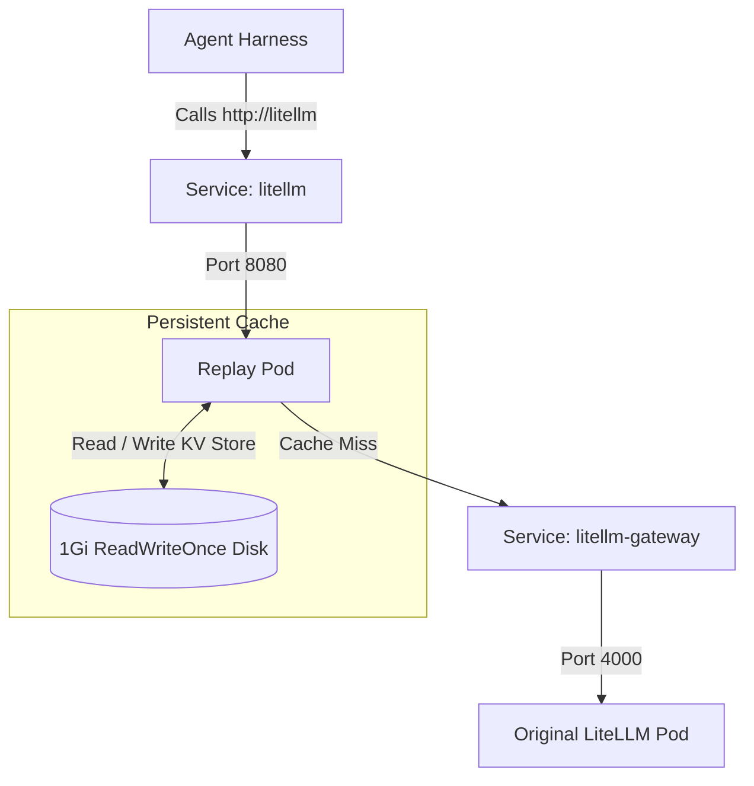

# Inference Replay Proxy

## This directory contains an example of deploying a Inference Replay proxy. It intercepts traffic destined for your primary LLM gateway (`litellm`), serves instant repeated responses from a local Persistent Disk (PVC), and forwards cache misses to the real LLM gateway automatically.

## Architecture Overview



- **Zero-Configuration Interception**: We re-route the primary `litellm` service address to hit our Replay Proxy pod. Agents require zero configuration changes.
- **Context-Aware Hashing**: Calculates a SHA-256 hash combining the exact **Prompt + Available Kubernetes Skills + Target Model**.
- **Permanent Lazy-Caching**: Trajectories are permanently captured directly onto a Google Cloud Persistent Disk (`/data/replay_cache.json`).
- **Runtime Togglable**: A `ConfigMap`-backed mode flag flips caching on/off without a pod restart.

---

## Modes

The proxy reads its current mode from a file mounted from the `inference-replay-config` ConfigMap. Changes are hot-reloaded within ~1 second; no pod restart required.

| Mode  | Behavior                                                                             |
| ----- | ------------------------------------------------------------------------------------ |
| `off` | Pure pass-through. No cache reads, no cache writes. Proxy is invisible. (default)    |
| `on`  | Serve cached responses on hit; on miss, forward to upstream and record the response. |

The cache file on the PVC is untouched when you flip modes — switching `on → off → on` resumes from the same cache.

---

## Deployment Instructions

Follow these steps to build, deploy, and verify the standalone replay proxy in your cluster.

### Step 1: Build and Push the Proxy Image

Run these commands from your local workstation (replace `<YOUR-REGISTRY>` with your container registry path, e.g., `us-central1-docker.pkg.dev/<YOUR-DEV-PROJECT>/inference-replay` for GCP Artifact Registry):

```bash
# 1. Authenticate Docker to your registry (e.g., for GCP Artifact Registry):
gcloud auth configure-docker us-central1-docker.pkg.dev
# 2. Build the proxy container image
docker build -t <YOUR-REGISTRY>/replay-proxy:latest replay-proxy
# 3. Push the image to your registry
docker push <YOUR-REGISTRY>/replay-proxy:latest
```

---

### Step 2: Update the Image Tag in `deployment.yaml`

Open `deployment.yaml` and update the `image` field under `replay-proxy-container` to match your newly pushed image path:

```yaml
containers:
  - name: replay-proxy-container
    # Change this line to point to your registry:
    image: <YOUR-REGISTRY>/replay-proxy:latest
    imagePullPolicy: Always
```

---

### Step 3: Apply the Manifests to the Cluster

Deploy the persistent volume, gateway routing, and standalone proxy in the `kubeagents-system` namespace:

```bash
cd examples/inference-replay
# 1. Provision the 1Gi Persistent Disk (PVC)
kubectl apply -f pvc.yaml
# 2. Create the mode ConfigMap (defaults to 'off' — pure pass-through)
kubectl apply -f configmap.yaml
# 3. Expose the original LiteLLM pods under the new name 'litellm-gateway'
kubectl apply -f service-gateway.yaml
# 4. Deploy the Standalone Replay Proxy pod
kubectl apply -f deployment.yaml
# 5. Intercept primary 'litellm' traffic to route to the Proxy
kubectl apply -f service.yaml
```

Verify that the standalone proxy transitions successfully to **`Running`**:

```bash
kubectl get pods -n kubeagents-system -l app=standalone-replay
```

---

## Verification & Testing

### 1. Start an Explicit Port-Forward

Forward local port `8080` directly to the running standalone replay deployment:

```bash
# Kill any broken background forwarding jobs
pkill -f "port-forward"
# Forward explicitly to the Standalone Replay deployment
kubectl port-forward deployment/standalone-replay 8080:8080 -n kubeagents-system &
```

### 2. Execute a Test Call (Recording Miss)

Run this `curl` command. The first run forwards to Gemini and captures the golden response to disk:

```bash
curl -X POST http://localhost:8080/v1/chat/completions \
  -H "Content-Type: application/json" \
  -d '{
    "model": "gemini-model",
    "messages": [{"role": "user", "content": "Explain quantum computing in one sentence."}]
  }'
```

### 3. Verify the Cache Contents

Inspect the formatted JSON Key/Value store saved directly on your persistent disk:

```bash
POD_NAME=$(kubectl get pods -n kubeagents-system -l app=standalone-replay -o jsonpath='{.items[0].metadata.name}')
kubectl exec -n kubeagents-system $POD_NAME -- cat /data/replay_cache.json | jq .
```

### 4. Observe the Instant Replay Hit

Execute the exact same `curl` command a second time. It will complete near-instantaneously (<10ms) with **zero Gemini API calls**, serving entirely from your persistent volume!

---

## Toggling Replay

The proxy is always in the traffic path once deployed. To enable caching or return to pure pass-through, patch the ConfigMap — the proxy hot-reloads within ~1s, no pod restart.

### Turn caching on

```bash
kubectl patch configmap inference-replay-config -n kubeagents-system \
  --type merge -p '{"data":{"mode":"on"}}'
```

### Turn caching off (pure pass-through)

```bash
kubectl patch configmap inference-replay-config -n kubeagents-system \
  --type merge -p '{"data":{"mode":"off"}}'
```

### Check current mode

```bash
# From inside the cluster (or via port-forward):
curl http://localhost:8080/admin/mode
# → {"mode":"on","cache_size":42,"valid_modes":["off","on"]}
```

Or read the ConfigMap directly:

```bash
kubectl get configmap inference-replay-config -n kubeagents-system -o jsonpath='{.data.mode}'
```

### Typical workflow

```bash
# Start a recording session
kubectl patch configmap inference-replay-config -n kubeagents-system \
  --type merge -p '{"data":{"mode":"on"}}'

# ...exercise your agents; cache fills up...

# Return to live traffic (cache stays on disk, untouched)
kubectl patch configmap inference-replay-config -n kubeagents-system \
  --type merge -p '{"data":{"mode":"off"}}'
```
