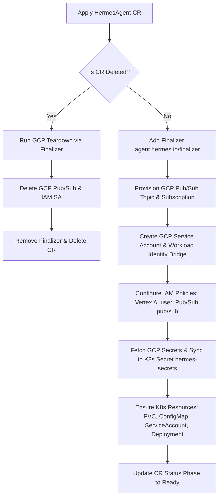

# 🤖 Hermes Operator-based GKE Deployment (`crd`)

This module provides a declarative, **operator-based** approach to provisioning, deploying, and managing the **Hermes Chat Bot Agent** on Google Kubernetes Engine (GKE) Autopilot. 

Instead of relying on local, imperative bash scripts to configure GCP infrastructure and Kubernetes resources, this module leverages a custom Kubernetes Controller (**`hermes-operator`**) and a Custom Resource Definition (**`HermesAgent`**). The operator continuously reconciles the state of your deployment to match your desired configuration.

---


## 📂 Directory Structure

```bash
integrations/gchat/crd/
├── provision.sh           # Idempotent, interactive setup to provision GKE, APIs, secrets, build agent, operator, and custom resource
├── teardown.sh            # Idempotent, interactive cleanup to tear down all GKE, operator, and GCP resources in reverse
├── hermes-operator/       # Go-based Kubernetes Operator project (Kubebuilder-scaffolded)
    ├── api/v1alpha1/      # Custom Resource Definition (CRD) Spec types
    ├── internal/          # Controller reconciliation logic
    ├── config/            # Kustomize configurations for installing the CRD and deploying the operator
    ├── Dockerfile         # Containerizes the operator manager
    └── Makefile           # Standard targets for building, testing, and deploying the operator
```

---

## ⚙️ The Reconciliation Lifecycle

When you apply a `HermesAgent` Custom Resource, the `HermesAgentReconciler` running inside the operator automatically runs through the following steps to ensure your desired state is achieved:



1. **Finalizer Registration**: Registers `agent.hermes.io/finalizer` on the CR to prevent deletion until external GCP resources are safely cleaned up.
2. **GCP Pub/Sub Provisioning**: Automatically creates the target GCP Pub/Sub Topic and Subscription for Google Chat events if they do not already exist.
3. **Identity & Access (Workload Identity)**:
   * Creates a GCP Service Account (GSA) for the bot.
   * Binds the GSA to the Kubernetes Service Account (KSA) using Workload Identity (`roles/iam.workloadIdentityUser`).
   * Binds GCP IAM role `roles/aiplatform.user` to the GSA to enable native, keyless Vertex AI/Gemini API access.
   * Grants the GSA subscriber access to the Pub/Sub subscription and publishes rights for Google Chat systems on the Pub/Sub topic.
4. **Secret Synchronization**: Resolves the latest active versions of `GCP_API_KEY` and `GEMINI_API_KEY` from GCP Secret Manager and populates them into a local Kubernetes Secret `hermes-secrets` mapped directly to the pod environment.
5. **Workload Deployment**: Deploys the standard Kubernetes workloads (ConfigMap `hermes-config`, PVC `hermes-data`, ServiceAccount, and the Deployment `hermes-gateway` container).

---

## 🚀 Getting Started

### ⚡ Quickstart: Interactive Provisioner

The easiest way to get started is using the interactive `provision.sh` script. It automates GKE cluster setup, enables APIs, creates Artifact Registry, generates keys in Secret Manager, builds the agent container, builds and deploys the controller operator, and provisions a live `HermesAgent` custom resource!

#### 1. Start the Provisioner
Run the provisioner from the `crd` directory:
```bash
cd integrations/gchat/crd
./provision.sh
```

The script will ask you for:
* Target GCP Project ID
* Target GKE GCP Region (default: `us-central1`)
* GKE Cluster Name (default: `platform-agent-host`)
* Target Namespace (default: `agent-system`)
* Allowed Google Chat User Email

#### 2. Verify Operator & Workload Rollout
Once the script completes, check that the operator and gateway are rolling out:
```bash
kubectl get deployments -n hermes-operator-system
kubectl get pods -n agent-system
```

You can track the reconciliation phase of your `HermesAgent` custom resource:
```bash
kubectl get hermesagent platform-agent -n agent-system
```

#### 3. Populate API Secrets (Optional but Recommended)
If you chose not to supply your Gemini API key during the interactive setup, you should edit the GCP Secret Manager secrets `GCP_API_KEY` and `GEMINI_API_KEY` in the Google Cloud Console with your live keys.

---

## 🔌 Access and Administration

### 1. Access the Local Dashboard
Port-forward the dashboard to your local machine:
```bash
kubectl port-forward -n agent-system deployment/platform-agent-gateway 9119:9119
```
Open your browser and navigate to `http://localhost:9119` to view the Hermes Visual Dashboard.

### 2. Approve Google Chat Integrations
To approve a pairing code and complete Google Chat setup:
```bash
kubectl exec -it deploy/platform-agent-gateway -n agent-system -c hermes -- hermes pairing approve google_chat <PAIRING_CODE>
```

---

## 🧹 Clean Up & Teardown

The `teardown.sh` script deletes the custom resource (triggering Config Connector to clean up GSA, Pub/Sub, and IAM policies), undeploys the Operator, removes KCC configurations, destroys the Secret Manager secrets, removes the Artifact Registry repository, and tears down the GKE cluster.

Run the teardown script from the `crd` directory:
```bash
cd integrations/gchat/crd
./teardown.sh
```
