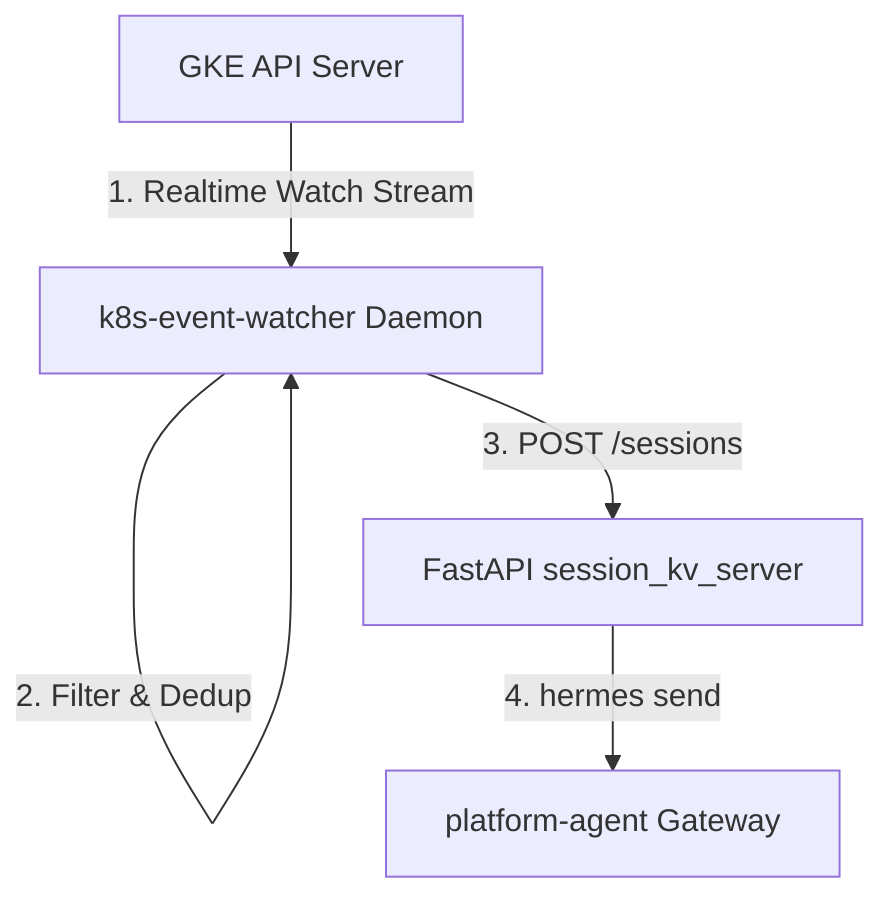

# Design Proposal: GKE Event Watcher Integration

## 1. Objective
Enable the Platform Agent (`kube-agents`) to autonomously troubleshoot cluster health failures in real-time by streaming, filtering, and deduplicating Kubernetes warning events.

---

## 2. Proposed Architecture

We propose integrating the Go-based `k8s-event-watcher` service as a **background process** inside the primary `platform-agent` container.



1. **Watch Stream:** The watcher daemon connects to the GKE control plane API Server and streams warnings (`core/v1.Event`) in real-time.
2. **Filter & Dedup:** It drops noise, filters events by allowlisted reasons, and groups occurrences of pod crash families (e.g. `ErrImagePull` -> `ImagePullBackOff`) within a 5-minute rolling window.
3. **Local REST Bridge:** When a new failure family triggers, the watcher daemon POSTs to the local FastAPI helper server `session_kv_server.py` (`http://localhost:8699`).
4. **Hermes Alert:** The FastAPI server executes the local `hermes` CLI to kick off a new agent troubleshooting session.

---

## 3. Iterative Task Breakdown & Verification

To allow progressive reviews and testing, the implementation is divided into four standalone steps:

### Task 1: Check in the Go Watcher Code
* **Action:** Merge Go source files (with OpenTelemetry dependencies stripped out) into `k8s-operator/cmd/k8s-event-watcher/`.
* **Verification:** Compile and run locally in dry-run mode against your current kubectl context:
  ```bash
  cd k8s-operator/cmd/k8s-event-watcher && go build -o watcher .
  ./watcher --dry-run --cluster-name=dev-cluster
  ```

### Task 2: Extend FastAPI Proxy Endpoints
* **Action:** Implement `/sessions` and `/sessions/{session_id}/inject` endpoints inside `session_kv_server.py`.
* **Verification:** Mock incoming alerts using local `curl` posts to the FastAPI listener port.

### Task 3: Add Multi-Stage Compilation to Primary Dockerfile
* **Action:** Update the main `Dockerfile` to compile the Go watcher binary and place it in the defaults scripts directory `/opt/defaults/scripts/k8s-event-watcher`.
* **Verification:** Build the agent image:
  ```bash
  make dev-rebuild-agent ARGS="platform --local"
  ```
  Verify the image is generated with the compiled binary inside the scripts folder.

### Task 4: Configure Entrypoint Startup
* **Action:** Configure both the FastAPI proxy and the Go watcher to start in the background on container boot in `deploy/shared/docker-entrypoint.sh`.
* **Verification:** Rebuild and redeploy. Run `ps aux` inside the container and verify both background processes are active. Trigger a test event and check that a session is created and GChat alert sent.
