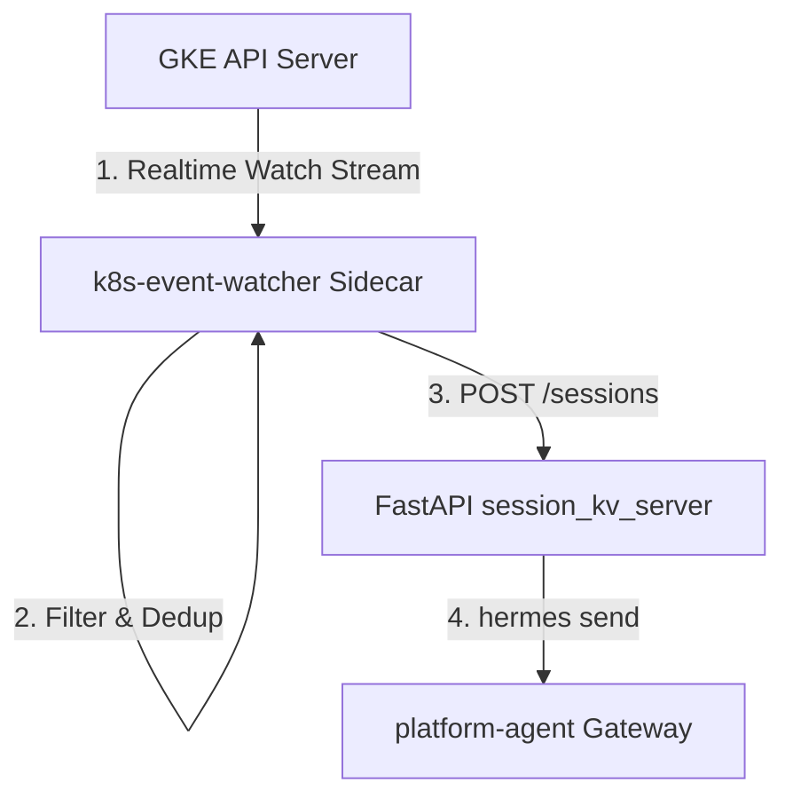

# Kubernetes Event Watcher Service

The `k8s-event-watcher` is a lightweight Go background service designed to stream, filter, and deduplicate GKE warning events in real-time, forwarding actionable alerts to the Platform Agent for autonomous incident triage.

---

## 1. Architecture & Flow

The watcher service is deployed as a **sidecar container** next to the `platform-agent-gateway` container in GKE:



1. **Real-time Event Watcher:** Tracks warnings (`core/v1.Event`) via a client-go informer stream targeting the GKE control plane API.
2. **Local REST API Bridge:** When a new unique incident triggers, the watcher issues an HTTP `POST` containing the event details to the local session server (`http://localhost:8699/sessions`).
3. **Session Ingestion:** The session server executes the local `hermes` command-line utility, which triggers a new autonomous agent diagnostic session.

---

## 2. Filtering Mechanism

To prevent noise and API token exhaustion, incoming events are evaluated sequentially:

1. **Reason Matching:** Only events matching allowed warning reasons (defaults to 12 critical failure types like `OOMKilled`, `CrashLoopBackOff`, `FailedScheduling`, and `Evicted`) are processed.
2. **Namespace Denylist:** Any event originating from namespaces in the exclude list (e.g. `kube-system`) is immediately dropped. **Deny rules take absolute precedence.**
3. **Namespace Allowlist:** Restricts monitoring to specified namespaces. If empty, all non-excluded namespaces are watched.
4. **Flapping Probe Protection:** Probe warning events (Reason: `Unhealthy`) are ignored until they repeat at least **3 consecutive times** (`Event.Count >= 3`), preventing false alerts during rolling updates or slow restarts.

---

## 3. Deduplication & Caching

The watcher runs a thread-safe **in-memory rolling-window cache** to suppress duplicate alerts for the same underlying failure:

### Deduplication Logic

- **Canonical Reason Grouping:** Event reasons in the same failure family collapse into a single incident key (e.g., `ErrImagePull` and `ImagePullBackOff` for the same pod group into one active incident, preventing parallel troubleshooting sessions).
- **Replay Shielding:** Informer watch-connection rotations (which occur every 15–25 minutes) force client-go to re-list active events. The watcher checks the event's `LastTimestamp` to distinguish duplicates from actual new incidents, preventing duplicate alerts on connection reset.
- **Incident Retry safety:** If a warning continues to repeat after the rolling window duration (configured by `--dedup-window`, defaults to 24h in production), it is classified as a new incident to give the agent another attempt at troubleshooting.

### Memory & Persistence Guards

- **LRU Eviction (OOM Guard):** Cache memory is capped at a maximum of **10,000 active entries**. If the limit is reached, the oldest (least recently active) entry is evicted to ensure the sidecar memory footprint remains bounded.
- **On-Disk Snapshots:** At graceful shutdown and periodically during runtime (every 30 seconds), the cache is serialized to a JSON file (specified by `--dedup-persist`).
- **Atomic File Updates:** Snapshots are written to a temporary `.tmp` file and renamed atomically to ensure the persist file is never corrupted if the pod crashes.

---

## 4. Multi-Cluster Deployment

The service utilizes a **decentralized topology** to monitor multiple GKE clusters:

- **Local Watcher Pods:** One watcher instance is deployed in each managed GKE target cluster.
- **Tagging:** Every instance runs with a unique `--cluster-name` flag (e.g., `production-us-east1`).
- **Unified Forwarding:** All distributed watchers stream events back to the central Platform Agent Host gateway URL (`--daemon-url`). This keeps the target cluster footprints lightweight and secure, avoiding the need to share GKE cluster credentials across security zones.

---

## 5. Configuration & Operations (Background Daemon Mode)

Even when running as a co-packaged background service inside the `platform-agent` container, the event watcher can be configured and monitored directly by customers.

### Environment Variable Customization

Customers can customize the watcher's behavior by passing the following environment variables under `spec.deployment.env` in their `PlatformAgent` Custom Resource:

| Environment Variable                | CLI Flag Equivalent     | Default Value                                                                                                                                                    | Description                                                              |
| ----------------------------------- | ----------------------- | ---------------------------------------------------------------------------------------------------------------------------------------------------------------- | ------------------------------------------------------------------------ |
| `EVENT_WATCHER_REASONS`             | `--reason`              | `CrashLoopBackOff,ImagePullBackOff,ErrImagePull,OOMKilled,FailedMount,FailedScheduling,BackOff,Unhealthy,NetworkNotReady,NodeNotReady,Evicted,FailedToDrainNode` | Comma-separated allow-list of event reasons to monitor.                  |
| `EVENT_WATCHER_EXCLUDE_NAMESPACES`  | `--exclude-namespace`   | `kube-system`                                                                                                                                                    | Comma-separated deny-list of namespaces to ignore.                       |
| `EVENT_WATCHER_DEDUP_WINDOW`        | `--dedup-window`        | `24h`                                                                                                                                                            | Rolling window duration to suppress duplicate incident alerts.           |
| `EVENT_WATCHER_UNHEALTHY_MIN_COUNT` | `--unhealthy-min-count` | `3`                                                                                                                                                              | Number of consecutive `Unhealthy` probe warnings required before firing. |
| `EVENT_WATCHER_METRICS_ADDR`        | `--metrics-addr`        | `""` (Disabled)                                                                                                                                                  | TCP address (`host:port`) to expose metrics and liveness health checks.  |

### Exposing Metrics & Health Checks

To enable scraping metrics and liveness probes in your target environment:

1. Configure `EVENT_WATCHER_METRICS_ADDR` to bind to a port (e.g. `:8080`):
   ```yaml
   spec:
     deployment:
       env:
         - name: EVENT_WATCHER_METRICS_ADDR
           value: ":8080"
   ```
2. The watcher will expose the following standard endpoints:
   - **Prometheus Metrics:** `GET http://<pod-ip>:8080/metrics`
   - **Liveness Probe:** `GET http://<pod-ip>:8080/healthz` (Returns HTTP 200 `ok`)

These metrics can be scraped by Google Cloud Managed Service for Prometheus (GMP) or a standard Prometheus server to monitor watcher health and event filtering throughput.
