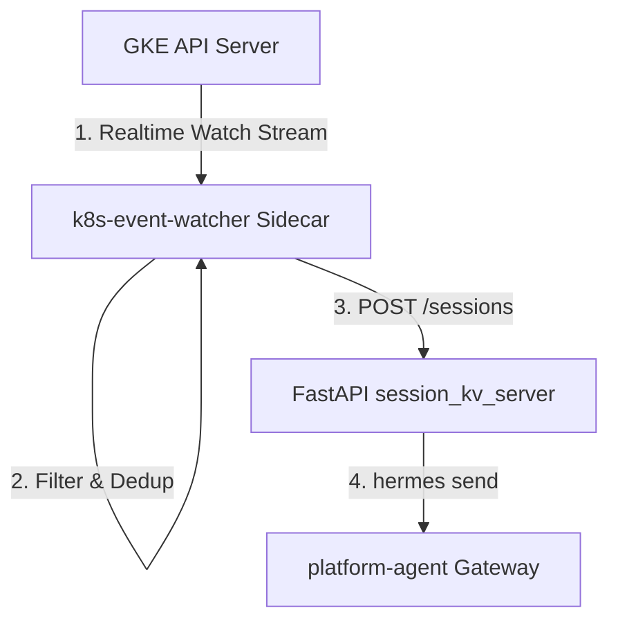

# Kubernetes Event Watcher Service

## 1. Objective
Enable the Platform Agent (`kube-agents`) to autonomously troubleshoot GKE cluster health failures in real-time by streaming, filtering, and deduplicating Kubernetes warning events.

---

## 2. Architecture & Flow

The `k8s-event-watcher` service is deployed as a **sidecar container** inside the `platform-agent` Pod.

1. **Real-time Event Watcher:** The watcher connects to the GKE control plane API Server and streams warnings (`core/v1.Event`) in real-time using client-go watchers.
2. **Filtering Allow-lists:** It filters events by allowlisted warning reasons (e.g. `CrashLoopBackOff`, `FailedScheduling`, `FailedMount`, `OOMKilled`) and suppresses noise from non-essential events.
3. **Smart Deduplication:** It deduplicates events and groups related failures (e.g. `ErrImagePull` and `ImagePullBackOff` for the same pod collapse into a single unified incident key) using a configurable rolling window.
4. **Local REST API Bridge:** When a new failure family triggers, the sidecar POSTs the event metadata to the local gateway server `session_kv_server.py` (`http://localhost:8699`), which spawns a new troubleshooting session.

