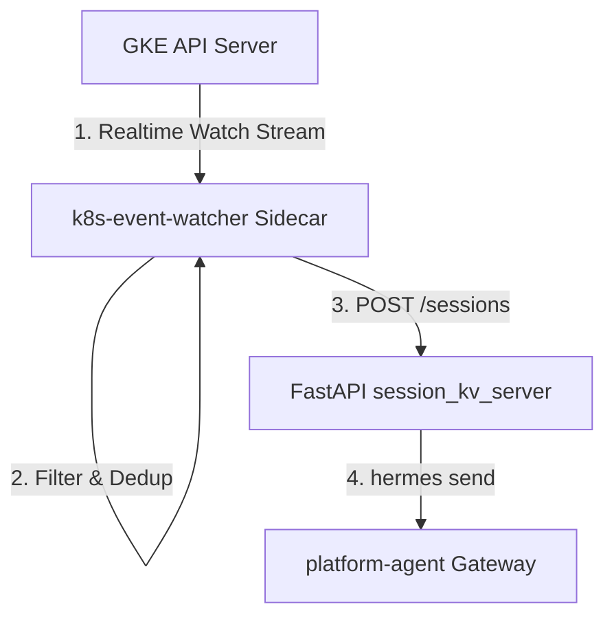

# Design Proposal: GKE Event Watcher Integration

## 1. Objective

Enable the Platform Agent (`kube-agents`) to autonomously troubleshoot cluster health failures in real-time by streaming, filtering, and deduplicating Kubernetes warning events.

---

## 2. Proposed Architecture

We propose integrating a Go-based `k8s-event-watcher` service as a **sidecar container** inside the `platform-agent` Pod.



1. **Watch Stream:** The watcher container connects to GKE control plane API Server and streams warnings (`core/v1.Event`) in real-time.
2. **Filter & Dedup:** It drops noise, filters events by allowlisted reasons, and groups occurrences of pod crash families (e.g. `ErrImagePull` -> `ImagePullBackOff`) within a 5-minute rolling window.
3. **Local REST Bridge:** When a new failure family triggers, the sidecar POSTs to the local helper server `session_kv_server.py` (`http://localhost:8699`).
4. **Hermes Alert:** The FastAPI server executes the local `hermes` CLI to kick off a new agent troubleshooting session.

---

## 3. Iterative Task Breakdown & Verification

To allow progressive reviews and testing, the implementation is divided into four standalone steps:

### Task 1: Check in the Go Watcher Code

- **Action:** Merge Go source files (with OpenTelemetry dependencies stripped out) into `k8s-operator/cmd/k8s-event-watcher/`.
- **Verification:** Compile and run locally in dry-run mode against your current kubectl context:
  ```bash
  cd k8s-operator/cmd/k8s-event-watcher && go build -o watcher .
  ./watcher --dry-run --cluster-name=dev-cluster
  ```

### Task 2: Extend FastAPI Proxy Endpoints

- **Action:** Implement `/sessions` and `/sessions/{session_id}/inject` endpoints inside `session_kv_server.py`.
- **Verification:** Mock incoming alerts using local `curl` posts to the FastAPI listener port.

### Task 3: Containerize the Watcher

- **Action:** Add a multi-stage `Dockerfile.watcher` to package the compiled static binary into a scratch container.
- **Verification:** Run `docker build -f deploy/docker/Dockerfile.watcher -t k8s-event-watcher:latest .`

### Task 4: Deploy the Sidecar

- **Action:** Define the sidecar container and volume mount inside `platform-agent.yaml.template` using the CRD's native `spec.deployment.sidecars` field.
- **Verification:** Deploy and ensure the platform agent pod runs with 3 active containers (`platform-agent`, `fluent-bit`, `k8s-event-watcher`).
