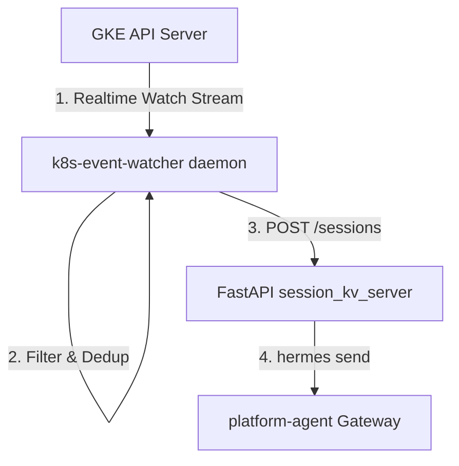

# Kubernetes Event Watcher Service

The `k8s-event-watcher` is a lightweight Go background service designed to stream, filter, and deduplicate GKE warning events in real-time, forwarding actionable alerts to the Platform Agent for autonomous incident triage.

---

## 1. Architecture & Flow

The watcher service is deployed as a **background daemon process** running inside the `platform-agent` container:


```mermaid
graph TD
    API[GKE API Server] -->|1. Realtime Watch Stream| Watcher[k8s-event-watcher daemon]
    Watcher -->|2. Filter & Dedup| Watcher
    Watcher -->|3. POST /sessions| Proxy[FastAPI session_kv_server]
    Proxy -->|4. hermes send| Agent[platform-agent Gateway]
```

1. **Real-time Event Watcher:** Tracks warnings (`core/v1.Event`) via a client-go informer stream targeting the GKE control plane API. With `--profiles-dir` it opens one such stream per watched cluster (see Section 4), all feeding the same local bridge.
2. **Local REST API Bridge:** When a new unique incident triggers, the watcher issues an HTTP `POST` containing the event details to the local session server (`http://localhost:8699/sessions`).
3. **Session Ingestion:** The session server executes the local `hermes` command-line utility, which triggers a new autonomous agent diagnostic session.

---

## 2. Filtering Mechanism

To prevent noise and API token exhaustion, incoming events are evaluated sequentially:

1. **Reason Matching:** Only events matching allowed warning reasons are processed. With `--reason` unset this is the built-in list of 11 (`defaultReasons` in `filter.go` — `OOMKilled`, `CrashLoopBackOff`, `FailedScheduling`, `Evicted` and so on), but a deployed install does not use it: the operator passes its own list of 7.
2. **Namespace Denylist:** Any event originating from a namespace in `--exclude-namespace` is immediately dropped. **Deny rules take absolute precedence.** The list is **empty by default and the operator sets nothing**, so as shipped nothing is excluded — including `kube-system`, whose events are triaged like any other.
3. **Namespace Allowlist:** Restricts monitoring to specified namespaces. If empty, all non-excluded namespaces are watched.
4. **Flapping Probe Protection:** Probe warning events (Reason: `Unhealthy`) are ignored until they repeat at least **3 consecutive times** (`Event.Count >= 3`), preventing false alerts during rolling updates or slow restarts.

---

## 3. Deduplication & Caching

The watcher runs a thread-safe **in-memory rolling-window cache** to suppress duplicate alerts for the same underlying failure. In multi-cluster mode there is **one cache per watched cluster**, so a noisy cluster cannot evict another cluster's active incidents and cause it to re-alert:

### Deduplication Logic

- **Canonical Reason Grouping:** Event reasons in the same failure family collapse into a single incident key (e.g., `ErrImagePull` and `ImagePullBackOff` for the same pod group into one active incident, preventing parallel troubleshooting sessions).
- **Replay Shielding:** Informer watch-connection rotations (which occur every 15–25 minutes) force client-go to re-list active events. The watcher checks the event's `LastTimestamp` to distinguish duplicates from actual new incidents, preventing duplicate alerts on connection reset.
- **Incident Retry safety:** If a warning continues to repeat after the rolling window duration (configured by `--dedup-window`, default `5m` — and the operator passes no override, so `5m` is what runs in a deployed install), it is classified as a new incident to give the agent another attempt at troubleshooting.

### Memory & Persistence Guards

- **LRU Eviction (OOM Guard):** Each cache is capped at a maximum of **10,000 active entries**. If the limit is reached, the oldest (least recently active) entry is evicted to keep the sidecar memory footprint bounded. Note this cap is **per cluster**, so the fleet-wide ceiling scales with the number of watched clusters.
- **On-Disk Snapshots:** At graceful shutdown and periodically during runtime (every 30 seconds), each cache is serialized to its own JSON file. `--dedup-persist` gives the base path and each cluster gets a suffixed file, since the caches cannot all write to one file. The suffix is the **profile directory name**, not the cluster name (`dedup.json` → `dedup-cluster-myproj-prod-us-central1.json`): two clusters can share a name across locations, and they must not share a snapshot.
- **Atomic File Updates:** Snapshots are written to a temporary `.tmp` file and renamed atomically to ensure the persist file is never corrupted if the pod crashes.

---

## 4. Configuration & Operations

When executing the `k8s-event-watcher` service binary directly, the following command-line flags are available for configuration:

| CLI Flag                | Default Value                           | Description                                                                                                                                                                                                                                                                                                                                  |
| ----------------------- | --------------------------------------- | -------------------------------------------------------------------------------------------------------------------------------------------------------------------------------------------------------------------------------------------------------------------------------------------------------------------------------------------- |
| `--cluster-name`        | `""` (required unless `--profiles-dir`) | The cluster name tagged on every alert payload and metric series. Required in single-cluster mode; with `--profiles-dir` each cluster is named by its own `cluster_identity`, so it is needed only to name an additional `--in-cluster` / `--kubeconfig` cluster.                                                                            |
| `--reason`              | `""` → the 11 built-in reasons          | Comma-separated list of event reasons to monitor. Empty falls back to `defaultReasons` in `filter.go`. Note the operator passes its own list of 7, so the built-in set is not what runs in a deployed install.                                                                                                                               |
| `--exclude-namespace`   | `""` (nothing excluded)                 | Comma-separated list of namespaces to ignore. There is **no** built-in denylist — `kube-system` is only excluded if you pass it, and the operator does not.                                                                                                                                                                                  |
| `--dedup-window`        | `5m`                                    | Time window to suppress repeating event alerts.                                                                                                                                                                                                                                                                                              |
| `--unhealthy-min-count` | `3`                                     | Consecutive count threshold for Unhealthy probe warnings.                                                                                                                                                                                                                                                                                    |
| `--metrics-addr`        | `""` (Disabled)                         | TCP address (`host:port`) to expose Prometheus metrics and `/healthz` check endpoints.                                                                                                                                                                                                                                                       |
| `--daemon-url`          | `""` (required unless `--dry-run`)      | The central Platform Agent Host troubleshooting gateway endpoint. There is no default; startup fails without it.                                                                                                                                                                                                                             |
| `--profiles-dir`        | `""` (single-cluster mode)              | Hermes profiles directory, normally `/opt/data/profiles`. Every Cluster Agent profile found is added to the watch set, using that profile's own `kubeconfig.yaml` and `cluster_identity`. Combines with `--in-cluster` / `--kubeconfig` to also watch one directly-reachable cluster; that combination requires `--cluster-name` to name it. |

### Running the Binary Directly

Before running any of the verification options below, navigate to the watcher directory from the repository root and compile the Go binary:

```bash
cd k8s-operator/cmd/k8s-event-watcher
go build -o k8s-event-watcher .
```

You can then run the compiled binary locally on your workstation against any Kubernetes cluster configured in your `~/.kube/config`.

#### Option A: Standalone Verification (`--dry-run`)

To verify event streaming, filtering, and JSON payload formatting without connecting to a backend server:

```bash
./k8s-event-watcher \
  --cluster-name="local-test-cluster" \
  --dry-run
```

#### Option B: Live Verification via Port-Forwarding (Recommended)

To test the full autonomous triage loop against a live Platform Agent in Kubernetes without running Python servers locally:

1. Port-forward the session bridge from your platform agent host cluster:

   ```bash
   kubectl -n kubeagents-system port-forward deployment/platform-agent-gateway 8699:8699
   ```

2. Run the watcher with live-mode flags (`--token-env` and `--owner` are required in per-incident mode when not using `--dry-run`):

   ```bash
   export DUMMY_TOKEN="test-token"
   ./k8s-event-watcher \
     --cluster-name="local-test-cluster" \
     --daemon-url="http://127.0.0.1:8699" \
     --token-env="DUMMY_TOKEN" \
     --owner="k8s-watcher"
   ```

#### Option C: Multi-Cluster Fan-In (`--profiles-dir`)

To watch every managed cluster from a single watcher process, point the watcher at the Hermes profiles directory. The Platform Agent already creates one **Cluster Agent profile** per managed cluster when it is onboarded and deletes it on teardown (see `agents/platform/scripts/cluster_agent_profile.py`), and each profile holds a `kubeconfig.yaml` scoped to that cluster plus a `cluster_identity` block naming it. That directory is therefore the inventory of what to watch — the watcher does not need its own cluster list or its own credentials.

> **The directory is read once, at startup.** It is a snapshot taken at boot, not something the watcher tracks. A cluster onboarded afterwards is not watched until the watcher restarts, and a cluster torn down afterwards leaves its informer retrying against a control plane that no longer exists. Restarting the process — or the Pod — re-reads the directory and reconciles both. Periodic re-scanning is follow-up work, not implemented here.

In a running Platform Agent pod. Note `--in-cluster` alongside `--profiles-dir`: the management cluster deliberately never gets a Cluster Agent profile (`cluster_agent_reconcile.py` excludes it, and prunes one if it appears), but it runs the Platform Agent itself and still has to be watched. Cluster sources are additive, so this watches the host **plus** every profile cluster:

```bash
./k8s-event-watcher \
  --profiles-dir=/opt/data/profiles \
  --in-cluster --cluster-name=platform-agent-host \
  --dry-run
```

For a local run you can hand-build the same layout:

```bash
mkdir -p /tmp/profiles/cluster-a
gcloud container clusters get-credentials cluster-a \
  --location=us-central1 --project=my-proj \
  --dns-endpoint \
  --kubeconfig=/tmp/profiles/cluster-a/kubeconfig.yaml
cat > /tmp/profiles/cluster-a/config.yaml <<'YAML'
cluster_identity:
  project: my-proj
  cluster: cluster-a
  location: us-central1
YAML

./k8s-event-watcher --profiles-dir=/tmp/profiles --dry-run
```

Notes:

- A subdirectory counts as a cluster only if it has **both** a `kubeconfig.yaml` and a `config.yaml` with a complete `cluster_identity`. That is how non-cluster profiles (`default`, `platform`) are skipped, without hardcoding their names.
- The cluster name comes from `cluster_identity.cluster`, not the directory name — profile directory names are sanitized and hash-truncated past 63 characters, so they are lossy.
- **Identity is the whole `project/location/cluster` triple, not the name.** A GKE cluster name is unique only within a project and location, so a fleet can legitimately run `prod` in `us-central1` and `prod` in `europe-west1`; the Platform Agent writes a profile for each. Two profiles are treated as duplicates only when all three match. The triple also labels the metrics and rides along in the inject payload, so the agent can build a `gke_<project>_<location>_<cluster>` context and reach the cluster the event actually came from.
- Each cluster gets its own informer goroutine, its own dedup cache, and its own snapshot file. A noisy cluster cannot evict another's entries.
- **An informer that cannot reach its cluster does not fail — it waits.** `WaitForCacheSync` has no timeout and the reflector retries a failed initial list forever, so an unreachable API server, a bad CA, or a missing `events` list permission leaves that goroutine blocked in the sync poll, emitting `watcher: informer error` repeatedly. It never returns an error, so "the informer is still running" says nothing about whether the cluster is being watched. This is deliberate: a cluster that comes back recovers on its own, with no restart.
- **`k8s_event_watcher_cluster_up{cluster,project,location}` is therefore set after the initial list completes, not when the goroutine starts.** `0` means "not watching this cluster" whether it never synced or has stopped; `1` means events are genuinely flowing. It is the only signal that separates the two, since a stuck informer looks alive from every other angle.
- A cluster whose dedup cache cannot be built (an unreadable snapshot file — corrupt JSON is tolerated and starts fresh) is skipped rather than aborting the run, for the same reason a bad profile is. It never starts an informer, so its `cluster_up` is `0`.
- **The watcher will not sit there watching nothing.** Because individual informers never give up, a process where _nothing_ ever syncs is indistinguishable from a healthy one — goroutines alive, no errors, `exit 0` on SIGTERM. Missing cross-cluster RBAC on first rollout is exactly that state. So there is one bound at the process level: if **no** cluster has synced within two minutes, the run exits non-zero and the supervisor retries. A cluster that syncs late still counts, and partial failure is left alone — one unreachable cluster out of seven is reported by `cluster_up`, not grounds for tearing down the six that work.

**Two metrics, two stages.** `cluster_discovery_errors_total{profile}` covers everything up to building a client; `cluster_up{cluster,project,location}` covers everything after. They fail for different reasons — malformed files on one side, RBAC and unreachable control planes on the other — so a cluster silently dropping out is only observable if you watch both. Alert on `cluster_up == 0` with a `for:` comfortably longer than a healthy initial list — `0` is the normal state during startup, so a short window would fire on every rollout. Alert on `cluster_discovery_errors_total > 0` on the absolute value, not `rate()`: discovery runs once per process, so the counter is set at startup and never moves again.

> **Neither metric is scrapeable in the shipping deploy.** The operator does not pass `--metrics-addr`, so the watcher opens no listener. Until it does, the log lines are the only signal these failures produce.

- A profile that has a kubeconfig but fails to load is **skipped, not fatal** — an unparseable `config.yaml`, an unloadable kubeconfig, or a cluster already claimed by an earlier profile. Making it fatal would be worse than it sounds: discovery runs before the direct cluster is added to the watch set, so one broken profile would stop the watcher monitoring **everything**, including the management cluster. Every skip logs and increments `k8s_event_watcher_cluster_discovery_errors_total{profile}` (see the alerting note below).
- A profiles directory that **does not exist yet is fatal**, deliberately unlike every other discovery failure. It is scaffolded by the `platform-agent` container, so the watcher can legitimately start first — and exiting is what makes that self-healing, because whatever supervises the watcher restarts it and the next attempt succeeds once the directory appears. Starting successfully without it would be permanent: discovery runs once, so the profile clusters would stay unwatched until something else restarted the pod. A few seconds of restarts at boot is the better trade.
- A directory that exists but **cannot be read** (permissions, I/O) is not fatal — a restart will not fix it, so the watcher degrades and counts against `{profile="-"}` rather than crashlooping forever.
- **Profile kubeconfigs are used for the address and CA certificate, not for authentication.** `gcloud container clusters get-credentials` writes them to authenticate by running `gke-gcloud-auth-plugin`, and that binary is deliberately absent from the agent's containers — the image build keeps credential-aware CLIs out, concentrating them in the credential proxy. So when a kubeconfig specifies an `exec` credential, the watcher drops it and attaches a bearer token minted from the pod's own Google identity (Workload Identity) instead. That is the same identity the plugin would have used. Kubeconfigs that authenticate some other way are left untouched.
- Finding **no** profiles is not an error. A single-cluster install legitimately has none, since reconcile only creates profiles for clusters other than the management one. Startup only fails when the combined watch set is empty.
- Cluster sources are additive. `--profiles-dir` contributes the profile clusters; `--in-cluster` or `--kubeconfig` contributes one more. Given together they need `--cluster-name` to name that direct cluster, otherwise it would report an empty cluster label next to properly-named peers.

---

## 5. Integration Roadmap (PR Rollout Plan)

To minimize review overhead and ensure stable integration, the event watcher feature is split into **5 sequential phases**:

1. **PR 1: Core Go Watcher Service (Current PR):** Adds the `k8s-event-watcher` service code, unit tests, and CLI execution configurations.
2. **PR 2: Session Server REST Bridge:** Adds HTTP endpoint extensions to the Platform Gateway session KV server to receive incoming event payloads.
3. **PR 3: Kubernetes Operator Sidecar Injection:** Updates the operator controller logic to automatically inject the watcher configuration and dependencies into Platform Agent deployments.
4. **PR 4: Agent Instructions & Skill Updates:** Updates the Platform Agent's core instructions and skills to safely handle event alerts and triage warnings.
5. **PR 5: Packaging & Docker Containerization:** Updates the container Dockerfiles, entrypoint scripts, installer scripts, and adds the cluster name runtime configuration scripts.
