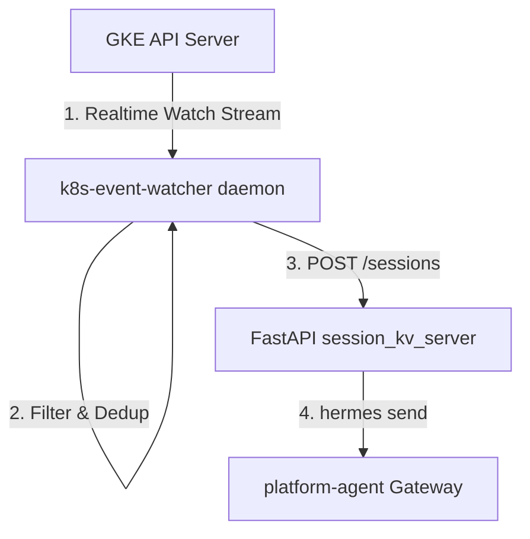

# Kubernetes Event Watcher Service

The `k8s-event-watcher` is a lightweight Go background service designed to stream, filter, and deduplicate GKE warning events in real-time, forwarding actionable alerts to the Platform Agent for autonomous incident triage.

---

## 1. Architecture & Flow

The watcher runs inside the gateway Pod's `agent-api-auth` container, started by that container's entrypoint (`deploy/shared/start-services.sh`) alongside the PlatformAgent API authenticator. Both are what is left of the credential-proxy sidecar after the credential runtime moved into a Pod of its own: the watcher posts to the Session KV server on the gateway's loopback and reads its `--profiles-dir` off the gateway's volume, so it could not move with it. `CREDENTIAL_PROXY_ROLE` is what selects the pair; see the entrypoint. Its flags are set in that entrypoint rather than passed as container arguments, since they describe loopback plumbing inside the container. The per-install values arrive as environment variables instead: the cluster's name as `EVENT_WATCHER_CLUSTER_NAME` and the container's memory limit in bytes as `EVENT_WATCHER_MEMORY_LIMIT_BYTES`, both of which the operator sets on the container (the second through the Downward API from the container's `limits.memory`), and the dedup window, the three debounce thresholds and the scale-up hold as `WATCHER_DEDUP_WINDOW`, `WATCHER_BACKOFF_MIN_COUNT`, `WATCHER_IMAGEPULL_TRANSIENT_MIN_COUNT`, `WATCHER_FAILEDSCHEDULING_MIN_COUNT` and `WATCHER_SCALEUP_HOLD`, which it does not (see Sections 2 and 3). At startup the watcher sets the Go runtime's soft memory limit to half of `EVENT_WATCHER_MEMORY_LIMIT_BYTES`, because the API authenticator shares the container; an explicit `GOMEMLIMIT` takes precedence, and an absent or unparseable value leaves the runtime default, with one log line saying which applied. The entrypoint restarts the watcher if it exits, and deliberately does not let its failure stop Envoy or the credential server:


```mermaid
graph TD
    API[GKE API Server] -->|1. Realtime Watch Stream| Watcher[k8s-event-watcher daemon]
    Watcher -->|2. Filter & Dedup| Watcher
    Watcher -->|3. POST /sessions| Proxy[FastAPI session_kv_server]
    Proxy -->|4. hermes send| Agent[platform-agent Gateway]
```

1. **Real-time Event Watcher:** Tracks warnings (`core/v1.Event`) via a client-go informer stream targeting the GKE control plane API. With `--profiles-dir` it opens one such stream per watched cluster (see Section 4), all feeding the same local bridge.
2. **Local REST API Bridge:** When a new unique incident triggers, the watcher issues an HTTP `POST` containing the event details to the local session server (`http://localhost:8699/sessions`).
3. **Session Ingestion:** The session server executes the local `hermes` command-line utility, which triggers a new autonomous agent diagnostic session.

---

## 2. Filtering Mechanism

To prevent noise and API token exhaustion, incoming events are evaluated sequentially:

1. **Reason Matching:** Only events matching allowed warning reasons are processed. With `--reason` unset this is the built-in list of 11 (`defaultReasons` in `filter.go` — `OOMKilled`, `CrashLoopBackOff`, `FailedScheduling`, `Evicted` and so on), but a deployed install does not use it: the entrypoint passes its own list of 10, of which 8 are forwarded and 2 (`TriggeredScaleUp`, `NotTriggerScaleUp`) are read by rule 7 and never forwarded.
2. **Namespace Denylist:** Any event originating from a namespace in `--exclude-namespace` is immediately dropped. **Deny rules take absolute precedence.** The list is **empty by default and the entrypoint sets nothing**, so as shipped nothing is excluded — including `kube-system`, whose events are triaged like any other.
3. **Namespace Allowlist:** Restricts monitoring to specified namespaces. If empty, all non-excluded namespaces are watched.
4. **Flapping Probe Protection:** Probe warning events (Reason: `Unhealthy`) are ignored until they repeat at least **3 consecutive times** (`Event.Count >= 3`), preventing false alerts during rolling updates or slow restarts. Note the entrypoint's own `--reason` list does not include `Unhealthy`, so this rule is inert in a deployed install.
5. **Crash-Loop Leading-Edge Debounce:** Events in the crash-loop family are held until `Event.Count >= --backoff-min-count` (default **3**). A container that is genuinely crash-looping climbs the count within seconds; a startup race that resolves on its own — an image warming on a fresh Autopilot node, a dependency not yet listening — usually never reaches the threshold, so it no longer opens a session and alerts before the pod recovers. Unlike rule 4 this one **is** live in a deployed install, since the entrypoint's `--reason` list carries both `BackOff` and `CrashLoopBackOff`.
   - The family is matched on the **canonical** reason, not the wire reason. kubelet's repeating crash-loop signal is `Reason=BackOff` (`Back-off restarting failed container …`); `CrashLoopBackOff` is normally a container waiting-state reason rather than an `Event.Reason`. Both are gated.
   - The **image-pull family is not gated here** — including the `Reason=BackOff` events whose message says `Back-off pulling image`, which `canonicalizeReason` splits out of that wire reason. It gets its own rule below, because the reason family alone does not say whether a pull failure will clear.
   - Events whose emitter leaves `Event.Count` at zero **fail open** and fire immediately. These gates only ever delay a signal expected to arrive again, so the cost of firing early is one noisy alert while the cost of holding wrongly is a crash loop nobody hears about.
   - The entrypoint passes this one explicitly, from `WATCHER_BACKOFF_MIN_COUNT` (default `3`), so an install with slow-starting workloads can raise it — or set it to `1` to restore firing on the first event — with `kubectl set env` rather than an image rebuild. Like `WATCHER_DEDUP_DIR`, it is an environment knob only: the operator does not plumb it from the `PlatformAgent` CR.
6. **Transient Image-Pull Debounce:** The image-pull family is split by _why_ the pull failed rather than by reason, because `ImagePullBackOff` covers two opposite incidents. A bad tag will never resolve and must fire immediately; a registry rate limit, a 5xx or a connection timeout clears on kubelet's own retry schedule and looks identical on the wire. Failures classified as **retryable** are held until `Event.Count >= --imagepull-transient-min-count` (default **3**); **terminal** failures and anything the classifier does not recognise still fire on the first event.
   - Classification is substring matching on the error text (`pullfailure.go`), which is not a stable API — kubelet, containerd and each registry word these differently. That is why the gate is **subtractive**: it can only ever delay a failure it positively recognises as self-clearing, so a registry that rewords its quota error goes back to firing immediately rather than being held wrongly. Two guards keep stray text out of it: HTTP statuses are matched with their reason phrase rather than as bare digits (a pull message carries plenty of unrelated numbers, including a 12-digit project number in Artifact Registry's quota error), and the quoted image reference is stripped before matching, so a repository path like `denied-team/app` does not read as an authorization failure.
   - The cause arrives on **one event out of four**. kubelet emits `reason=Failed` carrying the error text, then `Error: ErrImagePull`, `Back-off pulling image "…"` and `Error: ImagePullBackOff` — none of which say why. A per-message decision would hold the first and fire on the second a second later, which is worse than not classifying at all, so the class is remembered per `involvedObject.uid` and inherited by the causeless events that follow. That memo expires after 10 minutes and is capped at 4096 entries per cluster; a terminal verdict supersedes a remembered retryable one, never the reverse.
   - The same memo keeps the **error text**, which the payload reports as `pull_cause`. All four events canonicalize to one dedup key (Section 3) and there is no follow-up inject — bar the one re-open Section 3 describes, when the daemon policy-filtered the event holding the key — so whichever crosses the threshold first is in practice the only one the agent ever reads. In practice that is the cause-bearing event — the causeless ones are re-emitted on the pod-worker sync and only overtake once the backoff interval exceeds it, well past a threshold of 3 — but the ordering is a race, not a guarantee, and raising the threshold tips it. `pull_cause` is additive rather than a rewrite of `message`, so `reason`, `count` and the timestamps still describe one event object, and it is omitted when `message` already carries the cause. Cause text is kept even when the classifier does not recognise it, since that is exactly when it is the only explanation available.
   - The entrypoint passes this from `WATCHER_IMAGEPULL_TRANSIENT_MIN_COUNT` (default `3`), on the same terms as rule 5: environment knob only, `1` disables it.
7. **Unschedulable-Pod Gate:** `FailedScheduling` is the scheduler's normal output during a scale-up as much as the first sign of a stuck pod: a pod that will be running in a minute emits it the moment it is created, and the scheduler retries the pod on every node and pod change while capacity arrives, so the count climbs past any threshold before the node is Ready (measured on Autopilot: count 5 at 14 seconds, node Ready at 49). A repeat count is therefore a delay, not a discriminator, and the gate reads cluster-autoscaler's own verdicts first. The autoscaler records them as events against the pod: `TriggeredScaleUp` when it is adding a node for it, `NotTriggerScaleUp` when it has decided it cannot help (`max node group size reached`, `pod didn't trigger scale-up`). Both are on the entrypoint's `--reason` list so the dispatcher sees them; the filter stops them at `scaleup_mark`, so neither is forwarded, and the dispatcher remembers the latest per `involvedObject.uid` (`scaleup.go`), with the event's own timestamp rather than the arrival time, so a mark replayed by an informer relist does not read as current. A `FailedScheduling` then decides in this order:
   - **Stale:** an event whose last sighting is more than 15 minutes old is held (`failedscheduling_stale`), whatever the count or the marks say. The scheduler retries every unschedulable pod at least every five minutes and each retry bumps the event, so on the core/v1 recorder (GKE's own schedulers, Autopilot included) a pod still pending always has a fresher sighting and a 15-minute-quiet event describes a pod that has scheduled or gone. An `events.k8s.io/v1` recorder (upstream `kube-scheduler`, so GKE Standard) writes a continuing series back to the API server on a 30-minute refresh, so there a stuck pod's sighting can read up to 30 minutes old and this check delays its card to the next refresh rather than the next retry; it never silences it. This is one half of the restart case: the informer's initial list replays every event still inside the API server's TTL, and a `FailedScheduling` whose pod scheduled while the watcher was down arrives with a count past the backstop. The other half is ordering: the list is served in name order, which for one pod is creation order, so that `FailedScheduling` precedes the `TriggeredScaleUp` that held it, and the watcher therefore defers the list's `FailedScheduling` events until the list has completed and every mark it carried is on record (`watcher.go`, `flushReplay`). Together they cover a pod that scheduled at any point before the restart: the hold below is aged from the mark to the event's own last sighting rather than to the clock, so a replayed event sighted while its scale-up was in progress is held however long ago that scale-up triggered, and an event sighted more than 15 minutes ago is held here. What neither covers is a scale-up that took longer than the hold and scheduled less than 15 minutes ago, which fires on the count as it would have live. An event with no timestamp at all fails open, as an event with no count does.
   - **Declined:** a `NotTriggerScaleUp` on the pod passes the event at any count. The autoscaler has ruled it cannot help, and waiting for more repeats only delays the incident. The card opens on the scheduler's next retry after the verdict, not on the verdict itself — up to five minutes later.
   - **Scale-up in progress:** a `TriggeredScaleUp` recorded within `--scaleup-hold` (default **15m**, cluster-autoscaler's default node-provision timeout) of the event's last sighting holds the event at any count (`scaleup_hold`). A later `NotTriggerScaleUp` releases it sooner; past the hold the count applies again, so a scale-up the autoscaler never delivers does not silence the pod. The hold is measured to the event's own sighting and not to the clock because the two part company after a restart: the scheduler stops re-emitting the event when the pod schedules, so a replayed event's sighting stays fixed at the end of its scale-up while the clock moves on, and a mark aged by the clock would expire 15 minutes after the scale-up triggered while the sighting stayed under the staleness check for as long again as the scale-up took. For a live event the sighting is the present and the two readings agree, so a pod still pending past the hold is sighted again with a fresh timestamp and falls through to the count. The mark is remembered for the dedup window and never less than the hold plus the staleness check's 15 minutes, so a `--dedup-window` shorter than that (the binary's own 5m default) does not cut the hold short. This is a ceiling on the hold, not a settle timer: a live event is never delayed by wall-clock time, only by what the autoscaler said or by how often the scheduler has repeated it.
   - **Count backstop:** with no verdict on record — a cluster without cluster-autoscaler, or a pod it has not evaluated yet — the event is held until the pod's failed attempts reach `--failedscheduling-min-count` (default **5**, `failedscheduling_min_count`). The attempts are `Event.Count` summed across the pod's `FailedScheduling` event objects (`attempts.go`), because both recorders key an object on its message: every time the scheduler's text changes (`0/3 nodes are available: 3 Insufficient cpu` becoming `0/4 nodes ...`) the API server gets a new object whose count starts again at one, and a pod whose message shifts every few retries would never reach the threshold on any one object. That is five failed scheduling attempts, not a time: the scheduler retries on every cluster change and at least every five minutes, so the count climbs within seconds while nodes join (the measurement above) and every few minutes on a quiet cluster. On a cluster with an autoscaler the verdict arrives seconds after the first attempt, so the backstop covers the gap before it and the pods the autoscaler never rules on; on a cluster without one, a pod that has failed five attempts is stuck unless capacity frees on its own. Zero fails open as in rules 5 and 6.
   - The two marks are admitted by the same reason and namespace rules as everything else, so a mark from an excluded namespace is not recorded, and dropping `TriggeredScaleUp` from `--reason` is how to switch the hold off. The memo keeps a verdict for the dedup window and is capped at 4096 entries per cluster. Dedup (Section 3) keys on `(uid, FailedScheduling)`, so a stuck pod is one inject per window however many times the gate passes it.
   - Events emitted through `events.k8s.io/v1` — upstream `kube-scheduler` records that way — carry their repeat on `series.count` and `series.lastObservedTime` rather than `count` and `lastTimestamp`; the watcher reads through to those when the core fields are zero, and counts a first occurrence (`eventTime` set, no `series` yet) as one sighting rather than leaving it at the fail-open zero, so the count and the staleness check see live values on either shape and the first event is held like a legacy emitter's. GKE's own schedulers populate `count`.
   - The entrypoint passes the count from `WATCHER_FAILEDSCHEDULING_MIN_COUNT` (default `5`) and the hold from `WATCHER_SCALEUP_HOLD` (default `15m`), on the same terms as rule 5: environment knobs only.
   - This is not the general settle period proposed for every reason. That would delay `BackOff` and `OOMKilled` by a fixed interval to let them resolve; this gate never delays a live `FailedScheduling` by time, and reads a discriminating signal that exists for this reason alone.

Every rejection increments `k8s_event_watcher_events_filtered_total`, labelled by the `gate` that rejected it (`reason`, `namespace_excluded`, `namespace_not_allowed`, `unhealthy_min_count`, `backoff_min_count`, `imagepull_transient_min_count`, `scaleup_mark`, `scaleup_hold`, `failedscheduling_min_count`, `failedscheduling_stale`). Rules 4 through 7 drop events on purpose, so without that counter a threshold set too high is indistinguishable from an informer that has stopped delivering. The deployed install exposes no metrics, so each rule 7 decision also logs one line naming the pod, the count and which of the four cases decided it, and the dispatcher logs each mark it records.

**`Event.Type` is not one of these criteria.** The informer lists every `core/v1.Event`, and every gate in `(*filter).Decide` reads `Reason`, `Namespace`, `Count` or, for rule 7, the event's timestamp and the pod's autoscaler mark — none reads `Type` — so a `Normal`-type event whose reason is on the list — image-pull `BackOff` most routinely — is forwarded like a warning (the two `Normal`-type autoscaler reasons are the exception, and only because rule 7 stops them). Severity is decided downstream, and there too on the type alone — though not by the absence of a `Warning`. `inject_message` coerces before it grades (`event_type = payload.get("type") or "Warning"`), so an absent or empty `Type` grades `Warning` or `Critical` and is posted. A `Normal`-typed event, and anything else an emitter invents, grades `Info`: recorded for the daily recap, posted nowhere. Neither end carries a reason-based exception, so a reason worth waking someone for is only as reachable as rule 1 makes it — that flag is the single place deciding what gets a chance to alert, and `NodeNotReady` is not on the deployed list. See [`agents/platform/docs/session_management.md`](../../../agents/platform/docs/session_management.md).

---

## 3. Deduplication & Caching

The watcher runs a thread-safe **in-memory rolling-window cache** to suppress duplicate alerts for the same underlying failure. In multi-cluster mode there is **one cache per watched cluster**, so a noisy cluster cannot evict another cluster's active incidents and cause it to re-alert:

### Deduplication Logic

- **Canonical Reason Grouping:** Event reasons in the same failure family collapse into a single incident key (e.g., `ErrImagePull` and `ImagePullBackOff` for the same pod group into one active incident, preventing parallel troubleshooting sessions).
- **Replay Shielding:** Informer watch-connection rotations (which occur every 15–25 minutes) force client-go to re-list active events. The watcher checks the event's `LastTimestamp` to distinguish duplicates from actual new incidents, preventing duplicate alerts on connection reset.
- **Incident Retry safety:** If a warning continues to repeat after the rolling window duration (configured by `--dedup-window`, default `5m`, but `24h` in a deployed install — the entrypoint passes `WATCHER_DEDUP_WINDOW`), it is classified as a new incident to give the agent another attempt at troubleshooting.
- **The window slides.** Every fresh sighting pushes the deadline out again, so a workload that keeps failing is reported **once**, not once per window. Only a genuine gap expires it — and when it does, the incident is rebuilt from scratch: new session, new chat thread, `count` back to `1`, no reference to the previous one. A window shorter than the failure's own repeat interval therefore produces a stream of unrelated-looking alerts for one problem, which is why the deployed value is not the binary's `5m` default: the kubelet's image-pull and crash-loop backoffs both cap at 300s, landing steady-state repeats right on that threshold. `24h` sits clear of that cadence at the cost of folding a same-day recurrence into the original incident.
- **A dispatch the daemon did not accept does not suppress the failure.** `Observe` writes the dedup entry before the session is created and the payload injected, so an entry can exist for an alert that was never delivered. Three paths call `dedupCache.Forget` to drop it again, after which the next sighting opens the incident normally: a failed `POST /sessions`, a non-2xx inject, and a 2xx inject whose body says `{"status": "suppressed"}` — the daemon accepted the payload and then dropped it against its per-severity daily ceiling, which no HTTP status distinguishes from a delivery. That last one increments `k8s_event_watcher_events_quota_suppressed_total`; the other two increment `k8s_event_watcher_inject_errors_total` as before. Without the rollback a wide window would turn a transient daemon error — the Session KV server not yet listening during a first-install rollout, say — into permanent silence for exactly the steadily-failing workload the window is tuned for, and a ceiling that resets at 00:00 UTC would still be muting the workload hours later.
- **A fourth undelivered case deliberately does _not_ roll back.** `{"status": "filtered"}` means the daemon graded the event `Info` and recorded it for the daily recap instead of announcing it. That is a property of the event rather than of the day, so the next sighting would grade the same way and reopening would achieve nothing but cost: at a 24h window and a 300s kubelet repeat, one quiet workload would mean a session, an inject and a ledger row roughly 288 times a day. The entry stays and `k8s_event_watcher_events_policy_filtered_total` counts it. A watcher predating that status would also keep the entry, but for the wrong reason: it reads `filtered` as delivered, and knowing nothing of the flag it can never re-open the entry the way the next bullet describes, so the family's `Warning` members would stay deduped behind it for as long as they keep arriving. **Do not assume the two are upgraded together.** The gate lives in `session_kv_server.py`, which is copied to the shared PVC from the agent image; the `filtered` handling is compiled into this binary, which ships in the sidecar image. Different mechanisms, no ordering between them — the daemon runs ahead of the watcher on any install where the agent image rolls first, which is the ordinary case rather than an override. So the status is negotiated rather than assumed: `Inject` sends `X-Watcher-Features: policy-filtered`, and a daemon that does not see that token answers `suppressed` instead, which every watcher back to the one that introduced the rollback already handles. That answer is correct but not free, and it is miscounted: an old watcher reopens on it and pays the ~288 redundant sessions a day priced above, and it increments `k8s_event_watcher_events_quota_suppressed_total` — a counter that reads as alerts lost to the daily ceiling when in fact nothing was withheld from anyone. Read it against `..._policy_filtered_total` before believing it: quota suppression rising on a watcher that reports no policy-filtered events at all is this skew rather than a spent ceiling. The daily recap's cap-dropped tally is not affected, since it derives that from the ledger row's severity and not from this metric, but its informational total is: `inject_message` writes the `intercepted_events` row before it checks the feature token, so a watcher reopening on every sighting leaves one row per sighting where a current one leaves one per incident, and the closing 📉 line sums `occurrences` across all of them. Expect the same ~288× overstatement there, per quiet workload, as in the session count. A new watcher against an old daemon is unaffected — it never receives `filtered` and reopens on `suppressed`, one redundant session and no silence.
- **A kept entry still does not silence the rest of its family.** That entry is keyed on the _canonical_ reason, and `canonicalizeReason` folds kubelet's `Normal`-type `BackOff` ("Back-off pulling image"), `ErrImagePull` and the `Warning`-type `Failed` beside them onto the single key `(uid, ImagePullBackOff)`. A bad image tag can put the routine member in front, and every `Warning` behind it would then be deduped against an entry held for an event nobody was told about — permanently, because each of those sightings slides the window forward and only a gap longer than the whole window expires it. So the first event the daemon would actually post re-opens the incident, counted in `k8s_event_watcher_events_policy_reopened_total`. `daemonWouldAlert` decides that, and it is an allow-list of two rather than the absence of a `Normal`: `Warning` in any case, and an empty `Type`, which `inject_message` coerces with `payload.get("type") or "Warning"` before grading. Any other value — `Error`, `Info`, whatever an emitter invents — the daemon grades `Info`, so admitting it would spend the family's one reopen on an event that comes straight back `filtered`. A sticky `reopened` flag is what caps it at one extra session per window, so a family whose members all grade `Info` cannot reintroduce the churn the bullet above avoids; the exception is `MarkPolicyFiltered` deleting a reopened entry whose own inject came back `filtered`, which is the recovery for the two images disagreeing about the grade rather than a path either should take. The re-opened payload's `count` is **1**, not the count `Observe` returned: that number is every sighting in the family, nearly all of which reached nobody, and the ledger's `occurrences` column — which the daily recap sums into "Forwarded _N_ events" and ranks its incident list by — must only hold sightings that were actually forwarded.
- **What the rollback cannot see.** It covers what the daemon reports in its response. `inject_message` returns before the chat post and the agent turn actually run — those happen in a FastAPI background task — so a failure after the response is invisible to the watcher and the dedup entry stands. Widening that would mean the daemon reporting delivery asynchronously, which the watcher has no channel for today.

### Memory & Persistence Guards

- **LRU Eviction (OOM Guard):** Each cache is capped at a maximum of **10,000 active entries**. If the limit is reached, the oldest (least recently active) entry is evicted to keep the sidecar memory footprint bounded. Note this cap is **per cluster**, so the fleet-wide ceiling scales with the number of watched clusters.
- **On-Disk Snapshots:** At graceful shutdown and periodically during runtime (every 30 seconds), each cache is serialized to its own JSON file. `--dedup-persist` gives the base path and each cluster gets a suffixed file, since the caches cannot all write to one file. The suffix is the **profile directory name**, not the cluster name (`dedup.json` → `dedup-cluster-myproj-prod-us-central1.json`): two clusters can share a name across locations, and they must not share a snapshot. The deployed install enables this, writing under `/opt/data/event-watcher/` on the data volume — an empty cache is not a neutral state, because the informer's initial LIST replays every event still inside the API server's TTL and re-reports incidents that were already triaged.
- **Atomic File Updates:** Snapshots are written to a temporary `.tmp` file and renamed atomically to ensure the persist file is never corrupted if the pod crashes.

---

## 4. Configuration & Operations

When executing the `k8s-event-watcher` service binary directly, the following command-line flags are available for configuration:

| CLI Flag                          | Default Value                           | Description                                                                                                                                                                                                                                                                                                                                                                                                |
| --------------------------------- | --------------------------------------- | ---------------------------------------------------------------------------------------------------------------------------------------------------------------------------------------------------------------------------------------------------------------------------------------------------------------------------------------------------------------------------------------------------------- |
| `--cluster-name`                  | `""` (required unless `--profiles-dir`) | The cluster name tagged on every alert payload and metric series. Required in single-cluster mode; with `--profiles-dir` each cluster is named by its own `cluster_identity`, so it is needed only to name an additional `--in-cluster` / `--kubeconfig` cluster.                                                                                                                                          |
| `--reason`                        | `""` → the 11 built-in reasons          | Comma-separated list of event reasons to monitor. Empty falls back to `defaultReasons` in `filter.go`. Note the entrypoint passes its own list of 10 (8 forwarded, plus the two autoscaler verdicts rule 7 reads), so the built-in set is not what runs in a deployed install.                                                                                                                             |
| `--exclude-namespace`             | `""` (nothing excluded)                 | Comma-separated list of namespaces to ignore. There is **no** built-in denylist — `kube-system` is only excluded if you pass it, and the entrypoint does not.                                                                                                                                                                                                                                              |
| `--dedup-window`                  | `5m`                                    | Rolling window suppressing repeat alerts for one `(uid, reason)`. Slides on every sighting, so it bounds the quiet gap that reopens an incident, not the incident's lifetime. A deployed install runs `24h` — the entrypoint passes `WATCHER_DEDUP_WINDOW`, which is overridable on the container without a rebuild.                                                                                       |
| `--dedup-persist`                 | `""` (in-memory only)                   | Base path for the on-disk dedup snapshots described above. The entrypoint passes `/opt/data/event-watcher/dedup.json`, so a deployed install persists across restarts; if that directory cannot be created the entrypoint logs and falls back to in-memory only.                                                                                                                                           |
| `--unhealthy-min-count`           | `3`                                     | Consecutive count threshold for Unhealthy probe warnings. The entrypoint does not pass `Unhealthy` in its `--reason` list, so this has no effect in a deployed install.                                                                                                                                                                                                                                    |
| `--backoff-min-count`             | `3`                                     | Consecutive count threshold for the crash-loop family (`BackOff` / `CrashLoopBackOff`), matched on the canonical reason. Holds transient startup blips that resolve on their own. Image-pull back-off is handled by the next flag instead. `1` restores firing on the first event. The entrypoint passes this from `WATCHER_BACKOFF_MIN_COUNT`.                                                            |
| `--imagepull-transient-min-count` | `3`                                     | Consecutive count threshold for image-pull failures whose error text looks self-clearing (registry 429/5xx, timeouts). A bad tag, and any wording the classifier does not recognise, still fire on the first event. `1` restores firing on the first event. The entrypoint passes this from `WATCHER_IMAGEPULL_TRANSIENT_MIN_COUNT`.                                                                       |
| `--failedscheduling-min-count`    | `5`                                     | Consecutive count threshold for `FailedScheduling` when cluster-autoscaler has recorded no verdict on the pod. A `NotTriggerScaleUp` on the pod fires at any count and a `TriggeredScaleUp` holds at any count for `--scaleup-hold`; both need their reason in `--reason`. `1` restores firing on the first event. The entrypoint passes this from `WATCHER_FAILEDSCHEDULING_MIN_COUNT`.                   |
| `--scaleup-hold`                  | `15m`                                   | How long a `TriggeredScaleUp` on a pod holds its `FailedScheduling` events, measured from the autoscaler's event to the `FailedScheduling`'s own last sighting. Past it the count threshold applies again. Cluster-autoscaler's default node-provision timeout. The mark is kept for at least this plus 15 minutes whatever `--dedup-window` says. The entrypoint passes this from `WATCHER_SCALEUP_HOLD`. |
| `--metrics-addr`                  | `""` (Disabled)                         | TCP address (`host:port`) to expose Prometheus metrics and `/healthz` check endpoints.                                                                                                                                                                                                                                                                                                                     |
| `--daemon-url`                    | `""` (required unless `--dry-run`)      | The central Platform Agent Host troubleshooting gateway endpoint. There is no default; startup fails without it.                                                                                                                                                                                                                                                                                           |
| `--profiles-dir`                  | `""` (single-cluster mode)              | Hermes profiles directory, normally `/opt/data/profiles`. Every Cluster Agent profile found is added to the watch set, addressed by asking the GKE API about that profile's `cluster_identity`. Combines with `--in-cluster` / `--kubeconfig` to also watch one directly-reachable cluster; that combination requires `--cluster-name` to name it.                                                         |

### Switching the Watcher Off in a Deployed Install

None of the flags above reach a running pod: the entrypoint sets them, not the operator. The one
setting that _is_ exposed on the `PlatformAgent` is whether the watcher runs at all —
`spec.harness.eventWatcher.enabled: false` is the emergency stop for an event storm.

```bash
kubectl patch platformagent platform-agent -n kubeagents-system --type merge \
  -p '{"spec":{"harness":{"eventWatcher":{"enabled":false}}}}'
```

The operator renders it as `EVENT_WATCHER_ENABLED` on the credential-proxy container, and
`start_event_watcher` in `deploy/shared/start-services.sh` returns before launching anything when it
reads false — so the watcher process and its supervising subshell never exist, and the pod rolls to
apply the change. Unset means enabled. Because the
container stays Ready either way, the off state is reported in two places: a line in the sidecar log
and the `EventWatcher` condition on the CR. Full semantics, and what the stop does _not_ do, are on
[PlatformAgent CRD → `spec.harness.eventWatcher`](../../../docs/site/src/content/docs/operator/platformagent-crd.md#specharnesseventwatcher).

### Running the Binary Directly

Before running any of the verification options below, navigate to the watcher directory from the repository root and compile the Go binary:

```bash
cd k8s-operator/cmd/k8s-event-watcher
go build -o k8s-event-watcher .
```

You can then run the compiled binary locally on your workstation against any Kubernetes cluster configured in your `~/.kube/config`.

#### Option A: Standalone Verification (`--dry-run`)

To verify event streaming, filtering, and JSON payload formatting without connecting to a backend server:

```bash
./k8s-event-watcher \
  --cluster-name="local-test-cluster" \
  --dry-run
```

#### Option B: Live Verification via Port-Forwarding (Recommended)

To test the full autonomous triage loop against a live Platform Agent in Kubernetes without running Python servers locally:

1. Port-forward the session bridge from your platform agent host cluster:

   ```bash
   kubectl -n kubeagents-system port-forward deployment/platform-agent-gateway 8699:8699
   ```

   This step needs an ordinary node pool. On a GKE Sandbox (gVisor) pool — the install default — the
   forward is established in the host-side CNI netns while the Session KV server's loopback listener
   lives in the sandbox's own network stack, so the connection is refused;
   [PlatformAgent CRD](../../../docs/site/src/content/docs/operator/platformagent-crd.md#specharness)
   is canonical on the constraint, and
   [`scripts/exec_tunnel.py`](../../../scripts/exec_tunnel.py) relays the same port through
   `kubectl exec`, which does enter the sandbox.

2. Run the watcher with live-mode flags (`--token-env` and `--owner` are required in per-incident mode when not using `--dry-run`):

   ```bash
   export DUMMY_TOKEN="test-token"
   ./k8s-event-watcher \
     --cluster-name="local-test-cluster" \
     --daemon-url="http://127.0.0.1:8699" \
     --token-env="DUMMY_TOKEN" \
     --owner="k8s-watcher"
   ```

#### Option C: Multi-Cluster Fan-In (`--profiles-dir`)

To watch every managed cluster from a single watcher process, point the watcher at the Hermes profiles directory. The Platform Agent already creates one **Cluster Agent profile** per managed cluster when it is onboarded and deletes it on teardown (see `agents/platform/scripts/cluster_agent_profile.py`), and each profile's `config.yaml` carries a `cluster_identity` block naming it. That directory is therefore the inventory of what to watch — the watcher does not need its own cluster list. It resolves each identity to a control-plane address through the GKE API and authenticates with the pod's own Google identity, so it needs no per-cluster credential either.

> **The directory is read once, at startup.** It is a snapshot taken at boot, not something the watcher tracks. A cluster onboarded afterwards is not watched until the watcher restarts, and a cluster torn down afterwards leaves its informer retrying against a control plane that no longer exists. Restarting the process — or the Pod — re-reads the directory and reconciles both. Periodic re-scanning is follow-up work, not implemented here.

In a running Platform Agent pod. Note `--in-cluster` alongside `--profiles-dir`: the management cluster has to be watched from the first second of a fresh install, before `cluster_agent_reconcile.py` has run and given it a profile like every other cluster in the project. Cluster sources are additive, so this watches the host **plus** every profile cluster — except that once the host's own profile exists, the direct entry absorbs it (see the note on duplicates below):

```bash
./k8s-event-watcher \
  --profiles-dir=/opt/data/profiles \
  --in-cluster --cluster-name=platform-agent-host \
  --dry-run
```

For a local run you can hand-build the same layout. A profile is just the
identity — the address comes from the GKE API, and Application Default
Credentials that can `container.clusters.get` in the named project are what the
run needs:

```bash
mkdir -p /tmp/profiles/cluster-a
cat > /tmp/profiles/cluster-a/config.yaml <<'YAML'
cluster_identity:
  project: my-proj
  cluster: cluster-a
  location: us-central1
YAML

./k8s-event-watcher --profiles-dir=/tmp/profiles --dry-run
```

Notes:

- **The scan itself is not in this binary.** Reading the profiles directory, parsing each `cluster_identity`, resolving the address through the GKE API, and attaching the token all live in [`internal/clusterprofiles`](../../internal/clusterprofiles/), which stops at a `rest.Config` per cluster so the drift detector can reuse it. What this binary adds is the client, the log lines, and the metrics below — so the behaviour described here is split across the two, and a change to any of it starts there.
- A subdirectory counts as a cluster only if its `config.yaml` carries a complete `cluster_identity`. That is how non-cluster profiles (`default`, `platform`) are skipped, without hardcoding their names.
- **The address comes from the GKE API, not from a file in the profile.** The watcher calls `clusters.get` on each identity and builds the client from what GKE reports. A profile's `kubeconfig.yaml` is deliberately not read: since the shell moved into its own pod, that file is written by `gcloud container clusters get-credentials` onto the sandbox's volume, where uid 1000 — the model's own account — can rewrite it. This process attaches a `cloud-platform` bearer token to whatever host its config names, so honouring a model-writable address would hand that token to an attacker-chosen endpoint. The API answer cannot be tampered with in the same way, and it costs `container.clusters.get`, which both `roles/container.clusterViewer` and `roles/container.viewer` grant and the agent's identity already holds.
- **A cluster the GKE API will not describe is skipped and counted** — deleted between scaffolding and this start, or outside what the pod's identity may read. Guessing an address from the name would produce a watcher reporting events for a control plane nobody confirmed.
- **The DNS endpoint wins where the cluster publishes one that accepts external traffic**, otherwise the IP endpoint with the cluster's own CA. This is the rule [`gke_endpoint.py`](../../../agents/platform/scripts/gke_endpoint.py) applies when it decides whether to pass `--dns-endpoint` to `gcloud`; the two exist to reach the same control planes, so keep them in step.
- The cluster name comes from `cluster_identity.cluster`, not the directory name — profile directory names are sanitized and hash-truncated past 63 characters, so they are lossy.
- **Identity is the whole `project/location/cluster` triple, not the name.** A GKE cluster name is unique only within a project and location, so a fleet can legitimately run `prod` in `us-central1` and `prod` in `europe-west1`; the Platform Agent writes a profile for each. Two profiles are treated as duplicates only when all three match. The triple also labels the metrics and rides along in the inject payload, so the agent can build a `gke_<project>_<location>_<cluster>` context and reach the cluster the event actually came from.
- Each cluster gets its own informer goroutine, its own dedup cache, and its own snapshot file. A noisy cluster cannot evict another's entries.
- **An informer that cannot reach its cluster does not fail — it waits.** `WaitForCacheSync` has no timeout and the reflector retries a failed initial list forever, so an unreachable API server or a bad CA leaves that goroutine blocked in the sync poll, emitting `watcher: informer error` on client-go's own backoff, which settles at 30 to 60 seconds between attempts (a 30-second cap with full jitter). It never returns an error, so "the informer is still running" says nothing about whether the cluster is being watched. This is deliberate: a cluster that comes back recovers on its own, with no restart. A missing `events` permission is asked about before any of that: each cluster's goroutine opens with a `SelfSubjectAccessReview` for `list` on core `events` at the cluster scope and, only once that is allowed, one for `watch`; `system:basic-user` lets any authenticated identity ask, and on GKE the answer resolves through the same authorizer chain as the list itself, IAM included. Both verbs are required, so an identity granted `watch` alone, which the reflector's watch-list stream would have served, is held here; no role template or IAM role grants that shape. A `no` on either builds no informer at all — no reflector, no cache, no retry loop — and logs one `events list denied at preflight for <identity>, holding 10m0s before the next check: <reason>` line naming the verb, the identity that was refused, and the authorizer's reason, then re-asks every **10 minutes** until both are allowed; so a fleet where the identity is denied everywhere is one line per cluster in the first second of the process. The identity is what the API server authenticated the caller as, read with a `SelfSubjectReview` (also granted by `system:basic-user`) only when a verb is denied: the Google identity's email on a profile cluster, `system:serviceaccount:kubeagents-system:kubeagents-platform-agent` on the host cluster, so the line says whether the missing grant is IAM on the GSA or RBAC on the KSA, as the 403 it replaces did; on an API server that will not answer that review the line falls back to naming which credential the cluster is reached with and says why. The reason is the authorizer's: on GKE, IAM names the missing permission (`requires one of ["container.events.list"] permission(s) in Cloud IAM or a Kubernetes RBAC role`); Kubernetes RBAC sets none, so a denial by RBAC — the shape every install's host cluster prints when the pod's service account lacks the grant — reads `no reason given (Kubernetes RBAC returns none; grant list and watch on events to this identity)`. A review that fails outright, or comes back with an `evaluationError` because the authorizer could not decide (the state in which the API server answers the list itself with a 500, not a 403), is logged as `preflight inconclusive` and the informer is built as if there had been no preflight, so the preflight can only make a denied cluster quieter, never withhold one the reflector would have watched. It is blind to a permission revoked after it ran, which is what the hold below is for: a 403 Forbidden on a cluster whose initial list has never completed holds that cluster's informer for the same 10 minutes between attempts and logs one `events forbidden, holding 10m0s` line per attempt, because a permission changes when someone edits a binding, not on the cadence a flapping connection gets, and on a fleet where every cluster refuses the list the default backoff adds up to a refused request, logged twice, from one cluster or another every second or two for the life of the process. Both the preflight hold and this one end early on shutdown, and a permission granted during either is picked up on the next attempt. The same hold applies after the first successful list: a cluster already being watched whose `events` permission is revoked, or whose identity may `list` but not `watch`, gets the 403 on its watch request, is held for the same 10 minutes, and drops to `cluster_up=0` for the whole hold; the next watch request that succeeds returns it to `1`, with no restart.
- **`k8s_event_watcher_cluster_up{cluster,project,location}` is therefore set after the initial list completes, not when the goroutine starts.** `0` means "not watching this cluster" whether it never synced, was denied at preflight and is waiting for the next check, is held after a 403 on its `events` list or watch, or has stopped; `1` means events are genuinely flowing. It is the only signal that separates the two, since a stuck informer looks alive from every other angle.
- A snapshot the process cannot read is not fatal to its cluster. Both an unreadable file and unparseable JSON are logged and the cache starts empty, costing at most one replay of the events still inside the API server's TTL. Failing the cluster instead would be silent and permanent: the restore runs once at startup, other clusters would keep the process alive so nothing exits, and the cluster would stay unwatched until the pod restarted.
- A cluster whose dedup cache cannot be built for any other reason is skipped rather than aborting the run, for the same reason a bad profile is. It never starts an informer, so its `cluster_up` is `0`.
- **The watcher will not sit there watching nothing.** Because individual informers never give up, a process where _nothing_ ever syncs is indistinguishable from a healthy one — goroutines alive, no errors, `exit 0` on SIGTERM. Missing cross-cluster RBAC on first rollout is exactly that state, with one difference since the preflight: it now announces itself, one `denied at preflight` line per cluster naming the refused identity and the authorizer's reason, so the exit that follows has a cause above it in the log. So there is one bound at the process level: if **no** cluster has synced within two minutes, the run exits non-zero and the supervisor retries. A cluster that syncs late still counts, and partial failure is left alone — one unreachable cluster out of seven is reported by `cluster_up`, not grounds for tearing down the six that work.

**Two metrics, two stages.** `cluster_discovery_errors_total{profile}` covers everything up to building a client; `cluster_up{cluster,project,location}` covers everything after. They fail for different reasons — malformed files on one side, RBAC and unreachable control planes on the other — so a cluster silently dropping out is only observable if you watch both. Alert on `cluster_up == 0` with a `for:` comfortably longer than a healthy initial list — `0` is the normal state during startup, so a short window would fire on every rollout. Alert on `cluster_discovery_errors_total > 0` on the absolute value, not `rate()`: discovery runs once per process, so the counter is set at startup and never moves again.

> **Neither metric is scrapeable in the shipping deploy.** The entrypoint does not pass `--metrics-addr`, so the watcher opens no listener. Until it does, the log lines are the only signal these failures produce.
>
> **A broken watcher leaves the Pod Ready, deliberately.** The readiness probe checks only the credential proxy, and it has to: the Service's `api` port targets this container, so failing readiness when the watcher dies would take the agent's whole API offline — the coupling this container split exists to prevent. Liveness would be worse, restarting Envoy with it. The consequence is that a watcher which can never start is invisible from outside, so the entrypoint logs an `ALERT` line after three consecutive failed starts and backs off exponentially to 2 minutes instead of retrying flat every 10s. Making this properly observable needs the metrics endpoint enabled and scraped.

- A profile that names a cluster but cannot produce a client is **skipped, not fatal** — an unparseable `config.yaml`, a GKE lookup that fails, or a cluster already claimed by an earlier profile. Making it fatal would be worse than it sounds: discovery runs before the direct cluster is added to the watch set, so one broken profile would stop the watcher monitoring **everything**, the management cluster included. Every skip logs and increments `k8s_event_watcher_cluster_discovery_errors_total{profile}` (see the alerting note below).
- A profiles directory that **does not exist yet is fatal**, deliberately unlike every other discovery failure. It is scaffolded by the `platform-agent` container, so the watcher can legitimately start first — and exiting is what makes that self-healing, because whatever supervises the watcher restarts it and the next attempt succeeds once the directory appears. Starting successfully without it would be permanent: discovery runs once, so the profile clusters would stay unwatched until something else restarted the pod. A few seconds of restarts at boot is the better trade.
- A directory that exists but **cannot be read** (permissions, I/O) is not fatal — a restart will not fix it, so the watcher degrades and counts against `{profile="-"}` rather than crashlooping forever.
- **Profile clusters are authenticated with a token this process mints, never with a credential it read.** `gcloud container clusters get-credentials` writes kubeconfigs that authenticate by running `gke-gcloud-auth-plugin`, and that binary is deliberately absent from the agent's containers — the image build keeps credential-aware CLIs out, concentrating them in the credential proxy. Rather than widen that boundary, the watcher attaches a bearer token minted from the pod's own Google identity (Workload Identity), which is the same identity the plugin would have used.
- Finding **no** profiles is not an error. A fresh install legitimately has none until the first `cluster-agent-reconcile` tick. Startup only fails when the combined watch set is empty.
- Cluster sources are additive. `--profiles-dir` contributes the profile clusters; `--in-cluster` or `--kubeconfig` contributes one more. Given together they need `--cluster-name` to name that direct cluster, otherwise it would report an empty cluster label next to properly-named peers.
- **A profile that duplicates the direct cluster is dropped, and its identity moves onto the direct entry.** Reconcile gives the management cluster a Cluster Agent profile like any other, so the two sources overlap on the cluster the pod runs in. Watching it through both would raise two alerts for one event: each watched cluster has its own dedup cache and the dedup key is `(UID, reason)` with no cluster in it, so nothing downstream would collapse the pair — two sessions, two chat cards, two slots of the daily alert ceiling. The direct entry is the one kept, because the credentials are not equivalent: a profile authenticates as the pod's Google identity against the control-plane endpoint, which a permission set without `roles/container.viewer` or a master authorized network that excludes the pod's egress can refuse, while the direct entry uses the pod's Kubernetes service account against `kubernetes.default.svc` and never leaves the cluster. Neither is checked at startup — discovery asks the GKE API where the cluster is, but nothing exercises that address until the informer's initial list — so keeping the profile would mean discovering the refusal there, with the entry that would have worked already discarded. On a single-cluster install that is the whole watch set, and the pod crashloops watching nothing; on a fleet the peers sync and the management cluster is silently unmonitored. What the profile did have is the `project/location/cluster` triple the payload is stamped with, so that is copied onto the direct entry. The match is on `--cluster-name` against `cluster_identity.cluster`, and the log line names the profile absorbed and the identity adopted. The profile itself is untouched — it is still the Cluster Agent that answers the triage.

---

## 5. Integration Roadmap (PR Rollout Plan)

To minimize review overhead and ensure stable integration, the event watcher feature is split into **5 sequential phases**:

1. **PR 1: Core Go Watcher Service (Current PR):** Adds the `k8s-event-watcher` service code, unit tests, and CLI execution configurations.
2. **PR 2: Session Server REST Bridge:** Adds HTTP endpoint extensions to the Platform Gateway session KV server to receive incoming event payloads.
3. **PR 3: Kubernetes Operator Sidecar Injection:** Updates the operator controller logic to automatically inject the watcher configuration and dependencies into Platform Agent deployments.
4. **PR 4: Agent Instructions & Skill Updates:** Updates the Platform Agent's core instructions and skills to safely handle event alerts and triage warnings.
5. **PR 5: Packaging & Docker Containerization:** Updates the container Dockerfiles, entrypoint scripts, installer scripts, and adds the cluster name runtime configuration scripts.
